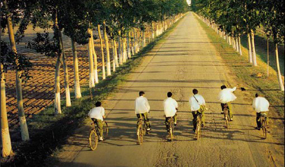

# ＜天权＞小镇青年成长指南

****小镇青年直到走出来才发现这一切的荒谬。一个贫穷的省份跟自己的孩子过不去的后果就是继续贫穷着。优秀的小镇青年走了就再也不回来。开十万家榨粉店也不回来，修路涨工资也不回来，姑娘穿得再少也不回来。一代又一代小镇青年一手造就了这一切，集权主义的统治至上而下，从政治到家庭，从教育到管理罪犯，殊途同归**。** 

# 小镇青年成长指南

## 文/拐歪(广西南宁)

 

小镇青年的成长指南一：在这个高度分工愈加趋近完全竞争的时代里，特别在异乡的土地上，你必须准备好只身面对惨淡。

我在一个不愁温饱也不谈富贵的机关大院家庭里长大，这是半数混出来的小镇青年的发育环境。小镇青年的父亲们，爱好棋牌、垂钓、球类运动，小镇青年的母亲们，爱好裁缝剪织、聚头聊天、攀比儿女。我年龄未到青年的时候，没有足够的激素刺激身体探求更广袤的世界，我仅仅朴素地以为，这里便是世界的全部，并早早纳之己用。我学会棋牌、垂钓、球类运动，讨厌裁缝剪织、聚头聊天、攀比父母。

小镇很小，在一个功能齐全但体积有限的空间里，我和我的朋友茂盛成长。朋友的父亲是县委常委、法官、邮递员、兽医、面包师父、图书管理员、文工团指导员、果园主、粉店老板、烟草销售员、银行职员、修车匠、国营百货仓库管理员、县报记者、屠夫、渔民、小学老师、中学老师、小学老师的中学老师。朋友的母亲是律师、补鞋匠、报刊店员、街道清洁工、护士、经理秘书、寡妇、企业会计、机关职员、文具店老板、送奶工、做棉胎的师傅、服装店老板、全职太太、文工团演员、小学老师、中学老师、中学老师的小学老师。正是这样一个牵一发动全身的体系，我和我的朋友几乎靠自己的父母和朋友的父母走完了童年除了玩乐之外的全部。于是以我为代表的小镇青年们在很早的时候接近天真地以为，即使足不出户，我们也能够仅依靠人与人的关系和情感走完这看似轻松的一辈子。

一般意义上来说，摆在成长中的小镇少年面前有两条路。第一条路：在一定的势力范围内，做老大。这样做的好处很多，你可以收揽“门客”，强纳保护费，叫人帮你写作业，等树上的芒果熟到八分的那天下午，端坐在芒果树下，掏掏耳屎，待你的小弟从芒果树上灰头土脸地爬下来，颤巍巍把果子递到你的手上。当然其风险是相等存在的。任何独裁都惧怕集体情绪爆发的那天，有时候甚至是更高权力的弹劾。第二条路：跟对老大。这几乎是一件只有好处没有风险的事情，当然，差不多也别无选择。例如你出生在人民医院里，你不可能跟着中医院的老大，甚至连客观上的可能性都没有，你没有QQ没有手机可以那么远距离地跟另一个小镇少年走到一块，交流是唾液相交状态的，不靠任何一种LED屏维系。

小镇青年成长指南二：克服狭隘地活着。

小镇很小，小镇少年几乎都喜欢吃同样的食物，唱同一首歌，过着同样模式化的少年生活。我们家旁边的小街里，有一家开了二十年的榨粉店。图省事的小镇少年的父亲们，在小镇少年母亲们经期低沉或者工作劳碌的早上，常常领着附近的小镇少年在那家店里吃榨粉。小镇青年如今散落天涯，网上聚头聊天时提起那家粉店，无论乾坤挪移，无论天地玄黄，无论在野党多么疯狂，大家舌苔上滴下的唾液都是同样的一股咸酸味，大家在每一块电脑屏幕后面都眼眶微湿鼻尖酸涩。

小镇很少外来人口，本地语言主要分为县城派和乡镇派，在我就读的初中里，操乡镇派语言的同学往往是暴力美学的实践组织，一部古惑仔翻来覆去看七遍打开家门就可以混世界了。县城派又分为亲乡派和自成一派，亲乡派都喜欢撸起袖口去干群架，而自成一派的最后要么成了被暴力的对象要么团结一致自立山头跟亲乡派和乡镇派时不时小规模冲突着。严重的时候砍刀砍死个把少年不是个新闻，板砖拍成脑残的也不少。

许多年后人们问我，你的泛滥的人文关怀是哪来的。我可以把这事情解释地很玄乎，也可以很简单。我在我还是小镇少年的时候很庆幸地没有加入任何一派。我很庆幸地被乡镇派砍过，跟着亲乡派把县城派拍翻过，我很庆幸地在县城派里自我感觉优秀过，走了一圈之后我最终回到了吃粉派的怀抱中。我一边吃粉，一边矫情泛滥地同情这些阶级分明的同龄少年。这是很难得的你能意识到吗，在一个少年还没有形成自己的完整世界观的年纪里，他仅仅依靠自己朴素的感知原谅了人类生之具有的文化差异，原谅由此造成的冲突矛盾流血死亡。我每天守在一碗榨粉面前，等待非暴力不合作的同龄少年来吃粉。跟他们谈老师的小口头禅，女同学的青春红痘，圣斗士星矢的黄金盔甲，H漫画的精美画功。无害且差点有益地存在着，用我的小宇宙为阴郁的帮派纷争的小镇少年撑起一片理想主义的朗朗晴空。这件事情无论多久，我都敢将它扯出来大吹牛逼。往往越积弱的文化，越担心自我毁灭的信仰，对着这个世界越为愤怒，对异族文化越不能原谅，愈卑微者愈卑鄙，行凶者内心是易碎且懦弱的。小镇少年本来具有人文主义的先天优势，我们生长在怎样一种以人为本的社会生态里啊，我们应该比都市少年更知道求同存异的可贵，可事实相反。都市少年从出生到长成皆在一个文化杂糅的庞大机器里受到熏陶，现实是，他们比我们更了解那家小小榨粉店的伟大光芒。

小镇青年成长指南三：尽你所能地自由生长。

小镇的生活现在想来过于朴实。真正意义上的文化活动几乎为零。音乐和舞蹈除了政治任务和排忧解闷，没有更大的功能。作家是找不到的，书法家和画家都白发苍苍地蹲在老年人活动中心里。我还是一个小镇小学生的时候成为我们小学舞蹈队的一员，我同时还是一个鼓号队大鼓手和升旗队的旗手，我在《少年文艺》里发表香港回归时大陆少年欣喜若狂的政治文章，我在县报上托我爸的关系把别人拍的照片属上自己的名字发表了一回。当然，照片是我依靠过人的审美能力百里挑一挑选出来的。遗憾的是，我的文艺生活随我的小学毕业而死去，初中的我便成为了一个生理旺盛迷恋H漫画和后桌女同学的准优等生，我毫无建树的高中更不必回忆，唯一跟文艺沾边的一件事情是我把考试作文当新概念作文比赛来写了十几次之后，班主任怒不可遏地找到了我爸。

小镇少年的成长环境在这个国家里也许是最苛刻的。农村少年拥有土地，城市少年拥有开化的父母和色彩斑斓的周遭。我在强大的应试压力和不怎么好的应试智商的影响下，彻底成为了一个碌碌无为的小镇少年。我高中时代的课外阅读量是我初中时代的三分之一，我初中时代的课外阅读量可能连我小学时代的一半都不到。我沮丧地在高一的时候买了一把吉他，疯狂地扫了四年，成为一个破烂的翻唱网络歌曲的乡村民谣。我会的其他的乐器只有一把口琴。

我初二那年发现我的绘画天赋，我温柔地提出之后遭到拒绝。高一，我摸到食堂二楼排练室里的架子鼓，第一次上手，脚鼓三个军鼓和两把叉，我居然跟着旋律就猛打起来，没人相信那是我的第一次，几乎也是为数不多的几次。我高三逃晚自习去文化宫看人教鼓，爸妈在我逃回学校的路上逮到我，硬要说我沉迷网游，把我直接在路边暴训一个小时。后来想起，这在部分程度上造成了我情绪崩溃的第一次高考的失败。

小镇少年很难自由表达思想，思想控制在教育程度不高的小镇父母群体里是很常见的。你没办法跟你爸解释某某老师就是个傻逼，你爸在你还没有陈述完之前会粗暴地告诉你，只要分数高，该弯腰时就弯腰。你没办法倾述你对一个女性身体的生理期迷恋，你纯靠毛片对自己进行青春期教育，你无法否定报刊媒体的愚蠢言辞，你经常否定自己觉得是不是我才是傻逼，你看事物的方法变得单调，你没法对艺术激起热情，特别在你竟然还是一个听话的优等生的情况下。你无法携带手机，你居然不能和你异地恋的女朋友每天说上话，你不可能了解学校以外发生的事，除非坑爹的叫床广播在周杰伦的歌曲中间播放时事新闻。你看小说的电子辞典会被班主任踩碎在地上，他认为他很生气，你对自己太不负责任，你也开始这么怀疑自己。

小镇青年直到走出来才发现这一切的荒谬。一个贫穷的省份跟自己的孩子过不去的后果就是继续贫穷着。优秀的小镇青年走了就再也不回来。开十万家榨粉店也不回来，修路涨工资也不回来，姑娘穿得再少也不回来。一代又一代小镇青年一手造就了这一切，集权主义的统治至上而下，从政治到家庭，从教育到管理罪犯，殊途同归。中国的教育领域里，都是某个省里自己跟自己玩的游戏，只要居然有一家小镇学校胆敢采取高压手段，所有的小镇学校无不纷纷效仿，争着谋杀艺术，扼死特立独行，把创意吊起来打。小镇青年如今恍恍惚惚长大，告别处子之身拥抱大千世界，小镇唯一能将他们唤回来的就是头发渐白的亲人，还有生就属于他们的那丝小镇气质。也许那家榨粉店百年不倒，到那时候，青年终将归去。

 

（采编：应鹏华；责编：麦静）

 
