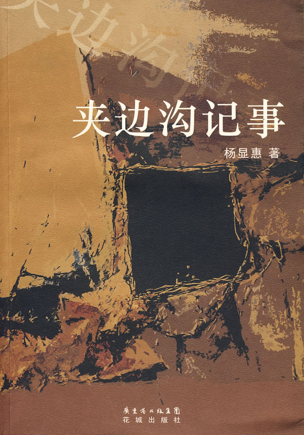
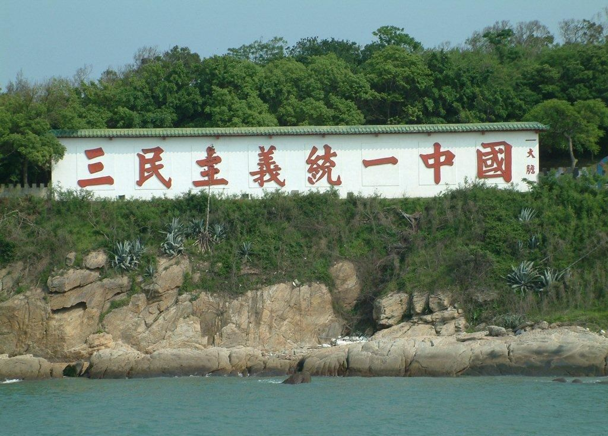

# ＜天权＞巨流成伤 ——《巨流河》读后小感

**世事变迁、人情冷暖，由先生这么娓娓道来，少却了几分刀光剑影的激荡，却凭增数缕淡雅的暗香。正是这种深沉而不矫作、悲悯而不滥情、惆怅而不迷惘、内敛而不压抑的笔调，使该书避免了为政治意识和时代话语所架空，在感情的表达上达至纯真自然的极高境界，十分让人动容。**  

# 巨流成伤

# ——《巨流河》读后小感

## 文 / 笑草（中国政法大学）

 

初读齐邦媛先生的《巨流河》是源于一次偶然的网络阅读经历，略嫌不适的繁体版本并未阻碍阅读的流畅和愉悦。后在“天下文化”开辟的专页中，了解到更多关于邦媛先生和本书的“前世今生”。这是一个文学家对半个世纪民族命运的沉重诠释，更是一个独立心灵在时代变迁中傲然自立的明证。

大凡家国命运的回忆，写来常是悲苦愁结，抑或微言大义，容易落入宏大叙事中枯索的窠臼。而这半个多世纪的起伏波澜，在齐先生的笔下显得跌宕而终至温润。世事变迁、人情冷暖，由先生这么娓娓道来，少却了几分刀光剑影的激荡，却凭增数缕淡雅的暗香。正是这种深沉而不矫作、悲悯而不滥情、惆怅而不迷惘、内敛而不压抑的笔调，使该书避免了为政治意识和时代话语所架空，在感情的表达上达至纯真自然的极高境界，十分让人动容。先生的一生，“从波澜壮阔到波澜不惊”，即使仍有挂念，回望往事也能做到心绪安平。战争的硝烟、政治的隔阂，都无法割断一脉自巨流河流到垭口海的亲情之血。垭口海，多么形象的一个名称！当先生的背影定格在湾口的凝望中，隐约你能感受历史的悲怆，和那转身而来的一点从容。

#### （一）国家叙事与个人记忆

巨流河、垭口海，两相陌生的一对地名，放于今日也未必可为众人所熟，却因为一群流离的人，一段流离的历史而碰撞在一起。若不是齐先生，或许我还不知晓辽河古称“巨流河”，也不熟悉齐世英跟随郭松龄将军东北反奉的始末。历史中太多的细节被堙没在国家叙事的背景中，成为可有可无的注脚，岂不知，一部家国史，应该也是属于全体个人的心灵史。

“二战之后，欧洲犹太人写他们悲伤的故事，至今已数百本。日本人因为自己的侵略行为惹来了两枚原子弹，也写个不休。中国人自二十世纪开始即苦难交缠，八年抗日战争中，数百万人殉国，数千万人流离失所。生者不言，死者默默。殉国者的鲜血，流亡者的热泪，渐渐将全被堙没与遗忘了。”（p1）中国传统向来以国为大，缺乏对个体价值的足够珍重，这从历来的政治架构和伦理理念中便可见一斑。一场二战后，西方产生了《辛德勒的名单》和《黑皮书》，日本人写出了《广岛札记》；而中国抗日八年，内战五载，真正能书写我们自己历史的寥寥无几。“生者不言，死者默默”，是何等的凄凉悲景。

本书的台湾繁体版的腰封有这么一句话：“读了这本书，你终于明白，我们为什么需要知识分子。”真正的知识分子，应当对时代发出自己的声音，并使自己只屈服于真理。近半年来，陆续读到野夫先生的《尘世挽歌》、高尔泰先生的《寻找家园》、杨显惠先生的《夹边沟纪事》、龙应台先生的《大江大海1949》，还有诸如章诒和先生等人的文章，才深感苦难文学之于中国的特殊和不易。经历如齐先生者，笔下却绝非只是苦大仇深的悲切之痛，而是饱含家国之念与个人醒思。中山中学的悲壮校歌（p38）、著名的《松花江上》，那是家国破碎中先生对那个时代最为深切的情怀。及至后来的种种磨难，反而都成了先生不平凡一生的平凡注脚。

#### （二）个人风骨

正如王德威先生所言，齐世英、张大飞、朱光潜、钱穆是直接影响了先生生命状态的4个关键人物：父亲齐世英的温和洁净、“大哥”张大飞的虔诚深情、恩师朱光潜的治学风范、大儒钱穆的独世品格，这些个人风骨强烈的灵魂，勾勒出联结齐先生生命历程的一条线索，诠释了“玉汝于成”的个体实质，也展现了那个时代值得为人称颂的某种精神气质。但是无一例外地，这些杰出的生命个体都带有不同程度的悲剧色彩：儒雅刚烈的齐世英赴台后因在政治上不容于当权者而受排挤，心中磊落却愤懑至终；英勇精忠的张大飞用一个雨中的背景留给他所爱的人最后一次记忆，然后在翱翔的空中壮烈殉国，为这一段浪漫辛酸的感情添上了令人无言以对的浓重一笔；“恒恬诚勇”的朱光潜先生留守大陆，之后的悲惨遭遇已无须多言；博学清修的钱穆先生被一个“卖国总统”和一个“贪腐总统”赶出素书楼，带着晚来的凄凉做了“政治的刀下之鬼”。对于读者而言，可对每个人物盖棺定论；而于先生，或只如木心先生的那句话，“我所见的生命，都只是行过，无所谓完成。”（《同情中断录》扉页）即便历史明证，对亲历者，如何能不唏嘘！

在诸多形象中，齐先生对张大飞的感情刻画可谓刻骨铭心：家破人亡而寄人篱下，却始终带着忧郁温和的笑容；患难相处而暗生情愫，却因命运错离而自啼风雪。张大飞之于齐先生，从那个站在牛首山的山风里由隘口回头看我的温暖兄长，演变为“一个远超过普通男子、保卫家国的英雄形象，是我那样的小女生不敢用私情去‘亵渎’的巨大形象。”（p96）于是，在他们屈指可数的相处时间里，“在那世外人生般的江岸，时光静静流过，我们未曾一语触及内心，更未及情爱。”（p96）可个中的柔情，却是溢于言表。终于，范孙楼下匆匆一别，他在雨中疾驰而去。“今生，我未再见他一面。”这般深沉内敛的感情表达，早已超越了男女的情欲纷扰，炼化为内在对于美好种种的心力。

#### （三）文学的慰藉

不同于大多数流水账般的回忆录，本书花了很大的篇幅来展现先生在岁月的不停颠簸中对于文学的不懈追索。这其中，既有以英国文学为主线的专业诠释，也有以个人情感为内核的艺术表达，充分展现了文学之于时代、之于个人的独特价值。先生试图向我们说明，“在如此充满缺憾的历史里，为什么文学才是必要的坚持？”（p376）

在阅读雪莱、济慈的年岁里，先生度过了少年、青年、中年、直至老年的完整生命历程，而这种阅读体验在不同的阶段又迸发出截然不同的情感。其实，对于大多数读者，先生对英国诗歌的大部分精妙解读和感悟是超越一般鉴赏能力而不得要领的，但是诗歌的妙处与力量正在于，在一种不确定的意念下去阐发情感的无限可能性。即使你从未接触华兹华斯的《玛格丽特的悲苦》（The Affliction of Margaret）,当你读到朱光潜老师朗诵“If any chance to heave a sigh, They pity me, and not my grief”时潸然泪下的情景，如何能不动容？（p113）即使你不熟悉柯勒律治，当你读到先生用《沮丧：一首颂歌》（Dejection： An Ode）来表达对张大飞沉重又难言的悲悼之情时，心里又何以不戚戚然？（p143）

“文学的魅力不在于大江大海般的情绪宣泄而已，更在于所蕴积的丰富思辨想象能量，永远伺机喷薄而出，令不同时空的读者也荡气回肠；而文学批评者恰恰是最专志敏锐的读者，触动作品字里行间的玄机，开拓出无限阅读诠释的可能。”（p386）就是这种对文学的纯粹追求，不但给了先生跨越所有悲苦的勇气和智慧，也令先生获得超然于政治的清醒与成就。今天，当看到颇受好评的新版《源氏物语》译者俨然就是先生所极力提携的林文月，不免为之宽慰。而诸如杨照、张大春、骆以军、朱天文等台湾文学力量逐渐为国人所知，先生的功劳亦当不小。

#### （四）教育之殇

本书对文学的“独特关注”，不但源自先生扎实丰厚的英美文学素养，更来自其亲身参与的教学实践与改革。先生在书中提到朗诵惠特曼《啊，船长，我的船长》中的：“O Captain！My Captain！”（p133）我的脑海立即浮现出Robin Williams在《Dead Poets Society》中的经典教师形象。在接过教职开始人生的另一阶段后，先生终于有机会将承自孟志荪、朱光潜、吴宓诸师的“师范”精神发扬光大；而到了国文教科书改革，先生的努力更是演化为一场冲破政治藩篱的惊心壮举。而今台湾各界名流之中，先生桃李遍布，于社会者助益良多，无关乎其被尊称为“永远的齐先生”。只是见到前些年台湾教育、文化等领域的“政治回潮”，不知先生该是如何的一番感喟和唏嘘。

说起教科书改革，不得不提张立宪先生正在实施的“民国老课本”项目。中文文字之美，自民国以降，已成式微，而方今之世尤甚。此首祸者，莫过于国文教科。民国老课本里简约而富有韵味的文字，于今日之教科书中被替之以枯索无味的繁冗文本，实为教科编审部门的遗祸。可以说，如今的中文教育，已基本丧失了欣赏汉字、汉语之美的功能，更无需提美育与反思之定位。而关照如今中国教育改革之艰难现状，更可见先生当年的莫大勇气。若无对教育的赤诚与深刻反思，如何能于逆流中勇溯而上，义无反顾？

#### （五）两岸，走向何方

“渡不过的巨流河”，是横亘在先生心头和历史本体的鲜明意象；而一条台湾海峡，谁又能说不是两岸跨越不过的现实伤痕。虽然先生不为政治风云所左右，可兹事如两岸关系体大者，不可避免为政治意识和宣传形态所裹挟，硬生生将一种地理上的隔阂演变为一条文化上的鸿沟。在各自的话语体系中，并不能找到太多相互的谅解和共识，或者说，对于台湾人究竟需要什么，我们并非清楚地了解。经济利益、政治互信，族群共融、抑或身份认同？又或者，他们只是在想，是否有人指引他们一条明确的道路，而不论这条道路将通往何方。

几年前，廖信忠老师在大陆出版了一本《我们台湾这些年》，引发读者热议，同样也反映出所谓“台湾研究”的尴尬：在那些空洞的政治概念之下，一种以最为寻常的视角观察台湾的姿态却渐行渐远。其实于社会和民众者，无论政治如何“风雨飘摇”，自有其抗争、顺应、调整的内在机理，关注每个人的悲欢离合，便能梳理出社会的沧桑巨变。可惜，我们往往忽略这一点。

也因此，谈及两岸关系，总想起秋白先生在觅渡河前的那番惆怅：“觅渡，觅渡，渡何处？”

 编者注：本文中引用括号内页码皆检自《巨流河》一书。  

（采编/责编：黄理罡）

 
