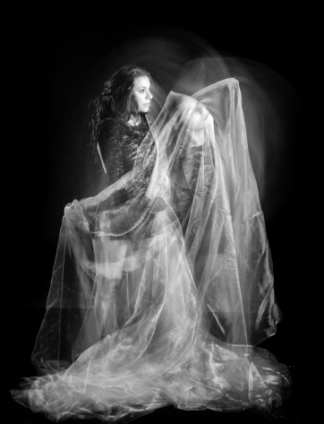
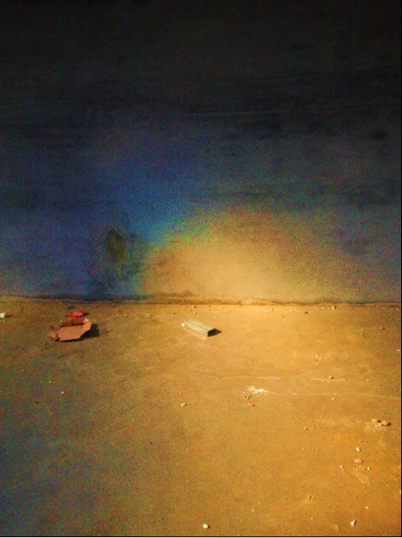

# ＜天权＞幽灵

**过去与现在，回忆与失忆，现实与梦境，这些混沌交替的词汇同样令我感到厌倦，无聊，一个切实的“真实”构成了人的一生，失效中的定义在真实的面前黯然失色，我认为小说承担的不是一个精彩、卓越、跌宕的义务，小说也不是为了迎合人的思维，当然，小说也绝不与回忆挂钩，这篇小说是寻求真实的自语，层层叙述临近一块块孤立的真实，可真实也是幻觉，是臆造的一部分，同样的，幻觉与臆造也造就了真实，这篇小说不会给读者一个安慰的、貌似带来思考的快意的“知觉”，这篇小说如同它的题目《幽灵》一样虚幻、无聊、无解。**  

# 幽灵

## 文/郑晧中

墨绿色西服披挂在冯酡的身上，一只翘着的腿，露出红色的袜子，两年前荒废的皮鞋，牛皮，老款式，他坐在一张红色暗纹镶嵌亚光金丝纹理的沙发上，下方，屁股的下方被长期的沉坐给生生地压陷下去，一道黄色的光，一个穿着黄色衣服的女人，他的妻子，装作委屈的谨慎的动作，反倒夸张了礼仪的表情，用着谨小慎微的举止引起周围的骚动，女人吐了一口气，一股白烟顺着光飘向了窗外，双手扶住杯子，瑟瑟发抖，光的颜色被肌肤吞并，形成了明亮的肉色，像清晨的死猪，冒着热气的血，一张肥墩墩的肉皮横跨在屠夫的工作台上，她悄悄撑起了手臂，眼睛构成了思考的角度，另一只手既缓慢又灵巧地玩耍着手中的药瓶，蓦地，突然，向后仰脖，将药水吞咽到嘴里、食道、肚子里，旋即挤压着脸、嘴，绽放出褶皱，“呀”，一声将近一秒的音响从嘴里发出，说明药水是苦的，苦回甘，却不面对甘，只沉醉苦，她将双手，小臂支撑桌面，与胳膊夹成一个将近九十度的角，双手攥成拳头，再张开掐住整成脸，让脸上的表情与肉一同整个动作表达苦痛，她把自己没入光里，表达寒冷，不是要索取温暖，这样瘦干干的一个女人，造成苦痛坐在逆光的角落，面前一瓶药，一张桌，一个玻璃杯，接着一声咳嗽，压制住的咳嗽。终于，有气无力地望着天花板，打着长长的哈欠，扭动了三下右腿，露出了浅红袜子，抖动三下，将右手搭在左边胳膊肘继续支撑，接着扭动腰，望向了暗处，眉间挤出三条横线，捏着药瓶，光被云彩遮住，整个屋子暗了下来，

冯酡的妻子说：“我不去吃饭了，肚子痛，你们自己去吧。”

“你还能绝食吗？”冯酡说。

“我回家吃点早上的面条，我肚子不舒服。”

“你如果不想去就不去，吃点热的总比凉的好吧，上一次我也肚子疼去吃的水饺，就着蒜，肚子就好了（这时女人的表情挤出了反对蒜可以医治肚子的模样。冯酡赶紧说）小时候肚子疼就把蒜放在炉子上烤烤吃了就能好。”

他的妻子终于站了起来，做出了勉强的动作，拖拉着走到了三步，在即将抵达冯酡身边的时候，迅速地坐了下去，那张红色的暗纹亚光金边沙发，陷了下去，比冯酡的那边高处一些，几乎同时，女人斜着眼光看了一眼冯酡面前的电脑屏幕，然后生出一点点的得意，将头靠在了沙发后背，两条腿仿佛瘫痪似的撇在复合地板上，手机没有声音，有信号，躺在沙发，时间在此处前进，冯酡继续望向电脑，他在等待一声车鸣，这样他们就可以下楼坐车吃水饺，角瓜鸡蛋馅儿，芸豆肉馅儿，肉三鲜馅儿，也许可以喝点酒，让自己的妻子吃点蒜，这时，冯酡想到女人明明说不去吃了，为什么还要坐在沙发上闭目养神呢，她不是说自己回家吃面条嘛，此时，女人装作睡着的模样，双手交叉在一起，头部微微的左右前后摇动，做作的动作，而冯酡，手脚冰凉，直直望着屏幕，等着吃饺子，等着时间进行到十二点半或者十二点十五分，冯酡想着，有些事情就是无聊的，荒废的，生活本身就是由无聊构成的，这是一个现在进行时的世界。

目前，时钟在冯酡的眼中定格为十四点三十五分，他依旧穿着那件墨绿色的西服，双腿弯曲坐于红色暗纹亚光金色纹路沙发上，左手夹着一支烟，烟灰大约三厘米，蓝色的烟气呼啸着飘向斜上空，他的肚子饱胀，里面装着饺子汤，猪大肠，几颗木耳，几片青椒，韭菜鸡蛋，韭菜猪肉，牛肉洋葱，芸豆肉，豆腐皮，土豆丝，香菜，面皮，面汤，还有蒜，口腔里的蒜气经过烟草与茶水的发酵从鼻腔中形成酸味的气体喷出，心脏沉重地跳着，有力地挣扎出一道道消化液，这张继续被沉重的屁股压着的沙发再一次陷了下去，过会儿还要经历几次屁的喷薄，他的妻子也许躺在家里，也许躺在了梦里，也许走在返回这张沙发的路上，时间向后倒去，女人并没有听从冯酡的建议吃下那一勺蒜泥，冯酡自顾自的吃着，知道女人在侧旁继续进行她自在的表演，她吃了几口土豆，几筷子豆腐丝，即便是冯酡夹过去的猪蹄也被她咬了两口废弃在小盘子里，这一个孤零零的猪脚保留着一块小小的牙印，女人继续捂着肚子，无聊地看着周围的人吃着饭菜水饺蒜泥，她并没有忘掉自己肚子的记性，她在众人的面前用着与病理相依为命的姿态表达着病的来到，她不会与病对抗，或者讨厌病，她的姿态完全是感谢病的到来，冯酡拖下自己墨绿色的西服，一件黑色的坎肩与浅蓝色衬衫继续包裹着他的肉体，他的肚子，他继续吃着，吃着属于他妻子的那些饭菜，终于在肚子的提醒下，停止了进食，外面的阳光彰显着温度的无用，阳光只完成光亮的任务，阳光把阳光所要覆盖的人无耻的摊平，人在阳光下被风吹得头发散乱，这其中的尘土，微尘，细菌，以及我们看不到的东西全部动了起来，当然，风的作用让人能够忘记平静，人在风到来与病到来时都会表达出一种生活的反应，这样的反应来自于人出生后周围环境与人的受教，人面对了阳光和风做出了皱眉，遮掩，迎面，微笑，厌恶，欢喜，而风与阳光把人的造作公布给自然，女人捂着肚子坐上了车，冯酡穿上墨绿色的西服，裤腿露出一小块红色的袜子走出了饺子馆坐上了驾驶席，他手握方向盘，发动汽车，将车倒出门口，开回家中，

他说：“你为什么不吃蒜泥，”

“我实在吃不进去，你夹给我的那块猪蹄，我觉得非常油腻，其实我想吃，但我咬下去以后就吐了出来，我感到反胃，昨天晚上我三点起床，肚子疼，浑身发烫，今早我拉肚子了，五六点钟就睡不着了（这时冯酡的脑子里想着睡不着还不起床），”车子在一个分岔路口停下，女人要回家，

“你必须到医务室看看，听听医生怎么说，”

“我想回家睡觉。”车子停在医务室门口，

“你下去看看，听听医生怎么说，”

“我想回家睡觉，我不想去，我没事，我喝了药了，我现在不痛苦，”车子即将开到家门口，冯酡赤红着脸，大声的咆哮：

“你既然有病，呈现出病的姿态，模拟着病的样子，你就应该去看病，你就应该吃药，你想继续装扮病的姿态吗？”车子抵达门口，女人提着剩下的猪肠子，青椒，木耳，水饺，夺门而出，再即将摔门的时候，冯酡喷出一句：“别摔门。”女人减缓了摔门的速度，车门关闭，冯酡轻轻点着油门，听着女人是否摔家中的铁门，“哐”“嗙”，门关了，在时间停止在十四点三十五分之前到门关掉的那段时间冯酡抵达公司，坐在那个暗红色纹路亚光金色的沙发上，打开电脑，接了一个电话，大约是三分钟的大声咆哮，女人被冯酡几句话击败，冯酡合上手机，再一次点上一根烟，时间行进到十四点三十五分钟，此刻烟灰在三厘米距离处掉落。

我愿意！一声咆哮因为挂上了音乐的波澜之处形成了类似壮举的声响，司仪的眼角荡出了得意的皱纹，这之前，那提前设计的玄机巧妙地达到了效果，之前的之前，准新郎与准新娘在此大厅排练，司仪胸有成竹的叙述着过程中的起伏，最终要落到那一句大声的嚎叫，开篇的三个字，要用着诚恳，激动，包含爱的语气与豪情呐喊出，冯酡本人踌躇地询问司仪可否取消此环节，最终，终归要呐喊，人生的一场秀，婚礼，在这个筹备起来琐碎、无聊的秀场中，最后的一句我愿意呐喊出了秀的终结，秀的释放，灯光环绕交错闪鸣，各种颜色投射到人与人的陌生中，在众人的面前行走，漫步，奔跑于婚礼仪式中，人保持着与以往不同的威仪，微笑，快乐，感动，台上的人有台上的麻木，台下的说着风凉话，感言，祝愿，埋怨，司仪终于听到了这一声嚎叫，新娘被冯酡的声响震动而闭上眼睛，两行热泪因为声响，因为无辜，因为需要热泪而流淌，这两行热泪令冯酡感到收获，并没有幸福，而是一种轻松的愉悦，台下的朋友则被这一场表演感动，一个年轻的未婚女人与自己的母亲留下了眼泪，她们满怀着感动祝愿，她们幻想着自己与自己的女儿出嫁时的情景，她们为了自己的感动而感动，这就像是一个妇人坐在家中的沙发上打着毛衣或吃着瓜子，看到了电视剧中的演员感人的遭遇联想到自己的处境，流下了优越感十足的泪水，他们不关心剧中人现实中的遭遇，剧中人与婚礼上的新人在以后漫长的现实中憎恨起婚礼的初衷，这些实在的宿命被最后的消亡所淹没，也被那些感动所融化，冯酡的喉咙微微沙哑，声带的震动迫使他咽下了唾液，他骄傲地释然地牵起了自己女人的手，面对着众人的仰慕的目光与微笑走向了那个灯火通明的高台，司仪张开了双臂，呼喊着高潮的来临，他的眼镜片后面被这方高台上的雾气熏了若干次，他一次次地制造着属于自己的高潮与得意，他看着这对新人逐渐走向了明亮面前，他想到了明天他将要制造另一个幸福的高潮，一种隐隐的忧愁袭入身体，仿佛一件盔甲罩住了身体，他继续组织好千篇一律的语言用一种令人羡慕的口气说出了祝福的隽语，也送上了祝福的论断，这对新人笔直地站着，一个自然，一个拘谨，这些幸福的错觉与感动的张力把整个现场的气氛推上了顶峰，在他们举起酒杯，窗外鸣放鞭炮时，一张持续了半天的笑脸坍塌，只一瞬间，再一次披挂上阵，饮完杯中饮料，恍若白酒的饮料众人皆知的掩人耳目，换上崭新的礼服，去一个个包间，一位位亲朋的面前接受祝福，那些看到他们到来的亲朋瞬间展开了笑脸，冒失地、窘迫地站起来，用着大家熟昵的方式煽动起了一股股热风，欢快的气氛，精彩或者蹩脚的祝福，也在引领者的面前败下阵来，一对新人当真沉浸在幸福中，他们在灯光，鞭炮，仪式，惯常的习俗中制造幸福，可是他们的爱情在之前的之前早早地溜走，他们如今是一对戏中的主角，尽职尽责地扮演好未来与现在的角色，敬完最后一杯假酒，两个同样疲惫的人可以说是苦命相连，他们僵硬地扮演了一天的幸福，他们共同演好了一场大戏，此刻，他们两颗心竟然相惜，彼此望着彼此的疲惫想着未来，他们卧在床上，一天，漫长的一天将要过去，冯酡说：“洞房总要做爱吧,”“太累了，”“总要做的”冯酡将身体压住女人，完成了最后一项表演，二人欣然入睡，恍惚的婚礼如一顶不合身的礼服永远地穿在了身上，那一句呐喊换来了人生的未来。

此刻，冯酡坐在卧室，找不到自己的衣服，他看到了自己的衣服与妻子的衣服混成了一团，他想起了自己的那一句我愿意，女人坐在客厅嗑着瓜子，看着一个养鸡的栏目，听到如同当时一样音量的咆哮，她不情愿地扔下瓜子皮，嚼着牙缝里的瓜籽，拖拉着鞋子走到了卧室，整理着，蹩脚地整理着衣服，结果，她拿出了一条秋裤对冯酡冷漠地说：“你穿这个可以吗，”“你怎么不在家穿秋裤呢，”他们同时感受到了沮丧，沉默地履行各自的义务，女人找到一个绿裤子，这是冯酡十一年前的裤子，十一年前的冯酡从未想过这件裤子会在此时被女人扔出来，他还是穿在腿上，并且穿上了自己的红衬衣，红卫衣，这时，他低下头看到了自己穿了两天的红袜子，在小拇指的位置破了一个小口，露出了黑黑的指甲，他想起这是婚礼当天穿的袜子，他看到女人把头埋在衣柜中继续翻找，脑海里再一次想起了那一声我愿意，震耳欲聋，他走到了厨房，行走中发现一双鲜红的脚与十几年前的绿裤子极其冲突，他苦笑了一下，拿起了一块自己刚刚切好的绿色萝卜，在酒柜的玻璃照射下，他看到自己像一个小丑，滑稽的沮丧的失败的小丑，那一声我愿意贴着他的额头，他继续苦笑，在即将打开电脑时，他的妻子把头伸出衣柜：“等我们有了自己的房子，我要一个大衣柜，咱们分开，你一边，我一边。”

眼睛下方与便池平行垂直的一个点，自便池向上一米左右一条垂危的抛物线溅起水滴簌簌的涌进水坑里，一股玉兰花被放置室内三天，凑上去猛一嗅的气味儿扩散整个茅厕，鼻翼翕动开张，鼻毛微微地顺着气流的吸入悄悄生长，一阵幸福的错觉，转瞬消失，水坑生出了一颗颗的泡沫越聚越多，门紧紧贴着人背，人背因为狭小的空间靠着门，耳朵里是外面两个女人快乐急速的声响——南人的语言，如同两只竖起了羽毛的鸡，一层层的鸡皮疙瘩颗粒饱满，两只羽毛稀薄根根竖立的鸡兴奋地滑稽地劈开两只鸡爪拉拔着跑，冯酡感到一种虚无，一种疑问苍天，叫嚣宿命的冲动，为什么？这两个女人与自己扯上了关系，他听着琐碎的声音不得不传入自己的耳边，感到尴尬极了，这无端的尴尬来自冯酡所不愿面对的生活，他仿佛看到了生活的尽头——死亡，对于一个没有信仰的人，未来就是死亡，那么他会用各样的错觉忘记这个真实的未来，他会说“未来充满希望，”对于一位有信仰的人来说“未来是重生”或“未来是重生吗”，在肯定与疑问之间这位有信仰的人始终不能面对的就是否定，假如否定就会迫使自己走上了真实，他就会失去了错觉的能力，而且又不能用那句“未来充满希望”来鼓舞自己脆弱的心与灵，冯酡就是如此的一个人，他将自己的阴茎抖了几下，熟练地扔进裤裆里，拧开水龙头，手沾了四下水，迅猛的一抖，顺带在上衣口袋一蹭，开了门，在开门之前冯酡的脑海中已经模拟了开门的后果，他如同开门之前的脑海指令一样微笑，潇洒的点一下头，熟练地无谓的面向两个女人——妻子与妻子的姐姐表达殷勤，旋即厌恶的扭过脸，在楼梯的拐角呼出一口气，昂着头走了上去，快速的走，一步两个台阶，两个女人快乐的交谈着，他们聊着琐碎的过往，一点点捡起了情感，在这个北方的居所中，周围响起，震动着南方特有的爆发力十足的声音，冯酡咬着牙望向窗外，耳边是不大不小的声响，冯酡尽力地听着这种声响，并且恨恨地忖思终结这一切的愤怒，他也诧异于自己的愤怒与绝望，为什么？自己仅仅因为一个远道而来的人升起了厌恶的错觉，观察自己不等于对峙自己，外面的车流逐渐增多，车轮摩擦柏油马路的声响越来越大，发动引擎，引擎正在发动，发动机在工作中的轰鸣声在远方呼啸着流动着不曾停止，几声鸣笛，大车与小车不同品牌的车子造成了断断续续的音效夹杂着持续发声的两个女人，在这个空旷的房间里，冯酡感到了初冬的寒冷，气温持续地降低，今天临近霜冻，昨夜的一场瓢泼大雨将冯酡持续慌乱的心逐渐地冰封，他佯装出一副尽力自在的模样看着听着两个女人发出的声音，思绪向着之前的之前甩去——那个遭遇妻子的时候，他怀疑自己厌恶自己的选择，他被这无聊的乏味的日子折磨透了，冯酡想到过自杀，他的两个哥哥都死于自己，一个因为情变投河自尽，一个因为家庭的琐碎或许因为如同冯酡一样荒凉地看到了真实，在一个黄昏的山峰上，哥哥自缢于松柏，当冯酡想起这两件事件时，他认真地思考过他们为什么有这样的意气去完成这一切举动，该有多大的欲望，死的欲望支持着一个人自缢，并且要忍受住绳索勒紧皮肉与生命对抗的悲痛，现在冯酡感到了死并不是一个可怕的事情，这个举措着实是一件解脱的事，轻而易举地把自己的荒凉殆尽，此刻，冯酡听着两个女人的声音仿佛一个周身麻木的人急需要一个死亡的痛苦结束这一切的未来，给自己一个真实，这时冯酡的脑子里闪出一个图像，在城市的边缘，一所村庄的民房中，民房于一夜平地而起，红色的瓦，木梁建构，尖顶呈三角形，房屋中间贯穿一根木梁。

一个月前冯酡买下了这一亩地，盖起了这间民房，他固执地保留了这根房梁，要求装修队用白色的木板将红瓦下的稻草遮盖，一根长长的房梁贯穿九间屋子，刷上桐油，闪着黑光，冯酡刚才脑子所闪出的情景是在与包工头商议保留房梁的命令时出现的，他的脑子闪现出自缢的景象，一根草绳垂直坠落尸体，自己挂在空旷的屋子里，整张脸苦紫黑青，想到这时他不禁地苦笑了一下，并且他自己惊异于自己有些兴奋的感受，甚至他想到了母亲看到了自己的尸体挂在梁上的模样，他不自觉地来回踱步，兴奋地盘旋在这个两个女人快速发出刺耳声响的房间里，他甚至佩服起自己的设想，他得意的满足的走出了门口，走向了距离自己十五公里方向的那根房梁，开门的时候一股风猛地扑到了冯酡的脸上，头发坠在右眼下方，冯酡看到一棵棵秃顶的杨树被午后垂危的黄光砍了一刀，双手揣进兜里，摸索到手机，冯酡看了一眼私存的信息，那个远方的爱情，多么绝望，他在婚前与婚后爱上了一个远方的姑娘，两条相隔千里的线不可能交叉，绝不，而且爱情并不如死能带给冯酡兴奋的快乐的感受，他关上手机，看着这个即将告别的世界，他没有任何觉知，如同一个必须要完成的任务，就像婚姻，既然选择就要走下去，十五公里的路并不算长，路上的行人始终与冯酡没有任何关系，他看着身上这件墨绿西服，脚腕露出的红袜子，他仍然感到自己像小丑一样，马上他就要卸下这身皮囊，永远地没有欢乐也没有烦恼没有期盼也没有欲望，他在完成最后一件欲望，现在他已经开始想着自己死后家人与妻子的反应，他想到这些就会兴奋，他猜测着是谁会先看到自己的恐怖的尸体，他先想到自己的母亲，冯酡迅速地给出一个结论——昏迷，紧接着是父亲——叹一口气，妻子呢，冯酡不能猜测到妻子的反应，那个女人应该会继续和他的姐姐呶呶不休，会持续地冷漠，会让自己更加坚定这个最后的欲望，因为死亡将要到来，如同圣举，这个街道都变换成了新的意象，黄色的光覆照在橙色的干瘪的树叶上，树皮一层层地剥落成了冬季的颜色，在光所能照射到的地方，阴暗的灌木绽放出了突兀的绿色，远处的一个人包裹着一件黑色的羽绒服，像一个幽灵，连头部也被厚厚的帽子包裹着，那个人缓慢的走着，用着一种类似飘动的节奏，脚下一块块青灰相间的地砖密集的延伸到路的尽头，这个如同幽灵的人在冯酡的前方飘动着行走，融化在一束束从树叶缝隙中穿透的光里，这个即将告别的世界在每一次的迈步后慢慢消失，每一个擦肩而过的人与景都将成为冯酡脑中最后的记忆，空阔荒凉的边陲小城，车子稀少，马路上的人悠闲地穿行，口袋中的绳子使西服的一处冒失地鼓着，也许在另一个地方也有人在走向死亡的路上，其实我们每一个人都在这一条路上走着，冯酡觉得自己不过是自主地提前越过起点到达终点的路途，他明知人脸上的表情都是一种等待，人的风景最终都会腐烂，人所期望的未来也是空无的幻想，路上的风景，冬日的萧瑟，风一股股的收割冯酡煞白的脸颊，他的心里涌现出一点忧伤，一点点的不舍，可是踏上这条自戕的道路，所有的犹豫不决都被强大的虚无吞并，他固执的执行这一条自设的指令，必须要完成最后的欲念，他甚至觉得有一个幽灵附着在自己的身边，监视着自己每一步每一念，他要服从这个幽灵，否则会成为永远的嘲讽，想到永远，冯酡笑了，目前他距离永远近在咫尺，而且当他一想到不舍与温情就必须要用痛苦的记忆去压垮这样的情绪——他所称作软弱的情绪，他距离房屋越近就越想要记住所有的痛苦，他把自己浸泡在痛苦里，终于，面前的房屋出现在视线中，现在临近黄昏，临近死亡。

走进院子，关闭大门，脚踩黄土，拿出绳子，打开门，放到衣柜，垫砖，抛绳，结扣，勒紧，整理衣服，再一次看到红袜子，拍了几下墨绿西服肩膀处的微尘，昂着头，微笑，流泪，冰手颤抖松垮擒住绳子，他望向前方的金黄色，视线模糊成了光圈，一条条一块块的黄色的形状，小心地以不触碰头发的角度将绳扣套过头颈，声音全部消失，忽然，踢落红砖，双腿紧紧绷直，红色的袜子暴露出大块面积，手用力地向后撇着，强力地迫使手够不到绳子，一张肉皮扭曲，逐渐发紫，黑青，吐舌，墨绿西服的肩膀处变了形，房梁落下了细微的木渣，树皮屑，屋子里降临了暮光，深黄色接近橙色的暮光，透过房梁斜上方的窗户，一道宽约六十公分的黄光照在冯酡紫色的脸上，黄色与紫色重合成了灰色，明亮的灰色，与水泥墙面一样的灰色，整个空旷的房屋中唯有一块刺眼的红色——袜子，这时冯酡的意识，冯酡的感知，冯酡悄悄地出离身体他惊讶地发现自己没有死，不，是他走出了自己的肉体，他成为一个不怕光的幽灵，看到了那副悬挂着房梁上的肉体死亡，首先，他踹了一脚地面，没有声响，他用手触碰水泥墙面也没有知觉，可也不能穿越墙壁，他撞在墙壁上没有任何感觉，他掐了自己一下，身体是空的，他感到孤独，感到一种受骗，原本是要接近永远，而现在却只能无休止地陷落在虚无里没有任何生理上的知觉，保留着精神上的觉知，于是他走出了这间屋子，同时他看到了大门敞开，父亲迎面麻木的走来，他意识到自己是一个幽灵，在开门的瞬间他其实在一个与他们两隔的世界，就是说，幽灵开门的动作包括门翕动的造型父亲是看不到的，冯酡看到父亲的眼睛突然一亮，快步跑向了门口，穿过自己的身体，对着那具肉体呆了几秒，旋即笨拙的吃力的将冯酡的肉体搬了下来，险些砸到自己，父亲喘着粗重的气，哭出了声音，低着头，双手撑着膝盖，哭声像是木头击打墙面一样木讷，冯酡呆立看着，扭过身子，他大声地呼喊，用力地奔跑冲撞面前的水泥墙，他站在父亲的面前大声地咆哮，而父亲如电影中的角色沉浸在了自己的伤痛中对于冯酡无丝毫反应，冯酡意识到自己完全地失效，他明白了此前的沮丧并不是真正的沮丧，那是由快感和欲望造成的沮丧，因为真正的沮丧是落在绝望中的，只有彻底的绝望，如冯酡一样绝望才能体会到如今的沮丧，包括荒凉，荒芜，如今在这个死后的世界里，冯酡彻底地融入了之前未死时所给予自己生命失效的定义中，而他悟的太晚，太残酷，他知道了自己真真实实的没有抵达永远，却由一个完全孤独的人在一个不得不看不听的境界中等待着消散，想到消散，他明白了自己也许处在一个中阴身的阶段，是否在一定的时间中自己还可以存在，也许真的有轮回，他想着这个新诞生的希望，心里渐渐平复许多，可是，刚刚撞墙后面部的鲜血，肘部，脖颈上的擦伤怎么还能存在，作为一个幽灵为什么在身体质感上仍能留下印记呢，他用着绝决的决心扭过身子，离开了父亲与自己的身体，他对于这个现状部分接纳，他要承担和面对自己的死，再一次踩着院子里的黄土，黄土仍然被自己踩下了脚印，他知道只有自己才能看到脚印，此时，在他死后的一小时后，天空仍然是黄昏的样子，太阳呈现出橙色的光芒，持续的把这个眼中的世界覆照，冯酡此后的世界永远的停留在黄昏中，他是一个安住在黄昏里的幽灵，此时，他看到了母亲的赶来，他不能残忍地面对这些痛苦，他快速地离开这个地方，站在马路上，看着汽车疾驰地行进，他走到马路的中间，想让一辆汽车终结幽灵的宿命，而结果恰恰是汽车穿越了自己的身体，他不能承担物体本身给自己的力，他只有用自己的身体冲撞实在的静止的物体时才能对自己构成视觉上的伤害，在生理上没有一点感知，这时，他随手捡起了一块砖头，猛的击向头部，没有声响，可是石头停止在头部的伤口上，鲜血顺着头发流到了眼睛里，衣服中，冯酡疯狂的击打自己的头部脸部，他发疯的需要一种知觉，可是没有，没有，没有一点知觉，冯酡摸着满脸的鲜血，歪斜的鼻子，肿胀的眼睛，红色的血液喷涌出，动脉被石头的锐角击碎，一个幽灵，喷涌着鲜血，满脸血红，墨绿色西服因为鲜血的染尽呈现出黑色的效果，唯独那双红色的袜子越发鲜红，湿润，过去的印象中幽灵可以穿越墙壁，幽灵和幽灵之间也有一些交集，幽灵甚至可以凭借意识瞬间降临一处自己愿景中的地方，可是现实中的幽灵——冯酡，他原本是要逃离现实，可结果又彻底的拥抱现实，这是一个没有任何幻觉的世界，无生无死，不生不灭，无痛苦，颠倒视觉，一个幽灵唯有寂寞地静观着黄昏中现实的聚裂，恒定中的橙光，暮色中的人与景，红色头颅红色袜子的冯酡明白之前的臆想才是虚伪的臆想，之前的现实才是一个泡影，那些所谓的现实，痛苦，虚无，荒芜是我们头脑中臆造出来的感受，此刻的自己才真正的拥抱在现实里，幽灵，觉者，佛陀，一个安住在空间中不生不灭的家伙，这个修行人需求的“解脱”，被冯酡自戕的结果直接达到，他没有任何知觉却又有充盈的觉知，他是个流浪的觉者，走在家乡的街上，他觉得世界，黄昏里的世界生出了一种温暖的效应，他竟然感受到了解脱的意境，此刻距离他死后两个小时，一个不会饥饿的人丧失了欲望，走上了不归的道路，鲜血在冯酡所走过的路上积成了一块块的血泊，冯酡越流越多的血把自己染成了红色，一个红色的幽灵昂着头，走在橘色黄昏中，一块块的光斑割裂出了梦幻的空间，楼宇之间的距离造成了光的分离，暮光中的楼宇是蓝色的，一副充满希望的画面因为这个幽灵赋予了一层惨烈的诗意，一种不可思议的幻想，冯酡看到这个画面的时候终于睁开了眼睛，是的，如你所见，一场梦。

如此清晰的梦境令冯酡唏嘘不已，他呆立着看着自己的枕边留下的口水，这个清晰的梦境在他初醒后留下的不是恐怖的感受，而是一种安逸的境界，他沉浸在梦中的幽灵角色中，他感到现实才是幻觉，他望着妻子的照片，没有丝毫的眷恋，清晨的房间光缓缓地显影，窗帘下的黄光让冯酡回想起梦中的橘色黄晕，起身穿好衣服，关门之前望了一眼熟睡的妻子，悄悄地走出了这个家门，他没有在临别时望一眼自己的父母，关门之际，冯酡想到自己还缺一样东西，一根结实的绳子，在她翻箱倒柜的时候，母亲揉着稀松的睡眼走了出来，“你起来了啊”“嗯，你也起得很早”“昨晚我做梦了，没有睡好，”说这话时母亲打着连连的呵欠，冯酡警觉地望向了母亲问：“你做了什么梦？”母亲瞪着眼睛说：“我梦到一个人浑身是血，不停地走啊走，真吓人啊，”冯酡压制住诉说自己梦境的冲动，答应着，放弃了寻找绳子，说了一句“早饭我出去吃，”走出楼房，外面颇寒，冯酡将墨绿色的西服领子竖起，本能地低头觑着鞋子，顺手把裤腿抻了一下，果然是红袜子，他的脑中反复跳跃着梦中的景象，他此时感到自己仍然是那个幽灵，他甚至想拿起一块石头击打一下自己，他终于忍受不住，顺手捡起一块砖块，轻轻地敲了一下自己的头部，怪异的是同样没有知觉，他再一次用了大一点的力气，仍然没有感觉，血混着红色的砖屑流到了眼中，眼没有感受，远处的黄光使他发现自己仍然站在黄昏的街上，他站在砖石铺的街上，街上的人那么熟悉，都是梦中死前走来时遇见的人们，他突然想到那个全身裹着羽绒服的男人，仿佛飘荡着行走在他前面的男人，冯酡跑到了那个他们交汇的路口，果然，那个男人还在那里往返行走，如同飘动着行走，冯酡看到那个人距离地面三公分，他果然是飘动着的，在冯酡走上前去触碰他的时候，一道从树叶缝隙中窜出来的光让这个男人再一次融化，消失，冯酡萎顿的望着那些往来的人，一个个的人像是游戏中的角色，重复着在一定时间里往返，他开始怀疑自己是否是自缢而死，是不是早就已经丧生在一场事故中，刚刚的幻觉明显地指出，冯酡自己是混沌的，否则他不会看到自己的母亲，而且他确信自己刚刚在卧室的床上醒来，黄昏下的冯酡慌乱地误入迷宫之中，在这个仿佛永远是黄昏的街上，他奔跑着来到梦中自杀的房前，他分不清现实与梦境，肉体与魂灵，头颅被染成红色的冯酡再一次，是否是“再一次”踏上了黄色的土块上，走向了这个被木梁贯穿的房间，打开简易的房门，灰色的水泥墙壁上被黄昏的橘光分割成一块块梯形，一个卧倒的衣柜上垫着几块破碎的砖块，上面就是绳子，垂直的绳扣静止于房梁，光透过绳子前面的窗户把绳子分成了几块明暗的距离，满脸鲜血的冯酡站在阴影中，笑了。

（采编：张一帆；责编：刘铮）

 
