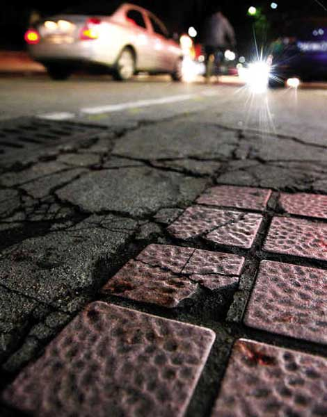
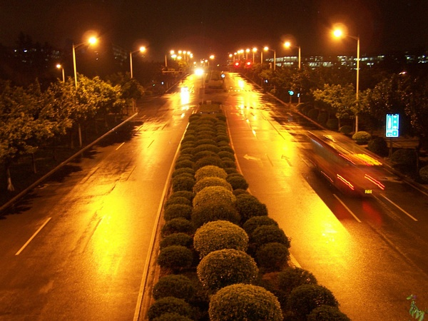
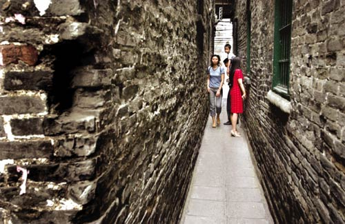
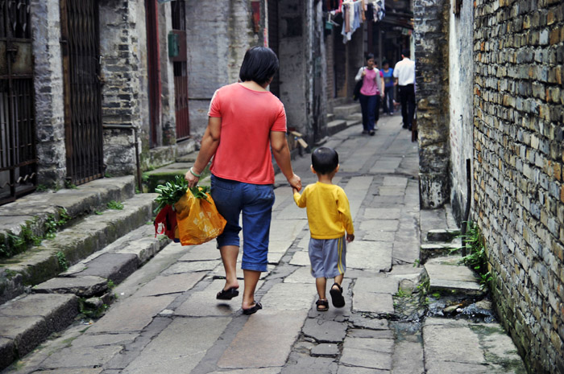

# ＜天权＞广州的小巷

**鲁迅提到“民族的脊梁”，在文天祥时代，这脊梁也许是忠君爱国的气节，而现在，却应该是人维护自身合法利益和社会公正的勇气，这种公民精神是建立公民社会的基石，而我能在这个城市感受到。而小巷里的人们，来自全国各地在这异乡默默辛劳的人们，不是脊梁，却是支持这脊梁的有力肌肉，他们是撑起公民大厦的梁柱，他们的血汗为这大厦涂抹上最初的油彩。**

** **

****

#  广州的小巷

## 文/陈不识（暨南大学）

子虚：

我开始酝酿给你写这封信的时候，正在石牌村的小巷里，喝着一瓶冰镇老珠江啤酒，一边对一盘四季豆回锅肉望眼欲穿。我上次带小凤来这的时候，那厮用他那尝遍大武汉身经百战的狡猾舌头一下就认出是地沟油炒的，但是我们照吃不误，我们的胃早已百毒不侵。我对面坐着一个中年农民工，皮肤黝黑，身材壮实，留短髭，挽起灰褐色衬衫的袖子吃炒饭，右桌是几个有些发福的中年女人，一边从小地锅里夹菜一边用湖南口音大声地笑谈，前面正对着小街的是一对年轻情侣，一边聊天一边把玩着手机等待上菜。老板忙前忙后，老板娘抚着大肚子，独自坐在门口，平静地望向逼仄的小街。

你上次问我广州这个城市怎么样，我想广州的一面，那些高楼大厦和新奇时尚你从任何媒体都能看到，而我现在只是告诉你广州的另一面。

这里是广州的小巷，在我学校附近的石牌村。这里不是戴望舒的雨巷，没有油纸伞，也没有丁香般的姑娘彳亍而徜徉，却是同样地幽暗而悠长，现在就跟着我吧，就像跟随《俄罗斯方舟》里那个一望无际的长镜头，不，也许把石牌的小巷铺展开来，比忧郁得神经质的俄国人的舌头和历史还要长一些。

小心点，你脚下的地总是凹凸不平而且潮气很重的，又常有光着膀子的汉子拉着垃圾车轧过，污水的气味，混合着垃圾的气味、汗水的气味、食物的气味、发廊的气味、杂货铺的气味、男人劣质香烟的气味，女人廉价香水的气味……不不不，并不那么恶心，我倒是宁愿把这小巷中的混合气味比作一首蹩脚而有趣的交响曲，细心分解它的化学分子式。

从卫星图上看，这里就像我们的毛细血管一样分支繁复，却又是一脉相通。现在跟着我，就像跟着博尔赫斯，那个可爱的老瞎子的拐杖敲击在巷壁上，空洞洞地回响，深呼吸每一种想象中的可能性，在无数时空交叉小径的迷宫中寻找命中注定的劫数。我常常在此游荡，刚开始的时候搞不清这里错综复杂的状况，却乐于随心所欲地走进任何一条岔道，心想大不了迷路了就从原路返回，却很少真的迷路，总能找到一个豁然开朗的出口，看到未曾想到的景象。现在我已经摸索到一条些最近的路，直通向天娱广场对面，或者总统大酒店旁边。慢慢走，给对面的人让下路，小巷很窄，最窄处只能勉强并肩过两个人。

啊哈，你看，这里什么店都有，打着各地招牌的小饭店里煎炒烹炸，小桌子上闪烁着食客的红口白牙；成人用品店的霓虹灯闪着暧昧的光，告诉你这里连SM用具都齐全；路旁小服装店全是假名牌，价格便宜款式新潮，放着《爱情买卖》或者《两个人》这种或新或老的总之都挺给力的流行歌曲，全凭老板的爱好；发廊里德理发师很忙碌，守着长途话吧的大妈还眯着眼睛在碎碎念，偶尔看到卖猫的人，笼子旁用红笔在纸板上写着“能捉老鼠”......

这巷中的一帧帧平淡无奇烟火气十足的画面，最大的好处就是便宜，在这里，你可以吃一顿五块钱的快餐，理一次五块钱的头发，打一个五分钱一分钟的长途，租一个月三四百块的房子（偏远些的上社和棠下一带可能更便宜），这在这个城市的别处是难以想象的。我有时买一块两块钱的肉饼，一个五块钱的鸡腿，再加上一块钱两个的馒头，有时还会提一瓶青岛或者雪花，钻进便宜的长途话吧里边吃和老友边聊。

放下电话，我透过绿色的啤酒瓶看这城中村的小巷匆匆走过的人们，这里生活的人们，或者说我们现代社会的人，我们的生命的时间不再是古典时代广阔的，模糊的，浪漫气息尚存的，汪洋恣肆的无边无际的江河湖海里的水滴，而被精确地狭隘地理性地，分割成由量化的时分秒组成的孤单的瓶装水。个体生命的就是瓶装水。时间在这里被压缩，在这里被彻彻底底地祛魅。

昆德拉不喜欢这种时间的祛魅，他在《慢》中的精彩段落里说，懂得慢的乐趣的人“凝望仁慈上帝的窗户”，而我们在这小巷里仰头凝望，可以看到什么呢？密密匝匝的楼层平均间距也就一两米的样子，楼上的各种线路比古代后宫女人百转千回的弯弯肚肠更加盘根错节，楼和楼通过他们就像握手甚至拥抱在一起，阳光锈在上面。那从太阳出发的光，用了八分钟，穿过太空，穿过大气，穿过云层，最后却在这里生锈了，再也挣扎不起来。所以这里无论何时都是这种幽暗的色调。

但是也许这里的人们并不需要阳光。想象下刚才我们在小饭店的邻座们，白天，他们走出城中村小巷，中年男人在建筑工地挥汗如雨，中年女人在尘土飞扬的街边摆地摊，年轻男孩去一座几十层的写字楼办公室里做小职员，年轻女孩到一家星级饭店当服务员，傍晚，他们坐上拥挤的地铁或者BRT回来，这里只是一个睡觉的地方，仅此而已。白天不懂夜的黑，反之亦然。

但是我忘了一点。孩子。七八年后，从小店老板娘子宫里出生的那个孩子，那个小男孩或者小姑娘，会穿着脏兮兮的校服，趴在小店的桌上写作业或者看高柜上电视机里的喜羊羊。孩子是需要阳光的，可是阳光在这里被收编了。

刚才说到地铁，广州前一段新开通了几条地铁线，年前也开通了BRT,报纸上有人盛赞这些交通工具拓展了这座城市的地理空间。而小巷里人们的空间却被压缩了，连同时间、欲望和尊严。也许他们辛苦一年也买不起一个LV包，辛苦一辈子也挣不到一部兰博基尼，而远离家乡的他们，躲在这城市的暗角里默默奋斗着和希望着。我想起以前有人调侃写了个帖子，列举各行各业的收入（在不吃不喝不消费的情况下）什么时候能买房子，比如一个工人要做多少零件，一个作家要码多少字，一个妓女要接多少客等等。我给你说这些并非刻意渲染这小巷里的悲苦氛围，只是愤世嫉俗在青春的祭坛上被冷冰冰的现实残忍地一次次剥离开。但那也许有些心酸，却又未必是一种绝望了。人们平静而淡定地生活着，不懂通货膨胀和CPI，不知道温家宝上了TIME的封面，不关心谁得了诺贝尔和平奖，这些东西还不如今天鸡蛋的价格重要。就像电影《悲情城市》里，不管发生什么，总是有一家人安静吃饭的场面。总是要吃饭的，这就是生活吧。

一次我们一群流氓在石牌村不远的饭店里喝到两点多，中间挑逗一卖酒的小姑娘，93年的，她要干到五点多才下班。我在想象中看到那十几岁的少年少女刚迎过第一缕晨曦，便立即隐没在阴暗的小巷里，沉沉睡去了。像很多不为外人知的地方一样，这里隐藏着卑微而繁杂的回忆和故事，和着钝重的语法和变形的元音，随着背井离乡的少女的背影一同隐没在这城市的背影里。

但是并非所有人都喜欢城市这些阴暗的后台和卸妆后的丑陋。类似棚户区和城中村改造并非什么新奇和不合理的事情，比如最近改造完成的猎德村据说状况就不错，但是两三个月前，还传出因为拆迁纠纷被警方带走十几个人的事件。城中村像是城市的肿瘤，不，更准确的比喻应该是城市的私处，本来有用却令城市羞于启齿，于是，一场伟大的割礼开始了，每一条小巷，每一个人，只不过是这宏大叙事下的标点符号。剧本《阴道独白》中写道，一个女人发现自己的阴道就像在湖里打捞一块祖母绿。但常有不由分说硬闯进来的阴茎，有时叫阶级斗争，有时叫GDP和市容，打破这里卑微的平静。

这座城市当然有明净开朗的一面，不用说她引以为傲的经济水平，她的政府财务公开程度在全国无出其右，她的媒体监督政府的勇气也是著名的，她的子民敢于联合起来上街反对污染自家环境的垃圾焚烧工程，敢于为了自己方言母语的存留发出呐喊。鲁迅提到“民族的脊梁”，在文天祥时代，这脊梁也许是忠君爱国的气节，而现在，却应该是人维护自身合法利益和社会公正的勇气，这种公民精神是建立公民社会的基石，而我能在这个城市感受到。而小巷里的人们，来自全国各地在这异乡默默辛劳的人们，不是脊梁，却是支持这脊梁的有力肌肉，他们是撑起公民大厦的梁柱，他们的血汗为这大厦涂抹上最初的油彩。

有人解读王安忆《长恨歌》里最后长脚杀死王琦瑶的隐喻着现代化的市场经济代替了旧中国十里洋场的繁华，上海也许是这样吧，广州却没有这么决绝，新旧是混杂在一起的。石牌村里，偶尔也会路过些森然古旧的祠堂，这里还是有些历史的，据说在某处还存有孙中山手书的牌匾。而这座据说2800年历史的城市又是创新的，从清朝的十三行到大革命的基地，到文革后期的李一哲大字报，再到改革开放的前沿阵地，广州常走在时代之前。

但我还是喜欢在这小巷里游荡，你知道吗,这里隐隐约约有种咱们家乡的气息，可能是咱们小时候在家乡这种小巷里玩儿惯了吧，还记得咱们在烟雾缭绕鱼龙混杂的游戏厅一起搞到深夜，回去被家人打吗？还有一起和比我们大的孩子打架,还有在工地上偷走螺纹钢卖到废品收购站然后去玩游戏机，哈哈，那时候做什么都毫无负罪感，只是好玩而已。

但现在我却离开家乡，到这里来了。弗洛伊德说图腾是父亲的替代品，人面对两者都有反抗和赎罪的矛盾心理。这小巷里的人和我一样，挣开家乡的束缚，来到这个城市寻找新的图腾，却又割舍不断延续的血脉，这并非是多么地恋家，却像是一种本能的对脐带的依恋。小巷里的人们在这方面和我相似，羁旅之人的同感。

但是无论如何，无论小巷内外，广州是个有趣的城市，我已经开始喜欢她了。上学期我做家教或者办别的事跑了一些地方，问了很多路，对广州人的印象也不错。那次去接学者胡泳，他在车上问广州是个什么样的城市，本地的司机就说，广州这个地方啊很开放的，只要你不偷不抢，只要努力，都能混口饭吃的。这可能是我听过的对广州的最好描述。《食品公司》结尾曲歌词有一句，“This land is for you and me.”确实如此。

所以，哪里都是我们的，趁着年轻，兄弟好好混，不要想太多，大家现在状态都一样。我在这，你在家，咱们都好好的，过年一起喝酒，在缝山针下，哈哈。

乌有

2010年10月16日零点于羊城 
