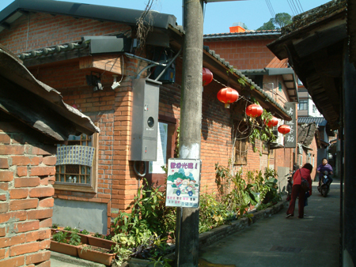
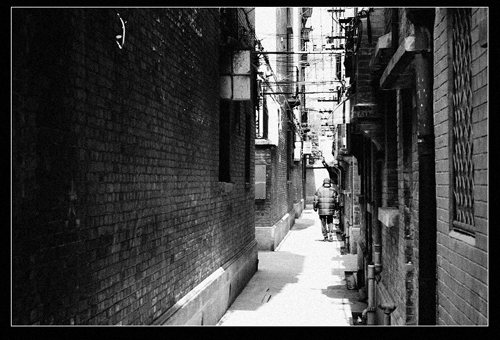
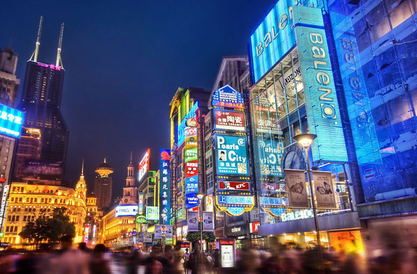
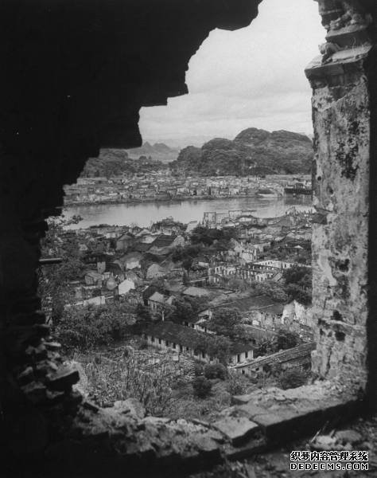

# ＜天权＞式微的聚落

 **这或许是现代聚落无法抹去的悲哀和现实真相。我们拆除的不仅仅是一座房子，一个村落，同时拆掉的也是一种历史，一种记忆。而那些聚落千百年来积蓄的文化认同感正逐渐消逝，融入到现代主流的政治框架内，变成了一种异化的价值符号。**  

# 式微的聚落

## 文/文刀刘（安徽师范大学）

  每次坐火车去远行的时候，我都会专注地望着车窗外流动的聚落。它们或远或近，或大或小，或处山塬沟谷之间，或临平畴水汜之侧。它们栖息于这个国度古老版图的一角，虔敬地承袭和传递着地域文化的血脉与香火。纵然锋利和野蛮的历史剥掉了许多聚落鲜明的外壳，但它们还是以一种强悍的文化向心力在凝结和巩固着自身的势力，渗透进每一个宗祠和家族的记忆里。于是，聚落千百年来积蓄的文化认同心理在地域扎根立足，成为了地方独特的文化形态和构建模式。 

 当我独自穿过某个城市的街头巷尾，极力地感受和捕捉着空气中每一丝勾栏瓦舍的气味。这里，古典与现代共鸣，发出冗长的回音，视野之间勾勒出一个有着光、影、声、色的市井流动风俗画廊。阿尔贝·加缪说过，想要了解一座城市，无非是了解这座城市里的人怎样活着，怎样相爱，又怎样死去。不管是沿街吆喝的小贩，还是倚门啼哭的幼童，亦或是隔屋争吵的妯娌，他们都以或隐或显的世俗生态画面在构筑着我的聚落记忆和城市体验。这也同时让聚落有着意蕴深厚的生命观感和人情风味，使其在现代城市革命的黑暗到来之前，化作永恒的记忆和古老的微光。 不可否认，这是一个张狂恣意的时代。打着城市化和现代化的温柔幌子，在权贵资本利益媾和的联盟下，各种势力张牙舞爪地推进着暴力拆迁和城市革命，古老的城市和乡野聚落正面临着灭亡和绝迹的危险，发出一声无力而又微弱的历史叹息。王安忆的《长恨歌》中老上海的弄堂不见了，北岛的《城门开》里老北京的胡同不见了。地方圈地运动正方兴未艾，百姓房屋被强拆却诉求无门，或自焚抗议，或进京上访。李承鹏在《李可乐抗拆记》中用黑色幽默和荒诞的笔触揭示了这个时代暴力强拆的罪恶和血腥史；简·雅各布在《美国大城市的生与死》中写道：“大规模计划只能使建筑师们血液沸腾，使政客地产商的血液沸腾，而广大群众往往成为牺牲者。其实牺牲的岂止是群众，更是城市的内在灵魂——文化”；高尔泰在他的自传体散文《寻找家园》中沉重地戏谑这场城市革命的本质：“那一场花样繁多的人肉盛宴，拖的时间也实在是太长了。”而诗人于坚却无奈地感叹道：“一个焕然一新的故乡，令我的写作就像是一种谎言。” 

 面对现代化和城市化的革命浪潮，本土的聚落文化正在日益萎缩和衰落，而异化的城市景观却凶猛而又强势地涌入到现代城市的众多角落，有人称之为“多元文化的融合”。实体地名作为城市坐标的抽象头衔和方位指向，是地域聚落文化依托的历史名片，而我如今的日常工作之一就是编审地名文化词条。在录入地名信息的工作过程中，给我最深的感受是：现代许多城市日益带有山寨化和异域化的倾向。查建英在她的《八十年代访谈录》中曾有过这样一段话：“北京很多新建筑就像七色进口冰淇淋、欧陆风情、加州棕榈泉、温莎大道、后现代城……其实多元文化、异国情调都是好事美事，只可惜我们先革掉了自己这一代的文化传统，失了元气，还没来得及复苏，异国情调就从天而降，弄得有点喧宾夺主，我们自己倒没了根底。” 台湾作家龙应台也曾提到现代城市革命在全球化浪潮中的文化生存问题，她曾说道：“是应该跟世界接轨，但你接上轨之后开进开出的列车里装的全是人家的货，那你自己在哪儿啊？”从某种角度来看，龙应台对于现今本土聚落的衰微以及文化焦虑与质疑的看法不无道理，但她似乎还没有认识到和指出这一问题的根源与滥觞所在，而土耳其作家奥尔罕·帕慕克则深刻地道出了这个时代聚落文化式微以及城市革命的某种尖锐本质。他曾在《伊斯坦布尔》中写道：“尽管如此，此一垂死文明的哀婉愁怨依然包围着我们，虽然西化和现代化的欲望强烈，但最急切的愿望似乎是摆脱衰亡帝国的辛酸记忆，颇像被抛弃的情人甩掉心上人的衣物和照片。” 

 现代城市革命所产生的神奇效果之一就是用崭新而又丰富的实体物质景观去巧妙地掩盖和摆脱掉帝国昔日不堪入目的政治记忆，让人在光怪陆离的世界中丧失了自我感和历史感。我在地名编录的过程中，曾遇到很多带有政治色彩的历史地名记忆在悄然地隐藏和消逝，而他们将此称之为“负面地名信息”。 我们的民族向来没有形成奥尔罕·帕慕克所指的那种带有伊斯兰宗教和地缘政治复杂的“呼愁”情结。纵观漫长的中国历史，在零星的古诗文里，偶尔也浮出一些类似“呼愁”的情结，然而，不论是刘禹锡的“朱雀桥边野草花，乌衣巷口夕阳斜”还是杜牧的“商女不知亡国恨，隔江犹唱后庭花”，这种隐秘的个人化历史情结远非奥尔罕·帕慕克的“呼愁”所指那样：“呼愁”不是某个孤独之人的忧伤，而是数百万人共有的阴暗情绪。我们的“呼愁”情结已被历代的政治无形地压制并逐渐同化，以致最后在面对现代的城市聚落革命浪潮下，对于废墟的记忆和城市的蜕变，众多人的脸上只剩下麻木和无关的表情。 从贾樟柯的电影中，可以看到，无论是《三峡好人》还是《世界》，它们都或多或少地展现了现代聚落变迁的影子。《三峡好人》里有着那些在尘土瓦砾的废墟间拆掉自家老屋的人们，而《世界》里却充斥着无处不在的山寨城市建筑景观。导演贾樟柯并没有停留在这种粗糙的电影镜头之中，而是从这些现代的聚落变化中发掘出了更为深刻的时代本质：光鲜的外表，空洞的灵魂。 

 这或许是现代聚落无法抹去的悲哀和现实真相。我们拆除的不仅仅是一座房子，一个村落，同时拆掉的也是一种历史，一种记忆。而那些聚落千百年来积蓄的文化认同感正逐渐消逝，融入到现代主流的政治框架内，变成了一种异化的价值符号。正是这样，式微的聚落，流变的故土，最终让我们成为了一种没有乡愁、没有归宿的异乡人，丧失一切柔软和细节的疼痛，去寻找残酷而又凶猛的未来生活。  

**（采编：麦静；责编：黄理罡）**

 
