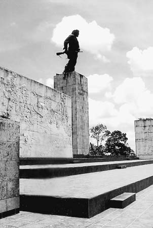
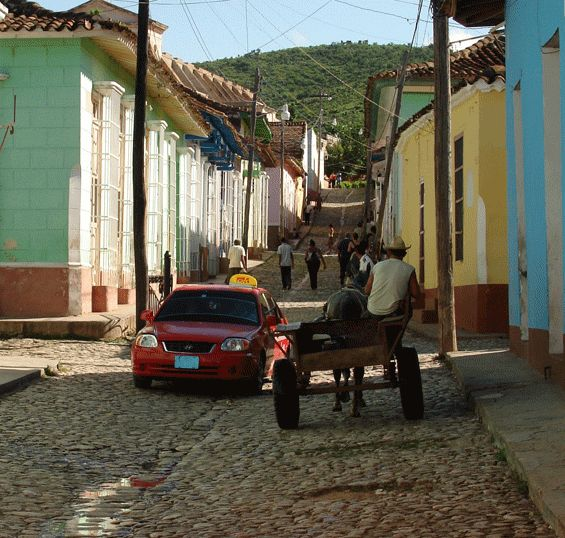
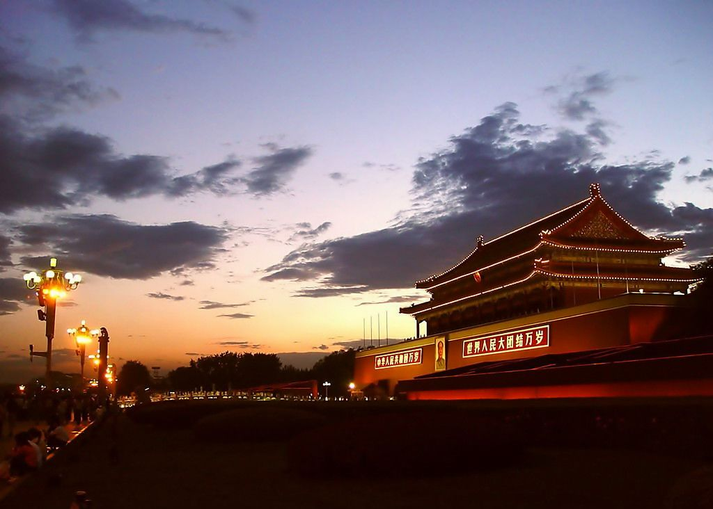
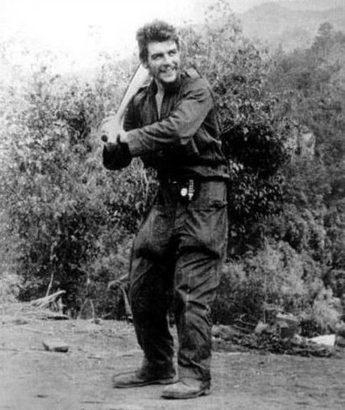

# ＜天权＞忠于理想，面对现实

**诸如此类的傲慢是多么容易滋长。它认为自己是真理的化身，站在道德和智慧的制高点上，有时还戴着三个表。它说以你们的智商你们都不知道什么是幸福，告诉你只有我给你指的那条金光大道才是你们方向，才是你们要牺牲你们的一切去投奔的目标。**  

# 忠于理想，面对现实

## 文/谷凌一（University of Virginia）

 

#### 1.

那天我去看他，我高中时代的英雄梦想。蓝天白云，滚烫的太阳，镶嵌着红色五角星的广场，巨大的广播播放着热烈的革命歌曲。像是50年代的招贴画：空气里充满了自由，热忱和理想。

格瓦拉的青铜像基座下，一边有个很小的展览室，摆放着不多的遗物和照片；另一边埋放了他和与他一起死于玻利维亚的游击队员的遗骸。一直在想，那些为了乌托邦梦想死去的理想主义者们，如果他们醒来，看到现世的这一切，会说什么呢？

#### 2.

如今看来，革命先烈们的鲜血不仅白流了，而且比白流了还要惨烈。他们为之奋斗的完美社会跌入现实中，就成了人间地狱。我们那个在敏感词统治下植物大战僵尸的年代，据老罗语录，非正常死亡的人数多于一战和二战各类杀人机器开足马力绞肉的总和。我也忘不了金边S-21监狱里，那密密麻麻的，睁大眼睛甚至对着你笑的，最终无人幸存的，遇难者的存档照片以及叠得很整齐的累累白骨。当然还有古拉格群岛，还有金大胖金二胖以及未来的金三胖的帝国--只要金胖们继续胖着，高丽人民就继续瘦着。

#### 3.

当年热忱地建立乌托邦的年青人，现今只剩下歪在哪个戒备森严的大楼里打点滴的卡斯特罗。仿佛就是这一场狂潮的真实写照。古巴正沿着我们第二代敏感词指出的方向，迈步走向我们的80年代。

说说古巴现在时什么样吧。人均月工资二十美元不到，但是基本生活用品吃穿用度，房子车子，蜜月度假，医疗教育，全是国家按计划配给。听上去仿佛乌托邦，实际上很坑爹。货币是两套，普通peso和外汇劵，只有外汇劵能买一般商店买不到的东西--街边站着完全符合周立波描述的打桩模子。所有先富起来的人，都是做外宾生意的。吃穿的物资很紧，详见我人人相册古巴分册的国营商店照片--值得一提的是我在哈瓦那老市区见到一家只收外汇券卖阿迪耐克彪马的店，里面火爆地仿佛换季打折般挤满了买那些一条运动裤等于普通人三个月工资的古巴人。住房紧张，几代同堂是常见的，离婚夫妻也只能继续住一起也是常见的；住房不能买卖。车子你就别想了，是专门配给这个那个人的。至于贴心蜜月套装，则诡异地导致古巴离婚率跃居美洲第一。蜜月套装指的是，花两美元扯个证，你们就能发到两箱啤酒两箱软饮料几套新衣服，外加高规格酒店蜜月套房一周。在这个一听啤酒三美元相当于十分之一的月工资的国家，有着拉丁民族冲动热情好客性格的古巴年轻人，为了能和亲朋好友开个party，脑袋一热就扯证了。等蜜月结束回到家，屋檐底下上有跃跃欲试准备开打婆媳大战你男人若不回来吃饭就只供应剩菜剩饭给你的婆婆，中有觊觎你那点灰色收入的大伯子和偷你千辛万苦弄来的化妆品用的大嫂子，下有哭闹不止无法无天无人能管的小侄子，你于是两眼一黑……（啊，为毛我会入戏这么深，难道是天涯婆媳和天涯育儿逛多了……）

这个古巴，是只要外宾您愿意就能找到为了更好的物质生活积极踊跃热烈报名做你二奶的少女。这无疑是对格瓦拉式的英雄主义最辛辣的讽刺，最毫不留情的耳光。

#### 4.

我在同济的时候曾跟着和平路边喊住我问“同学你知道圣经是什么吗”的同学去观摩过一次小教会活动之后短信联系若干。有信仰的人说话做事自然有他让人感动的地方：他是真心找到了他心中的光明并诚恳地要和你分享这种喜悦再拯救你于末日的地狱。但是这难道不是一种傲慢么：视自己为被神恩宠的孩子，视周围人为庸庸碌碌争权夺利猪油蒙了心的迷路小羊羔。

柴静的《看见》有一期《为了顺治》。男婴顺治胆道闭锁，他从没见过世面的父亲带他到上海看病。因为高额手术费和低术后存活率，因为负债累累，他父亲决定放弃治疗。期间“爱心妈妈”志愿者们一直激动地指责他愚昧无知指责他没有人性，并质问他：你又不相信我们了吗你没看见我们是在帮你出钱出力啊你什么都没有我们图你什么啊我们就是想帮你啊。之后一个志愿者在顺治父亲做出放弃治疗的决定后愤怒地“没收”了孩子的病历。怎么都觉得这样的帮助包含着自上而下的俯视，和自以为是的拯救。

诸如此类的傲慢是多么容易滋长。它认为自己是真理的化身，站在道德和智慧的制高点上，有时还戴着三个表。它说以你们的智商你们都不知道什么是幸福，告诉你只有我给你指的那条金光大道才是你们方向，才是你们要牺牲你们的一切去投奔的目标。

那些怀着乌托邦梦想的革命青年，毫无畏惧地按照真理的平立剖节点图纸改造这个世界，完全无视甲方的任务书。是不是骨子里也有这样的傲慢。

#### 5.

当我从我的萝莉时代坚定地走向中年妇女时代，当我放下摩托日记点击进入天涯育儿，我汗颜地发现我仍然热爱着我曾经热爱的那些英雄们，我仍然做着那些我曾经做过的梦，我仍然过着我十六岁时想要过的浪迹天涯的生活。

我知道丢下妻女吞枪的柯本是多么不负责任父亲，我知道如果生活在梵高身边一定会对他的疯狂忍无可忍，我知道格瓦拉的游击队就是如我们敬爱的敏感词总理所说跑到哪里放一把火就走不管不顾的。可是那些燃烧的恒星，它们一定会灼伤甚至毁掉身边的星球，但它们的光芒穿过时空的茫茫黑夜，却能照亮你的希望。

吸引我的始终是那种热切，自由，充满理想主义的光芒。它让我知道有另一种生活在等待。在这个吃三聚氰胺做顶天立地房奴的混乱时代，他们告诉我说，除了犬儒主义式的打酱油，其实还有另一种选择。

#### 6.

墨西哥的高原小城San Cristobal de las casas是Chiapas的首府，这个州1/4的人口是玛雅原著民。靠着几乎空白的西班牙语和完全空白的玛雅语，我斗志昂然地混在玛雅中年妇女们中间坐着破烂的小巴奔赴于各个村庄的市集间。市集上有很多玛雅姑娘们缝制的布偶，各种傻头傻脑的小动物造型，但最特别的骑着马儿扛着枪蒙着脸的游击队员布偶。

十全大补手册Lonely Planet指出，这便是Zapatistas，一个旨在维护印第安人利益、出没与丛林间、导致美国向墨西哥政府援助1 billion美刀军费的左派武装组织。

自然它是传承了格瓦拉的游击队传统，但是又不一样。队长Subcomandante Marcos依旧是个受过良好高等教育的思想家革命家。但当当年充满一腔年青的热血的他跑进贫穷苦难的玛雅村庄鼓动被压迫的玛雅人民发起土地革命推翻资产阶级统治建立无产阶级专政时，淡定的玛雅人民看了看这位文艺又二逼的青年，说：土地不是财，资产亦非私，本来无一物，何来闹革命。说完这些玛雅人民就该干嘛干嘛去了，留下有如当头棒喝被完完全全shock到了的Marcos同学。

再后来94年的时候，大彻大悟的他建立了一支不一样的游击队。他们不要乌托邦，他们也没打算推翻什么建立什么，他们说他们是玛雅人也是墨西哥人。感觉更接近于一个和当局不断谈判的维权组织。Marcos说“We didn’t go to war to kill or be killed. We went to war in order to be heard.”

San Cristobal的Zocalo上一直有几个写满大字报拉着标语的帐篷。我问了一个从墨西哥城大学过来玩的大学生，他说大概意思就是当地的玛雅人和政府的土地纠纷，玛雅人抗议随意政府征用他们的土地云云。

这是个远比几十年前更实际的游击队。他们不是赐予玛雅人一个新的生活蓝图，而是应玛雅人之请帮助他们和政府就各种不那么激动人心不那么波澜壮阔的事情而谈判。

这是不是就是格瓦拉死之前说的：忠于理想，面对现实。

对了，我高度怀疑这只游击队全体蒙面的原因除了耍帅以外，还为了在平时逛街买菜吃冰淇林的时候不被人认出来。此外，身为游击队队长的Marcos，还写了本叫做的儿童书，主要讲了那些喜欢抽烟喜欢女人的古老神灵们的传说故事……

#### 7.

我离开格瓦拉的墓地时，突然冒出来一群追逐打闹的孩子，赤着脚穿着挺脏的衣服，但是笑得很开心。

在他试图用热血建立完美社会之后这么多年，在他墓地边，生活依然和他所想的乌托邦有天壤之别。不能说这些孩子们的生活有多美好，但是也不能说他们的生活毫无希望。但是无论如何，它不是你能快刀斩乱麻地“拯救”的。

我把带来的小文具和巧克力都分给了这群孩子们。大概也只能做这些了吧。

 

（采编：尹桑；责编：黄理罡）

 
