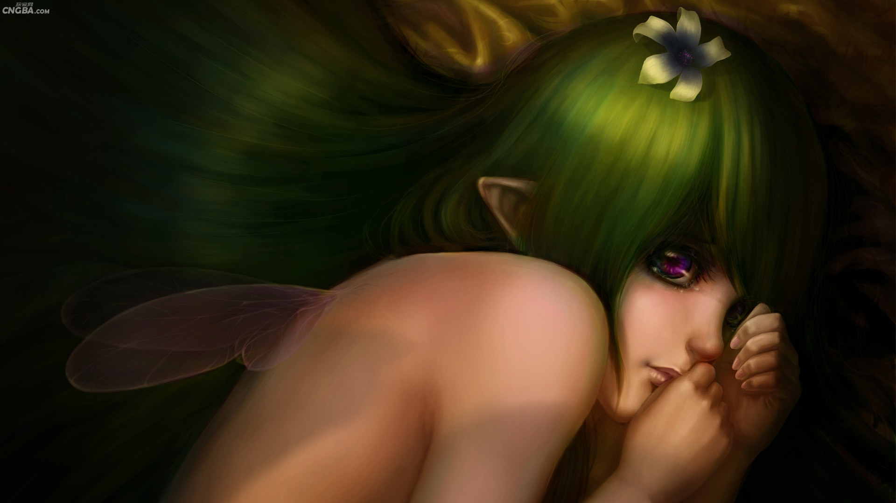

# ＜天权＞性爱小说：消失的鬼

**我们知道，到了夏天，总是要发生一些莫名其妙的事情，也总是有一些人和东西会出乎意料地消失掉。这些失踪不但猝不及防，而且完全没有可以解释的原因。谁能解释一只青蛙在变成金光闪闪的王子时，物质守恒定律是如何发生作用的呢？因此，我们只要自然地看待它们就好了。自然的东西是不需要解释的。但是他沉默了好久，最终还是说了一句：这是为什么呢？鬼怎么可能消失呢？**

 

# 性爱小说:消失的鬼

## 文/覃仙球 (首都师范大学)

 

### 

### 

其实他总共只和鬼做过一次爱。

那一次是很久以前，鬼藏在他的口袋里。他在厨房，正要把面粉倒进瓷盆里，准备制作蛋糕。口袋里突如其来的鼓胀感让他顿时满足和错觉起来。鬼在这里啊。他安心地想。于是他并不急着把鬼从口袋里拿出来，而是继续有条不紊地往面粉里加入蜂蜜，鸡蛋，牛奶，盐，酵母和水，然后搅拌，在窗台的阳光下静置十五分钟。做这些的时候，你可以看见他的身体，此刻变成了一幅静物画。在这幅静物画里，画家错落有致地安排了向日葵，水果和彩色瓷器。它们几乎静止和永恒，以藐视相对论和进化论的姿态固定在那里，死亡无法企及。所谓的安心，就是如此的布局了。然而这份二维的平衡很快被打破了。因为鬼突然钻到了他的裤子里。

我要和你做爱！鬼在他裤子里尖声尖气而又瓮声瓮气地说。鬼的声音简直是稚气极了，就像一个刚刚吃了大量牛奶糖的小型哺乳动物一样。这样的鬼要求和你做爱，你怎么能够忍心拒绝呢？但是他还是犹豫了一下子。他以奇怪的姿势翘着手臂，弯下脖子看裤子里的鬼，因为害怕沾满面粉的手会弄脏了鬼。他感觉自己裤子里悄悄隆起了一个物体，像一块狗骨头，或者一个麦克风，一根电线杆，一支小小的粉笔。反正是一些他很熟悉又很生疏的东西。这些东西他都见过，但是从来没有亲自感受，所以也不知道应该怎么解决它们。他看见鬼在裤子里蟋蟋簌簌地动，如同一只正在换毛的不安的小松鼠。他叫了一声：鬼。他小声地说，我不知道怎么做爱。说完他的脸悄悄红了起来。他觉得自己多么愚蠢啊。鬼是这么的好，而他却竟然不会做爱!

鬼从他的千鸟纹灰色呢子裤里探出头来，匪夷所思地看了他一会儿，然后又看了看刻有石楠花的壁炉板，好象要确认他们之间的关系。这时候鬼的眼睛其实是茫然的，它既没有看他，也没有看壁炉板，当然更不可能看波斯菊图案的壁纸，或者窗台上的绿色盆栽植物。它凝视的可能只是它自己的身体。但是我们也不得而知。作为一个鬼，它有足够的理由保持自己的古怪和神秘。

他紧张地看着鬼，担心它即将要尖叫地哭起来了。他是多么地爱鬼啊！他为自己不知道应该怎么和鬼做爱而深深自卑和自责起来。这时厨房里极其安静，只有排风扇轻微的嗡嗡声，和正在缓慢发酵的面粉混合物发出的噗噗爆裂声。弥漫的是甜孜孜而又油腻腻的气味。这样粘稠浓郁的气味啊，你闻见了怎么能不想马上就着它们喝一杯摩卡咖啡？但是他窘迫得发起汗来，汗水在他的额头堆了密密麻麻的一层，就像南方茂盛的棉花地。

沉思了很久，鬼突然抬起头来对他兴奋地说，你不会，我可以教你啊。说完鬼就咯咯地笑开了，这笑声迅速地洒了一地，就像一堆尖利而无用的碎玻璃渣子一样，在黑白方格的地板上叮叮当当地发着亮光。他开始晕眩了。他认为鬼是嫣然而美好的。

那我应该怎么做呢？他谨慎而温柔的问鬼。从他的声音和语气中，你可以听出他的谦虚和期待。只有爱着某个人或者某个东西时，一个人的心脏才可以这样柔软和富有弹性。从而我们知道，他是真的很爱鬼。他怎么能不爱鬼呢？鬼马上就要教他做爱了啊。鬼很严肃地说，首先你要洗手。因为你要抚摸我很久才行。如果你不洗手，我们没做完爱，白蚁就已经把我吃光了。我的身体太甜了！

他顺从地去洗手。他花了漫长的时间，因为手上的面粉块儿都已经硬化成了爬行动物的皮甲。用了大量的水和肥皂。他洗手时的表情是多么专注和学院派啊。在鬼看来，所有学院派的处男都是可爱的。他们不但不会做爱，而且都很善良。在他们学会做爱以后，他们仍然很善良。这样想着，鬼忍不住窃喜起来，小小的手捂住嘴巴，发出了稀奇古怪的欢笑声。

洗完手，他镇定了一些。他轻声问鬼，接下来，我们应该做什么呢？鬼这时像一个真正的指挥官了。它假装沉吟了一下，然后用尖尖细细的宛如小鸡的声音肯定地回答道，现在我们去客厅。这就是说，他们要在客厅做爱了。这是多么激动人心的地点啊！又宽敞，又温暖。在客厅做爱的感觉，根本不是那些只会在卫生间里做爱的人可以想象的。在卫生间做爱，亏他们想得出来！鬼高傲又不屑地想。

在客厅里，鬼挑选了一张草莓红的丝绒沙发，就命令他躺下了。这时，鬼就从裤子里跳出来了！

其实我们早已经能猜出鬼的样子了：它非常之小，和一个穿花裙子的布偶一样，所以看起来随时都可以飞起来的样子；它穿着一件彩色菱形格子的罩衣，头上是一个黑色绒线的尖帽子。它的脸很尖，唇角也很尖，手指脚尖也一样，让人想起削好的花花绿绿的小铅笔。鬼有很黑的皮肤和瞳孔，这大概和它爱吃黑可可粉是有很大关系的。他羞涩地对鬼笑了笑，目光似乎要把鬼轻柔地包裹起来了。

鬼双手叉腰很威严地下令：把衣服脱了。鬼听见自己的声音又尖细又沉稳，得意地偷偷踮脚跳了一下。你见过上发条的吉普赛小人儿跳舞么？它们就是这样，一踮一踮地跳，风就把它们的大花蓬蓬裙吹得鼓起来啦。他温顺地脱下了绒线的外套，和白衬衣，又弯曲起身体，脱下了千鸟纹的呢裤子，和底裤。他把它们都整齐地堆放在沙发边的地毯上，然后重新躺下了。这时，他就是完全赤裸的了！

应该怎么描述他的身体呢？其实他的身体，和鬼比起来，简直就是一艘巨大柔软的橡皮艇，完全可以把鬼盛装和环绕起来。他身上均匀分布着鼓起来的肉块，和橡皮艇也很相像。光滑的，坚韧的。这些都可以用来形容他。他的皮肤和某种海洋生物的很相象，如此平整润滑，以至于让人以为刀枪不入。他的毛发很少，但是身体中间的性器官那里却很茂密，乌黑光亮，像一簇小丛林。他的性器官，已经发生了变化，耸立在丛林里，像一只不知道为什么要振翅起飞的大鸟，很困惑的样子。他从来没有使用过它，所以完全不知道拿它怎么办才好。

鬼看着他驯服地平躺的身体，感到很满意。如果你凑近它，可以看见它的瞳孔里，有两朵神采奕奕的小火苗在跳动。鬼狡黠地笑了一下，就飞快的把罩衣扒掉了，如同扒掉玉米的外皮一样轻松愉快。我们看到鬼的身体，是完全不会让人感到惊异的样子。它有两个又小又圆又翘的乳房，臀部和乳房一样，都是俏皮的样子，似乎要挣脱皮肤的束缚轻盈地飞起来，而它的皮肤，闪耀着新鲜可可豆的光泽，又稠又亮，仿佛可以流动起来。鬼的腰肢瘦小伶仃的，四肢也很柔弱无助，让人看了忍不住要心疼起来。鬼还有一个完全符合规格的性器官，上面有一片薄薄的绒毛，一个微妙的阴蒂，和一个单薄略显锋利的阴唇。它们都很柔软和湿润。

鬼从地毯上轻快地跳到他的身体上，灵活地爬来爬去，还戴着那个古怪的绒线帽子，妖里妖气的样子。他觉得有很多猫咪在自己的身体上毛茸茸地蠕动，于是想笑起来。他支起头，正好看见鬼扬起的黑亮圆润的小臀部，尖尖的肩胛骨，和顽皮的绒线帽子。鬼突然跳到他的性器官正上方去了。它奋力地张开自己的腿和性器官，勇敢地尖叫了一声，就把他的性器官完全插到了自己的性器官里去了！然后它就像那些上了发条的吉普赛小人儿一样，一踮一踮地跳了起来。

很多很多暖和的海浪正在从他的胸口涌起来，让他以为自己的身体变成一个温泉了，正在雾腾腾地融化，一波又一波蓬松松的白色水蒸气，毫不费力就升到空中了。他很疑惑，自己真的可以这么好吗，这样乏力而又忍不住要律动地躺在这里，连让人眼花缭乱水晶吊灯都若隐若现了。他看不见鬼了。鬼那么小的身体，怎么能把他的性器官全都吞进去了呢？他的性器官看起来多么粗暴，而鬼又是多么柔软易碎啊。他想看看鬼变成什么样子，但是他什么都看不清楚。因为那温泉源源不断地向他的四肢和大脑涌动，把它们完全麻痹和软化了。还有一个水泵，噗噗噗地喷着热气，冲击到他的喉管来！他忍不住只好随着水泵的节奏一声一声的呻吟起来。他的声音低沉而粗野，让他都不禁为自己惊讶起来。

鬼一边跳着，一边开始用儿歌的方式数起数来。它用童稚的嗓音甜美地唱着，一千，两千，三千，四千，一千，两千，三千，四千……周而复始。它只会数这四个数字。他的性器官很激进，但是竟然也没有对鬼造成威胁。鬼跳起来的时候，就露出他的一半性器官，看起来还是欣欣向荣的样子；鬼降落下来的时候，他的性器官就被吞没起来了，鬼的身体也并没有丝毫的膨胀。难道鬼的性器官和宇宙中黑洞的原理是一样的吗?这真是一个充满趣味的神奇过程。如果用初等算式来表示，可以简单地列为：A+B=A,或者X=X—Y。

在鬼跳得越来越快的同时，他也越来越接近红热状态。他只知道有一个飞速旋转的磨具，在他的全身所有的角落不停地摩擦，好象要将他彻底打磨干净，痒而舒适，使他抑制不住地轻轻痉挛起来。这是他发现自己身体里的那个温泉原来是一个火山口。滚烫烫的熔岩已经在薄薄的岩层下蠢蠢欲动，东突西冲，马上就要喷发而出——这一瞬间，三把手枪同时向他开了火，将他的身体打得弹跳起来，一下，两下，三下，四下，五下！他全身都被中弹的火辣感吞噬了！他失去了全部的知觉！巨大的麻痹和黑暗向他严严实实地倾压下来！他要死了吗？他随着子弹的发射一声接一声地叫喊起来。啊！啊！啊！啊！啊！他一共叫了五声，然后安静下来了。

所有的知觉都渐渐回到他的体内。但是他一点也不想动了。他好象变成了一滩奶油。只要永远躺在那里。他感觉鬼轻巧地正在爬过他的腹部，最后爬到了他的胸口。他轻轻抱住了鬼，轻轻叹了口气，翻侧过身体，就不动了。他觉得它的骨头很小很轻，像某种鸟类的骨骼，中空的，透气的，具有塑料低廉的质感，用手指按压下去，会发出轻脆的咯咯声，如同挤碎了一片又一片坚果的壳。如果再用力一些就可以折断了，就像折断一个单薄的谎言那样轻易。鬼在他的耳边小小声地问，你觉得做爱好吗？他气息微弱地说，很好，今天最好了。说完他就恍惚起来，在一堆又一堆白色泡沫的簇拥下沉沉睡去了。

但是，那天似乎是鬼最后一次出现了。在那天做完爱之后，鬼就真的消失掉了。

谁能解释消失的鬼是怎么一回事呢？鬼似乎是一下子就不见了。他在房间里，在橡木壁炉里，在衣柜里，在床的夹缝里，在抽屉里，在黄色军大衣的褶皱里，甚至在羊毛拖鞋里都没有找到它的踪迹。他终于相信，鬼似乎是真的消失了。这时蚂蚁行军一般的时间正在悄悄从他的桌面上相继爬过。在古代文明的碎片上也留有它们密密麻麻的痕迹，除了那些残余，其他的都被它们吞食掉了。与此同时他突然感觉到自己的心脏变成了一只被切开以后暴露在空气中持续氧化的苹果，呈现出与铁锈类似的暗褐色，在一阵短暂的呆滞之后终于忍不住抖动起来，随之将那些虚弱的碎屑纷纷抖落在地。

外面刚好是夏天了。我们知道，到了夏天，总是要发生一些莫名其妙的事情，也总是有一些人和东西会出乎意料地消失掉。这些失踪不但猝不及防，而且完全没有可以解释的原因。谁能解释一只青蛙在变成金光闪闪的王子时，物质守恒定律是如何发生作用的呢？因此，我们只要自然地看待它们就好了。自然的东西是不需要解释的。但是他沉默了好久，最终还是说了一句：这是为什么呢？鬼怎么可能消失呢？

科学家告诉我们，当物体每秒运行7.9 公里时，我们称之为第一宇宙速度，超过第一宇宙速度，物体可以飞离地球表面进入卫星轨道；当物体每秒运行11.2公里时，我们称之为第二宇宙速度，超过第二宇宙速度，物体可以飞离地月系进入外太空；当物体每秒运行16.7公里时，我们称之为第三宇宙速度，超过第三宇宙速度，物体可以飞离太阳系进入茫茫宇宙。当物体每秒运行三十万公里时，我们称之为光速，超过光速，可以使时间倒流，物体进入消逝的世界。

只要我们同时拥有了第一宇宙速度、第二宇宙速度、第三宇宙速度以及光速，还有什么是不可能的呢？

 

（采编：应鹏华 责编：麦静）
