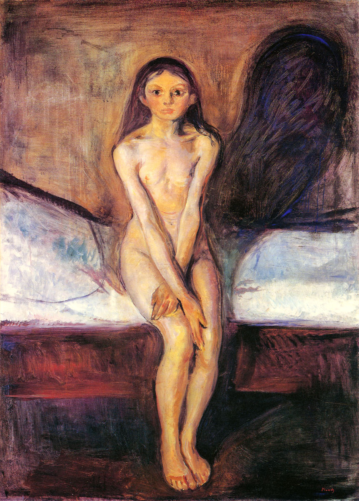

# ＜天权＞恋马狂的第二个故事：妓女萨日朗的死

**我甚至嫉恨那匹和她日夜不离的黑马。有时晚上隔着窗户微黄的灯光，我能看见萨日朗赤裸着身体，在给黑马擦身，她深红色的头发披散在身上，宛如大理石一般的胸若隐若现，她和黑马像一幅画，一针一针刺在我的眼睛里。**

# 恋马狂的第二个故事：妓女萨日朗的死

## 文/汪海鸣（上海戏剧学院）

萨日朗说，性爱救赎一切。

那时距离我上一次遇见她不过才几年而已，而在Paradise Lost这个集结犯罪艺术家的自治州里，显然她已经是妓女的代名词。Paradise Lost有他自己的故事，已经发生，那是你们爱看的，我会慢慢地讲。

今天我们还是萨日朗。恋马狂的第二个故事。Paradise Lost的第一个故事。

那年刚刚经过战乱，所有死掉的村庄以及没来得及死掉的人们，都怀着大赦的心情开始重建。

萨日朗就是那时流浪到我们村里，她只有十三四岁的模样，牵着一匹和她很相称的瘦小的马驹，晃晃悠悠地从远处走来。

所有的经历都写在她脸上，裸色长裙挂满了血污，马背空空，她穷得一干二净。

战争让人们变得仁慈，他们乐意多搭一间小屋给这样一个深红色卷头发的姑娘，村长甚至主动安排她的房间就在自己的旁边。

萨日朗每天清晨牵着她的马去森林，运回一些必备的木材。她的话很少，人们甚至觉得她乖巧得有些阴郁。

那是好几年前的事情了，昨晚我又梦见她牵着黑马，从森林里走出来，就像太阳初生。她抱着黑马，她哭，黑马也哭。

萨日朗和黑马在村庄里度过了好几年快乐的日子，村长视她如己出，甚至张罗着该谈婚论嫁，而她总是一个人，和她的黑马住在一起，一个个拒绝着男孩子们的好意，包括我。

我甚至嫉恨那匹和她日夜不离的黑马。有时晚上隔着窗户微黄的灯光，我能看见萨日朗赤裸着身体，在给黑马擦身，她深红色的头发披散在身上，宛如大理石一般的胸若隐若现，她和黑马像一幅画，一针一针刺在我的眼睛里。

村庄很快兴旺，卷入战后那种泡沫经济里。

当时的统治者迷恋赛马，全民也需要这样一种娱乐来解压。高层有高级的玩法，底层有底层的新鲜。

我们村子每年都要举行赛马，萨日朗的黑马总是最勇猛的。细碎的汗水在黑马光亮的毛皮上闪着光，它就像挂着星辰从天幕冲出的神。

那时我们都爱萨日朗。

有一天统治者最爱的一匹红马在和黑马的比赛中负伤，不幸死掉。统治者大怒，几天不见官员，人心惶惶。赢了统治者那匹马的大官A惊惧中在自己家里处死了那匹黑马。

三天后统治者忽然召来A，声称将黑马抵偿给他，便恕他无罪。否则偿命。A隐瞒了黑马已死的事，承诺三天之内交付与上。

A回家后，动用一切秘密手段，全国搜寻符合条件的黑马，逐层通知下去，谁若上献，必有重赏。

当然消息传到了我们村长耳朵里。村长认为这对我们从村级上升到城市极为有利。

在通知萨日朗前，我们全村召开了秘密会议，商议如何从萨日朗身边带走黑马。

那时萨日朗正骑着黑马在河边奔跑，每一次听见她的马鞭声，村长激情演讲的声音就像被鞭子抽打一样打了个颤。

印象里萨日朗从来没有和黑马分开过。

村长已经联系A的人验过货，他们甚至虚张声势地组织了一场赛马，一切看起来都是如此和谐。

A和手下都坐在贵宾席。黑马的表现毫无失误，萨日朗那天开心极了，结束后甚至骑着黑马绕场好几圈。

A当即以进贡给皇上为由要走了黑马。消息宣布时萨日朗勒住缰绳，愣在那里。

当时已经是第二天的下午，事情极为紧急。假若明日不启程，那么一切精心部署就都完了。

不知道从哪里冲出两个人，举着一朵大红花套在马头上，萨日朗惊恐地用双手扒着马脖子，被强行推开，又抱住马腿，他们用马丁靴踹她，想要把她和黑马分开。

除非你们砍掉我的手，萨日朗喊着。

村长不停给A赔礼，A很生气，说我会付钱的，一匹马而已。不过为了显示自己大度，他决定给萨日朗一个晚上。

一个晚上可以干什么呢？

一个晚上可以看月亮下山，可以从村头走过森林，可以做七个梦，一个晚上够最缠绵的情人告别。

萨日朗在这个夜晚做什么了呢？第二天A的手下从熟睡中爬起，看到的是A鲜血淋漓的尸体。

村长吓傻了，决定全村追拿凶手，没有用了，A的手下火速回城，当天警察，大批陌生人将村子围个水泄不通。

还有别的怀疑吗？萨日朗怎么对黑马的我们都看见了，这事只经过很草率的调查。

A的亲人利用强权为萨日朗定下一个合理的罪名——一个女盗马贼。

案发过程由我们全村编排，村长带着几个要上法庭的人，好像拍戏一样把它一再合理化。

大意是萨日朗看上了A的黑马，偷窃未遂起杀人之心——尽管仍有诸多疑点，可是谁在乎呢？

我们得到了我们的好处，战后重建的小村庄将获得一笔巨款，并且获得升级城市的资格。

即将做最后审判的前夜，我走进村长的房间，我说，这样做可以吗？

村长正在泡脚，他捧着一杯茶说，你指什么？

我明白了。我低下头，村长说，就这样吧。

萨日朗将判死刑。

我永远都忘不了法庭上萨日朗看见村长时的样子，她苍白着脸，嘴唇红得要滴出血来，我亲眼看见了她热烈燃烧的双眼如何一点点熄灭。

可是由于萨日朗的黑马非常勇猛，所向披靡，甚至连邻国的马都成为败将。统治者非常开心，于是对今年判定的死刑犯大赦。只有三年，萨日朗就出狱了。

萨日朗在狱中过着怎样的生活，是我不敢想的。

她对一切罪名缄默，他们说她连走路都安静地就像一枚阳光里落下的尘埃。

后面的事传到我们村——现在是城市了——已经几近传说——

萨日朗通过和看管马匹的大小阶层上床，最终见到了黑马。

她一定是想要带着这个唯一的亲人，远走高飞。

不，萨日朗拿刀刺死了黑马，手段极为残忍，马的双眼被刺瞎，四腿被砍断，接近虐待。

萨日朗，萨日朗，我想到那只拿着棉布抚上黑马的柔软的手，像最温柔的情人一样。

萨日朗逃到了Paradise Lost，那是全国犯罪者逃逸的天堂。

萨日朗成了著名的妓女。据说和她上床要带一个特制的“套套”。

很多男人甚至为这个慕名而来——那是一个被掏空的黑马生殖器，男人那可怜的尺寸常常让萨日朗大为鄙夷。

她只允许它进入她的身体。

萨日朗快不快乐呢？

很久以后我在Paradise Lost看到她时，她已经漂亮得不像话。

我花了很多钱和她待一个晚上，我不要和她亲热。

我只想看着她，看着这个深红色卷头发的姑娘，她所有的经历都写在脸上。

那让她有一种惊人的美。

她已经认不出我了。她要听听我的故事。

好吧，我的故事是——

有一天一个男孩为了保护心爱的女孩，冲进了一个官员的房间，杀死了他，因为他要抢夺和女孩相依为命的黑马，又刚好住在男孩的家里。一定有人看见了他的罪行，这个人是他的父亲，也是这个村的村长。

他不是英雄。他犯了罪。

我的故事讲完了，萨日朗抬起满是眼泪的脸，看着漆黑的窗外，半天说不出话来。

Paradise Lost刚开始它的一天。

（采编：麦静；责编：麦静）

