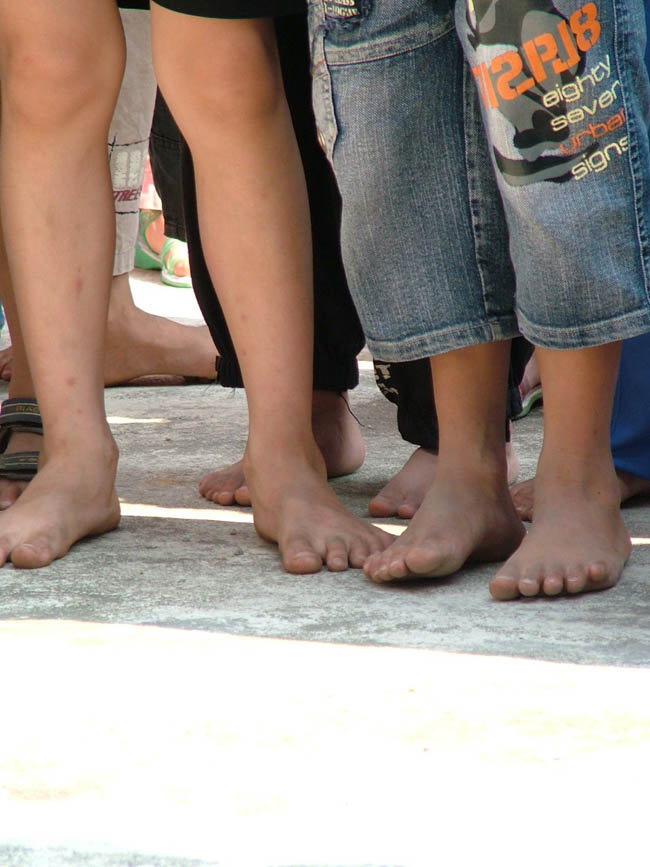
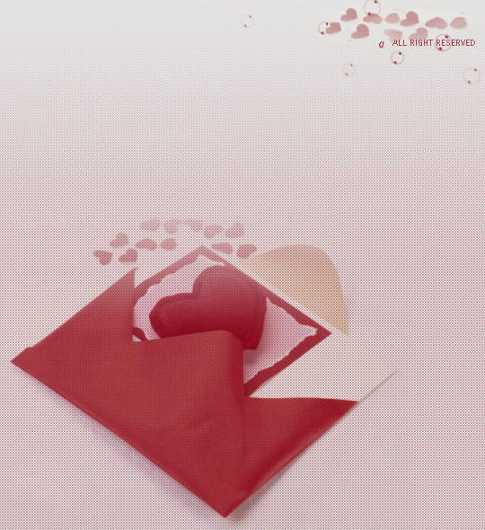
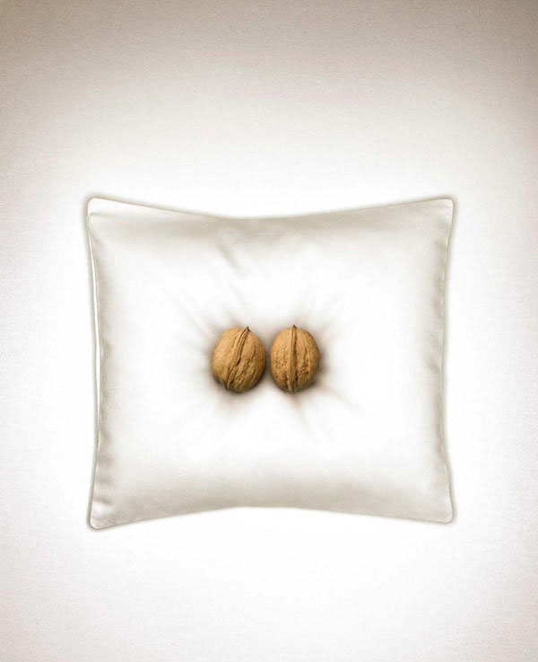

# ＜天权＞我为什么如此热衷于口交

**口交的时候，我能感到自己暂时拥有了一样东西，这种占有感和成就感，是我几乎没有得到过的。它们是我在这个繁华世界上得到的少量安慰之一。不能再对爱情抱太大期望。已经进入二十一世纪，在这个史无前例的社会主义国家，没有人仅仅依靠爱情活着，也不会再为爱情去死。**

### 

### 

# 我为什么如此热衷于口交

### 

## 文/覃仙球（首都师范大学）

### 

### 

第一次想到死似乎是小学三年级。那时想买一套《十万个为什么》，一百多块钱，在当时是一大笔钱。家里无论如何不同意。我感到伤心极了，在小屋子里哭了一下午。心想着家里连书都不舍得给我买，活着也没有人爱我，不如死了算了。“死”这个念头平生第一次闯入脑中，让我感到既震惊又恐慌，进退两难地坐在地上低声啜泣。后来慢慢平复下来，就洗干净手和脸出去找小朋友玩了。从此再没有跟家里提过要求买东西。上中学时，每个月问家里要钱都很窘迫。初中每个月的生活费是100元，高中每个月是200。死活不肯多要。如果要的越多，欠的也就越多，怕以后还不起。幸好那时物价还不高，一碗螺蛳粉只要一块五。衣服基本都是姐姐给买的。

小时候几乎没有什么玩具，表姐送的一个芭比娃娃，金色头发有甜蜜的香波气味，我十分珍视，更早的时候我有过一个五块钱的芭比，由于廉价的做工，她的头发大部分脱离了头皮，让人看了很哀伤，我因此更加怜爱她，从对门吴裁缝家捡回许多碎布，踩着缝纫机给她做了各种款式的裙子，包括一条用蚊帐纱做的蓬蓬裙。我由此一跃成为本街道的芭比掌门人，拥有两个芭比娃娃和几十套各色裙子，她们住在一个布置得金碧辉煌的鞋盒里。上初中之后，我将衣钵传给了比我小五岁的、吴裁缝家的小女孩吴燕丹，但显然她很不珍惜，很快就把她们弄丢了。

缺乏玩具的后果是只能拼命地找书看。那时家境好的同学家里都有一套《十万个为什么》，我的一个小伙伴磨冬冬就有一套，而且是昂贵的全彩版本——他爸爸是派出所所长，家里条件很好。一到周末我就会借故去找磨冬冬玩，趁机看《十万个为什么》。从上面我知道了恐龙的种类、宇宙的诞生、植物分为孢子植物、裸子植物和被子植物等等。但是磨冬冬并不是很爱看，他表示“很无聊，我都看腻了”，拉着我玩别的，比如把《小芳》的音乐录影带来来回回倒着放然后哈哈大笑，或者骑着小自行车到处追赶猫和狗。我对他这种强人所难的恶趣味感到很不理解，就渐渐不怎么去他家了，但也由此失去了看完《十万个为什么》的机会。要是自己有一套《十万个为什么》就好了，不用管别人的脸色。——直到今天，我都没能看完《十万个为什么》。因为那个科普迷的时期很快过去了，我开始跟着姐姐们看琼瑶、岑凯伦、三毛、席绢、于晴的小说，为日后男默女泪的风格奠定了基础。

高中时处心积虑地勾引猪，也不过是因为他爸是教育局长，家里有钱，而他又是大手大脚的公子哥儿，花起钱来不会心疼，正是一头嗷嗷待宰的肥猪。但他父母很会藏富，家里住的是单位分的二室一厅，家具也都是敝旧的。猪身上穿的衣服虽然不便宜，却也全都是土包子的款式。他那时穿着一双阿迪达斯，乍一看顶多值十块钱。总之他完全是那个阶层的代表：财大气粗，粗俗不堪。简直就是我的反面。按理说我们应该是敌人才对，最后却睡到了一张床上。要是当时借酒行凶强行给他口交，没准现在我已经被他金屋藏娇了。他在韩国上学两年，每次回家都给前女友小琉带化妆品高跟鞋和衣服，却从来没给我带过任何东西，可见他其实心里是没有我的。这么多年也都只是我一厢情愿而已。

高二那年特别想买一个CD随身听。其实那时连MD都已经出来了，学校里的公子哥儿都人手一只。时隔多年，磨冬冬再次和我上了同一个高中，比我低一年级，但我们见面都装作互不认识——他已经改名叫磨赣文。小学四年级时他们全家搬到了县城，他父亲据说在公安局里做到了很高的职位。有一天我在学校外面的邮局寄信，刚好他和另外一个公子哥儿在旁边，似乎是给女朋友寄东西，我只听见称重的胖女人问他寄的什么，他说，MD。胖女人不知道是什么，多问了一句，他便不耐烦地说，就是随身听。胖女人出奇地好脾气，问他要不要保值，价值多少。他满不在乎地说，两千多吧。我第一次在邮政系统看见这么温柔的柜员，几乎感动得落泪了，赶紧挤过去买信封和邮票。胖女人甩过来，垮着脸嘟囔，一块钱。整个县城就这么屁点大，局长公子们都是明星。

那一年唯一的愿望就是买一个CD随身听。没有随身听，却又忍不住买了一堆唱片。一个比较要好的女生有部随身听，晚上有时会借过来听听，可能借得太勤了，那个女生就把随身听长期借给了她男朋友。我虽然脸皮厚，也不好意思再借，只能自己买了。当时市场上有冒牌的索尼随身听，300多，对我来说也是天价。没日没夜地想，想得心脏都疼了，没有随身听眼看着就活不下去。但钱是肯定存不下来的，一个月两百块的生活费，光吃就花了一百五。跟家里要也是绝无可能，因为问了也不会给。后来突发奇想，写了一堆小说要投稿，写得太差，均石沉大海。这个愿望终究是落空了。不知为什么，突然间就不想买了。好像是把心里的一块什么东西彻底燃烧殆尽。也没有死。但那种被灼热的欲望烧得浑身苦痛的焦躁，一辈子再也忘不掉。

上大学，每个月的生活费是500块钱。其实不是小数目，除去吃饭洗澡300元，还能剩下200元零用。却怎么也不够用。有时跟同学聚餐，唱歌，或者生日送礼物，半个月的生活费就出去了。总是数着钱过日子。刚上大学就开始找家教兼职，加入了一个什么家教中心，交了几十块钱之后再也没有任何消息。我尴尬极了，只想尽快结束这种跟家里伸手要钱的日子。大一的第二个学期，经过同学的介绍，找到一份家教。每个星期两次，骑车20分钟到厂洼路，一个小时30块钱，每次两个小时。一个星期能赚120块钱，一个月是480。加上60块钱的饭补和100块钱的补助，顿觉富裕起来。那时骑的车也是自己的，春天时跟着宿舍的胖男生去到老远的东边花90块钱买来，当然不可能花比自行车还贵的钱打车，骑了一下午回到学校。有一份收入，有自己的自行车，心里有喜欢的人，那一年是快乐的，并不那么频繁地想到去死了。

教的是一个初二小男生，黑乎乎圆滚滚的，贪吃又贪玩，经常把他妈气得掉眼泪。每次补习完都要留饭，午饭或晚饭，吃完饭小男生就玩电脑去了，他妈妈照例要拉着我坐在沙发上聊天，诉说丈夫的冷落和儿子的顽劣，说她二十几年前为了帮丈夫把户口从天津转到北京来“一遍遍地跑公主坟，那时公主坟还真的是一片坟啊”，她“一个柔柔弱弱的小姑娘，管户口的大爷看了都心疼”，如今他在电视台里做大了，就开始嫌弃她，还好她“用私房钱为儿子买了一处房，现在住的房子也是自己的名字”，“也不教育儿子，有时还在一旁看热闹”。我笔直地坐在柔软的布艺沙发上，不时喝一口水，报以尴尬的微笑。

大一的暑假没回家，每隔两天给小男生补习一次。空闲的日子，便骑着自行车满北京乱逛，还假装成陈绮贞的资深粉丝，参加了她第一次在北京的签售会和记者会。到了才发现别人都是一摞摞的台湾原版唱片，甚至不乏珍贵的Demo123。我手里只有一张《吉他手》的磁带，简直是没脸见人。赶紧屁滚尿流打电话给猪，让他给我汇200块钱，买了四张精选集和一张吉他手。相机也是跟一个学长借的。他长得高大英俊，可惜鸡巴有些过于短小了。我一度怀疑他是喜欢我的——我曾经怀疑过学校里半数男生喜欢我。在他的相机里我发现了一张远距离偷拍我的照片。

这样的好景一直持续到大二的寒假回家。开学回北京，家长跟我说不需要家教了。我怀疑肯定是因为我教的太差，而且翘舌音不够圆润。我在给小男生补习时，一直在努力压抑内心强烈的厌恶。我知道自己完全无法胜任这份工作，也全无好感，只是为了钱，一个安逸的环境，免费的午餐或晚餐。这对我一个来自偏远地区、一无所长的普通大学生来说，是何等来之不易和弥足珍贵。这些东西给了我一层保护的壳，让我得以面对这个居心叵测的世界。我知道，为了虚荣和温饱，付出一些代价是必须的。突然失去这层壳，就如同醒来时发现自己躺在大街中央，赤身裸体。

幸而很快又经同学介绍，得到了一份新的家教。还是一样的时间，一样的报酬，我需要坐一个小时的37路到劲松桥的百环家园。这家的父母都是湖北人，高级知识分子，十分有涵养，孩子是个高一小男生，文静有礼，在十一学校上学，主要是补习英语。小男生学得没什么热情，我也就得过且过——我向来是没有责任心的人，对于非我兴趣，更是惊人地敷衍。教了几个月，到了期末，家长跟我说，以后不用来了。

大二的夏天同时和一个16岁的小男生谈恋爱，仗着父亲是体育频道的编导，他小小年纪就不上学，跟着父亲拍体育纪录片。他似乎是个早慧的天才，小小年纪便写了一堆奇怪而深奥的文章。他父亲看着有前途，就打算出版，把他往文艺圈力推。他要找人画插画，到我所在的陈珊妮贴吧发帖，我正在愁着往后的生活，便和他联系。我那时还是阴蒂小清新，说的话都非常之令人炫目，聊了两个晚上他就说爱上我了。我平生第一次被人表白，还是出身这么好的小男生，不由得飘飘欲仙，信以为真。我见了他，以及他父亲，谈插画的事。我买了笔纸颜料，开始画画。每天发短信卿卿我我，有天他打电话来，说要我和他暑假一起去西藏。我说我暑假要做兼职。他说，你不要做了，和我去西藏吧。我说，可是我没钱去，他说，不用你花钱，你陪我一起去就好了。我说，那要得到你父母的允许。他说，我妈就在旁边，她已经同意了。

画了没几天两人就分手了。小男生可能觉得我太做作，也可能觉得我太肤浅，缺少才华。——现在回想起那时的自己，我也常常会起一身鸡皮疙瘩。至于分手对于我而言是失去了两份收入，他是毫无感觉的。出身中产阶级的孩子，没吃过太多生活的苦，有时候是单纯得可怕。他们有时候难以理解为什么要过得这么节省，斤斤计较，因为生活对于他们来说，就是“天热，那就开空调啊”，或者“公交车太挤，为什么不打车”这么简单。

失魂落魄了好几天，一直在想，要不要去死。讽刺的是，我想死，并不是因为失恋，而仅仅是因为生活的贫瘠和困苦，缺少钱，缺乏物质。最后还是屁滚尿流地考完了试，上网四处找工作。找了一个电话推销保险的兼职，一天30块钱。每周五天。去试用了三天，每天不停翻着黄页打电话。正式上班第一天，那个精明的女经理告诉我，工资要改成20元一天，可以的话就继续干。我没说什么。下班骑着自行车从鼓楼外大街一路骑回学校，经过荷花市场，满是欢乐的人群，我放慢了速度看了看，终于还是忍不住掉了些眼泪。

没有再去做那份兼职。只好厚着脸皮继续跟家里要钱。大三了，十月底一个同学介绍我到某国字头的公司做兼职，接送外国专家，一天70元，还给报销手机费、公交地铁费。我哪里见过这么高的报酬，做得非常勤快，不停往返于机场和酒店之间。第一个月下来，居然赚了一千块钱！我非常鼓舞，花钱也阔绰了起来，动辄就是去吃昂贵的吉祥馄饨，有时甚至会奢侈到去吃肯德基呢。

我是一直羡慕那些花钱无所顾虑的人。这辈子还没能痛痛快快花过一次钱呢。大二时常常和班上要好的女生一起逛西单，她们都只在中友和君太买衣服，那些动辄几百上千的衣服，我是无论如何也不敢买的——难看倒是其次，主要是买完就只能等着饿死了。我始终记得大一那年的暑假，怀揣两百多块钱，从学校骑着自行车到西单，来来回回骑了好几次，终于下定决心买那双打了五折的PUMA鞋。店员狐疑、好奇而轻视的眼神，以及最后如释重负的嘘气，内心的羞耻、饥渴和满足，多年之后，仍然历历在目。

好了，终于可以言归正传，解释为什么我如此热衷于口交了。其实，给谁口交是不重要的，被口交的鸡巴大小也不重要，重要是的是通过口交，通过口交掌握了男人的命脉，通过口交给男人带来的快乐，通过口交使男人对我产生依赖。这些才是最重要的。口交的时候，我能感到自己暂时拥有了一样东西，这种占有感和成就感，是我几乎没有得到过的。它们是我在这个繁华世界上得到的少量安慰之一。不能再对爱情抱太大期望。已经进入二十一世纪，在这个史无前例的社会主义国家，没有人仅仅依靠爱情活着，也不会再为爱情去死。

所以，如果下一次，如果我说：“请允许我给你口交。”

请你一定不要轻视我。

### 

### 

（采编：麦静；责编：黄理罡）

### 

### 

