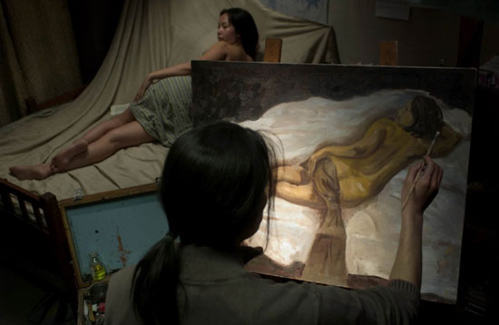
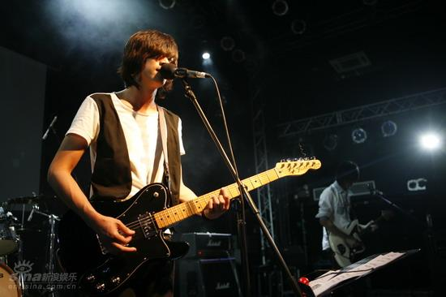
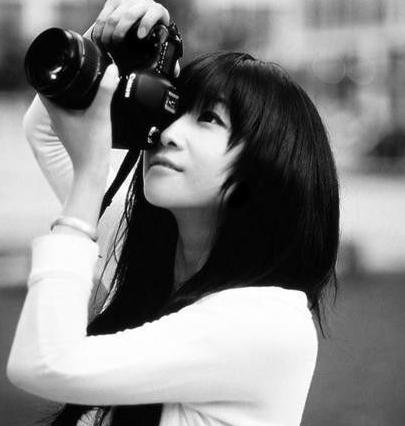

# ＜天权＞我就想说说“文艺”这两字儿

**整部《立春》看下来，我就在想，坚持这样的理想到底有多艰难，文艺一下到底有多艰难，实在不行，干嘛那么死板，换个生活方式不是很好么。那么多人没有更高深的知识，更高雅的素养，不一样活的好好的？你们这些文艺青年干嘛找罪受，到头来不一样没伪文青或者市场卖葱的大妈一样活的轻松么？人生到底得有多么艰难你们才肯放弃那些天杀的理想？文艺不能当饭吃，弄多了还适得其反。**  

# 我就想说说“文艺”这两字儿

## 文/ 朱一一（华中科技大学）

 

我看《立春》的时候，一直很难受，憋着一口气，又伤心，又愤懑。

北方一个破败的旧工业城镇里生活的几个文艺青年，执着于一个像太阳一般遥远的理想，一次次的碰的满头灰，更可悲的是根本就没有多少人理解这种坚持，他们只将这当做一个笑话而已。因此，电影里面的那几个小人物在没有支持更不存在掌声的环境里艰难维系着做文艺的理想，显得格外滑稽。

王彩玲的好嗓子就像是这个时代里出现的蹩脚诗人，才华是有的，却总是那么不合时宜。小城镇里需要的是增长的GDP，被工业大烟囱熏黑的天空下面，没有文艺的净土，破败的建筑下面缺乏文艺发芽的土壤，电影中给我留下很深印象的一幕是，熙熙攘攘的下班人群中那个突兀的大喇叭里，传来播音员刺耳的普通话，然后王彩玲天籁的歌喉缓缓溢出《暮春》的音符，夹杂着隐隐的汽车鸣笛声，嘈杂的人生，每个人的表情麻木，除了伪文艺青年周瑜。

周瑜的确是一个伪文青，他与艺术的距离很近，却因为天赋原因只能一直在门外徘徊。他比小城镇里的很多人更懂“文艺”这个词，于是对王彩玲比一般人更多了一份理解，甚至出现一种被艺术冲昏头脑的爱慕，他很实在的喜欢着王彩玲，不嫌她老也不嫌她丑，他觉得她有才华有一份契合他心灵追求的东西，看上去有些可笑，分明是一个伪文青，干嘛打着艺术的幌子做着诱拐良家妇女的勾当？至于心灵追求，也不见得就有那么的纯粹，因为我就是一个类似周瑜那样的伪文青，没多少天赋，也没多少涵养，仅仅是觉得人可能需要汲取更多的知识才能做到在别人面前有更大的底气，别人谈《财神客栈》的时候，你可以缓缓的吐出，我不爱看那类型的电影，我觉得《四百击》还不错，当然，《四百击》只是入门级，如果说出了《战舰波将金号》，懂的人自然会对你多投出一瞥，当然，如果不小心再说出了《Amores perros》，很有可能出现过犹不及的情况，作为文艺青年曲高和寡的尴尬就像扩音器里王彩玲的歌剧，突兀的像是出现在正式场合的小丑，明明是一份很正经很严肃的工作，最后却成了上不了台面的笑柄。更可怕的是遇到这样一种情况，装得很成功的周瑜突然遇到了很有料的王彩玲，于是轻而易举的败下阵来，这样的悲哀时常出现在我的生活当中，总想显得很有文化的样子，一遇到能够把常识说成宪法修正案一样的人物的时候就露怯，甚至有的时候像周瑜一样对仰慕的人生出爱慕之情，你羡慕某人，很有可能是因为，他身上有你最缺乏同时最想拥有的东西。

所以我总是在文艺男面前局促不安，不仅仅因为自卑作祟，更多程度上源于一种底气不足。不管曾经多少次中意的男生与心中的理想型隔着千山万水，但再深深挖掘一下，还是会发现其实心灵深处还是对文艺男失去抵御力，尽管很多人都告诉我，没出息，文艺男最不靠谱。的确如此，撇开现在很多WS男喜欢穿格子带黑框卷上牛仔裤边挎着单反装文青弄得自己gay味十足以达到诱骗无知少女的目的，我们也不能否认文艺范很有市场这样的事实，哪个少女在怀春的时代没有想象过自己成了流浪歌手的情人？记得看了一个采访XX的报道，他很直白的说，唐朝丁武不知道骗到了多少少女贞操的鲜血。姑且不论这句话的真假，我们也有理由相信男人一旦沾上了“文艺”，“摇滚”，“离经叛道”这几个字儿，魅力指数就像身上的荷尔蒙一样嗖嗖的往上蹭。《立春》里的黄四宝就是这样的青年，长发颓废带着艺术的气质，松松的把王彩玲迷得神魂颠倒，其实到头来还是一个平凡的不得志青年，在广大的艺考生面前，他就是小镇上略微文艺的一个青年，这样的人有太多，广告牌砸死的十个人就得有四个这类文艺青年，即使姑娘给他很多青睐，但这个社会不给你市场，才华这个东西，十块钱都可以称不知道多少斤，谁在乎你能够仿一副莫奈或者高更？

****

说这么多，只是因为看了《立春》后，心里就特别闷，至少闷了半年，直接后果就是果断放弃伪文艺路线，我还是做一个粗俗的市民好了。现在市面上真文艺和假文青形成一种混乱的局面，随便来一个人都可以给你谈谈杜拉斯，曾经看过豆瓣上一个人写的东西，第一句就是“雷蒙德连卡佛知道么？那么，村上春树知道么？好吧，我只是想说，连卡佛的书，挺好看的。”然后接下来全文，就是全面力挺一个装得一塌糊涂拽得快连自己的爹都不认识傻逼青年，说什么他只是看清了这个社会，敢于跑出来揭露伪文青虚伪的道义，仅仅因为声音有些刺耳就受到抨击，你们这些人，太没素质了之类的。看完后我只是很诧异，那么这第一句除了显露出自己懂得比较多，略微讽刺一下某些人外，对整个行文有何意义呢？“周云蓬就是个瞎子，完全应该去算命，而不是唱歌。”言论自由这种东西让我们在善恶是非面前保留意见，但对这种偏激的看法装逼青年，我真没法给出任何好感，自然也对力挺他的人有些看法，当然，她说出了雷蒙德连卡佛，段数比我高，我认输。这个世界是你们的，终究还是你们的。

做个文艺青年或者伪文青，走文艺的道路太艰难了，首先，得记忆好吧。中国的作家太山寨了，越小众越好的原则下，外国人自然成了好的选择，名字又长又拗口，普罗大众沉浸在《爱情买卖》这种靡靡之音中，这些外国名字就成了阳春白雪，好歹能让知道的人风光好一阵。说海德格尔太低端了，最起码也得来个弗里德里希.冯.海耶克吧。说海明威太低端了，好歹应该是约翰.厄普代克吧。说beatles太低端，至少应该知道led zeppelin吧。说实话，写出这些名字，我百度了好久。其次，得有钱吧。吸毒毁一生，单反穷三代，这句话一点都不假。文艺青年得内八小清新外加爱拍照吧，卡片机怎能比得上单反能驾驭这样的气场呢？砸锅卖铁弄了单反，镜头呢？不同质量的相片得不同的镜头吧，好一点的镜头价格也抵得上俺家房子的厕所那么大的面积了吧。。最后，得有时间吧。姑且闲人如我一个，也只愿在家里蹲着做一个死宅，哪有那么多的时间精力动不动就逛美术馆，动不动来一次流浪？是的，不能叫旅游，得叫流浪。文艺界有太多专业词汇，踏进去长路漫漫，所以，入行还得谨慎啊。

整部《立春》看下来，我就在想，坚持这样的理想到底有多艰难，文艺一下到底有多艰难，实在不行，干嘛那么死板，换个生活方式不是很好么。那么多人没有更高深的知识，更高雅的素养，不一样活的好好的？你们这些文艺青年干嘛找罪受，到头来不一样没伪文青或者市场卖葱的大妈一样活的轻松么？人生到底得有多么艰难你们才肯放弃那些天杀的理想？文艺不能当饭吃，弄多了还适得其反。既然我没有勇气做一个像屈原一样不愿随其流而扬其波，哺其糟而啜其醨的人，还不如做一个简单的屁民，粗俗但坚强的活着就好，文艺的生活不是每个人都能过上，精英文化这种东西，到头来还不如重申常识来的有用，只有当权力机关不再愚民同时民众意识在常识的召唤下得以苏醒，社会的正义自然得到昭彰，理性不再成为空谈，那些文艺青年心目中的高雅世界，自然就到来。你看，王彩玲最后其实也弄懂了，她收养了个孩子，然后像普通人一样去朝拜一下胜迹，生命有了安慰，文艺输得惨淡落荒而逃，平常人的幸福，其实也就那么简单。

 

（采编：陈锴；责编：陈锴）

 
