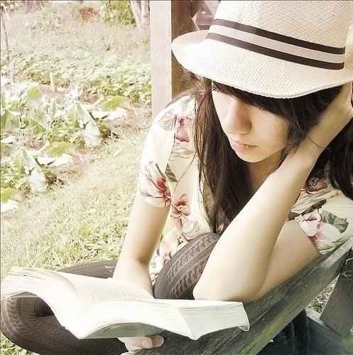
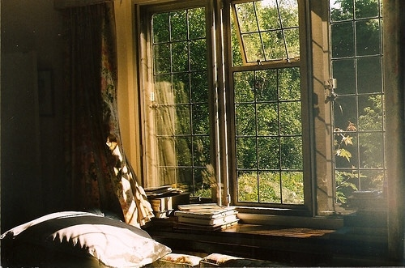

# ＜天权＞我的文学主张

**现在于我，写作的最高宗旨是言物感人。当我想讲一个故事的时候，我就让它马不停蹄地落笔──我是在从伦敦飞往北京的飞机上写《宋朝人在纽约》的，在高空，chuck palahnick的一句话突然浮上心头：上帝你可不能让这架飞机坠落，我还有一个故事没有说完！我希望通过每一个故事创造出一个境，使读者能够沉浸其中。我不能做到像很多作家那样去忽视读者，读者万岁，但是我挑选我的读者。**  

# 我的文学主张

## 文 / 吴昕悦 （Wellesley College）

  这本是一个由小女生而起的血案。 在豆瓣小抄小组，有个姑娘发了一篇摘抄，是校内前一段时间很流行的一个叫做《你说，后来》的文，节选如下：  你说帘外海棠，锦屏鸳鸯；后来庭院春深，咫尺画堂。 你说笛声如诉，费尽思量；后来茶烟尚绿，人影茫茫。 你说可人如玉，与子偕臧；后来长亭远望，夜色微凉。 你说霞染天光，陌上花开与谁享；后来烟笼柳暗，湖心水动影无双。  我当时看了以后回了一个“文过于质”，本觉得没有什么，结果没过多久就告诉我楼主把我的回复给删了，因为我传播淫秽信息。去那个帖子看，所有的反对意见都被楼主删得一干二净，只留下了“好美阿”“好动人”。我再发，又被删。楼主还放出话来：有些人，就是眼高于顶。 

 那好。现在计时，给我五分钟，我也能写：  你说桥边红药，锦绣琳琅；后来烟波缱绻，儿女情长。 你说跫音不闻，寸寸断肠；后来断雁西边，人去茶凉。 你说踏月约期，暗影浮香；后来弦涩墨冷，对影成双。 你说阡陌纵横，英雄相敬不相忘；后来捣衣声碎，佳人独守朱阁窗。  再给我一个小时，我还能无穷无尽地写下去，不就是押个韵，引个典故再酸一酸麽，一句两句还成，原文竟然能浩浩荡荡丝毫不审美疲劳地来上个两千字，更恐怖的是还有人对了一个几千字的“我说，后来”。淫词艳曲写成这样，你当柳永当年是卖醋的啊。 我记得高中的时候难得听的一节语文课上，黄春老师给我们看一个句子，“花瓣上的露珠就像天使的眼泪”。他说这情景确实很美，但是说了什么呢？空洞的美是留不下来的。我记得当时很多人喜欢王勃的滕王阁序──气势磅礴文采斐然。但是现在回想，高中古文里面还能让我时时想起并且感动如初的不是当时抄在笔记本上的“想佳人、妆楼颙望，误几回、天际识归舟。 ”，而是归有光淡然一句“庭有枇杷树，吾妻死之年手植也，今已亭亭如盖矣。” 我高中的时候有强迫症，写文必写骈文，大排比必须押韵，不用典浑身难受，字不漂亮不改不行。高二某次期中考试之后，刘葵老师找我。她让我坐在对面，把打了满分的作文给我，然后说，这样写文章不行。 这件事情已经过去了三年，对比现在和当时的文章简直不是一个人写的。就像谈恋爱一样，我跟学妹说女孩子就是要对男朋友温柔啊，但是这份温柔体贴不是因为你比他弱小需要依赖他，而是背后有了强大的实力支撑所以可以在表面上低调。写文章也一样，把书读破把辞藻用尽之后，在眼前唯一要做的一件事就是：把锦绣文章撕碎。 曾经发过一个状态：“我希望用每一个字敲打你的灵魂”。安子叶回复说，被苹果砸一下还好，狂砸就砸傻了。后来写文章总有人在后面说，不够深啊不够深。我苦思冥想怎样才能剖析得更深入，后来一拍脑袋：去死吧，写文章又不是挖洞，我又不是在写圣经。 这并不意味着我自恋地满足于自己的作品──我二十岁，时间还长。我也许写得还不够好，但是我足够真诚。 现在于我，写作的最高宗旨是言物感人。当我想讲一个故事的时候，我就让它马不停蹄地落笔──我是在从伦敦飞往北京的飞机上写《宋朝人在纽约》的，在高空，chuck palahnick的一句话突然浮上心头：上帝你可不能让这架飞机坠落，我还有一个故事没有说完！我希望通过每一个故事创造出一个境，使读者能够沉浸其中。我不能做到像很多作家那样去忽视读者，读者万岁，但是我挑选我的读者。 不止一次有人问我是不是以后想当一个作家。对于我而言，写作不需要成为一个职业──它已经穿透在我的生命之中，我不能控制自己在笔记本上写写画画，我不能控制自己做白日梦自言自语，我不能控制自己热爱生活。 我一点也不着急，只要我写作，我就还有勇气。我知道百年之后，能够被称为90后作家的人现在还不知道在哪里跌打滚爬积累写作素材。阿瑟米勒说，历史是一只怪兽，只要它抖抖后背，一切都可以被甩开。我想我就是那只死死抓住鬃毛的小虱子，对着庞然的怪兽发出无声无息的咆哮。 我是一个二十岁的人了。  有人说想当少女作家，你得小学就出书，争取两年一本，参加新概念大赛和各种文学选秀。 有人说想当美女作家，你得整个容照个艺术照最好丰个胸，该文艺的时候精神抖擞，该风骚的时候身体力行。  可我是一个作家。 不需要定语。 不需要形容词。 

（采编：尹桑 责编：陈轩）

