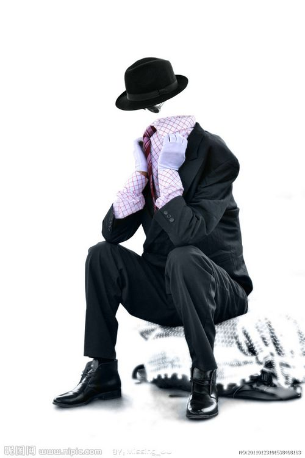

# ＜天权＞捂着嘴上厕所的人——原创成人童话

**而自从上厕所变成了一项娱乐活动后，小高也变得有些颓废。他会每天喝非常多的水，然后不停地跑厕所，多的时候一天能跑二三十趟，就好像抽烟抽上了瘾一样。这带来的直接影响是，他家里的水费蹭蹭地往上涨，这里面包括他喝下去的跟冲马桶冲掉的。在心情不好的时候，他甚至会喝一大杯水，然后蹲在马桶上等，这俨然变成了他表达悲伤的一种方式。**  

# 捂着嘴上厕所的人——原创成人童话

## 文/陈谌(厦门大学）

 

我有一个朋友姓高，大家都叫他小高，但是他长得并不高，冬天衣服一穿多反而有点显矮，所以名字往往只能代表愿望，而愿望这东西却总是令人绝望。

他从23岁起得了一个怪病，他每次上厕所撒尿的时候都会有快感，也许你会说，憋得很久以后上厕所不也会觉得很爽吗，但是小高撒尿时带来的快感实在是太强烈了，用他的话说，有的时候尿着尿着就高潮了。

小高跟我在同一家公司上班，我跟他的办公桌挨得很近，下班后我们经常一起去喝个小酒，有一次他喝高了，就跟我透露了这个事情，说他自己也不知道究竟怎么回事。

这个病起初并没有给他的健康带来什么影响，也没有给他的生活带来多少困扰，只不过每次在公司上公共厕所的时候，他都得闭着眼睛一只手捂着嘴一只手把着尿，以免自己不小心叫出声来，好心的王大爷有次见了还在旁边拍着他的肩膀劝他：“小伙子，你这是结石吧，赶紧去看看医生呗，瞧你都痛成这样了。”

小高当然不好意思说自己其实是爽得要命，而他也从没想过要去看病。他觉得这根本就不是病，更像是捡了个便宜，万一哪个缺心眼医生把他给治好了，他反而要觉得不开心，生活中得少很多乐趣，毕竟谁能从撒尿这么枯燥的事情里找到如此简便易寻的快乐啊。

不过俗话说事情都有两面，自从小高有了这个凶残的能力之后，他发现自己变成了性冷淡。因为他撒尿的快感竟然比他做爱的快感还要强，而一旦有了一个非常好的替代品，谁还会在这方面浪费时间啊，就好像如果睡觉都能长肌肉，谁还会跑去健身房呢。再说撒尿这种事情也不用做前戏，只需要多喝点水就行了。

所以后来他女朋友就跟他分手了，走之前还说了句应该是自人类有分手这件麻烦事儿以来史无前例的一句分手宣言：“你他妈的就和你的膀胱过一辈子吧！”

这都是小高亲口跟我说的，不过虽然当时我并不在现场，我依然可以想象他女朋友那时的表情，应该是不足以用一个“怨”字就可以形容的。但我总觉得她其实并不是介意他一个星期能跟自己做几次，而是对于自己竟然没法在那方面胜过一个膀胱的价值而耿耿于怀，毕竟自尊心才是女人的硬伤，我始终相信这一点。

小高分手之后，他的公寓就空了出来，从那之后我也会隔三差五地跑去他家做客，想试图安抚一下他的悲伤情绪。不过很奇怪的是我从他身上似乎没有看到丝毫悲伤的迹象，他会很开心地跟我聊着自己未来的计划，比如要把公寓重新装修成什么样子，要买一个新柜子，摆一台新饮水机什么的，还会吹着口哨自己下厨煮一桌乱七八糟的菜留我吃晚饭，而里面一般都会有四碗都是汤，偶尔还拉我在阳台一起喝着啤酒扯着些有的没的东西。

不过最可笑的还是看他一脸淫笑地跑去上厕所，屁颠屁颠好似一匹撒欢的野马，然后就听到里面传来的一阵“呜啦呜啦”的乱叫，接着见他一脸满足地提着裤子从卫生间出来。他说还是在家里舒服，没有在外面那么拘束，不然每次上公共厕所都跟偷情似的，还怕被别人听见。

作为他的朋友，我其实很想劝他点什么，不过我好像也从他“自给自足”的生活里挑不出什么毛病，只是隐隐觉得这是种不好的生活状态而已。这就好像你看一个怎么吃也吃不胖的人在那里坐着吃了一整天一样，你也知道这样的生活方式不好，但你一说他，多多少少给人一种羡慕嫉妒恨的感觉。

不过单从生物学的角度说，我觉得这肯定是个病，毕竟如果所有人都能从撒尿中找到超越性的快感，那人类早晚是要灭绝的，不然人家都忙着上厕所了谁还生孩子玩儿啊。况且就算人类不灭绝，我们的社会也肯定会发生广泛而且深刻的变革，至少公共厕所的票肯定是要卖得比桑拿城夜总会来得贵了。

而自从上厕所变成了一项娱乐活动后，小高也变得有些颓废。他会每天喝非常多的水，然后不停地跑厕所，多的时候一天能跑二三十趟，就好像抽烟抽上了瘾一样。这带来的直接影响是，他家里的水费蹭蹭地往上涨，这里面包括他喝下去的跟冲马桶冲掉的。在心情不好的时候，他甚至会喝一大杯水，然后蹲在马桶上等，这俨然变成了他表达悲伤的一种方式。

有一天领导找他谈心，说：“小高啊，你最近工作怎么老是出错呢，总觉得你有点心不在焉啊。”他信誓旦旦地说：“只是这段时间心情不太好而已，没关系的，过几天就好了。”

领导说：“如果是身体的问题，你可以请假去看病嘛，不要硬撑着勉强自己，这样反而耽误了工作。”

他说：“我的身体很健康啊，哈哈哈，一点毛病都没有的，这个您大可以放心……啊，对不住，我得上个厕所，是在是憋不住了……”

然后他就从领导的办公室冲出来了。

其实也难怪，他每天不停地跑厕所，工作不出错才怪，而且他的毛病发展到后面，渐渐从自己愿意跑变成了不得不跑。更糟糕的是他没法憋着，毕竟水龙头整天开开关关的早晚也会变得关不紧，所以每次开车上下班的时候，他都得在车里备着几个塑料瓶子，不然一旦遇到高峰期堵车，他就悲剧了。不过我琢磨着要是旁边的司机透过车窗看见，大概也觉得奇怪，那表情那动静，知道以为他在解决个人问题，不知道的还以为他大白天的玩儿车震呢。

终于在上上个月的时候，小高被自己给弄报销了，去医院做了个检查，肾和膀胱都出了问题，后来做了个手术，切掉了一个肾。去医院看他的时候，我见他全身插满了管子，一副奄奄一息的模样。我凑到他耳边跟他说，人家的肾都是切去卖钱的，你这用坏了白白切掉不说，还得自己花钱请人切，真是太浪费了。

他却依然用白死不活的语气跟我说，少个肾没什么大不了的，他最担心的其实是等他病好了，以后撒尿就没有快感了。

不过说来也怪，出院之后，小高的快感就真的这样不明不白地消失了，就好像当初不明不白地有了一样。他跟我说他很失落，还不如手术失败死了来得痛快，觉得人生顿时失去了意义一般。

我劝他说，你大可以这样想嘛，你就当自己从来没有得过这个怪病一样不就完了。不过话一出口我也觉得有点没说服力，就好像你劝一个中了五百万大奖，过两天又全被偷走的人一样，至少他的心态已经完全不一样了。

因为担心他想不开，我昨天晚上又跑去他家里看他。

一进门就看见他坐在沙发上正乐颠颠地挖着鼻孔。

“你没事了么？怎么忽然心情大好？”我很奇怪地问他道。

“我今天忽然发现我鼻子内壁很敏感哎，挖鼻孔的时候竟然会有很强的快感！”他一脸兴奋，就像找到了新的寄托一般。

我觉得很无奈，但却没有嘲笑他的执迷不悟。

至少挖鼻孔比上厕所要省水多了。

 

（采编：何凌昊；责编：麦静）

 
