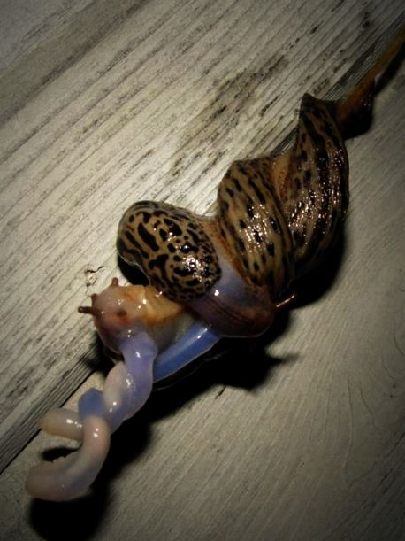
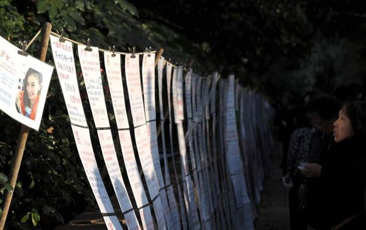
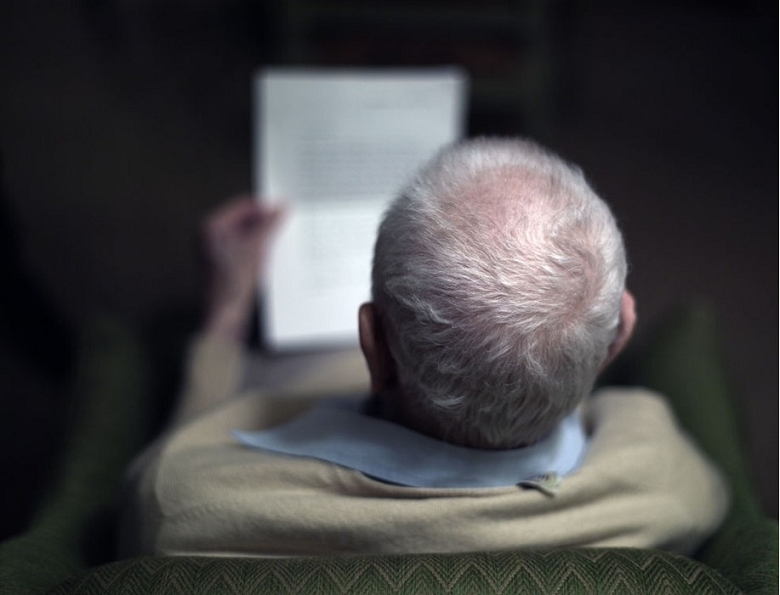
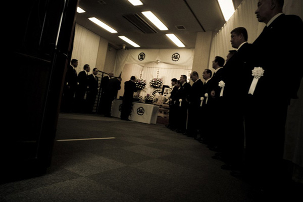
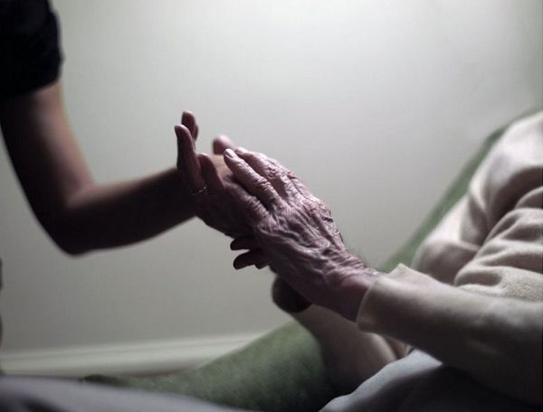
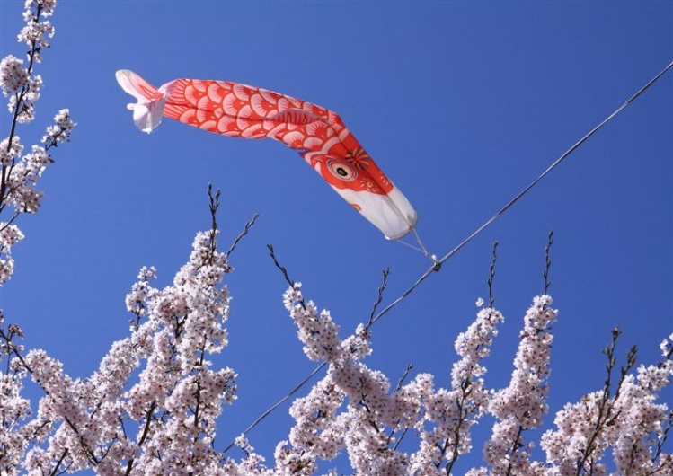
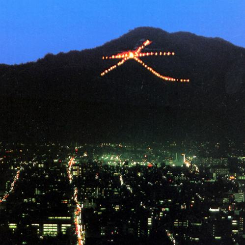

# ＜天权＞教授之死

**编者按：这大概是北斗第一次放这么长的文在主站上，刚开始想把这个小说做成连载，后面觉得一个故事应该是一气呵成的读完的，断断续续的读起来总不方便，所以就这样全部放上来了。这个故事我读的时候自然的想到了《围城》，主人公陈宇和钱钟书笔下的方鸿渐是那么的神识，又让我想起了杨德昌的电影“一一”，更多的时候作者是在描述一种状态，而这种状态于我们大多数人而言，都是一种困境罢。**  

# 教授之死

## 文/苏枕书（日本京都大学）

 

#### **一**

早起刷牙的时候，陈宇看见壁上有一只蛞蝓，极为缓慢地蠕动，身后拖出一条亮晶晶的迹子。梅雨将至的潮湿天候，这种令人不快的生物时常出现在水台附近。牙刷飞快制造着丰富的泡沫，他咕噜噜漱口，又迅速洗完脸，调转视线，无视那只蛞蝓。

陈宇到日本已三年。本科毕业时，就业形势似未有眼下这么糟糕。他出身校名头很响，系里同学愿意工作的不多，好像都怀着崇高的学术理想，要为天地立心为生民立命。最简单的是留本校读研，风险最低。还有更多人想着出国。美国，英国，当然不能忘了浪漫之都、汉学重镇法兰西。这些年学历史的看不起学文学的，学文学的看不起学法学的，学法学的看不起学经济的——学文的集体被理工科看不起。

陈宇本科时期确定名分的女朋友就是某师范文学系出身，还是学现代文学。他们在一起谈人生谈理想，谈学术。女友平时看的是朱自清茅盾冰心萧红张爱玲，近点的是《收获》《小说月报》，写各种文学评论，分析人物设定写作技巧等等。陈宇看什么？廿四史，资治通鉴，王夫之顾炎武王国维陈寅恪。“唯此独立之精神，自由之思想，历千万祀与天壤而日久，共三光而永光”，他常把这句挂在嘴边，对女友的阅读体系知识结构颇为不屑。小姑娘每听他说“共三光而永光”，总顿时多出三分敬畏，有一度还想考历史系的研究生，缠着他开书单。他颇严肃，清清嗓子道，历史——学历史和学你们文学那一套方法不一样。

怎么不一样？他也没有继续说。总之学术话题是绝好的兴奋剂。裸裎相对，温软的女孩子躺在他怀里听他有一搭没一搭讲几句，仿佛他们做的事也是“共三光而永光”，和一般人不一样。

陈宇也是一心要出国的。他想去美国。哈佛，普林斯顿，芝加哥，斯坦福——都是他心中圣地。他宿舍床前曾贴着一张世界地图。美国那一块土地圈点甚多。他对彼处地理也了如指掌。密西西比河，中部平原，阿巴拉契亚山脉。但凡提及便饱含深情。彼岸的大陆啊，为什么我的眼中常含泪水？他大一时入了党。大三时发现原来党员身份居然可为申请出国加分，真是喜出望外。平时牢骚归牢骚，欠党费归欠党费，关键时刻必须感恩戴德。层层推选，费尽周折，真的申请上一间大学，奖学金虽不丰厚，也足够糊口。

无限可能的未来在眼前展开。他难以抑制对明日的憧憬，已开始考虑是否需要在那里买一辆车。广阔的新大陆怎么能没有一辆车？他是穷学生，买二手车就够了吧。远方县城的父母听说儿子要去美国，还有奖学金，也十分满意。并提醒儿子换一个女朋友。“她还在那个师范念研究生？配你是不够了。”他嘴上虽不答应，心里却也预感分手只是时间问题，无意间对她也愈发冷淡起来。

然而世事无常，孰料美国那边不知出了什么状况。学校这边找陈宇商量，说可将他改派日本。他很生气。好比本来嫁的是大户嫡出阔少，临时被送到庶出房里去。又好像一夜间从一等公民降作二等公民，无比气闷，在女友面前也颇讪讪。他一向对日本无甚好感，提起日本汉学，就要引用严耕望先生的观点，称日本无有一级成就的学人，次一级的才比中国多，而境界终归不高，常常出错。不过算起来去日本拿的奖学金并不比去美国的少。日本离中国近，风景也不坏。日本学界的研究方法在他心中分量虽不比美国，但毕竟是公费留学，说出去也不跌份儿。于是最终还是去了。这样安慰自己：就当从头等舱换到公务舱，更何况丈夫有志在四方。

刚到日本的一段时间，陈宇心中依然燃烧着美国梦。日本只是跳板，他不会久留。不过现实是，在日本头一年，语言已令他倍感挫败。好容易习惯了语言，又被论文折磨。学校老师刻板严肃，毫无通融一说。刚开始托福单词书还摆在书架的醒目位置，不知何时此书已悄然匿迹。他的英语也日益感染浓重的日式腔调。

从日本去美国继续深造者不在少数。不过大半都是理工科医学出身。转念想如果当初学法律，大概现在还有望去德国，也可聊作安慰。又想，来日本不如去香港。至少从香港去欧美要容易得多。这样想着，愈觉怀才不遇，前途惨淡。

和国内那位分手不知是什么时候的事。后来交往的几位皆不了了之。同研究室有位日本女生，从东京开学会回来，赠他一只粉色包装的小纸袋，内有曲奇饼一小罐。她粉嫩一张包子脸，不知怎么梳那么圆的丸子头。他是第一次离她这样近，连她身上温柔的香水气息都闻见，一时心驰。又听她说，“这是从东京带回的礼物。”他面上有笑容，躬身答谢的样子非常尽心。曲奇饼吃完，粉色纸袋一直不忍扔掉。直到有一天发现本栋楼内每间研究室的同学都有同样的粉色小纸袋，从此提起总要恨恨：“日本人顶小器。一小罐饼干也能出手当礼物。煞有介事包装得那么好看。”

博士毕业之期临近，父母开始关心他的去留。父亲表示，“必须回国，不许待在日本。”他觉得这个要求没有错。这么多年在日本总觉没有吃过一顿酣畅的肉，每想到此，大国优越感油然而生。父母同时暗示他应该成家。“什么时候带个对象回来？”他打哈哈，说“要找还不容易”。并添了一句：“日本人也是有的，上次还有人送我礼物呢。”

父亲厉声呵斥：“日本女人不许带回家！”

他笑道，放心放心，我只是说，我在日本女生中间也是很受欢迎的。所以个人问题大可不必耽心。

他在父母面前将留学生活尽量描述得美好风光，工作婚姻皆不必担心，那是水到渠成的事。仿佛得到博士号的同时，也附赠教职与妻儿。他草草吃了几片干枯的面包，出门去研究室。水台那条蛞蝓已挪到窗边，外面是灰蒙蒙的天色，满含雨气的厚云从山头压下来。一阵风，乌鸦凄厉地叫着，松与樟枝叶摩挲的声音像大雨。

“你、你知道么，昨天晚、晚上，柳、柳田老师去世了。”还没进研究室，就被师兄田边氏拦在楼道口，得到这么一条新闻。

“什么？哪个柳田老师？”

“还、还能有谁？我、我们的师祖，柳、柳田老师！”田边有点口吃，一着急更厉害。日语不像中文，一音一字一义，故而结巴起来更要命，听者尤为费力。田边在研究室很寂寞，大家都不太乐意和他说话——主要是没耐心。他却偏爱凑热闹。女生们叽叽喳喳一个一个音节撒豆子似的往外乱倒讲八卦时，他端杯水到一旁听着，憋了好久，终于逮着机会插话，一口气说了很多。口吃语速一快，突突突好似子弹钻心，女生们脑仁儿疼，受不了。但涵养都很好，只是微笑不理他罢了。此刻，他恳切地望着陈宇，知道自己第一个把如此重大的消息带给了他，不由一阵激动。而陈宇却没有多问。田边有些失望。陈宇打开研究室门，平时早上不出现的几位都到了。

“我是一早从大岛老师那里听说的。”陈宇的嫡系师姐周珊珊道，“现在大岛老师他们都去柳田老师家了。”

大岛是陈宇的导师，博士阶段跟柳田做过一年研究，不久柳田退休，被私立大学返聘，大岛则留学中国。因此严格来讲，大岛并不是柳田的弟子。而周珊珊和陈宇却都心照不宣，以柳田的徒孙自居。国内要出柳田的文集，他们也十分积极，表示要参与翻译。可惜被上海某大学的老师占了先，从出版社拿走项目，把翻译活儿分给门下众人。那位老师早年在日本当过两年研究员，积累了些人脉，学问做得不差。而周、陈二人却嗤之以鼻。“他的日语水平，看看文献也罢了，居然要翻译柳田的书，吓，真是。”“现在国内学术翻译都这样，实在不知道柳田老师怎么同意的。”二人本来还因争着要翻译某书而红脸，此刻却异常同仇敌忾。

周珊珊比陈宇高一届，很有师姐的样子。不过陈宇并不大服她。她本科是日语系出身——陈宇很不以为然：语言么，就是工具。毕业后工作了一两年才来日本，也没有拿奖学金。陈宇刚来时，常在课上抢白她，争辩一则史料，一条观点，很希望大岛老师认识到自己的实力。可惜他日语水平远不如周珊珊，常常憋得面红耳赤，又听她在老师跟前用温柔得体的敬语解释得面面俱到，不由气急。周珊珊也无辜宽容地望着他。他着急起来就对她说中文：“你来把我的观点翻译给老师听！”她脾气好，一一翻译。可惜老师并未对陈宇的观点多作评价。

“在老师眼里，我们这些人的水平都太低，低得难以计较是谁更低。”陈宇事后讪讪说。

大岛老师年近花甲，夫人是典型的日式贤妻良母，有两个儿子，一个念医学，一个念物理。大岛对学生很严格，也爱拖堂，兴致到了多讲一两个小时也是常事。而每逢下午最后一节课，他都准点下课，学生有时余兴未尽，还想讨论什么，他也挥挥手表示，明天再谈。原来夫人每晚都要与他小酌，回去晚了夫人要生气。夫人管账，每个月给他点儿零花钱，只够买烟。若惹恼了夫人，下个月就没零花钱，可不得了。周珊珊说，某回搭老师的车去开学会，路上老师不小心超速，给警察逮了个正着，罚了一笔不小的款子。过了几天，夫人收到罚款单，大为震怒，不许老师再碰车。从此老师上下班只好骑儿子高中时一辆旧自行车。周珊珊熟悉学校很多典故，对老师的八卦最了然。这是她作为师姐的资历——比如柳田老师的死讯，她也会比陈宇早一步知道。

周珊珊眼见已跨过三十岁的门槛，三天两头被家里催婚，不堪其扰。每年都说，年底必须带个男朋友回来。但每年都没有。家里遂安排各种相亲。周珊珊倒也不是不积极，只是架子大，挑剔多。要求男人学历不低、谈吐文雅，样貌也不能太跌份。这么一来，可供选择者已屈指可数。再仔细一瞧，几乎每个人都要不得。甲男穿衣品味太差。乙男家庭条件很糟。丁男个儿矮，没到四十岁已呈谢顶之势。丙男——暂时没挑出毛病，但对方不喜欢她，并微笑着，尖锐指出：“我其实也不嫌弃女博士。不过既然能找二十出头的小姑娘，何必找这把年纪的？”周珊珊大为光火，从此把批判男人浅薄无知之类的说辞挂在嘴边。陈宇已学会对师姐保持恭谨的态度，笑着打哈哈，任由她把大面积打击男人，纯属助她消气。但另一位年轻的师弟傅章刚听了两句遍慢条斯理反驳，说，周师姐，这就是您的不对了。您既然可以挑剔别人，别人自然也可挑剔您。这是对等的。

傅章是北京人，家住虎坊桥，一口温文的和缓的京腔，像个老先生，一点儿都不油滑，杀伤力却更大。周珊珊脸上挂不住，立马反击，我并非挑剔。你要讲对等，那么我觉得我的态度相当公允。我只是在寻找一种真正的爱情。我希望能找到心灵相通、有共同语言的人。而男人却不关心这个，他们只知道女人的外表和年龄。

傅章嘴角牵出一丝礼貌克制的笑意，很认真地说，您这话又说岔了。女性一样在意男性的外表和年龄。只是年龄的增长对男性来说可能没有那么糟。故而女性多会喜欢年龄稍长的男性。

二人针锋相对，空气立马擦出战斗之火。周珊珊辩了几句，终于冷笑置之。陈宇只管埋头吃饭，到这时也急忙缓和气氛，批评傅章道：“你话多！你哪知道什么是爱情？”男生之间说话随意，傅章答：“嗨，您不也快三十了么，知道什么是爱情么？”这话本无恶意，陈宇听了无所谓。而座中还有一位超过三十岁的周珊珊，顿时黑了脸，满面严霜，许久都不再说一句话。师妹汪藻急忙挽救情势，向傅章啐道：“谁没有过二十岁？谁不会到三十岁？”这话说得也不够妙，在周珊珊听来仍极刺耳。遂淡淡道：“总归我和你们不是一个时代的人。”语罢拂袖起身。汪藻讨了个没趣，有些尴尬。众人也觉索然，沉默鱼贯而出。

“柳、柳田老、老师家，就、就在学校、附、附近。是、租、租的房子。”田边好容易逮住个空隙，急忙插嘴，“我、我有路过过……”

“柳田老师从私立大学退休后又买过一套房子，女儿结婚，就送给她了。自己却在学校旁租了间很小的院子——离研究所和图书馆都近，查资料方便。”一位日本同学飞快接口，田边张口结舌。

陈宇顿觉遗憾。早知道该去小院边溜达溜达，没准儿能碰上柳田老师，也能添一段谈资。柳田已退休二十多年，学术地位虽不可动摇，然早已远离学术圈，过着离群索居的日子。历史系研究室当门高悬一幅书法，是柳田几十年前手书的汉诗。傅章曾点评：“日本人写汉诗，到这个地步已经很不错。书法也很有品格，非当代人可比。”

柳田终年九十三，相当高寿。妻子早逝，只有一位独女，据说和父亲关系不怎么样，结过两回婚，现任先生是美国人。这几年柳田身体每况愈下，女儿请了保姆，自己长居美国，很少回来探望。保姆夜里打国际长途将老先生的死讯传递到美国，女儿一副早已预料到结果、终于成为现实的轻松感，说知道了。轻描淡写，命保姆通知学校：“我回来还要一两天，先让他们照顾着吧。”

#### 二

和柳田同时代出生的知名学者已凋零无几。他的死对学校而言当然是一桩大事。他在这所国立大学工作了几十年，门生众多，著作丰富，以严厉刻薄出名，和学生除了授业之恩，鲜有私交。后来被某私立大学返聘了若干年，按照辈分，葬礼自然应由该国立大学住持。故而该校历史系一早成立临时治丧委员会，几位老师到柳田赁居的府上料理杂事——需要安慰的家属尚在美国。寂静的小院在山脚树林间，宝蓝、浅紫二色的绣球花开着。小院不远是一座寺庙，附属幼儿园的小孩子刚乘校车叽叽喳喳拍手过去。附近邻居看到平时门庭冷落的人家忽而来了一群人，主妇们探头探脑小声嘀咕着什么。过会儿知道是有人过世了，便恍然大悟地点点头，“原来里头还住着人啊。”“是大学的老师？”“好可怜，好像没什么家人。”“也没有那么可怜啦，学校不是来人了么？”讨论了一会儿又无声无息散去了。

院内草木杂生，似久未打理。小楼共二层，很有些年代，推拉门要用力撞一下才能打开。底楼玄关逼仄，光线陡然一暗。保姆是一位中年妇人，眼里含着幽愁与谦卑，短发拢在耳后。就在那昏暗的空间里拼命鞠躬，道了半天歉，好像柳田的过世、大小姐的不在场都和她有关似的。

楼梯间堆满书，纸味呛人。保姆说，二楼是书库，柳田先生平时只在一楼活动，书房和卧室连在一起。说话间带领众人侧身钻过书墙，拉开书房的纸门。空气像蒙了一层昏黄的玻璃纸，空气暗沉腐朽，钟摆的声音传过来。到处都是书，各种书。矮桌上的稿纸和书本还没有合拢。保姆说，先生晚上在走廊摇椅里歇着，说要吃某家法国点心铺的冰激凌蛋糕。店里点心还没送来，他已不再呼吸。

日本葬仪复杂，除了主流的佛教式葬仪，还有神道教式、基督教式等多种。佛教式也门派纷呈，各有不同的念佛、敬香之法。譬如天台宗要念“南无阿弥陀佛”，祭拜者敬香三炷。真言宗念“南无大师遍照金刚”。曹洞宗念“南无释迦牟尼佛”，祭拜者手拈沉香屑，轻点额头，如是者三，复敬香一炷。葬仪流程通常为入殓、守夜、告别式、出殡、头七法事、断七法事，与我朝多有相似之处。入殓本应由亲人完成。近年流行入殓师，手段更为完美周到，亲人只需从旁参与，既具仪式之美又方便省事。然而柳田家的大小姐却在电话里指示，早早请入殓师做完吧！不必等她回来。“我先生恐怕也不习惯这些礼仪呢。”她对保姆这样解释。守夜怎么办？“爸爸不是有很多学生么？总会有人来的吧。”她很轻松地回答。哦对了，她早跟丈夫改姓，不再称柳田氏，全名似乎叫做惠子·费洛雷斯。

一天后，这位惠子·费洛雷斯女士偕同费洛雷斯先生风尘仆仆降临这座小院。细雨濛濛，打湿院中苔石。费洛雷斯女士小心走着，似恐弄脏精巧的皮鞋。她的美国先生个儿太高，进门时得低头弯腰，手脚完全没地方搁。厅内有几位帮忙的师生，从前夜到此日，已经替了好几轮。彼此厮见过，又寒暄一阵。做法事的老僧请二位家属到灵前献香。美国先生不熟悉东洋礼仪，动作很不利索，女士只好代劳。

据说座中有几位老师从前也见过这位惠子小姐。那时候柳田老师还在国立大学教书，中年得女，相当娇宠。几十年光阴淹然泯去，大家好像都已不记得前事。

“好潮湿。”女士皱眉，“京都的梅雨最讨厌了，哪儿都湿漉漉，空气都拧得出水。”

保姆尽心尽责，请小姐过目告别式上穿的印有家纹的纯黑和服。

“一定要穿这个？真麻烦。”她瞥了一眼，又望向丈夫，“不过你没有看我穿过这个吧？那就穿一回也不错。”

于是，告别会上，陈宇等人也有幸瞻仰女士的和服姿容。她手持念珠，向每一位来客微微躬身。

历史系研究室收到通知，说希望各位能参加老师的告别式。考虑到大家平时都有课，日期定在本周六。

“非去不可？我周六下午要去给人做家教。”傅章有些为难，“我很不爱穿西装，要么就不去了。”

周珊珊瞪大眼睛：“回头要编柳田老师的纪念文集，你不去，岂不少了一笔可写的内容？”

汪藻也笑：“就是就是。我们虽没有跟牛人上过课，不过能赶上牛人的葬礼，也很不错。”

傅章一脸对女生思维不可思议的表情，问陈宇：“你去么？”

陈宇道：“你还是去吧，家教的活儿停一回也没什么。刚刚他们日本同学还说整个研究室要凑钱献花篮。钱都出了，怎么不去。”又道：“我也讨厌穿西装，天这么热，就穿件深色衬衫大概也没事。”

周珊珊打断：“绝对不行，必须穿西装。你们好歹入乡随俗一下好不好？”语气如此斩钉截铁，好像岛国的风俗也需要她捍卫似的。

陈宇讪笑：“日本人相当讨厌，做什么都穿西装。面试，学会，葬礼，一片黑乌鸦。”

“不过师兄如果穿西装的话可能会帅很多哦。”汪藻道，“我就喜欢他们穿西装的样子，整洁、收敛、性感。”

陈宇完全将后面三个形容词理解为师妹对自己的赞美，十分受用地笑了。

#### 三

柳田老师的告别式在城南某会馆举行。当日斜风细细，雨水时缓时疾。四围山色如黛，岚气缥缈。会馆临着一条小川，水声寂静，岸边开满玉白的栀子，香气蓊郁。每个入场的人都挟裹一身湿气，会馆门口有人迎接，引入内堂。签到台分四处，表明亡者一生的人际关系，依次为：亲属、某国立大学相关、某私立大学相关、其他。陈宇一行人在“国立大学”一栏下留下名字，被带到大厅颇靠后的一排座位。人已来了不少，坐在前排的是一溜白发苍苍的老人，多为柳田门下弟子。

“就是在学会上，也看不到这群大牛聚得这么齐。”汪藻小声道，有些兴奋，探头探脑辨别那些背影各自为谁。周珊珊拍了下她的手，让她低调些。自己却又忽而掩口道：“啊，那不是森老师么？研究明代土地政策的，他都这么老了！”

昔日陈宇在国内念本科时，赶上美国某大学一位中国史大家的去世。那位先生早年毕业于陈宇就读的大学，公费赴美读书，定居彼岸。陈宇学校也为他召开了隆重的追悼会。系里老师争做追悼会主持人，闹得剑拔弩张。最后陈宇的老师角逐成功，终于握到追悼会的话筒。大会氛围本该悲哀肃穆，而老师的声音与表情，似乎总有一丝未曾安放妥当的兴奋。

如今这场告别会谁来住持？之前大家费了许多猜测。历史系现任院长并非柳田门生，而是从东京那边调来，身份不太合适。陈宇很希望大岛老师能担当此职，然大岛一开始就向校方表明自己辈分太浅，难当大任。而剩下的几位老师更年轻，资历更浅。倒是私立大学历史系有一位德高望重的老师，既跟柳田的业师念过几年书，后来柳田继承先师衣钵，又转到柳田门下。这样深的渊源，资格是足够的。只是这位老师早年在名古屋某大学任教，弟子众多，占了不少资源，没有同其他大学利益均沾。晚年来到京都的私立大学，颇受排挤。他深知此况，亦早早告病，为柳田守了一回夜，就不来参加告别式，免教旁人为难。各方讨论再三，结果仍由该国立大学历史系院长住持。

一时仪式开场，缁衣僧侣缓步上前，众人亦随之低首。院长到台前致简短悼词，略述柳田老师的一生，称他的去世“令东洋史研究的世界失去一盏明灯”。陈宇正待听一篇浩荡的长文，不料一两分钟就结束了。“日本人的排场就是小。”他心里说。想起刚来时参加开学典礼，在城中心的大礼堂。台上金屏风前雁翅般坐了两列校领导。校长致辞竟极简短，陈宇只听懂一句“诸君，努力吧”。屏风后学生乐队奏一曲音调低沉的校歌，即宣布散会，前后不足半小时功夫。

而后众僧长诵经文，台下人亦默捻数珠，大约过了十多分钟，众僧起立，宣布开始敬香。起首是惠子夫妇。接下来按座位次序一排一排上前。最初陈宇也教悲伤的气氛感染，心里颇为沉重。渐渐觉得无聊：怎么老半天过去，还没轮到自己？再看前面的人们从香炉内撮一抹香屑，往额上点三回，不知是哪一派的礼仪。如此简洁的过程，让陈宇有些失望。好像心里期待甚高的一件事却终草草收场。

“附近有家旧书店，我去逛逛，你们先回去吧。”退场后，傅章迅速脱下西服上衣，叠好，塞到书包里。

“我要去逛街。”汪藻愉快地怂恿周珊珊，“一起去？”

周珊珊表示要回学校，笑对陈宇：“你陪她？”陈宇有些窘迫，没有及时表态。汪藻笑：“可别为难他，一看他就不会逛街，没什么意思。”陈宇急道：“不不，不为难。”周珊珊不理会汪藻，只对陈宇道：“日语里把帮人跑腿、拎东西的活儿叫‘足君’。你得好好做 ‘足君’。”

傅章对他们这些调笑毫无兴趣，恰好公交车到了，解脱似的挥挥手，大步跳上车。周珊珊忙道“等等”，也跟上去，隔着车窗对陈、汪二人笑得十分暧昧。

“我可没勉强你。”汪藻深表同情，指指公交站牌，“下一班回学校的车再有几分钟也到了，你就等等吧。”

“不，我还是，陪你，逛街吧。”陈宇忽而觉得汪藻的面孔有几分可爱，之前也没注意到她颊上还有酒窝。汪藻不置可否，耸耸肩。

当晚回研究室，大家都看到汪藻身后跟着的陈宇，任劳任怨提了一堆花花绿绿的纸袋。

#### 四

梅天阴雨仿佛没有尽头，雨线撩得人满心倦意，总有哪处不得劲，却又描摹不清。陈宇仍是清早到学校，夜里回家。他没有什么特别的爱好。无聊的时候，想做点儿别的打发时间，也找不到。走廊里闲逛一圈，仍是回去看书。他看到傅章有时得空会铺纸写一篇字。以前没怎么在意，现在也觉得羡慕。小时候在县城念书，除了做作业之外，实在不会别的。傅章却说，哎，这不算什么。不过是乱涂。字得天天练，我没这个耐心。

那些有天赋的，起步早的，随口说一句“这不算什么”，足够让人无地自容。陈宇刚念大学时对大城市出身的同学很看不上：“他们考进来分数比我们外地的低很多，太轻松了。”后来才认识到，分数算什么。大城市的同学从小的眼界、见识，就把他这个县城出身的孩子甩出去多少，后来怎么追都追不上。他尽力掩饰这种自卑，不过其实也没那么糟。大家都在一个围棋篓子里，区别只在于有的棋子儿一辈子不见天光，有的棋子早早出来了，也只是在棋盘上瞎转悠。死的时候都还得回罐儿里。

来日本几年，不乏朋友给陈宇介绍女生。到了这个年纪，休论面子上多清高，其实标准已自动降低，早谈不上梦想之类，能一起凑合过日子就不错。其实对方多半也是这个意思。见面的氛围都还不错。春天到寺庙里看樱花，夏季有花火大会，秋天是红叶。冬天太冷，围炉饮酒吃火锅。然而底子下面的东西是锋利坚硬的。风景、学术、八卦谈完了，接下来谈什么？沉默片刻总要谈到未来。是回国，还是留日本，还是去别的国家？工作可有眉目？回国准备去哪个城市？家乡哪里？父母什么工作？家里安排房子么？

这些问题陈宇会尽量避开。在经济方面，他是顶开通的。找个大小姐出身的姑娘，他伺候不起。一辈子都得仰人鼻息，志气太短。找个家境中平的就不错。但姑娘们可没这么好对付，一听他家乡的名字，下一句多半是，哦……好像没听说过？又打听他父母的职业。幼年时一家住在城乡结合部。父亲自小学的木匠，跟着乡里父兄一起外出做工。吃的手艺饭，挣的辛苦钱。母亲曾经在供销社上班。后来下岗，去过纱厂，服装厂，种过蔬菜。长大后家中光景渐佳，老家农地被征用，一家人迁到县城里，母亲开了爿杂货店。父亲身体每况愈下，病了几回，也不再外出接活，只在家和母亲一起经营小店。陈宇面对她们的问题，给出一个含糊的答案：“他们都是做小生意的。”

陈宇走马灯似的挑她们，她们也走马灯似的挑男人。彼此斤斤计较，你朝前探一探头，我才敢往前踏出半步。你若即时后退，我也肯定缩得没影儿。好一场斗智斗勇的拉锯战，比谁更矜持，比谁更能控制场面。陈宇认为，大龄女青年，尤其是多读了几本书的大龄女青年，即使背地里恨嫁到捶胸顿足，在男人跟前也不会表现出过分的热情，反而更冷淡。好像惟独如此才能掰回几成面子。他把这条规律奉为自己宝贵的人生经验，偶尔拿来解释一下周珊珊的行为，都忍不住要笑。

近顷周珊珊对自己的人生大事不甚上心，倒格外关心起陈宇。吃饭不忘叫上他，且一定会拉上汪藻。明眼人都知道是有意撮合。陈宇此前并没有怎么留意汪藻，这个短发、团子脸、门牙像兔子的女生，要说周正都十分勉强。而既然周珊珊如此积极，不得不让陈宇疑心这是汪藻对他有意。他不忍拒绝，好歹聊胜于无。

多吃了几顿饭，多聊了几回天，益发觉得如果朝前走一步也无妨。他等着汪藻给出一点暗示，无奈除了每天例行的打招呼、上课、吃饭，实在找不出更多蛛丝马迹。而她仍然这样没心没肺地笑着，到底是什么意思？他有些沉不住气，每天晚上都主动要求送汪藻回家。汪藻一点也不忸怩，很爽快地同意，一路有说有笑，爆豆子一样快活。到了家门口，朝他挥挥手，干脆利落，蹦蹦跳跳就进屋了，完全看不出一点暧昧的可能——他气闷，想冷落她几天。这时才发现，她其实对他也没有多热。

他还怀着某种侥幸，希望汪藻是那种过于含蓄羞涩的女生。又被激起某种微妙的好胜心，反而更投入精力，更想得到一个结果。这种情感浓郁得超出他的想象，无比淹煎。再靠近一点，或许就要吃到眼前那根胡萝卜。然而蓦然有一天，他听她口中轻轻松松提起“我男朋友”这四个字，咕咕笑着，非常喜悦的样子。有什么东西轰然爆裂，他脑袋里“嗡”了一声，不由火窜了满面，当场就把目光刺向周珊珊。周珊珊也不闪避，一面帮着表扬汪藻那位“男朋友”，一面又对陈宇：“对了，你猜，柳田老师的藏书最后怎么样了？”

陈宇的注意力被成功转移：“难道不是捐给图书馆、分送弟子？”

“不是的。”汪藻也接过话，“被他女儿全卖给旧书店了。”

“全卖了？”陈宇十分惊诧。最近心神不宁，竟错过如此重大的新闻。一时完全忘了质问周珊珊，只追着他们问到底怎么回事：“卖给哪家？为什么要卖？难道没有跟学校图书馆打声招呼？”

“那院子本来也是柳田老师租的，人一过世，房子自然得退掉。他女儿不做学问，那些书留着没什么用，转脚就联系了几家旧书店，把书分批卖光。大岛老师想留一部分，也赶不上旧书店的速度。就这样全散尽了。”周珊珊道，“大岛老师很可惜，说尽量去旧书店找找，能买回一些是一些。”

陈宇愀然叹息，一顿饭吃得更加无味。从食堂出来，汪藻急忙要去上课，周珊珊在走廊里叫住陈宇，脸上是大师姐温和的笑意：“下午有空？去旧书店看看？已经打听到三家肯定收过柳田的书。”

“下午第二节有课。”细雨浸润樟树特有的清香，他道，“下课后去吧。”

周珊珊笑：“好，那我等你。”在他将要转身的时候，又叫住他：“对了，汪藻她有男朋友了——”

他打断，笑得有些虚弱：“嗯？”

“本来觉得你和她好像气场挺合的，也许可以发展一番。”

那股火又窜上来，他冷笑了几声，极力做出很大度的样子：“真要谢谢你。”

“不过看来你对人家也没什么意思。”周珊珊或真或假地笑道，“不然天天送她回家，怎么连手都不牵一回？”

他张口结舌，像在黑暗中突然被一束雪亮的光照出，无处躲藏。回想汪藻兔子般干脆利落的背影，又疑心是周珊珊在作弄他。更可怕的——汪藻和她一起在作弄他。不，不会这样。他被这些杂念搅扰得精疲力尽，慢慢冷静下来，反淡笑道：“你想多了，我只把她当成师妹而已。”又哀声道：“现在哪有什么闲心想这些？论文啊！头大！”

“是啊是啊，论文最重要。”周珊珊又恢复了师姐的样子，“我去图书馆，你一下课就联系我哦。”

“她男朋友是谁？不是傅章吧？”到底没忍住。

“想哪去了。”周珊珊笑得直不起腰，嗔道，“医学系的一个人，以前和她一个学校的，回头大家一起聚聚。”

他暗暗松了口气，只要不是傅章就好，若被师弟抢了风头，未免太丢面子。

#### 五

有好几次，都以为已出梅。天突然放晴，太阳亮得晃眼，洁白的云层纹丝不动。青山仿佛晒出一层绿雾，恹恹的浮在天边。陈宇倒有些怀念起梅雨。然而突然又狂风暴雨，漆墨的天空电光如泻。天气预报说，梅雨前线自太平洋到日本海，由南而来的潮湿空气使九州、东北地区大气极不稳定。九州北部、东北等地有暴雨。近畿地区时有大雨。请注意泥石流、河道泛滥……耳听窗外雨声激烈，樟树与松树随风狂舞，他有一种莫名的安心，哦，梅雨还没有过去，盛夏还没有到来，暑假尚有距离，报告还可以慢慢写，下学期也没有逼到眼前。

他又自省：天气的变化竟可影响心情，很不符圣人教诲。清凉的雨天迅速过去，这下是真的晴了，蝉也狂嘶。去年地震以来，核电站出了问题，日本全国呼吁节电。一般印象中认为岛国人民勤俭节约，善于利用资源。其实不然。主妇们固然爱惜一粥一饭，一张报纸都要叠好做垃圾筐。但从早开到晚的空调，整夜不熄的走廊灯——这些倒不见心疼。学校更是耗能、排污的大本营，据说本校在耗能排污方面常年稳居京都市第二名，直逼三菱重工。每个学生开学典礼时都会被教导节约能源，但收效甚微。核电站危机后，校方痛定思痛，控制全部教室的中央空调。学生们只好另辟蹊径，或买风扇，或敷冰袋。陈宇他们研究室太穷，买不起高级的降温工具。遂人手一把团扇，从早摇到晚，也没怨言。

月余来，他们一有空就满城逛旧书店。照着地图一家家筛过去。进了门直奔文史一栏书架。也不看书名，径自翻到扉页看有没有柳田的签名或藏书章。遇有买不起的大部头，则立刻联系各自导师，问他们要不要。或问研究室是否可动用购书经费。如此阵势，旧书店老板们非常满意，各自暗赞那位嫁到美国的大小姐，竟带来这么好的生意。

寻找大部头的活动，众人相当有默契。因为这时他们都将自己视作柳田先生的传人，有义务保住师祖的藏书。这一过程之后，各自开始搜寻散落的书册——彼此又成竞争关系，深恐某册自己喜欢的书落到同门手里，好不遗憾！于是经常听到研究室里某人惊叹，啊，这本书被你买到了！在哪里买的？被羡慕的那个人便得意道，就是那家书店呀。对方顿足，那家我早去过，怎么没发现！被羡慕的人更得意，你不知道了吧？旧书店老板可精明着呐，好书哪里会一下全放出来？必分批上架，才能引诱我们常去常买，这生意嘛，也才做得久呀。

某日，汪藻路过陈宇书架，忽然双眼放光，愣了两秒尖叫：“你，在哪里买的，《清国行政法》？”

陈宇向她展示此书的品相、柳田先生的藏书章与批注，这实在是他得意的一桩收藏：“就是那家——开价要一万五日元，我压到一万，居然也卖了！”

汪藻跌足，眯着细长的眼睛，又羡又妒：“那家我也去过几趟，怎么就没见着。这套书我要买很久了，嫌网上的贵，怎么被师兄你撞见了。”她接过陈宇手里的书，一册册翻过去，摩挲把玩，赞叹不已。

陈宇看她欲罢不能的样子，觉得很有趣。她平时看起来是那种对什么事都无所谓、满不在乎的样子，好像什么都不能打动她、影响她。内心不免有一瞬挣扎：要不大方点，把书让给她？说出来的话却没那么爽快：“你也要这书？研究用得着？”

她特别不客气，小鸡啄米似的点头：“用得着，很用得着。”带着笑，殷切又调皮地望他，等他的下文。他犹豫着，心里后悔，多嘴问她做什么！如果她真问自己要怎么办？就算她给钱，也再遇不到这等善价。况且还是柳田老师的藏书！

傅章刚练完一篇字，端详了一番，笑对陈宇：“要不你就让给她吧，她做晚清政治史，倒真比你更用得着。”

陈宇心中大骂傅章：“你倒会做人情！拿我的东西讨好别人，怎么不把自己的书送她？”面上还是努力笑道：“也是，让我想想——”

“你呀，真是不痛快。”傅章摆首，“宝剑赠英雄，多好的事。”

汪藻直笑个不止，将书放回去，笑对傅章：“怎么可以这样，问人要书，跟抢人老婆似的，我可做不出来。”

陈宇心下惋惜，汪藻你要是跟我在一起，这些书不就不分彼此了么。但被傅章这么说了，又抹不开面子，不想在汪藻跟前显得小器。银牙咬碎和血吞，真当舍了个老婆出去，痛下决心道：“这书，你拿过去吧，你比我更用得着。”

汪藻急忙摇手：“那怎么行，我不要。师兄你真是太好了，这份儿心我记下了。书不能要，可不能结下夺妻之恨。”

见汪藻这副态度，陈宇突然悲壮起来，反而更是要表现自己的胸怀，笑着又把书拿下架，推到汪藻怀里：“拿去吧！”

“真的？”汪藻雀跃，眼睛汪亮。陈宇心呼不妙，中了圈套似的。但已来不及反悔，挥挥手道：“那还有假。”

汪藻立刻把一万五千日元放在桌上：“多谢你出让，我就不客气了。这书一万太便宜，我拿旧书店老板的原价给你。”

唉，现在的女孩子，太凶狠，太厉害了。陈宇默默叹息着，拼命把钱退回去：“开什么玩笑，怎么能要你钱。”彼此推让了一番，仍是傅章出面：“汪藻，你就把钱收回去。正经请陈宇吃顿饭，作为答谢。这样既全了礼数，又不显得锱铢必较。”陈宇简直要把傅章诅咒死，但还是一团和气，接受了提议。

汪藻请他吃牛排，把促成此事的傅章也一并请了。牛排好吃，只是陈宇非常讨厌西餐礼仪，那是暴露他短板的东西。岂料主菜刚上来，就听傅章叫住服务生：“您好，且帮我切一下？顺道儿给我拿双筷子。”陈宇瞠目，没想到傅章说这样的话，做这样的事，竟可如此从容淡定、理直气壮。

“刀叉费劲，还是筷子好。”傅章说。

陈宇正拿刀叉努力对付着。他没好意思学傅章，恐有效颦之嫌。

#### 六

这年暑假，陈宇要留下来对付论文。这还是他第一次在京都过夏天。也好，趁此机会逛逛八月中的旧书市和盂兰盆节的五山送火。

盛夏天黑得迟，从旧书市挑罢书，陈宇踽踽穿过蝉鸣如雨的森林，到鸭川三角洲乘凉。有不少小孩子在浅川中央玩水。远山暮气缭绕，流水淙淙，浅渚上长满碧绿的青草，长腿的鹭或鹮优雅地栖息其间。野鸭很活泼，成群结队掠过水面，扑着翅膀到天上去。城市里的灯火星星点点起来了，最可眷恋的昏夜之交。陈宇突然意识到，自己已经很习惯这里的生活，当初未能去成美国的遗憾与怨气也不见了。二十岁过后的时间越走越快，好像时钟被调快了几个钟头，嗖一下滑过去好长一截。

八月十六日的古本祭四点就结束，因为当晚就是五山送火。这天陈宇从早到晚都在研究室赶论文。学校没什么人，超市和食堂都不开门。在研究室翻箱倒柜，找出一包不知谁扔那里的巧克力，吃了几块，齁儿甜。心想这个好歹补充糖分，再吃两块也无妨。傍晚，接到周珊珊的电话，那头有点儿吵。只听她问，在哪呢？研究室？快出来！到楼顶！

他狐疑着走出门，走廊内空无一人，金红的夕照一格一格照在地上，树影在里头缓缓摇动。还没走到楼顶，就听上头传来周珊珊的声音，陈宇？快上来！

原来汪藻也在，还有几位他不认识的学生，想是周珊珊的朋友。彼此介绍了，各个专业的都有。汪藻身畔那位男生，想是传说中的医学系男朋友吧。陈宇又重温了一遍当初把《清国行政法》让出的心情。犹豫、后悔、不忍、惋惜，真的送出时，知道这些不再属于自己，倒有壮士断腕的痛快。

他们买了啤酒和零食，边吃边聊。周珊珊笑，你不知道吧，在京都，能找到第二个像咱们楼顶这么适合看五山送火的地方，可不容易。

夜气缓缓沉落，这一晚人们熄灭灯火，聚满桥头、阳台、楼顶，等待包围古都的青山中燃起火床，组成五种纹样。八点整，远近人群似有骚动。黑暗中，一座座山头，幽明的火光缓缓亮起。

和陈宇想象得不同，火堆并非一下燃烧起来。最开始只是暗红，渐渐蔓延开去。整个城市沉浸在此起彼伏的惊叹中。松枝燃起的香气弥漫在溽暑未消的夜气里。他想，原来也没什么可看，日本人就喜欢大惊小怪。突然有一瞬，火苗昂然一跃，彻底燃烧的木柴迸发出熊熊烈焰，如此声势夺人。欢呼声一波一波回荡着，将这一晚的氛围推至高潮。他心里也雀跃起来，是真的觉得有趣。他总是相信自己的经验，对很多事有既定的看法。一不小心就成了偏见。许多风景，果然是亲眼见了才好。

“据说某年咱们学校有人偷偷爬到大文字山顶，添了堆火把，把‘大’变成了‘犬’？”

“哈哈哈哈，是真的！这种事，亏他们想得出来！”

“所以后来点火时就不许人上去了。”

……

久久不息的火光照彻四方夜空，星月一概失色。楼顶诸人余兴尚浓，陈宇不知为何忽觉索然：“我先下去，还有点东西没写完。”

周珊珊笑道：“你太用功了！还有酒呢。”背景音里还有其他人的笑声：“是啊是啊，再玩会儿吧！”

陈宇意识到，她似乎又有意把某个女生可着劲儿往他跟前凑。很危险，他丧失斗志似的退后一步，笑说：“还是你们继续吧——”

 （完）  

（采编：佛冉；责编：应鹏华）

 
