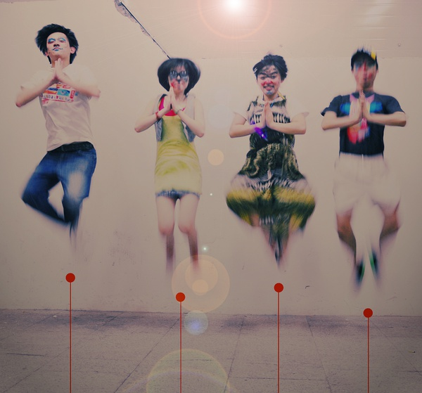
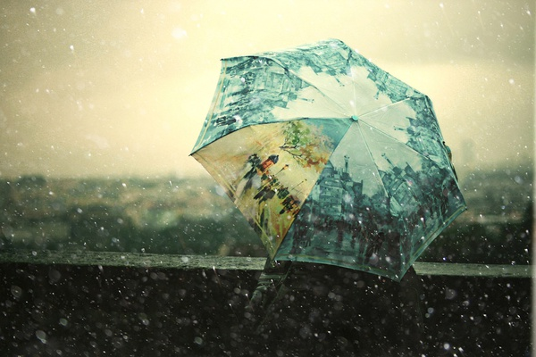

# ＜天权＞散场的少年

**那一年，你在和姑娘争论以后的孩子更像谁、婚后谁洗碗谁拖地，说着说着你们幸福地笑了起来，那远处的宿舍楼灯火燃成一片，你们望着远方，眼睛里满是憧憬。**

### 

### 

# 散场的少年

### 

## 文/常遠（北斗撰稿人）

### 

那一年，好友里的姑娘大多十八、九岁，还在跟男同学暧昧，跟男朋友吵架，跟闺蜜上自习，在校内分享有关星座、八卦、服装搭配、“大学生必看的100本书”的帖子，写下自己少女的心情。

那一年，我们也大多十八、九岁，还在跟女同学发短信，跟女朋友亲吻，跟兄弟踢球、喝酒、斗地主，在校内分享关于政治时事和文学历史的文章，一副指点江山、志得意满的文学青年嘴脸，在心爱的姑娘宿舍楼下徘徊，大喊着“世界是我们的”。

那一年，我们对世界仍有无穷浪漫的想象，我们指着那些行色匆匆、目光呆滞的中年人说：“看，他们像沙丁鱼罐头一样。我们不要成为那样的人。”我们高唱着朴树的歌：“妈妈，我恶心，在他们的世界，生活是这么旧，让我总不快乐。”

那一年，我们还在为晚上跟姑娘开房的50元租金纠结，却未曾想过有一天要掰手指算，跟姑娘开一辈子房的地方每平米多少钱，多久才买得起。

那一年，会弹点吉他、写首小诗还是颇具竞争力的资本，甚至只要你说几句甜言蜜语，送两束玫瑰，就能让心爱的姑娘芳心荡漾。

那一年，她喜欢你，你喜欢她，只是因为看对方顺眼，觉得对方好看，甚至只是因为对方在某次辩论赛或篮球赛上精彩的表现。

那一年，你们牵着小手，背着书包，穿着匡威白色帆布鞋走在下课的路上；那一年，你穿着邦威，她穿着艾格，直至后来的杰克琼斯、VERO MODA，而你们兜里都没有多少钱。

### 

### 

那一年，你的啤酒肚还没有这么明显，你还在操场上疯狂奔跑，对着同伴吼“传球”，仿佛有使不完的力气。

那一年，你骑着山地车，姑娘站在后面环着你的脖子，你们吹着风，晒着太阳，觉得山地车是世界上最好的交通工具。

那一年，姑娘们还是清汤挂面、马尾小辫儿，还没有把头发烫成大大的波浪，在脸上涂抹精致的妆容，对着镜头滴水不漏、得体大方地微笑。

那一年，你说你要做一名记者、律师、老师、设计师、画家，你说那是你儿时的梦想，你说你永远都不会放弃，你说公务员是你最讨厌的职业。

那一年，你在后山的林荫小道搂着心爱的姑娘说：“放心吧，我们会永远在一起，等毕业我们就结婚。”

那一年，你在和姑娘争论以后的孩子更像谁、婚后谁洗碗谁拖地，说着说着你们幸福地笑了起来，那远处的宿舍楼灯火燃成一片，你们望着远方，眼睛里满是憧憬。

那一年，亨利还在阿森纳进球如麻，普埃尔塔还在塞维利亚的左边路驰骋，穆蒂尼奥还在切尔西威风八面，劳尔还是伯纳乌的王子，齐达内还在世界杯上晃得普约尔头晕目眩。

那一年，罗玉凤还只是家乐福的一名普通收银员，陈老师的艳照还平静地躺在他的F盘里。

那一年，媒体还在惊叹博客的雨后春笋之势，博客还叫“部落格”，我们还在新浪上折腾花花绿绿的模板，在校内主页上尝试不同的代码组合。

### 

### 

永远不变的是一直在变。

如今，罗玉凤红了，被称作“凤姐”；陈老师去米国兜转一圈后复出了；博客甚至微博成为了习以为常的“默认存在”；齐达内做了皇马官员，亨利在美国的海滩上养老，普埃尔塔墓前的小花已开了三季，33岁的劳尔还在盖尔森基辛球场倔强地奔跑。

如今，你很久没有去球场了，打一场球需要一个星期的筹划和时间安排，腹前的山头日渐隆起；当年载姑娘的山地车早已丢失得无影无踪，而说过永远不分开的她远走去了大洋彼岸；你开始拿居住城市的房价跟自己的年收入对比，琢磨着什么时候能住上属于自己的平方米。

如今，弹吉他写小诗的人不再让姑娘们尖叫，反而是酸溜溜的土鳖文青；谈理想诉追求不再让人热血沸腾，反而容易被讥笑为矫情的榆木疙瘩；你没成为设计师，也没做记者，而是去考了自己曾经最鄙视的公务员。

如今，你的初中同学、小学同桌结婚生子的消息不断传来，你开始想是不是应该掏掏口袋给那些小生命送见面礼。

如今，校内那些当初跟男朋友赌气吵架、给情人织毛衣、大喊着“单身万岁”的姑娘已到了二十四、五岁的年龄，她们开始只为能否把自己嫁出去而焦虑。

如今，校内分享的热点是职场生存策略，是如何解救大龄单身青年；聚会的话题永远不离车子、房子、婚恋三座大山；你开始抱怨自己的老板，与人攀比年末的奖金，谋划下一次跳槽。

你挤在地铁上；你开车驶在长安街上；你坐在办公桌前加班；你下班后走在回家的路上；你推开便利店的门；你排队取下单位食堂的托盘；你看着她下班回家把高跟鞋狠狠地踢向鞋柜，揉着疼痛的脚；你跟姑娘喘息在汉庭238元的标间大床上；你与女友商量明年是否要首付一套房；你春节回家，在亲朋好友七嘴八舌的催婚声中沉默。有那么一瞬间，你愣住，想起自己那业已疲惫的英雄梦想，想起那些倔强的少年。

### 

### 

你听到时间的声音在敲打。

声声入梦。

我依然看到那些少年

站在九月新学期操场 仰望着天空清澈的眼神 想着无限的未来

### 

### 

(采编：张文倩 责编：黄理罡)

### 

### 
