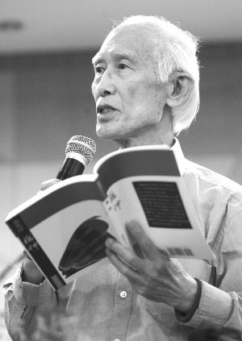
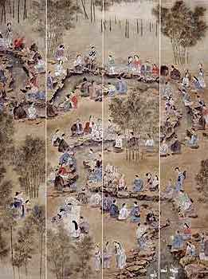

# ＜天权＞文白絮语

**思古之幽情，固然不可以断绝，但与其思古，崇古，和古人遥遥相望，不如亲古，习古，和古人促膝而谈。下一盘千年残局，到乡依然是现代人。“古”里没有说不清道不明的风尘和玄妙，而是功力，和某些不会随时间褪色的道理。比如有人说过，“长相思，摧心肝”，读诗的你一定读得懂相思之苦。**

# 文白絮语

## 文/赵无良（西安外国语大学）

我的笔不善言谈，但到了该说话的时候，也是不能沉默的。

我有一本余光中的散文集。余老是我最推崇的散文家和诗人，而他的大作我却只有一本，也不太读。为什么？因为不敢。读完后我会百感交集，五味杂陈。

至于是何五味，我就不解释了。但那滋味绝不好受，却也相当好受。好受在他文笔的精致，情思的灵动，从章法到内容的无懈可击。不好受的是看山容易登山难，用一生累积的高度，岂是每个人都能企及的？所以山脚下的人自然心中不是滋味。 拿《听听那冷雨》来说，因为这篇收录在了大学语文课本里，比其他作品较为熟悉（《乡愁》除外，仅就文章而言），就是文质兼美的佳作。既看得出字句的锤炼又语工天然，毫不造作。我也喜欢华丽的文笔，却因为根基太浅，常以辞害意，仿佛穿了绣花鞋就走不好路。余老则不然，一身锦绣绫罗，却上天入地全然不费力气。

但绝没有天生丽质的好文章。我坚信，余老的山路也是从脚下铺就的。记得是某次采访中，余老谈到作文的方法时，说要“白以为常，文以应变 ，俚以见真，西以求新”，也就是从中西古今里博采通融。这足以证明余光中不只是游戏文字的匠人，更是文字魔方背后，文化和思考的承载者。此外，也可以看出现当代散文的精品，不可能只脱胎于现当代散文中。

余老自己都说过：“不读旧小说，难谓中国的读书人”。可见他的笔尖，是蘸足了古典文学的墨才得以笔下如神。我并不崇古，更不泥古，所以绝没有带着守旧的观点来看它。近来在读文学史，以诗为例，“候人猗矣”相传是南音之始。后来有诗经，四言为主，之后有乐府，五言生发，魏晋南北朝五言兴，唐七言兴。而不论是几言当道，都有一定的杂言来为诗体的变化保留可能。一种体裁兴起，圆熟，衰落，都经过了漫长的沉淀。越来越精致，越来越动人。回想混沌之中那句“候人猗矣”，区区四言却启后世诗学之滥觞，安能不令人唏嘘？更别提这其中，仅南北诗风的融合就经过了一个多世纪的光阴。推而想之，中国古代文学的深厚功力，世上罕有其匹。

不是我看不上现代散文，我笔下无文，没有权利说这样的话。可道理并不是想不明白。一块耕耘了几千年的熟土，土力肥沃，奇花异草无所不生。就算你要改种转基因稻米，或是圈地盖商品房，又为什么要弃之不用，偏找一块生土来呢？你羡慕别人的土质也好，作物也罢，或是老土地里多埋了祖宗的血汗，怕长出什么妖魔鬼怪来，却都不能改变一个事实，就是你脚下的土地不会变，它的顶峰和低谷已有先例，你是看到过的。好奇的是，你是要把先人们走过的路，再走一遍？还是聪明一点，站在巨人肩上，登高望远？不是说要在古人的衣襟里苟安取暖，逼你写蹩脚的古体诗。但如果要轻视汉字高超的使用技巧，倒不如重新创造一种文字，另寻一块处女地，殷殷勤勤地开垦才算明智。

比较几位作家的作品就一目了然了。我斗胆先说鲁迅。鲁夫子古文今文都要得，杂文更是不错，刻画也细致入微。但就是不好懂，一方面思想“前卫”，我们只见其车尾灯；一方面白话还有些生涩，笔者和读者都挺费琢磨。还有朱自清先生的《荷塘月色》，是课本编纂者和老师口中的名篇，曾有犀利的人指出“看不出哪一点好”。说句不恭敬的话，极有可能是名人效应。再有就是周作人，我爱极了他的冲淡之美，白话文的使用比他本家兄弟流利一些，但同余老的文章相比，一个是栀子花，一个是牡丹花。并非栀子不好，而是唯有牡丹真国色。白话文章要兴盛，笔下须有大气魄。

在书店看到安妮宝贝的新书。其实对这些新型的作家我并不讨厌，甚至也写过这种依依呀呀的东西。这类文章的好处是读来省力，又可以消耗掉多余的感情，尤为许多文艺青年们所爱。在我所认识的人中，许多文笔较好的人一定程度上受到了安妮等的影响。诸如此类的还有韩寒，落落，笛安，郭敬明。平心而论，他们的书我基本不看，不是认为不该看，更不认为其难登大雅之堂。柳永的清旷好词在当时也算俗流，所以存在即是合理的。拿他们的文笔来和白话文使用之初的名家相比，总是平顺悦目了许多。可见由古变白并不是不可以，更不见得白话文就会永远对古文仰止。用余老的话来说，那是一个人人向往的“古中国”，可往古之门已经关上，从晚清开始一切就已经式微。墨汁里搅了其他的东西，就不可能，也未必要回去。只是向前走，如何走，这才是问题。

我在西安，这个处处以汉唐为名的文化古都，一副要复兴盛世雄风的样子。上文的答案或许就在这里。思古之幽情，固然不可以断绝，但与其思古，崇古，和古人遥遥相望，不如亲古，习古，和古人促膝而谈。下一盘千年残局，到乡依然是现代人。“古”里没有说不清道不明的风尘和玄妙，而是功力，和某些不会随时间褪色的道理。比如有人说过，“长相思，摧心肝”，读诗的你一定读得懂相思之苦。

刚才举了墨水不纯的例子，这并不是墨水的悲剧。国门打开，门环上染有国人的血，这是长痛不如短痛。墨水里或许掺了舶来的水彩，但她依旧是中国的墨，不是别的东西。一是未必画不了好画，二是好墨未必就纯。所以不用抱怨，更不用抱着砚台，摆出一副前朝耆老的可怜相。文化殖民还是文化融合，关键在于我们自己。洋墨水有毒还是有益，先检验自己的抵抗力。

以上还不算完全回答了如何走的问题。溯源而上和取法异邦，都是已经探讨实践过的路子，但我相信，一定还有蹊径可走。只是有一点，不能急，言下之意，不能慌。巨轮掉头转向，许多甲板上的人慌了神，开始晕船，不辨东西，不分黑白，弯腰低头乱吐一气。搞的甲板上人心惶惶，臭气熏天。静下心来想一想，诗歌的顶峰登了数百年，诗三百也浓缩了六个世纪的悲欢离合，而我们不过是朝生暮死的朝菌而已，急什么？慌什么？如果前人也如此，只怕巨轮早已易主，还轮的到我们掌舵，或是在甲板上晕船吗？

我也写过几首凑数的古体诗，巧的很，我身别多少也有些朋友写过，可见我并不是异类。探究作诗的心理，大多还是发思古之幽情，却很少以此为正业的。前有李杜，让近世几位文豪都不免走味儿，更别提普通的文字匠人了。写古体诗，就事业而言，“没有前途”。近代史是一条楚河汉界，首先从心理上上了一道封：那是另一个世界，和我们不同。而血脉里，自然而然，却也读得懂西风瘦马，晓风残月。在不爱听戏曲的年轻人里，京腔京韵的流行歌曲也能排上榜首。于是可以说，在古今文的交界处，我们的身份甚是模糊，，既可爱又可厌，既亲近又疏远，既正面又背对，既真实又虚幻。所以，会有弃古从今者，弃今从古者，弃中从洋者，弃洋从中者，不一而足。茫茫然，混沌沌，参差不齐。国人至少于精神，于文化方面，是一盘确实的散沙。我窃以为，是隔阂太深不利于沟通：凡见之乎者也，便觉枯燥无味老朽者大有人在；凡见之乎者也，便觉艰深古奥，不可理解者大有人在；凡见之乎者也，便觉自惭形秽，双膝瘫软者大有人在；凡见之乎者也，便觉与己无关，理应束之高阁者大有人在。古人今人，言语不通，再不能神交；古文今文，势同水火，再不能相辅相成。本是同根生，对面不相识。操持浅显易懂的白话文，是多么轻松快乐的事情。加上楚河太深，汉界太广，即使有诺亚方舟也未必过得去。

其实古人不过是死人，古书不过是旧书，沟通不过是时间，断层不过是历史。不过如此，不过如此，不过如此。可以怀着情感，和适度的尊敬，但大可不必畏惧之，疏远之，妖魔之。前文已说，古董里有的是好东西，国文要兴盛，古董更是利器。只会把玩古董中的赝品，算不得真本事；连古董都要怕，算不得中国人。

我要说的事，已说了有八分。再用余老的话来说，就是“只要仓颉的灵感不灭，美丽的中文不老，那形象，那磁石一般的向心力当必然长在”。余下二分，就让我留给自己来回味吧。

无良不才，拙文到此为止，文中如有疏漏谬误，恳请诸位玉正。

注：本文所指白话文，指五四后的白话。  

（采编自投稿邮箱；责编：麦静）
