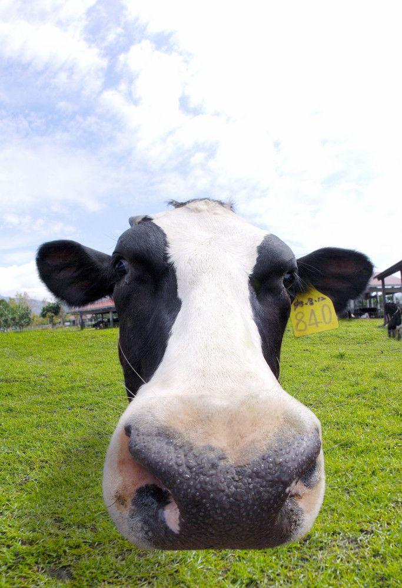

# ＜天权＞无法倒叙的情史（负一）

**这头牛并不这么想，你知道动物的成长期比人要短暂得多，这也导致人经历过漫长的等待之后，对生殖行为赋予了繁多的意义和枷锁；你也知道这宇宙中的大多事物，都是以自己的眼光来认识异己，而那个时候牛已经长出了微弱的乳房，它感觉到自己体内的正在有一些抵挡不住的情绪在蠢蠢欲动，所以这头牛想：“挤奶工这么盯着我看，一定是到发情期了吧，难道她喜欢我？其实我也喜欢她呀。”**  

# 无法倒叙的情史（负一）

## 文 / 苏伶辰（四川师范大学）

 

这个故事发生的时候，她还是一个牧场的挤奶工。那个时候，这个牧场只有一头奶牛，而且还没有成年，也只有这一个挤奶工，但是她因为没有奶牛可挤，就只负责养牛，她当时还不会弹琴，又或许已经是一个初学者了，这已经无从考证，唯一可以确定的是，她终日坐在草地上无意识地张着嘴睡觉，并且发出像牛粪一样混浊的鼾声。

从这个设定上来看，这个故事仿佛真的应该是一段历史，如果用英文来讲述的话，就应该用过去完成时态，我的意思就是说，这个故事是个有结局的故事，而且它已经完结很久了。

关于这个挤奶工和牛以及牧场的来历，我想我可能说不清楚，总之就是这个挤奶工每天带着牛到一个山坡上吃草，牛吃草的时候她就睡觉，但有些时候实在是睡得太多了，就算她闭上眼睛，上下眼皮也会马上弹开。挤奶工就只好站起来，走到牛的身边，摸摸牛的脊背和脑门儿，牛就发出哞哞的声音，这种声音很有催眠的效果，不一会儿挤奶工就又睡着了。

她那个时候穷得叮当响，买不起镜子，以至于活了十多年都没看清楚过自己的脸。后来她发现牛的眼睛大得像个油画框，而且瞳孔黝黑，玻璃体透亮，她便减少了很多睡觉的时间，对着牛的眼睛开始自照，挤眉弄眼地比划着各种动作。她在那个时候终于似是而非地看到了自己的模样，让她惊喜又好奇，她想：“原来我和牛不是一样的啊，那我唱歌的时候是什么样子呢？我跳舞的时候是什么样子呢？我当牧场主的时候是什么样子呢？”

对于挤奶工来说，她把牛的眼睛和牛分得很开，牛就是一头牛，和地上的石头，天上的云，搭建牛棚的木头棍子一样，虽然存在于她所在的环境里，却又和她没有太多的关系。但是这头牛并不这么想，你知道动物的成长期比人要短暂得多，这也导致人经历过漫长的等待之后，对生殖行为赋予了繁多的意义和枷锁；你也知道这宇宙中的大多事物，都是以自己的眼光来认识异己，而那个时候牛已经长出了微弱的乳房，它感觉到自己体内的正在有一些抵挡不住的情绪在蠢蠢欲动，所以这头牛想：“挤奶工这么盯着我看，一定是到发情期了吧，难道她喜欢我？其实我也喜欢她呀。”

这也难怪，谁叫这头牛见过的动物就只有挤奶工，在它看来挤奶工是自己的同类，虽然有的动物很傻，却也知道要找同类来交配，倒是有些动物聪明非凡，却总是找到石头、木桩之类的东西来交配。

自从有了这个想法之后，这头牛再也不好好吃草了，也不用尾巴扇牛蝇了，天天对着挤奶工像小狗一样摇尾巴，因此瘦了很多，而且越来越瘦，看上去缩了一大圈，又变成了刚生下来的婴儿牛的样子。挤奶工好不容易把牛养到这么大，现在居然又变小了，而且眼睛又小又漂浮，再也不是一面镜子了，她恼怒又困惑，于是对着牛说：“牛！你有病了吗？到底要干嘛！”

牛被这意料之外的诘问吓坏了，如果它还是大牛，它就哞哞地叫了，但是它成了一只婴儿牛，就只好呜呜呜地哭起来，它一边哭一边说：“挤奶工，你带我回你家吧，我想当你家的牛。”挤奶工也吓了一跳，她也来不及去想一头牛说话这种事情是否符合逻辑了，她说：“我家有什么好的，我家开屠宰场的，你跟我回家会后悔的。”牛说：“不管不管，我不怕，我就是要跟你回去。”

说到这里，我忍不住想到了达尔文的进化论中物竞天择的这个道理，恶劣的环境会让动物发挥自己更多的潜能，以获得生存下去的权利，因此，虽然这头牛其实心里想的是：“我才不信呢。”但为了让挤奶工无话可驳，它便超越一头牛的属性而撒了这个小谎。但在挤奶工看来，这头牛说的话是真是假都和她没有太大的关系。但迫于自己是挤奶工的压力，她只好答应了下来偷偷带着牛回家了。

走到半路，挤奶工漫长的反射弧终于让她对这件事有了一点感性的反应，她想：“毕竟这头牛也养了这么久，原本只用来挤奶，结果现在要拉去屠宰了，真是太可怜了。”于是她又问：“你真的不怕啊？”牛以为胜局已定，虽然它已经成为了婴儿牛的形态，却也像种牛一样气宇轩昂地发了个表示自己不怕的毒誓。

到了这里，想必你也发现这其实是一个关于误解的故事。而如你所想的那样，牛到了挤奶工的家，发现真的是屠宰场，工人磨刀发出的声音吓得它屁滚尿流，它把挤奶工撞翻在地，发疯一般往牧场的方向跑。跑着跑着它逐渐结实起来，像被吹胀的气球一样，从婴儿牛变回了这个故事开始时的模样。当它跑回到牧场的时候，忽然觉得脚下湿润，埋头一看，发现自己微弱的乳房已然变得饱满丰腴，白色的乳汁流淌出来，浸润在绿油油的草地里，宛如反哺。

过了很久那个挤奶工终于又回到了牧场。她发现牧场来了更多的挤奶工和奶牛，而她睡觉的那片山坡被牛奶加工厂覆盖了。她看到曾经的那头奶牛正在骄傲又愉悦地享受着照料。她准备走上去像过去一样拍拍它的脑门儿，却被它的目光之中畏惧与怨恨交织的波澜束住了挪步的双脚。于是，挤奶工只好尴尬地在裤子上拍拍双手，无奈地对着大家打了个照面离开了牧场。

后来挤奶工辞掉了工作，又卖掉了屠宰场，离开了家乡开始周游世界。据说她已经得知自己唱歌的样子，也知道了自己跳舞的样子，甚至发现了更多自己不曾想过的样子。又有人说她只是找了一片和以前一样的山坡，终日无所事事，只知道睡觉打鼾做白日梦。

当然，这就是另外的历史了。

事实上谁也说不清楚她后来究竟走了多远。

毕竟我们都不知道时间应该如何测距。

 

（采编：周冰；责编：黄理罡）

 
