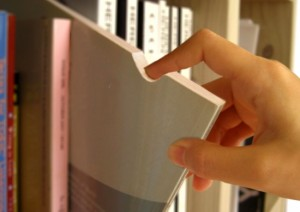
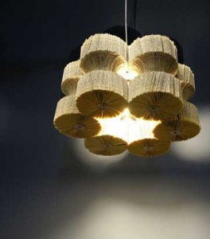

# ＜天权＞旧书

**我还在怀念夜晚空旷的地铁里，一个人和一本书的故事；我还在怀念，在旧书店淘到一本书那时候的欣喜若狂；我还在怀念，在豆瓣和那本梵高画册失之交臂的悔恨和难过；我还在怀念，在书架上与一本西班牙诗人的诗集邂逅，毫不犹豫买下来，细心包好邮寄给远方的挚友。**

### 

### 

# 旧书

### 

## 文/廖汉斯（武汉大学）

### 

### 

题记：“我打开一本书，一个灵魂就苏醒。”

 （一） 

武大旁边有很多旧书店，或者说二手书店。大多数是卖辅导书和各种考试的书籍，有一些还有大量的二手教材。其中最特立独行的算是豆瓣书店了，也是我光顾最多的书店。豆瓣书店的总店在北京，离北大不远，成府路200多号的样子；比武大的店略略大一点，那家店也很奇葩：武大的店是立于众多参考书店之中，而北大的店是立于众多餐馆之中。好在两者都算是食粮，只不过一个是胃里边儿的，一个是精神上的。豆瓣书店的书几乎全是对折，也有四折或者六折的。有些书是因为版本比较早，内容也较为晦涩，也有成套的不好卖出去的，但是几乎全是学术类的书籍，参考书和青春文学等等畅销书在豆瓣书店难觅踪迹。很多书品相都不是很好，想必也是在仓库里面憋屈久了，或是在路上经受了风吹雨打。但是其实品相再差，也不会影响到里面的内容，只是会影响价格罢了。降了价格，自然惹人喜爱；然而来光顾的大多也是学生、文人之类，这儿的书确实是买回去看的，不是为了装饰书房。豆瓣书店从来不给袋子，所以买了书都是自己兜回去；有一次一个朋友在其中买了500多元的打折书，也没有袋子，只好把书包塞得极满，再慢慢驼回去。我常常去光临豆瓣书店，就算不买东西，也可以坐在里面跟老板聊天。或者是当有人推门进来问：“有没有考公务员的书” 的时候替老板回答一句：“这儿不卖教辅书”。再或者是听那些买书的人谈论文学 、哲学、 历史。忽然忆起南京的先锋书店，那家古南都饭店附近的店面极大，书也极多，但是都极其崭新，成堆成堆摞起来，让人忽然有些望而却步了。

（二）

最近总是买书如山倒，读书如抽丝。每次买完书回来，先用钢笔在扉页写一个购于某处，加上年月日，实在是懒了就只拿出石头章子来，在朱红色的印泥里面倒腾一番，盖在书边缘处：“廖汉斯印”我只盖一半儿，于是就成了“斯印”。这就说明，这本书不再是新的了，这本书成为了我的私人物品。我反复抚摸，翻看，在字里行间用蓝或红的铅笔勾画，久而久之书也就渐渐旧了。我喜欢买书而不喜欢借书的原因在于，借来的书不方便勾画；然而借来的书总是旧的，上面总有人的勾画，我若是再在上面添加一笔，会显得极不负责任，索性还是买吧。然而买书的速度总是远远大于看书的速度，于是就只是买着，盖着，整理好了放进书柜里面，时常凝望书的侧面，回味回味标题。

现在又许多人喜欢看电子书，一是方便，二是资源多，三是不要钱，还省劲儿。难怪说现在的出版行业每况愈下，听闻就连美国的一些知名媒体都放弃纸质版了，不知是否为真。电子阅读器也日益兴盛了起来；父亲的朋友给我一台Ipad, 用那个玩意儿看书屏幕确实很大。我往里面倒腾了很多电子书的PDF,比如佛洛依德的著作，潘恩的常识，纽约摄影学院的教材，以及一堆我懒得借的书。然而我最终发现，我根本没有在它上面认真看过书，因为它其实就是一个娱乐的产品，一点也不纯粹。Ipad说实话很重，而且其实也很刺眼，就算调整了亮度还是不行。于是只在上面看完了一半《纽约摄影学院教材》，之后再没有问津它的电子书板块，久而久之连Ipad也觉得厌烦了；前段时间看到友人买了一台kindle,觉得还是亚马逊聪明，做纯粹的东西可能更可以做到专业而吸引人。但是我终究发现，对于我来说，是不可能在一台电脑、或者是一台电子阅读器上认认真真看完一本书的。即使在我的硬盘角落里放着大量的PDF,我从未有过拥有了一本书籍的欣喜和激动，于是我失去了抚摸书籍封面的机会，于是我失去了闻着淡淡墨香的机会，于是我无法在电子书上面盖上只属于我的印章，于是我不能再写上：赠友人XXX,汉斯于珞珈山，X年X月X日。不，这不是我想要的阅读，我还在怀念夜晚空旷的地铁里，一个人和一本书的故事；我还在怀念，在旧书店淘到一本书那时候的欣喜若狂；我还在怀念，在豆瓣和那本梵高画册失之交臂的悔恨和难过；我还在怀念，在书架上与一本西班牙诗人的诗集邂逅，毫不犹豫买下来，细心包好邮寄给远方的挚友。我终于发现，我是一个怀旧的，一个难以跟上时代步伐的人。去书店的人越来越少，能够沉下心来读书的人越来越少，买苹果的人越来越多，买了苹果导了很多电子书但是不看的人，就像我一样，越来越多。

（三）

我记得赫胥黎在他的《美丽新世界》里面描写了一个角色，就是那个成长在“旧世界”因此得以看到莎士比亚著作和其他书籍的人。当他来到“新世界”以后，发现人们都没有看过莎士比亚，或者是圣经。这些书，这些带着人类最美好感情和智慧结晶的书，被当做旧书处理掉了，禁掉了，人们再也看不到了；人们也不再需要这些旧书，因为他们有化学药剂，心情郁闷了可以打上一针，立马解决一切问题。其实他才是应该属于新世界的人，只是新世界的人已经被阉割过了一遍。新世界的总统把圣经藏在自己的保险柜里面；我想他知道圣经意味着什么，只是人们已经不再需要这旧世界的书了。奥威尔也在其《1984》里描写了文学作品被销毁，于是也许以后的人们只能口耳相传：“听说在很久以前，世界上有一种叫做书的东西。那和《真理报》有什么区别？” 如果以后真的是这样，我会从心底觉得莫大的悲哀。

如果奥威尔的意思是我们终将毁于我们所惧怕的东西，那么波兹曼的《娱乐至死》即是我们终将毁于我们热爱的东西。当娱乐的时代已经到来，当我们的时代不再需要文学的殉道者，当商品经济高度发达而文化产业却日趋衰弱，当书籍都成了被人忘却的东西，放在我们的书架里当做摆设、当做纪念，当电子产品取代了原木纸浆，当我们忘却油墨淡淡的香味，当我们提笔在纸上写字却忘记了怎么写，因为我们的手早已习惯了键盘------我忽然怀念起旧书，就算它的封面残破了，就算它被人蹂躏的皱皱巴巴，就算里面布满星星点点的墨迹，就算它是我从某个窄小的书店打对折买来的。

（四）

诗人西川好像写过这么一个句子，让我记忆犹新：

“我打开一本书，一个灵魂就苏醒。”

### 

汉斯，草草落笔于珞珈山

2011年6月7日

### 

### 

（采编：徐超 责编：黄理罡）

### 

### 

