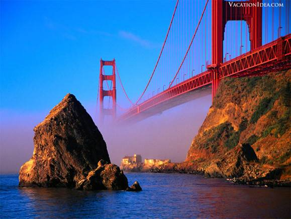
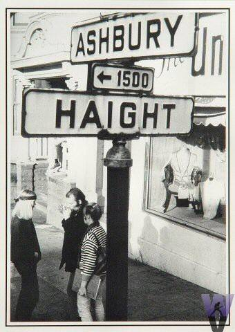
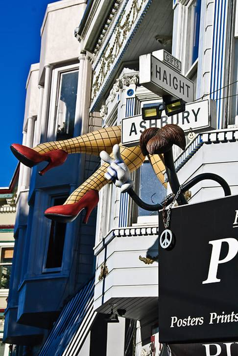
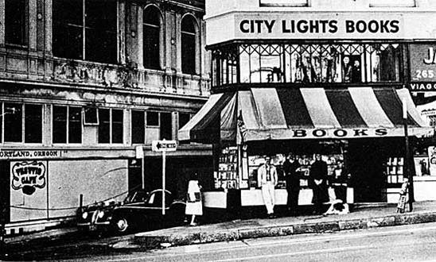
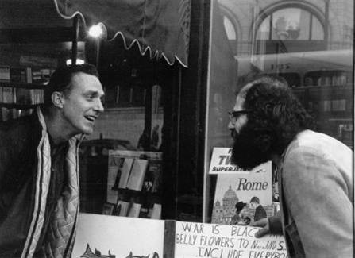
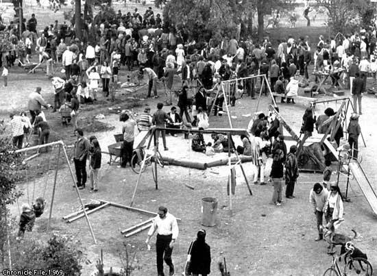
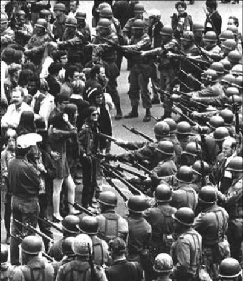
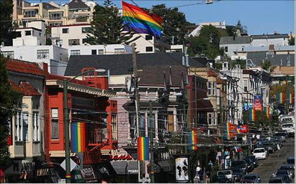
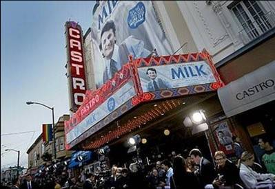
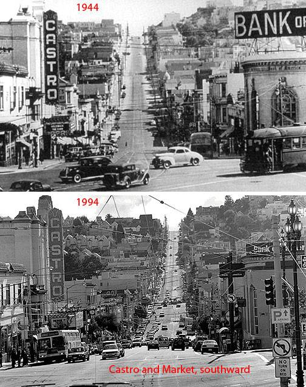

# ＜天权＞旧金山  致以夏天所有的爱

**1959年，希区柯克在《迷魂记》中让女主角玛德琳扮演一个精神恍惚的女人，独自开车到旧金山的金门大桥下，欲投海自尽时被跟踪的患有恐高症的警探救起。那一年，可能是美国文化中激流暗涌的最后一年。迷魂记，仿佛一记语谶，在幽蓝壮丽海湾风景的注视下，揭开了风云迭起的60年代美国政治和天花乱坠的社会文化运动的帷幕。** ** ** ** **

# 旧金山 致以夏天所有的爱

## 文/苏荣坤 ([Academy of Art University](http://browse.renren.com/searchEx.do?s=0&p=%5B%7B%22id%22%3A%22705062%22%2C%22t%22%3A%22univ%22%2C%22name%22%3A%22Academy+of+Art+University%22%7D%5D&ref=pf_spread))

1959年，希区柯克在《迷魂记》中让女主角玛德琳扮演一个精神恍惚的女人，独自开车到旧金山的金门大桥下，欲投海自尽时被跟踪的患有恐高症的警探救起。那一年，可能是美国文化中激流暗涌的最后一年。迷魂记，仿佛一记语谶，在幽蓝壮丽海湾风景的注视下，揭开了风云迭起的60年代美国政治和天花乱坠的社会文化运动的帷幕。 

 ** ** ** ** **嬉皮大公社****——****金门公园和海特街**** ** “嬉皮士，他们不拥有任何的东西，却尝试热爱所有的事物和所有的人。他们不信奉大部分贵格会会员所信仰的主教的信念——神创造万物。我们所赞扬的是存在于每个人心中的神。Namaskar（印度合十礼）” ——Ron Braithwaite 

### 

十年之后的1969年，前苏联和美国进行太空竞争。一名叫Armstrong的美国人终于历史性的第一个登上月球。在纽约州东南部一个伍德斯特的小镇上，聚集了多达四十五万的从美国婴儿潮时代成长起来的年轻人，开了一场长达三天的主题是“和平，反战，博爱，平等”的演唱会。在近60个小时的喧闹里，有3人死亡、2名婴儿诞生、 400人由于服用迷幻药而失去自制能力。 更早之前，在1967年的西海岸加州，嬉皮文化已经积累到顶峰。在阳光如流金一般四溢的夏季里，多达几十万人在在旧金山的海特和阿希贝瑞（ Haight-Ashbury ）地区举行了一个夏天的狂欢。它的前奏是同年一月份在旧金山金门公园举行的大聚会（ Human Be-In ），反抗加州刚刚颁布的对 LSD （一种迷幻毒品）的禁忌法案。这个聚会导致了海特和阿希贝瑞区成为了美国的反主流文化的中心，成为广大嬉皮士众心所归的圣地。 “如果你要去旧金山的话，请别忘了在头发插上鲜花，在旧金山城里，你遇到的人温柔善良。”这是几乎旧金山所有生活过的人都会唱的歌，此歌曲由约翰·菲利浦（ John Philip ）创作，司格特·麦肯热 (Scott Mckenzie) 演唱，在蒙特雷音乐节（离旧金山一百英里处的一个地方）一举成名，同时登上英美两国的流行歌曲排行榜首。之后这首歌也成了“爱的夏天”的“圣歌”，被广大的嬉皮士们在街头巷尾传唱。 

### 

6月份学校的学年正式结束之时，嬉皮士们纷纷开始了向旧金山的朝圣之路。旧金山这个城市，尤其是海特和阿希贝瑞区立即遭受了多达几十万的“头戴鲜花的孩子们”（ Flower Children ）的“大军入侵”。不光是青少年，还有广大的成年旅游者，艺术家，自由派人士，都纷纷涌入旧金山，然后回归自然部落般地群居在一起的，享受嬉皮文化所倡导的一切：免费食品，住宿，毒品，以及“免费的爱”。 这个反文化的嬉皮盛会，向人们展示了一个开满禁果的失乐园。这里没有阶级，没有劳动，也没有政府，国家机器。人人每天都在载歌载舞享受免费的音乐会，每天都可以在免费商店领到基本生活所需要的任何东西，还可以免费拿到大麻和化学迷幻药品。他们在这座城市里自行分划出一块原始部的土地落露营而居，像卡尔维诺《我们的祖先》里面患了麻风病的村落，用保守传统文化的眼光中的纵情声色来进行自我觉醒。他们跌跌撞撞，却又声嘶力竭，用尽热情和朝气沉湎于理想主义的乌托邦和药品制造出来的海市蜃楼中。 如然而随着超载的人口，混乱的公共次序，最终给城市带来严重的后果这个不现实的夏天变得现实起来。10 月 6 日，在嬉皮士们自发演出了一场摸拟的“嬉皮士葬礼”，在宣告“爱之夏天”的结束之后，人们以蜂拥而来的同样的速度，撤离了这个梦幻般的城市。 “爱的夏天”虽然最后如梦一般失散了，但在之后的三年，美国各地到处都兴起嬉皮文化艺术。从鲍勃迪伦的音乐，公路电影中的逍遥骑士。乃至蔓延到政治领域内，最著名的是嬉皮士们提出的反越战口号：“制造爱，而不是战争”（ Make love, not war ），整整影响了一代人。 **垮掉的一代****——****城市之光与八号画廊******

### 

美国彼时年轻的嬉皮士们并非凭空灵光一霎地自我诞生。在他们更早之前，已经有更意识激烈和超越的精英分子们，将自己打碎，塑造了一个个令世人夺目的肉身形象。他们有着更高的责任感，在主流社会试图维系的牢靠的文化秩序中，他们不顾一切的试图抵抗这样的强硬的秩序，追求自发的艺术的创作，没有桎梏，无可救药的浪漫。渴求从心灵从欲望中分娩的灵感里进行狂欢。 他们就是垮掉的一代。对于生活，他们对挑战极端的体验诸如放纵的吸毒和性爱有着浓厚的兴趣。作为美国知识阶层中抗议权威的最激烈的对立面，他们衍生出了美国文化史上第一支亚文化，来质疑和否定二战后传统的文化价值观。他们主要支持精神自由和性解放（或性自由）。例如同性恋权益的自由、男女平等、黑人权益、反对年龄歧视；支持文学作品不受检查制度危损的自由；支持大麻和其他毒品合法化；支持摇滚乐吸收蓝调因素并施行节奏革命。事实上，美国50－60年代的一些摇滚巨星如甲壳虫乐队和鲍勃·迪伦等都曾深受“垮掉派”作家和作品的影响；主张普及生态保护意识；反对军事－工业文明；反对全国性的政府权威，维护地方文化。其核心的理念在凯鲁亚克的《在路上》中描述到：“因为我很贫穷，所以我拥有一切。” 1950年朝鲜战争爆发、1952年第一枚氢弹爆炸、美苏太空竞赛。1953年，内华达州一名年仅7岁的男童马丁·莱尔德（Martin Laird）死于白血病，这可能是原子时代美国的第一个受害者。接着，美国在牛奶里发现了锶的放射性元素。有人回忆起说，虽然那时我才上小学，但已经在想，自己将来不是在核战中被炸死，就是在核辐射中牙齿脱落、慢慢死去。 在五十年代的时候，美国反文化运动已经在东海岸的纽约和西海岸的旧金山的大学里面崭露头角。有人根据英文“Beats”和“Beatniks”（“垮掉青年”的俗称与谑称）译成“避世青年”或“疲塌派”，也有人取其诗歌的部分特征，称为“节拍运动”或“敲打诗派”，这一名称最早由作家杰克·凯鲁亚克于1948 年前后提出。而“beatnik”一词是赫博·卡恩在1958年4月2日于《旧金山编年史》中首次发明并使用的，最开始是个贬义词，从当时苏联发射的人造卫星“sputnik”演化而来，用于讽刺“垮掉派文人”，表明他们既不合时宜，且和共产主义之间有某种亲缘关系。 

 1955年十月七号的晚上八点，金斯堡赤身裸体地在旧金山城市之光书店附近的“六号画廊”当众宣读他的新诗《嚎叫》。“我看见这一代最杰出的头脑毁于疯狂，挨着饿歇斯底里浑身赤裸，拖着自己走过黎明时分的黑人街巷寻找狠命的一剂/ 天使般圣洁的西卜斯特渴望与黑夜机械中那星光闪烁的发电机沟通古朴的美妙关系…… 这一刻是垮掉的一代文学的诞生。这首诗充满了强烈的控诉和激动的呐喊，文笔粗鲁跳跃，内容涉及同性恋、毒瘾，甚至还谈到东方的神秘主义宗教，是一首非常奇异又充满了禁忌话题的诗。当时金斯堡朗诵完之后，城市之光书店的老板费林盖蒂当即写了个短签送过去，内容模仿当年爱默生在惠特曼朗诵完《草叶集》之后所献的贺词，“在这个伟大生涯的开端，我向您致意 ”，不过他又加了一句“我什么时候能拿到你的稿子呢？”他要出版。 结果这首诗真的交给他出版之后，书店就因出版《嚎叫》被控以“传播淫秽作品罪”被告上了法庭。最终却出人意料地被法官宣布无罪，理由是《嚎叫》一书“具有一定的社会意义”。这一历史性判决还导致了D.H. 劳伦斯、亨利·米勒以及威廉·巴勒斯等作家的作品在美国的解禁。当时的美国社会比较保守，认为这样的禁诗伤风败俗，但是经过激烈抗争，最后费林盖蒂胜利了。 城市之光书店又先后两次由于出版“禁书”遭到起诉，但是书店并未因此倒闭，书店历史上只有两次“关门”，而且两次都是为了表示对美国对外政策的抗议而自发进行的。第一次是1991 年因反对美国发动海湾战争而停止营业；第二次是伊拉克战争期间挂出了“阻止战争和战争制造者”的横幅以及智利诗人聂鲁达的诗句 “暴君砍去了歌手的头／但井底的歌声／仍然涌向大地的秘密之泉”， 书店在3 月20 日那一天响应反战组织“无正常营业日”的号召而闭门歇业。 《旧金山垮掉的一代》一书的作者比尔·摩根说：“城市之光书店拥有辉煌的历史，在今天同样具有重要的意义，因为总有人愿意去寻找独立的文字和另类的声音，寻找那些不是在任何地方都能找到的东西。” 在当代网络侵袭传统印刷出版业，大型连锁书店的冲击下，纽约的另一传奇书店——高谈书店已经在2007年关闭。而费林盖蒂的城市之光书店迄今仍然保持着独立小书店的品质，屹立不倒。成为美国思想自由、言论自由的标志，成为旧金山的文化象征。 **要做爱不要战争**** ——****加州伯克利大学学生运动******  东京湾决议通过后的几个月后，越战征兵开始了。与此同时，由于“婴儿潮”一代开始步入青年，成为美国的巨大兵源。1967年，美国实行征兵制改革，规定不再缓征研究生和大学生，他们在毕业之后即被纳入应征之列。这使1968届的大学生突然失去了最可靠的逃避途径。而这一年毕业的大学生大多出生在婴儿潮的头一年1946年。对他们来说，毕业就意味着被送往越南前线。他们不愿意将自己的生命断送在无谓的战争中。 作为反文化运动学生运动的前锋和重镇，旧金山的伯克利大学也曾卷起一系列的风暴。那时，达斯汀·霍夫曼主演的电影《毕业生》(the Graduate)风靡大学校园，大学生们以为电影所描绘的图景就是他们应该有的大学生活，那就是喝咖啡、吃巧克力、弹吉他、议论时政、改造社会。那时他们觉得改造社会是大学生的使命。 50年代的美苏对抗对于尚在小学里读书的婴儿潮一代人来说，虽然像是一场挥之不去的噩梦，但毕竟离他们还有一些距离。60年代，在他们开始步入大学的时候，危机真正贴近了他们。使他们感到威胁的是1962年的古巴导弹危机和1964年开始升级的越南战争。 1964年9月24日，加州大学伯克利分校年仅22岁的哲学系学生马里奥·萨维奥（Mario Savio）和阿特·戈登堡(Art Goldenberg)等发起并领导了校园“言论自由”运动（Free Speech Movement)，抗议学校当局禁止在校园内谈论民权运动和发表反越战言论。10月1日到2日，加州政府出动国民警卫队前来制止，学生与警察对峙长达32小时，一些学生运动袖被逮捕，反文化运动的序幕由此而拉开，以后逐渐蔓延到美国其他所院校及学校以外的地方。1968年，该运动因马丁·路德·金和罗伯特·肯尼迪遇刺、越战的不断升级而达到高潮。在1968年的前几个月，将近4万学生在101所大学举行大规模的游行示威。示威中，数千人被捕。 

 1969年的4月20日，也是在一个夏日，数百名激进的学生在伯克利分校克利附近的一块空地上插起了一块手写的人民公园（People's Park）的牌子，宣布要在这里建造一个理想的社会。在此后的几个星期，他们在那里种花植树，并搭起帐篷，准备在那里建造房屋。5月15日，250名加州警察及坦克车、直升飞机将公园内的学生包围，要求他们离开，否则将被逮捕。学生与警察发生冲突。最终，学生在公园里种植的花草被拔掉，帐篷、围墙及房屋被坦克车铲平。人民公园仅仅存在了不到3个星期。 从世界范围来看，60年代同样是一个动荡的年代。青年人的抗议运动不仅发生在美国，而且发生在世界其他地方。仅在1968年这一年，就发生了法国的“五月风暴”和捷克的“四月之春”，中国的文化大革命也在高潮之中，大批知识青年在这一年开始上山下乡。与此同时，英国、意大利、德国、荷兰、瑞典、日本、匈牙利、波兰、南斯拉夫，也都相继发生了以青年人为主体的抗议运动。动荡开始于美国，因为它是第一个从工业社会向后工业社会过渡的国家，也是转型过程中矛盾和冲突表现最为突出的地方。 美国当时的大学生有着得天独厚的独立自由精神的土壤。不管是“垮掉派”作家，还是法兰克福学派马库塞（Herbert Marcuse)，抑或是新弗洛伊德精神分析学派弗洛姆（Erich Fromm），都对现代工业社会持一种批判的态度，他们的追求和反抗方式都带有强烈的理想主义色彩。而这种批判与否定，这种浪漫的、理想主义的东西，在60年代反文化运动中得以延续。最终以越战的美军撤军而终结。 威廉·曼彻斯特在《光荣与梦想》一书中说：“人们如果对于新的繁荣所带来的50年代生活方式没有一定的体会，就不可能理解15年后发生的社会反抗。” **彩虹旗飘扬****—— ****卡斯特罗公民的胜利******

### 

“我这样请求：假如我被暗杀，我希望五个、十个、一百个、一千个人站起来。假如子弹穿过我的头，让它也穿破每一扇阖上的柜门。我请求运动继续，因为这无关个人利益、无关名望、无关权力，而是关于我们少数族群，不只同志，还有黑人、亚裔、老人、残疾人、少数族群。没有希望，少数族群就彻底输了。我知道，不能只靠希望，但没有希望，生命将失去活着的意义。所以，你，你，还有你，一定要给人们希望，一定要给人们希望……” ——哈维·米尔克 Please always be with me 这是在电影《Milk》里面的对白。这部2008年的电影在旧金山上映时期，人们排着长队在电影院门口，电影票短时间内很快告罄。旧金山有一个白人笑话。1/3的旧金山市民是亚裔，1/3是非裔和拉丁裔，其余1/3是同性恋。它是美国非主流和叛逆者的总部。不仅如片中所说，是全美第一个选举了同性恋当选为市议员的城市，也是全美第一个大麻合法化，以及于2004年全美第一个同性恋婚姻合法化的城市。在去年的八月，加州废除8号提案，旧金山的同志聚集在议会大厦外一片欢呼。 哈维.米尔克（Harvey Milk）是美国时代杂志评选出的20世纪百大英雄人物之一，他是美国（也是全世界）第一位公开以同性恋身份从政的政治家。哈维亲手缔造了美国旧金山的卡斯特罗同性恋区，推动了七十年代的同性恋民权运动，他年仅48岁，在职位上被刺杀，身中五枪，震惊全国。 

### 

在市场街的西南角，靠近市政广场的第5区，垂直于卡斯特罗街道有一面没有人会错过的庞大的彩红旗所象征着同性恋社区。在这里，在几乎整一条卡斯特罗街上，家家户户的门前，商店和附近的住宅门口，都有一面小型的彩红旗，象征着房屋主人的身份。以至于，在大学文学史的课本里，当美国历史上最杰出的作家们描述到这些个坐落于第5区的六棱型窗户的免于1906年旧金山大地震的维多利亚式别墅屋时，也会用它们来代表美国的同性恋文化。这些人为了追求自己的幸福和自由，从封建的家庭中逃脱出来，从美国的各个角落里逃脱出来，躲避到这一个海角天涯，躲避到一起，直到七十年代，他们在这里寻找到了自己的声音，于是他们在这里把自由的号角吹响，将北加州的阳光和雨露，润泽到每个信仰自由和民主的人心里。 卡斯特罗社区的形成，固然和哈维的亲力亲为苦心经营息息相关。而这也是同志运动史上的一个结晶。1969年6月27日星期五，在石墙旅馆外，格林威治村的同性恋住所。“石墙运动“爆发，这被认为是美国乃至世界现代同性恋权利运动的起点。它是第一次有同性恋者拒绝警方的逮捕。在石墙骚乱以前，警方对同性恋酒吧和夜总会的搜捕行动是城市同性恋者生活的一部分。警方通常会登记出席的人的姓名以便用于报纸的刊登，然后把尽量多的同性恋者押上警车。接吻、牵手、甚至在同性恋酒吧出现都是被逮捕的理由。 这次事件成了全新的开放的同性恋社区的“广告”，成千上万的年轻男性投奔他们而去。而在西海岸的旧金山，在1969至1978年间吸引了大约3万名同性恋者，其中大部分都集结在卡斯特罗。在接下来的十年间又增加了5万人。石墙酒吧事件后4年，同性恋团体由50个激增到800个，至80年代初，数目逾千。 每年六月最后一个星期的星期日，在旧金山市区的市场街便会举行“同志骄傲大游行”来纪念石墙运动。这不仅是旧金山市区里的男同志、女同志、双性恋者、非同志一起狂欢的盛典，甚至是来自全美或全世界的同志及对同志友好的人一起狂欢的盛典。在游行前，会在卡斯特罗区附近的双子峰上，挂起巨大的倒粉红三角旗帜。这是全球三大同志游行节日之一。与此同时，每年在同志骄傲月里，旧金山也会在卡斯特罗剧院举办“旧金山同志电影节”。这也是目前全球历史最悠久、规模最盛大的同志影展。 在今日的卡斯特罗，满眼可见坦之若素的同性情侣手携手行走在街头，如漫步在自家后院中一般。而在华灯初上的时候，街头的大大小小的酒吧成为旧金山重要的夜生活根据地，电子音乐和酒精味弥漫的肉体都组成了在独立于现实之外的永无岛。每逢节日，如万圣节，满街都是奇装异服精心打扮的男女，站在主题成人服饰店和闪烁霓虹灯得酒吧门口成为他们重要的自我表达的方式，并点燃了这座城市的独特的灵魂之花。 

### 

### 

### 

（采编：安镜轩 责编：刘一舟）
