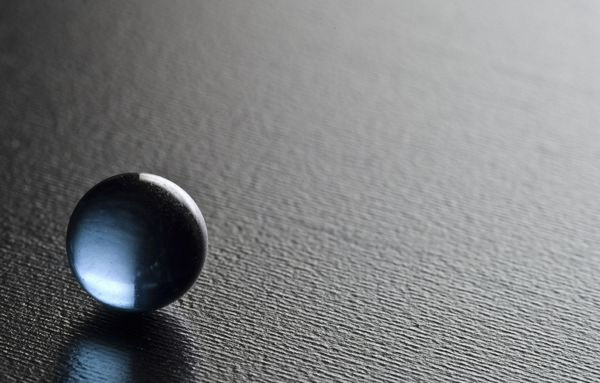

# ＜天权＞时光若刻

**合上自己写完的稿子，闭着眼睛想象她第一次吻我时候嘴唇的温度，我的嘴角竟然开始微微上扬。** **未曾想过，这个“像冰一样”的姑娘，让我二十年冰冷的回忆，顿时变得温暖了起来。**  

# 时光若刻

## 文/陈谌（厦门大学）

 **1.**

我开始发现自己和别人不一样是在5岁那年，准确地说是在1990年的11月2号。

那是一个起风的星期五，天气有些阴霾，早晨起床时妈妈让我多穿点，因为今天开始要降温。那天早上一进幼儿园，我就因为和一个名叫孙宇的小胖子打架，被我们的孙老师给抓住了。孙老师是一个很温柔的女老师，那年她23岁，刚从大学毕业不久，那天她穿着一件暖黄色的线衣，梳着一个很好看的马尾辫。

她把我和孙宇揪到角落，问我们为什么打架，孙宇一脸茫然地摇摇头，说：“我不知道，他今天一进来就打我，说要找我算账。”

于是她转而问我要跟他算什么帐，我义正言辞地告诉她：“三天前下午放学回家的时候他在我屁股上踢了一脚，他说有本事三天后找他报仇，所以我今天就打他了。”

孙老师笑着摸了我的头一下，说你这孩子可真是记仇呢，小朋友之间要相互友爱。

我说：“他才没跟我友爱呢，他从认识我到今天总共踢过我7次屁股，揪过我5次耳朵，还捏过我两个8次脸。”

那时候我只学到10以内的算术，所以只能用这种方式来描述16。

听我这么说完，原本微笑着的孙老师顿时就表情凝固了，她把孙宇打发走，然后就拎着我到园长办公室给我妈打了个电话。

后来事情的发展就没有什么悬念了，她们惊奇地发现我是一个不正常的孩子，我能清晰地记得从自己记事开始的每一件事每一个细节，细致到每天的每一顿饭吃的是什么东西，电视播了什么节目什么新闻，天气是好是坏刮风还是下雨，甚至谁在什么地方和我说了什么话，每一个画面都历历在目，只要我去回忆，它们就像过电影一样清晰。而且除了睡觉的时间外，没有任何的空白之处。

而我也从那一刻才开始明白，原来人是种会“遗忘”的动物，他们会把眼前这如此清晰、真实而不停流动着的画面在转瞬间忘得一干二净，甚至连自己说过的话、做过的事、听过的歌、读过的文字都能够在一段时间后无情地抛之脑后，而且遗忘的比率和效率都是如此的高，就好像西瓜经过榨汁机后留下的那些少得可怜的残渣一般，我甚至有些担心他们会不会有一天连自己是谁都忘掉呢。

可我自己却完全没法体会这种“遗忘”的感觉，就好像活着的人永远无法领悟“死亡”的虚无感一般，我只能无助地坐在那里，看着家人因我将前一天晚上的新闻联播一字不差地背出来后那惊奇而又惊恐的眼神，然后忧愁地交谈着这究竟是一种什么病，会不会对大脑的发育有影响之类的话题。

然而成人的世界终归是功利的，当我在邻居面前把《三字经》，《弟子规》像倒豆子一样倒背如流的时候，我看到了父母得意的眼神，尽管这只花了我不到一个小时的时间而已。而他们打电话的时候，也只要喊一声“七大舅”或者“八大姑”，我就能把号码完完整整地报出来，比查电话簿要方便快捷多了。甚至连我奶奶也会问我“缝衣针放在哪里了”，“早晨我说要去谁家做客来着”之类的问题，从此之后他们再也没有讨论过我脑子的结构，只夸我是个聪明的孩子。

不过其实我并不是个聪明的孩子，只是我的头脑像电脑一样冰冷而精确。

 **2.**

很多年后，当我以全省第一名的成绩考入一所全国知名的大学后，我才知道我的病叫“超忆症”。

得这种病的患者记忆力会异于常人，能够记得生活中的每一个细节，且过目不忘，这就是我之所以能够毫不费力地考入名牌大学的原因，我从小学开始基本没有认真学习过什么，只要是我看过的书、上过的课、做过的题，到考试时就能像放电影一样的在脑海里回放，就像作弊一样。由于我的逻辑思维能力并没有那么出众，只是单纯记得原有的题目而已，所以我的理科一直都不好。但自从我报了文科，我的高中生活便再也没有学习二字了，历史地理政治三年所有的课本，我一周就全看完了，从此以后大小考试都和开卷考无异，我的答案从来都是一字不差，连标点符号都一模一样。

据我所知，全世界得这个病的也就那么几个，而能够病到我这个程度的，估计应该不会有第二个了。

从小到大我都过得很开心，因为父母从来没有担心过我的学习，而我也因为我的特殊能力交到了很多朋友，我会跟他们讲各种各样的笑话，说千奇百怪的故事，跟他们说起曾经任何一天发生的有趣的事情，甚至可以告诉他们在某年某月某一天，他们穿什么衣服，在什么地方说了一句什么话。而他们也会听得津津有味，瞪大眼睛如痴如醉般出神地望着我，就好像在听别人的故事一样。

也就是在这样的时刻，我开始羡慕他们，羡慕他们眼神里流露出的那种东西。我从来无法理解他们对于回忆的眷恋，他们总会很怀旧地拿起一个多年前的明信片，围在一起回味一张泛黄的旧照片，甚至看一部很久之前看过的电影，这些东西对我来说都是没有任何意义的，毕竟在我的脑海里它们清晰到触手可及：明信片的每一个字我都能默写下来，照片上发生的事情我一眼就知道是哪一天的哪个时刻，而旧电影的每一个剧情每一句台词，我都能躺在床上闭上眼睛完整地放映一遍。

这是一种痛苦的羡慕之情，甚至渐渐变成了一种嫉妒，我感觉自己是一个没有回忆的人，因为我的脑海里仅仅只有回忆。

我开始变郁郁寡欢，也不再愿意与人接触，大学里我开始翘课，躲在宿舍里打一天游戏，或是在图书馆看一下午书，甚至只是坐在湖边发呆，什么也不去想，因为这些都是除了睡觉之外减少回忆的最有效的方式。只要我不去创造回忆，那我就不会有回忆了吧，我默默地想着，看着湛蓝的天空中云卷云舒，看着树叶从树上掉落到草地上再滚落到林荫小道上，看着年轻的人们匆匆的脚步，以及随着时光流逝的青春。

直到有一天，我遇到了一个名叫如冰的姑娘。

那是2006年9月14日，她穿着一袭碎花连衣裙走到我的身旁，问我是不是那个什么事情都知道的人。

我笑着对她说：“我并不是什么都知道，我只是什么都记得。”

然后她就跟我聊了起来，上至天文，下至地理，我发现她懂得的并不比我少，而且我仅仅只是记得发生过什么而已，她却能对发生过的事情有着自己的看法。

“你虽然什么都记得，可是‘记得’本身又有什么用呢，发生过的事情终归是发生了，你又不能改变什么，如果你不能有自己的东西，只是像个放映机一样放着那些东西，那它们终究一点意义也没有不是吗？”

我看着她的眼睛，陷入了久久的沉思中，那是一段很长很长的时间，空中有五只飞鸟飞过，一对情侣从湖的另一端走到了这一端，远处还开过一辆黑色的小汽车。

“你叫什么名字？”我问她道。

“如冰。”

“像冰一样的意思吗？”

“如果你非要这么理解的话。”她笑了，她笑起来很好看，就像七年前路过我家楼底时，俯身在墙角看见的那支鸢尾花。

“我可以知道你的电话号码吗？”

“可以啊，我发给你？”

“不用了，你说一遍就够了，一辈子都不会忘记的。”

她很羞涩地看了我一眼，但我却没有告诉她这其实并不是虚情假意的肉麻，而是一句真真切切的实话。

 **3.**

我和如冰在一起总共不过1年零7个月18天，那是一段刻骨铭心的日子，尽管我似乎没有资格这么说，毕竟所有的日子在我的脑海里都是如此的平等。

但闭上眼睛回想起那些日子的时候，我却又真切地感到它们是如此的特别，我发现自己第一次开始从某段特定的回忆里感到一丝温暖和感动。

每次牵我的手，她都会问我这是我们第几次牵手了，我总能一次一次地把数字报给她听，从十到一百再到一千，而我也会在她耳边告诉她，她一共说过几次爱我，每一次分别在哪一天，哪个时刻，哪个地点，她穿着怎样的衣服。我们之间从来都不需要什么承诺，她也从来不要我给她承诺，因为她知道我都记得，而且一辈子也忘不了。

我们之间也会有闹矛盾的时候，比如我翻她的旧账，说她在几时曾经无理取闹过，或者不承认她翻我的旧账，反驳她那天我其实应该是怎么怎么样的，这些都让她出离愤怒，尽管她知道我不是有意要记她的不好。但事后她总能原谅我，从不会跟我大吵大闹，毕竟她知道对我而言，事情无论好坏都是会深深刻在脑海里的，她不想等到几十年后我再把这事提起来。

但很遗憾的是，她最终还是没能等到几十年后的那一天，她最终选择离开了我，原因是她无法接受一个我这样的人，我会给她太大的压力，她在我这里必须小心翼翼，不能犯错，不然这样一个残缺的她就会永远留在我的回忆里，无法抹去。

如冰走后，我又回归了自己一个人的日子，每天发呆，看书，打游戏，睡觉，把自己关在自己的世界里，与世隔绝。朋友们都来劝我，想给我点安慰，但他们最后却都无奈地走了，毕竟他们也知道，“时间会治愈一切”这句话对我并不管用，我不是一个会自动痊愈的人，我的伤口会不停的流血，直到流干的那一天为止，只因为我没有一种叫做“遗忘”的能力。

但事实上我却比他们想象中都要来得坚强，我只要一直在做事，不给自己留下时间空间去回忆，自然也不会感觉到悲伤。于是我开始尝试着写文章，把自己二十年的记忆改编成小说，有如此清晰的回忆，加上自己曾经看过那么多的书，这是一个并不困难的过程。而且我发现，写文字的速度要远远慢于自己思考的速度，因此只要我的笔在动，我的思维就会跟着一起慢下来，它让我不再沉浸在那些冰冷的回忆中，让我对自己的人生有了新的认识和思考。

于是我无端想起了如冰对我说的那句话：“发生的事情终归是发生了，你既然无法改变，不如把它赋予属于你的意义。”

合上自己写完的稿子，闭着眼睛想象她第一次吻我时候嘴唇的温度，我的嘴角竟然开始微微上扬。

未曾想过，这个“像冰一样”的姑娘，让我二十年冰冷的回忆，顿时变得温暖了起来。

 **4.**

今年我二十七岁，现在是一名作家，我的书卖得很好，却没有人记得我是一个超忆症患者。

前天跟一个出版社的编辑一起吃饭，他问我现在新书写的怎么样了，让我说一下大致的剧情，然后我就把最近一章的内容完完整整背出来给他听了一遍，把他怔了半天说不出话来。

“话说你竟然把你自己写的东西给背下来了，你真是太有时间了。”他的表情像极了二十二年前幼儿园里孙老师的模样。

“时间这东西，留着不用，也不能省下来以后再用，不是吗。”我笑道。

“背东西不是很浪费时间吗，我从小到大记忆力都超级差的，前一天晚上背的课文，第二天老师一抽背就忘了，那时候经常抄课本，就总琢磨着，要是真有那种记忆面包该多好啊，想要记住的东西，吃下去就马上记住了，而且永远都忘不了。”他摇头晃脑地说着，像是陶醉在了自己的幻想中。

“那要是有想要忘记的事情呢？”

“貌似不用刻意去忘记吧，毕竟没有什么事情是永远忘不了的，在当时看起来再了不得的一件事情，总有一天你都会什么也不记得了不是吗，人的记忆力是这个世界上最靠不住的一个东西了。”

我喝掉杯里的咖啡，笑着摇了摇头。

“对了，我这段时间在做一个读者调查，也想把这个问题问问你，看你怎么回答。”他说道。

“什么问题？”

“如果有一个机会让你询问死神自己死亡的具体时间，你会不会去问他？”

“当然问了，为什么不问。”我很干脆地回答道。

“那你知道了以后呢，要做什么？”他似乎觉得很惊讶。

“我会提前1年零7个月18天躺在床上。”

“然后呢。”

“回忆我的整个人生。”

 

（采编：刘铮；责编：刘铮）

 
