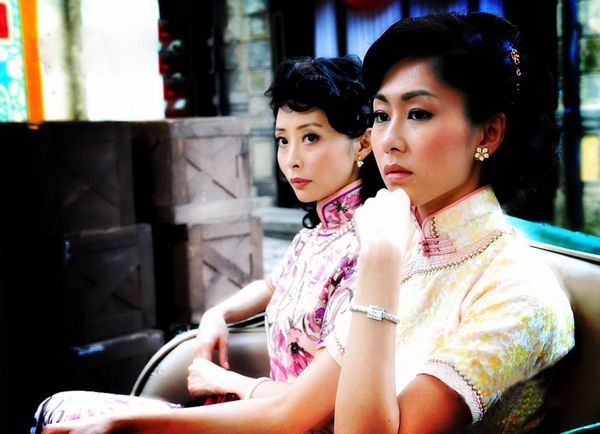

# ＜天权＞有关于民国时期西南塔山的夜莺裙子革命事件

**夜晚来临，在百岁老人的卧室里，女人们以各种理由聚集起来，展开了临时会议。焚烧裙子的法令将在明天开始，一场革命势在必行。塔山所有的女人前所未有的一致，一种古老的空前紧密的情感将她们联系在一起，走出房间时，月色这么明亮，街道如此安静，狼群在远山呼唤，她们都热泪盈眶，一夜无眠。**  

# 有关于民国时期西南塔山的夜莺裙子革命事件

## 文/汪海鸣（上海戏剧学院）

那是中国历史上极为混乱的年代，同时有三个政府分别在北部，东南，西南各自为政，每天在不同地方都有几十起大小起义，最多的一天四月八号达到了史上的高峰121起。内乱外侵达到匪夷所思的境地。即便是最洞明的学者和政治家也不免疑惑起来，在报纸上开始了另一场战役，最后报纸也不可信了。最闭塞的地区也遭遇了炮火的威胁，而不得不使用马和鸽子来获取情报。

每一分钟局势都在变化，家里每时每刻都保持着至少一个清醒的人，女人们主动担负起这一重任。并非是塔山的女人们更为勇敢，实在是塔山的男人们好酒嗜睡，即便是战争最激烈的时候他们也因为迷糊而错过了重要的情节。当时政权最盛的三个政府都宣称过要占领西南，塔山的女人们必须将国旗藏在最隐秘又最顺手的地方，以便当新的军队入侵之前及时换上合适的门面。

于是她们干脆将国旗当成围裙系在身上，或者把孩子放在里面，折起来，往背上一放，对角系在胸前，按照喜好为三面国旗找到合适的归属。男人表达政治的方式除了像个赌徒一样互相诅咒，谩骂几乎没有别的方式。然而在塔山镇，女人对政治的见解更直接而富有诗意，她们发明了一套只有女人和孩子可以理解的政治语言。倘若你不了解其中的隐喻，还以为这帮女人在讲童话故事。

比如，她们用猫头鹰，夜莺，黑鹰来命名这三个政权。这些名字比那些复杂的名字流传更广，以至于当局者们都开始以此自称。

黑鹰是一群来自北方的蛮汉，对外战争最初爆发时他们是第一群站出来的勇士。他们个个神通广大，目光如同火炬，赤手空拳可杀死十个带有武器的敌人，一度在北方形成一个坚不可摧的领导集团，人们追随他们如同宗教一样痴迷。然而当对外战争缓和时，人们很快发现他们对占有政权并不感兴趣，以至于暂时恢复和平时，他们居然解散回家了。

塔山的女人们并没有亲眼见到黑鹰的成员。她们认定那是一些身高两米，会活吃母鸡的怪物。有一张大理石一样冷漠严苛的面庞，在战场上可以像捉住小鸽子一样把敌人的脖子拧断，手臂上青筋暴起如同青蛇，对女人粗暴鲁莽，嗓门像一口洪钟。当北方的大胜不断传到西南时，早就成了新版神话故事。当听说黑鹰不会占领全国时大概不会有比这帮女人更开心的了。西南因为成为最后一块完全没有被占领的处女地而成为公开掠夺的筹码。早有密报声称在这次战役里他们不会松懈。大部分女人将代表黑鹰的旗帜系在腰上，成为一种习惯，这种旗子使用大面积的冷色调，在灶台前成为很好的防污利器。

与此同时东南开始的一种秘密的地下组织正沿着海岸线大肆兴起。他们可都是些漂亮的小伙子，据说行动的暗号是接近夜莺歌声的口哨，于是这些来自大海边的水手便被称为夜莺。这些水手在一次起义里出奇制胜，推翻了码头暴政，在历史上记下了狠狠的一笔。女人们都想委身于这些皮肤油亮，面容俊美的夜莺，尽管她们什么也没说，在男人们大肆嘲笑这些乳臭未干的革命者时也没有丝毫暴躁。然而只要看看夜莺的旗帜竟然是很多女人的抹胸就知道了……

所以当夜莺们准备袭击占领这个小镇时，他们手执武器埋伏了三天三夜，最终因为粮食匮乏走上街头。和他们预料的恶战相反，街头被一股奇异的清香充斥着，夜莺的首领很快带领水手们紧急撤退。他们认定了这是塔山的一种战略，善用草药迷香的西南早就设下了十面埋伏。倘若他们知道这是那些多情的女人早早把胸上的旗帜解开，挂在门前，这场占领塔山的战役的命运将在历史上改写。

夜莺们只得继续待在山里，等待时机。当一个站岗的士兵因为换班的迟迟不来而发出夜莺的歌声时，一个女人出现了。这是一个皮肤黝黑发亮，脸盘饱满的早熟的姑娘，穿着一条灰色裙子，一条夜莺的旗帜系在胸前，为他带来了食物。这个美妙的黎明以后，几乎每个士兵都和她发生了关系。换班的哨声响起，好像只是为了提醒一场约会。夜莺的首领终于在一团迷雾里否定了敌军使用美人计的策略，并且意识到也许占有塔山的女人，对赢得西南的战略部署更有意义。

这是一个民主的政权，因为这个没有先例的计划，他们用除了睡觉以外所有的时间用来开会，首先一个不会反抗的敌人存在么？不存在敌人也就不存在战争，不存在战争也就不存在和平，不存在和平也就不存在胜利，荣誉，那么这个行为还有意义么？如何相信一个女人？

塔山姑娘参与了会议并肯定了方案的合理性和可能性，甚至暗示了早在夜莺来临前他们就无条件归属的意愿。女人参与政治将改写历史成为最具争议的话题。塔山姑娘坚持，在历史进程中，女人一直都是主导力量。没完没了的会议引发了更大局面的思考和讨论。在最后一次会议中，论点已经上升到宇宙学，社会学，人类学的范畴里，以至于塔山女人从祖母那里听来的历史和水手从大海里获取的哲学僵持不下，最后不了了之。塔山女人气氛地走开，诅咒夜莺是一群无所作为的男人。

正在山里的会议召开地如火如荼时，塔山唯一一个酒馆里，一个长着一个大肉鼻子的男人终于在酒醉和睡梦里清醒过来，发现整个村子都在讨论自己的女儿离奇失踪的恶性案件。男人们一边喝酒一边闲聊，他们猜测女人被附近埋伏的夜莺抓走做了人质，而那竟是三天前的事情了。这个小个子秃顶男人一跃而起，冲回家里，刚到门口，就被老婆跳起来上下扇了好几巴掌。肉鼻子先生火速放走一只灰鸽，联系黑鹰政权前来拯救塔山。

这个举动是危险的，夜间出没的猫头鹰政权的暗探几乎以获取情报为乐。在黑鹰和夜莺，以及其他一些起义肆虐时，他们唯一的爱好就是抢劫。路上的马，空中的鸟，好吧，猫头鹰政权最初其实并不想卷入这场纷争，他们只是一群活跃的积极的土匪。有一个没落的书生作为军师，有严重的偷窥癖和收集癖。他曾研究过每个土匪的身材，尺寸，并且毕生都在研究男人的鼻子对女人的性吸引占据着如何重要的影响，倘若不在战乱年间，他倒是很有可能成为一个先进的知识分子。在情报最密集的时候，猫头鹰们每人每天可以吃到一只火烤乳鸽。书生在收到情报时对时事有了全局性的掌握，直到看到塔山向黑鹰求援时才知道火候已到。但显然他没有将情报放回原地再放生的习惯，所以黑鹰，夜莺们常常对收到偶尔漏网的信息匪夷所思，最终产生严重的内讧，这才是他们最后走向悲剧的实质原因。那天书生放走了唯一一只灰鸽子，这个小东西得以逃脱火烤的厄运，而到达了千里之外的黑鹰手里。

书生走出山洞，站在一水池里嬉戏打闹的土匪面前，指点江山，他昂起头说，猫头鹰们，是时候了。

他们火速向西南赶去，等着夜莺和黑鹰两败俱伤时坐享其成，这群土匪因为行事果断，凶残暴虐，在路上就臭名昭著，很快就成为和黑鹰，夜莺并列的第三大政权，代号猫头鹰。

最遭女人们嫌恶的猫头鹰旗帜，往往作为包裹孩子的布兜系在背上。所以当决定性的时刻来临时，猫头鹰们直到将塔山游览了三遍，都找不出这奇怪的浓烈的尿骚味究竟从何而来。

书生其实成为了猫头鹰们幕后真正的领导者，这个懦弱的守旧的孩子满怀着报复社会报复女人的阴暗心理，制定了一系列严苛法令。这些恐怖政策旨在压制民心，并不想造成大规模伤亡。其实政策最初的尴尬在于土匪们准备血洗塔山时，发现塔山的男人们都像小鸡一样温顺，完全没有抵抗的意思。而那些捉摸不透的沉默的女人，则躲在家里足不出户。

这些出自保守派的法令引起了轩然大波，其奇葩，恶劣程度以至于让人们当成了一种笑话而直接忽视了。比如最受诟病的裙子法令。他们认为塔山的女人们穿着太过放荡，为了彻底杜绝这种恶习，6月8日一清早，猫头鹰们便挨家挨户搜走所有裙子，扔在村头祭祀的广场上，准备一场大火焚烧殆尽，以示警告和决心。

猫头鹰们很重视这场以裙子法令开始的坚固政权的政策。他们将以此作为宣布公开占领西南的仪式。这场突如其来的暴动使人们意识到，那些布告上不可能的关于头发，指甲，细节到公共场所走路姿势的法令都将以暴力的形式一一有效展开。

男人们一如既往地忍受着，对于他们来说，这些法令的威力只是一场游戏，博取酒馆里的几声哈哈大笑了之。至于让女人们大为不满的裙子法令，他们可真觉得为此发火抱怨简直是大题小做。塔山的女人们愤怒了。

一个将近一百岁半死不活的高龄女人躺在床上，听到裙子法令时产生了一种回光返照的激昂情绪，当猫头鹰们搜索裙子的声音在院子里响起时，这个女人高声咒骂的声音可以一直听到大街上，从来没有这回事。不让女人穿裙子？从来没有这回事，我活了一百年了，什么样的女人我都见过，但没穿裙子的，头一回听说！

当时那个闯进夜莺丛林的女人早就安全返回了，她又被一种新的愤怒击中了。她找到邻居，一个嗓门尖利的女人家里打听风声。这女人都气疯了，她男人正在努力把肥大的肮脏的裤子往她赤裸的下身上套，她红肿着眼睛正在摔东西，又抓又咬，要我穿你这玩意，你他妈想都不要想！夜莺姑娘得到了满意的答案，她沉默地走进下一家。

夜晚来临，在百岁老人的卧室里，女人们以各种理由聚集起来，展开了临时会议。焚烧裙子的法令将在明天开始，一场革命势在必行。塔山所有的女人前所未有的一致，一种古老的空前紧密的情感将她们联系在一起，走出房间时，月色这么明亮，街道如此安静，狼群在远山呼唤，她们都热泪盈眶，一夜无眠。

清晨，一切准备就绪。书生站在广场的象征神的雕塑台子上，猫头鹰们列队站立，男人们端着饭碗看笑话，他们以为这些女人都躲在家里哭鼻子呢，他们互相说着自己的女人如何穿着难看的裤子在床上不愿出门，甚至有的干脆赤裸，以此抗议，表明绝不穿裤子的决心，人群不时爆发出一种下流的笑声。甚至昨天晚上女人的集体失踪事件，也被认为是抱在一团大哭的闹剧。火把已经点燃，书生宣布，女人穿裙子的时代结束了。

就在这时，一个穿着夜莺旗帜的姑娘从远处走来，巨大的夜莺旗帜围成了一条裹住身体的连衣裙，勾勒出饱满的胸脯和细细的腰肢，露出高傲的脖子和小麦色的脚踝，赤裸着双脚，披散着头发，眼睛里闪着挑衅的光，一步一步向人群走来。

猫头鹰们都看呆了，好一会儿才反应过来应该抓住这个女人。肉鼻子正在呵呵傻笑着，突然一个激灵认出来这是自己亲闺女，在身边的好邻居一把按住他时，猫头鹰们同时抓住这个女人。

夜莺姑娘的身体如此富有弹性，以至于他们不管抓在哪一块都禁不住一阵战栗。她双脚腾空，挣扎着发出的呻吟更让他们心醉神迷。土匪头子咽了一下唾沫，对书生说，穿裙子这条，还是废除了吧。书生也在神魂颠倒里不知所云。就在这时，更多的女人走出来了，每个人都穿着夜莺裙子，源源不断涌向广场中央。直到最后，百岁老人在塔山姑娘们的搀扶下，颤颤巍巍地在队伍末尾出现，书生的眼睛从一个看向另一个，被催眠一样不知该怎么办，他闭上眼，又睁开眼，大叫了一声，夜莺！

猫头鹰们反应过来，开始放起枪。这不仅仅是一场反对裙子法令的战役，这是一场赤裸裸的造反！一个姑娘中了弹，咚的一声倒下。赤手空拳的男人们开始骚动起来，并非是反对暴政，而是在夜莺们中间认领出自己家里的那一只，赶紧抓回去，局势陷入前所未有的躁动。枪声四起，不断有血开始在脚下蔓延。一些女人的裙子被扯开，赤裸着倒在广场上，被人群践踏。然而没有一个女人的哭喊和求救声出现，只有男人猪一样的喘息。塔山的女人并非勇敢，我早就说过，但这是一场关于裙子的战役，非比寻常。

这时那个夜莺姑娘跳上台子，把书生推下去，厉声吹出夜莺的口哨。很快从四面八方涌来山里的夜莺。年轻的水手们一举消灭了溃不成军的猫头鹰，在历史注定占领塔山的日子里，改写了猫头鹰的名字。

现在只剩下一个问题，就是肉鼻子放出的那只严重影响了历史进程的灰鸽子。灰鸽子纵然遇到如猫头鹰一样恶劣的土匪，还有子弹和炮火的威胁，但它终究尽职尽责地带着快烤焦的翅膀，直直砸到了黑鹰北方的大根据地。

几个打弹子的小孩捡到了这只鸽子，上缴到了黑鹰的办公室里。黑鹰的成员们尽管没有召开大规模的会议，但都不约而同地保持着一致看法。他们一边逗着孩子一边相互说，奇怪了，一个西南地区的小镇受到攻击，找我们干什么？

这个根据地早就成为他们另一个家园，女人们甚至种上了一些大葱和应季蔬菜。只有再遇到新的外敌入侵，家园受到威胁，他们才会全力以赴地参战。所以当猫头鹰们毫不费力地占领塔山时，他们的疑惑是一样的，那就是这是一个不会反抗的小镇。

撰写史书的人搜集了很多确凿证据，甚至塔山县志都详细记载了自历史以来唯一一次革命的细节。他们仍然认为这不太合宜，有失严肃，考虑再三，在此处略去了一千字。关于当时如此兴盛三个政权，只有“民国廿年，曾有代号猫头鹰，黑鹰，夜莺三个较大的政权，一年间就覆灭了。”短短29个字结束了这一历史。

随着塔山最后一个女人的去世，他们终于自己也开始怀疑这场革命的真实性，而夜莺的旗帜就在箱底放着，成为讲述的道具，而那终究是一面旗帜，他们甚至忘记当时是如何穿上去的。至于塔山的男人们，黑鹰，夜莺，猫头鹰，裙子革命，还有更多占领塔山的政权，他们什么也不记得。在其后众所周知的更大一场浩劫里，这些旗帜最终也被完全毁灭。

然而这段历史不应该被忘记，这群勇敢的女人告诉我们很多，其中一条看起来似乎是，女人是会为漂亮裙子，引发一场革命的。

（采编：何凌昊；责编：何凌昊）

 
