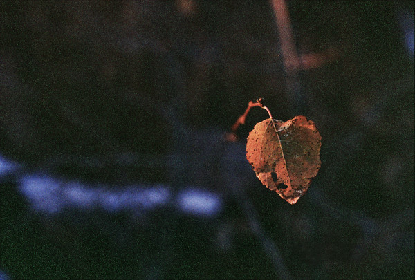
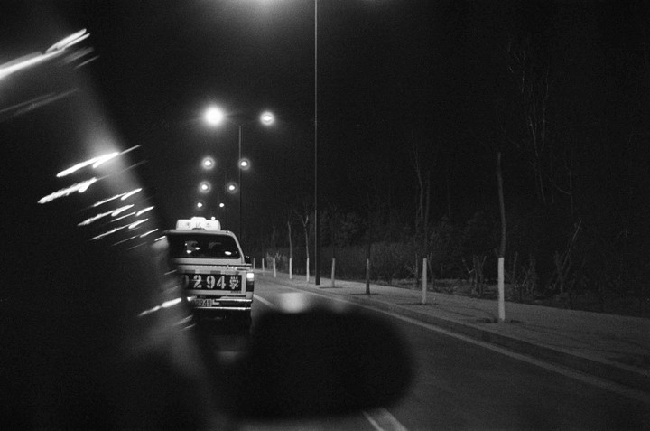

# ＜天权＞末世。寒

**少年已经缓缓移到路中间。这时驶过来一辆红色标致，少年惊恐地躲到一边。盯着远去的跑车，大口地喘着粗气。他的眼睛周围形成了黑色凸起。眼里充满莫大的恐慌。他害怕红色。** **少年再一次试图移向对面的饭店。门口的老板娘看到了他，一脸厌恶地挥挥手，“走开，走开！”他已经讨遍了这条街上的每一家。大家开始会笑笑，后来冷着脸，再后来直接赶他走。**  

# 末世。寒

## 文/马晓敏（安徽财经大学）

 

**题记：活着，真对不起。**

1983年1月1日凌晨，我死了。

在北海道南面有一条纳川河。河的周围是一些稀疏的破旧公寓。年久失修的木制楼梯，踩上去吱吱咚咚。特别是在冬日，大雪，寒风，黑夜，躺在沙沙作响的公寓里，你会感觉非常孤独。

就在纳川河下游不远处，有一条非常热闹的街区。一排排低矮的木板房挂着各式各样的店牌。拥挤不堪的街上，弥漫着一股呛人的油烟混杂着腐肉的味道。男人的吆喝声，女人的谈笑声，路人的争吵声，汽车的喇叭声……会让耳膜突然加重负荷，头晕目眩。

街上的人都认识一个人——一个讨饭的少年。土色的粗布上衣和肥硕的黑色裤子。长而油腻的头发凌乱地遮住苍白的脸。他正微闭双眼，斜倚在窑洞边休息。

他的家就在纳川河最上游的公寓里。那座老式的二层木屋。房前的晾衣绳已经成了鸟儿歇脚的地方。秋天，房顶上盘旋着一群乌鸦。暗哑刺眼的叫声，像在一首亡魂曲中欢呼鼓舞。母亲走后，父亲再没笑过。而自从父亲去世，他整整一年没回过家了。

时间已经到了中午。街上变得更加拥挤。强烈的阳光照在街上。远远望去，像一口沸腾的锅，冒着蒸汽。汗水浸湿了人们的衣衫。所有人都变成了鱼，为了脱离腻滑的街道，焦躁地游走，寻找可以停留的饭店、旅馆和小卖铺。然后迫不及待地一头扎进去。

当饭店开始往路边的排水沟倒剩菜的时候，少年艰难地支撑起身子，慢慢地移到路上。他太虚弱了，虚弱得好像随时都可能死掉一样。就像三年前，活泼得如同清脆的风铃草，带给整个世界无尽的欢笑。

那个时候，天还很蓝。时常会有大团大团鹅黄和乳白的云朵飘过。他和伙伴们奔跑着，跳跃着。躺在柔软的草地上，伸出手去抓那些漂亮的云朵。日暮西斜的时候，母亲温柔地呼唤。直到现在，梦里依然会出现。

少年已经缓缓移到路中间。这时驶过来一辆红色标致，少年惊恐地躲到一边。盯着远去的跑车，大口地喘着粗气。他的眼睛周围形成了黑色凸起。眼里充满莫大的恐慌。他害怕红色。

少年再一次试图移向对面的饭店。门口的老板娘看到了他，一脸厌恶地挥挥手，“走开，走开！”他已经讨遍了这条街上的每一家。大家开始会笑笑，后来冷着脸，再后来直接赶他走。

可是他哪儿也不肯去，整日就睡在窑洞边。似乎在等待着什么。

冬日，纳川河荒凉而阴沉。

雪没日没夜地下。彻骨的寂寞与寒冷。

商店的格子窗透出五颜六色的光芒。橱窗飘出烤肉的香味。还有带着黑色线衫帽大声欢歌的孩子们。整个街道散发出五六十年代摆着圣诞松树、按着马车铃声的英国小镇的欢快。

只是。这个世界，与我无关。

世纪末的最后一夜，我听到你们温暖的声音。睁开眼睛，前面空无一人。

活着，真对不起。

1981年12月31日晚22:32分，北海道发生一则交通意外。一名中年男子在穿越街道时被一辆红色汽车撞出几米远，当场死亡。初步确认该男子系自杀。具体情况警方正进一步调查中。

——摘自《早间新闻》

 

（采编：佛冉 责编：黄理罡）

 
