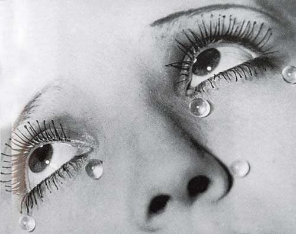

# ＜天权＞杀死我们的东西，一定是光鲜甚至美好的

**不管“提高自己”这样的理由有多么堂而皇之，也无论学识、修养、阅历这些东西有多么浸满褒义，只要抱着“得到”的心态，就终究会陷入到漫无边际的欲望泥淖中，死于追求更多的拥有。唯有“放下”，享受做这些事的过程而无所求，那每一点细小的收获都会变成惊喜——因为原本不期得到。** 

# 杀死我们的东西，一定是光鲜甚至美好的

## 文/ 李飞（中国政法大学）

 

接到一个朋友打来的电话，说想去拉萨。潜意识里，我觉得，在这个季节突然想去拉萨的女孩子，一定受伤了。于是，大致说了两句“现在不是合适的季节”之后，我很小心地问起她所在的那个城市也开始冷了吧？不出意料，话题自然地过渡到这两年来她在那个城市的生活——无比光鲜，却并不好...

在一起上学的时候，我们不是很熟，相互了解也不多。毕业之后更是来往甚少，几乎陌路。于今，这反倒成了她能够放下所有顾虑，把一切苦恼都倾诉出来的理由：像是说给一个陌生人。 

几年前，那时她还在学校。男生们都认为她长相很不错，性格也不差，气质、修养之类的也没有减分，总之，是很招人喜欢的。但是她一直没谈恋爱，似乎也从未听到过她聊起这方面的事。她很上进，有读书的习惯，单是这点就很令人钦佩了——我对她的了解也仅限于此吧，如果没有今晚这通电话的话。

她说，她其实很向往这样一段感情：在众多优秀的追求者中选择了那个风光无二的，开始了自己幸福、别人羡慕的生活。她很依赖物质，喜欢衣服、鞋子、首饰、皮包...所以她当年努力学习，如今努力工作，希望自己可以支撑这些。我知道她并不浅薄，从她的书单里就可以看出来。所以，突然了解到她对这些东西的向往程度之甚，我还是多多少少有些意外。说起来，她甚至很文艺，喜欢诗、会画画、看小众电影，收集一些精美的明信片。我觉得，她现在的修为和收入完全足以保证她在物质女皇风和清新文艺范儿之间自由游走了。要命的是，她真的有一大把优秀的追求者，其中那个最风光的她也很满意：从外到内的匹配，很爱她而且给她的物质菜单上添了两道硬菜：房、车。 光鲜生活的结果却是，她越发觉得无聊了...大把的奢侈品和一本好书都不能让她觉得满足，一堆的追求者和一份感情也无法取悦她，总觉得似乎还应该有更完美的生活，却又不知道那会是什么样子，徒生苦闷。这种情绪一点点地堆积起来，越堆越高，一直到今天她觉得像青藏高原一样高了，便决定去拉萨试试能不能把这堆烦恼卸在那里。

我没说什么，岔开话题问她是不是读过福楼拜的《包法利夫人》。她说没有，但是知道故事梗概：一个叫爱玛的姑娘嫁给了夏尔•包法利。夏尔爱她、宽容她、守护她、同时也善良、有能力和修养，是个模范丈夫。但是爱玛总觉得不对劲，她想象中的婚姻生活应该更加光鲜、美好。两人受邀参加侯爵家的舞会，开始了爱玛走向死亡的路：那物质与情欲的盛宴，彻底激活了爱玛潜意识里对更光鲜亮丽的某种东西的追求。很快，她慢慢记不起舞会上具体的人和物，但是那种场景却化成一个光点，指引她一直走向黑暗。爱玛开始关注巴黎上流社会的生活，订阅《沙龙仙女》，了解赛马、剧院、宴会，也看起欧仁•苏和巴尔扎克的书，辞掉了老佣人，教导新来的女仆如何以上流社会的礼仪来服侍她。当她愈发强烈的物欲和情欲一头撞上其所居住的乡村小镇的宁静，那种压抑感便一阵阵扑过来。深爱爱玛的夏尔，为了她而选择了搬家，却不幸地将两个人推向了更深的泥淖。爱玛在强烈的物欲和情欲下开始出轨，商人勒乐所象征的物质、莱昂和罗道尔弗所代表的情和欲，在爱玛看来，无限光鲜、美好，并最终将她置于死地，在债台高筑伤痕累累之后服毒自尽。而在这个过程中，夏尔始终是一个无可指摘的道德模范和完美丈夫，却也是刽子手之一。

那些被物质和情欲压死的女人并不少见（男人或许更多），像莫泊桑的《项链》中所写的玛蒂尔德，被一条假项链夺去了几乎一生。而包法利夫人的特殊性在于她是一个有良好的教养，读很多书，有知识也有品位，并不肤浅的女人，命运却比玛蒂尔德更悲惨。

我问她知道这是为什么吗？或者更具体点：为什么不管怎么提高自己都走不出物质和情欲，仍痴迷于貌似美好的光鲜？

她说这就是她想去拉萨的理由：试着找答案。我想了一会儿，还是把自己的回答咽了回去，或许她可以找到更好的。提醒了几句注意事项之后，我建议她不妨带一本《包法利夫人》上路，也“不沉”... 挂了电话，我想了想，给她发了条短信：“去吧，不是最佳的季节，却是最好的时候。”

朋友，祝你好运。等你回来时，我希望拿我的答案，换你的。 

读书、旅行、绘画、看电影以及收集明信片，都是好事，知识、修养、品位也都是好东西，但是，这些并不必然使人走出欲望。那关键的，似乎应该是接近于“境界”的东西：贵无不贵有。很多人，比如爱玛和这个朋友，在拿起一本书之前，就已抱着“得到”的心态：通过读书，获得千钟粟、黄金屋、颜如玉、车马如簇。如此，书读得再多，也终究拜倒在物质和情欲面前。还有些人，做诸如读书、旅行之类的事，并不为了换取物质和感情，而仅仅想多获得些知识和阅历，提高自己的修为——这貌似可取，事实上却更加危险。苦恼的是，尽管危险但又是必经阶段。原来，我曾给自己列出了希望拥有的完美人生，其中一项是有完整的知识结构和丰富的人生阅历，然后获得罗马诗人琉克里休斯所说的一种乐趣：“站在岸上静观海上的船只在风浪中颠簸是件趣事；站在城堡的窗口俯视下面厮杀的场面也是件趣事；但站在真理的高山上看底下的人，有的误入歧途，有的浪迹四方，忽而漫天迷雾，忽而风云变幻，这种乐趣更在其他乐趣之上。”后来，幸运的是，无意中意识到企图爬到那真理的高山上向下看，本就误入歧途了。不管“提高自己”这样的理由有多么堂而皇之，也无论学识、修养、阅历这些东西有多么浸满褒义，只要抱着“得到”的心态，就终究会陷入到漫无边际的欲望泥淖中（只是这欲望显得高尚一点罢了），死于追求更多的拥有。唯有“放下”，享受做这些事的过程而无所求，那每一点细小的收获都会变成惊喜——因为原本不期得到。正如陶渊明“好读书，不求甚解。每有会意，便欣然忘食。”正因为不求甚解，没打算从书中得到什么，所以才真正体会到了读书的乐趣，“每有会意”都会“欣然忘食”。

冯友兰先生曾将人生分为四种境界：自然、功利、道德、天地。那最高的境界，人与宇宙融为一体，因放下一切而获得一切，看似一无所有却又无所不有，以尘埃之身最终觉解浩瀚天地。这是我们永远达不到的境界，但并不妨碍在某个时候做一件这个境界里的人会做的事——正如，人类虽无法在珠峰顶生活却可以登上峰巅看一眼那里的风景！

朋友，你一定会看到很多很多经幡，多么绚烂...而那看不见的风，使之飘动，每次招展都是与神灵的一次沟通...但是，如果你没这个信仰，那这一切也就没有任何美好的寓意了，仅是光鲜而已。 你如此聪明，一定明白在你现在的生活里，哪些是幡，哪些是风？！是不是还缺一个神灵？！

 

(采编：何凌昊 责编：尹桑)

 
