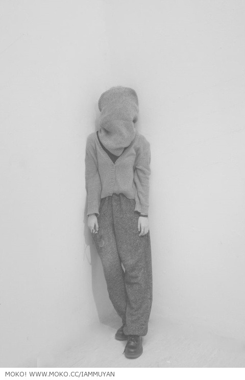

# ＜天权＞来和我谈一辈子的恋爱

**那时我会重新爱上你眼角的孩子气/后来我们在一座小城定居/我们是最寻常的夫妻啊等着老去/你不用费劲儿琢磨漂亮句子/可亲爱的你得像个诗人过日子/让我去斤斤计较红尘琐事**  

# 来和我谈一辈子的恋爱

## 文/汪海鸣（上海戏剧学院）

 

（图/[高木妍](http://www.moko.cc/IamMuyan/ )）

如果你有一辆房车，或者一艘船，我就跟你出远门儿 我们得养一只大狗，一只肥猫，亲爱的你得让我带一个豆浆机 我们可不能离文明社会太远 我给你洗衣服，但你要给我做饭，当然我可以刷碗 让我去学习一个女人应当会的一切 而我眼睛里的你，来学习如何做我整个世界

在城市里我们将遇到很多困难 比如在哪里停车或者船在哪里搁浅 我们得提防警察，窃贼，还有心怀不轨的流浪汉 还要善待口袋里的小钱儿 可有趣的陌生人啊倘若你有下酒的故事 我们不拒绝一起分享这甜蜜的夜晚 而在荒凉的旷野，我们一起爬出阳光倾泻的睡眠 离开彼此熟悉到厌弃的身体 像夏娃挣脱亚当的肋骨一样用力

野芹菜叶儿是薄荷味儿 今天你的左眼睛多了一层眼皮儿 有一只桌子腿儿长出了花骨朵儿 你把收集的种子四处乱丢啊 藤蔓把我们的家缠在了树上 我们把车从森林里开出时吓跑了车顶上一窝鸟儿

冬眠一场海藻和贝壳爬上了船舱 出来时我抱着我们的孩子摇摇晃晃 她说爸爸你快看哪有飞机飞往南方 于是这个偷懒的船长啊钻出来拎着一条鱼 眯着眼喊着我的小名儿

那时我会重新爱上你眼角的孩子气 后来我们在一座小城定居 我们是最寻常的夫妻啊等着老去 你不用费劲儿琢磨漂亮句子 可亲爱的你得像个诗人过日子 让我去斤斤计较红尘琐事

漫不经心和你唠叨着 等你说老婆子我们睡去吧 电视机里在播报晚间新闻 你偷偷吻了我一下 我低头看着洗脚水 藏红花在那悠悠开着 映着的白炽灯是一枚太阳呼呼睡着

（采编：徐海星，责编：黄理罡）

 
