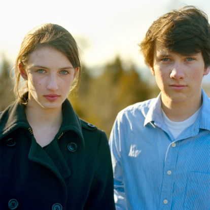
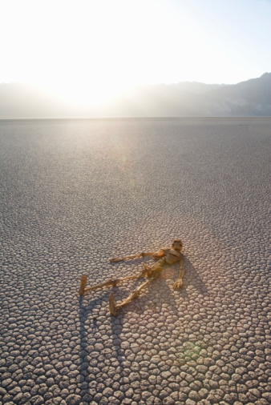
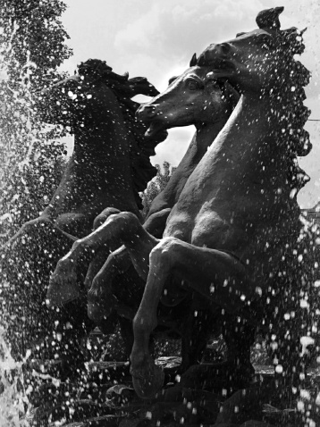

# ＜天权＞林大师又胡来了

**我眼睛里除了白光什么都没有。然而我看着你的眼睛。你的眼睛。你的眼睛。你的眼睛。你的眼睛。你的眼睛。你的眼睛。你的眼睛。你的眼睛。你的眼睛。你的眼睛。你的眼睛。你的眼睛。你的眼睛。你的眼睛。你的眼睛。你的眼睛。你的眼睛。**  

# 林大师又胡来了

## 文/林大师（Acadia University）

 

#### 十月十三日。我脑海里除了性什么都没有。

一个来自北方的姑娘。在北京做着平凡的工作。她住在自己姐姐家。坐地铁四十分钟到公司。每周休息两天。她工作的地方也有一群和她差不多的姑娘。她们都有了男朋友。她们笑起来都很美。她们的家都在远方。她们都在考虑着自己是否应该结婚。

她们每天都向彼此讲述着不一样的故事。这些故事一旦出口，就会变得异常模糊。模糊到她们再也记不起来。她们中午都带饭。大家用微波炉热完之后再坐在一起吃。

穿迷彩裤的女孩。穿绵羊外套的女孩。穿白衬衫的女孩。穿黑丝袜的女孩。穿牛仔裤的女孩。穿小西装的女孩。穿紧身黑皮裤的女孩。我看着这些女孩在我眼前出现然后消失。我脑海里除了性什么都没有。

巨大的悲伤降临了。它从天上掉下来，上一秒钟还是太阳边上的一个小黑点。下一秒钟整个城市都被笼罩在它的阴影里。然后一切又恢复了。没有人知道，这一下，世上所有的快乐都被砸死了。

一次漫长的交谈。一次深沉的大笑。一场失败的搭讪。一位苦逼的青年。“帅哥，要来我家玩玩么？”一个中年妇女在街上对我说。可惜我走开了。天黑了。外面的世界只剩漂亮的女孩儿和灯光。在地下的城市里，依旧灯火通明。不知疲倦的人们，不知疲倦的飞行。那飞行的步骤是这样：你先找个地方平躺。然后闭起眼，稍微数个数。然后基本上数到六十左右，你就发现自己飞起来了。

我和你们一起出现在这个狭小的通道里。只不过你们要比我快得多。你们流动着，以你们惯有的激烈。我站在激流的旁边，在那个近在咫尺的距离。辉煌笼罩着你们。我就是水上的舟。在这条灿烂的河里，我得了白内障。我眼睛里除了白光什么都没有。然而我看着你的眼睛。你的眼睛。你的眼睛。你的眼睛。你的眼睛。你的眼睛。你的眼睛。你的眼睛。你的眼睛。你的眼睛。你的眼睛。你的眼睛。你的眼睛。你的眼睛。你的眼睛。你的眼睛。你的眼睛。你的眼睛。

你们的眼睛那样看着我。

你们的眼睛那样美。

 

#### 十月十六日。飞逝日。

 

妈妈，我们能活多长啊？

唔，大概一百年吧！

一百年是多长啊？

唔，一百年就是三万多天。

那一天有多长啊？

一天就是两次睡觉之间的那段时间那么长！

妈妈。我们过了这三万多天之后是不是就死了？

啊，你可以这么说吧！

那死是什么呀？

啊，死就是一次长久的睡眠。睡到什么都不记得。

妈妈。三万多天太长了。我等不了了。我现在就想死！

啊，宝宝你过来。让妈妈看看你。

妈妈。真的要等那么长时间吗？

没关系宝宝。其实时间过得特别快。长大了之后就变的更快了。

有多快？

一闭眼就过去了！就像过山车一样。

你骗我妈妈！一闭眼一睁眼一百年就过去了吗？

真的！一闭眼一睁眼就过去了。一切都过去了！不信你试试！

好我试试！

女儿兴奋地闭起眼，两秒过后，她睁开眼睛。

发现自己站在一座墓碑前。

 

#### 十月十九日。坑杀日。

 

白起的腰弯下又直起。白起的手伸直再放下。白起面前的土从一个坑变成一座小山。

“哎？累不累啊大兄弟？"土山下的一个被埋了一半的脑袋说。

白起已经气喘吁吁，但还停了一下，笑着，然后微微摇摇头"没事儿。不累。"

土山下的脑袋说："哎！你们啊，这些年轻人，太不爱惜自己的身体！"

白起又笑了，放下铁锹站起来擦擦汗；"说点正事儿大爷，长平这地方有什么好吃的没有？我这光顾着挖坑，好几天没吃饭了！”

"那个，有啊！就长平东边有一个老田烤肉～可好吃了！是一个齐国人开的！还有那个，长平北边那里，有一个赵寡妇野味！那不光好吃！赵寡妇那两个大奶！呵！你真得看看去！再说那个长平南边，还有一个春秋食府！低价位，特实惠！我们以前中午饭经常在那儿吃。后来都快吃腻了！"

白起："别说了大哥。我快饿死了！"

土堆下那个头："这些啊都是我们长平特色。你呀，在这儿待了这么多年，居然都没吃过，算是白来了！"

白起："行了大爷。谢谢您了！我赶快吧您埋完了，然后好好吃一顿去！"

土堆下的人头："加油吧！"

白起弯下腰，又铲一把土。

画面下面出现一行字：长平会战。秦军坑杀赵军四十万。

小毛驴上驮着一个胖子。胖子坐在上面直喘。

小毛驴："将军啊，咱们这一去还回的来吗？"

将军："毛驴啊，你伴我左右征战多年。咱家是不会亏待你的！"

小毛驴："将军，汉军阵营还有多远啊？"

将军："前面，拐过去，那几个帐篷就是了。"

毛驴驮着胖将军来到那几个帐篷面前。

帐篷外面好几个人正懒洋洋地坐着晒太阳呢："呦！来啦？"

胖将军喘着："来～啦～"

"干嘛来了？打仗来，还是投降来？"

胖将军喘地更厉害了："君～君～咳咳！可杀不可辱。诸位，打仗不敢！老夫～咳咳！特来～拿诸位人头！"

几个人眯着眼睛看着驴背上喘着的胖子。面面相觑，谁都不着急。

"刚才！诸位！是～是历史学家让我那么说的。诸公莫怪，项某特来和诸位切～切磋。"

几个汉军呆呆地站了一会儿，其中一个反应快的人说："那咱们就开始吧。"

人们从地上捡来树棍和石子，开始朝胖子挥舞。胖子就是项将军，此时正用一根大木棍左右挥舞。驴子被石子打得嗷嗷直叫。结果一阵乱跑，背上将军摔下来。将军喊："啊！停！不带这样儿的！等会儿啊，等等！"大家都懒洋洋停下来等他。胖子艰难地爬回驴背上。大家继续心不在焉地挥舞。

画面下面出现一行字：项王某日独骑闯汉营。斩首千人。

山谷里七八个人拿着木棍咿咿呀呀追着四五个人打。

山上一个坐四轮车上的瘦老头摇摇扇子，一缕胡子说：大业可成矣！

画面下面出现一行字：诸葛丞相于祁山大败曹军。

长江里十几个人游来游去。在水里一碰到彼此就赤手空拳朝水里乱打一阵。还呲哇乱叫。后面的江上，两三艘破船着火了，正顺着水流往下流漂去。

画面下面出现两个字：赤壁。

万里无云。黄河南边有一匹马。马上端坐一个铁甲的青年。马下站着几个靠着武器站着的士兵。黄河北边有两匹马。马上坐着两个邋遢的人。两人手里有弓，一边从地上捡起树枝一边嚎叫着把树枝射出去。可是软绵绵地没什么力气。啪啪啪，好多树枝掉到黄河南岸的马上青年身边。

画面下面出现一行字：唐元年。秦王大破匈奴于晋内。

三五匹马驮着三五个戴甲的胖子在夜里举着火把追赶十好几个狼狈的步兵。

画面下面出现一行字：锦州战役。清军夜袭破明军三十余万。

历史的真相永远不会被人知道。

知道的人都死了。

只有一个人例外。

那就是我。

 

#### 十月二十六日。陈必匕，这城市最酷的傻逼。

 

陈必匕是这座城市里最酷的傻逼。

他的步伐那么稳健，每当他摔的时候脸都会磕到地上。他的手指那么灵活，每当他敲键盘的时候手都会抽筋。他的反应如此灵敏，每当他面对飞驰而来的车辆都会残疾。而且他还那么豪迈，那么幽默，那么细腻，那么文艺，他的括约肌那么好……

陈必匕，风一样的男子。他出现在后街的路灯下。井盖中渗出的白汽是为了烘托他而存在的干冰。他风骚地移动着，与白汽交替出现在灯光下。有人说他那天走的是猫步。另一个人说你懂什么呀！那是MJ在91年那部MTV中的MOVE！

陈必匕是一个特别严于律己的傻逼。但从他十多年不穿内裤这个细节上，人们不难看出他对自己的要求是多么严格。不光如此，陈某每天出门要戴可赛的头盔。并且每天把自行车当成摩托车骑。这主要体现在他骑车过程中一直用嘴模仿摩托车声音，而且还把车骑到机动车道上。

在台下少女几乎昏厥的叫喊声中，陈必匕随着剧烈的爆炸出现在水晶舞台上。他穿着黑色的西装，白色的衬衫。戴红袖标，穿白袜子。随着音乐的节奏。他把手放在自己裤裆上开始一下下前后舞动。

陈必匕在地铁的人群里抱着一个少女。少女的头埋在他的肩膀里。他则用脸小心地蹭着少女的长发。一会儿，他侧过头，看着少女的清澈的眼睛说：哎。我湿了。

三十年了，在陈必匕众多不改的习惯中，每晚穿著三K党套装在激情视频网站吓唬手淫男性这个习惯正如星空中不朽的北斗般成为他又一个严于利己的实例。

陈必匕在早上六点，开门的第一时间冲进广场上神明的行宫，然后他跳上水晶棺就开始跳舞。五分钟后他的演出结束了。五个军人把他带进一辆武装车辆。陈某消失了十好几年。

陈必匕站在监狱的二层小楼房顶张开双臂。他准备试验自己新研制的人造翅膀。结果他掉下去了。摔断了肋骨。他语重心长地对前来探望他的警卫说，如果房子再高两层，我定成功。

陈必匕把自己关在房间里。并把将要坏掉的蔬菜和肉倒进搅拌机。然后哗啦啦一阵，所有东西成为稀泥。陈必匕拿起搅拌机，喝个精光。到了吃饭的时候，他从冰箱里恭恭敬敬端出一大块方方正正的冰，拿来刀叉，开始切食。

陈必匕一洗内裤，上帝就发笑。每到这个时候，他的眼中就放出光芒，显得特别兴奋。可见是个爱干净的孩子。有一天陈必匕发短信告诉我说：每一个文艺青年都应该做出一些文艺的行为来把自己和普通青年及二逼青年区别开。

我说你打算怎么做呢。

挤满人的公共汽车，陈必匕突然站起来说：大家好。我给大家朗诵一首诗歌！众人骇然。五分钟后，他被捆起来放到公车前面的地上。结果因为世态炎凉，没有人抱他起来。他被过往车辆压了两次。

城管面包车后门被拉开。六个城管看见外面站着一个人。陈必匕说：城管同志，我给你们朗诵一首诗歌！当天晚上焦点访谈：执法人员群殴文艺青年五小时之久。过路行人无一相助。

陈必匕走过所有圆滚滚的胖姑娘时都会跑过去拥抱并且亲吻她们。"姑娘，你真美！"他微笑地说。而当陈必匕路过苗条的漂亮姑娘时，他会把她们的小内裤扒下来并且再套回她们头上。尽管这行为看上去有些粗鲁，但其中没有多少色情的成分。

 然而更糟糕的是，陈某出行，身上一定会带一支大黑笔。就是那种可以往白色黑板上写大粗字的那种黑笔。然后他会拿着笔，在他行走的过程中边走边写。他写的是诗。于是诗出现在墙上。车玻璃上。地砖上。路灯灯杆上。台阶上。性病小广告上。还有人们的衣服上。有些人身上会带上陈必匕的几个字。有些人则会被写上一整首诗。每到上下班高峰，陈必匕就乐了。"嘿嘿。这么多纸啊！" 

现在陈某的这种往路人身上写字的行为已经有名字了，叫做纹绘。据淘宝最新报价，现在陈某这些写在人身上的字在网上已经卖到五块钱一个了。我见过不少姑娘在人少的角落里褪下她们的丝袜或露出肩膀，彼此攀比陈必匕在她们身上留下的字迹。

陈必匕通过使用颤抖疗法治愈了几十例前列腺炎患者。

陈必匕在装逼年代里依旧坚持每日晨勃。

陈必匕用下流的语言赞颂纯美的情感。

如果这还不够的话，陈必匕将用他整体的傻逼填补你最后的空虚。

  作者人人主页地址： [http://www.renren.com/profile.do?id=234146417](http://www.renren.com/profile.do?id=234146417)  

（采编：应鹏华；责编：麦静）

 
