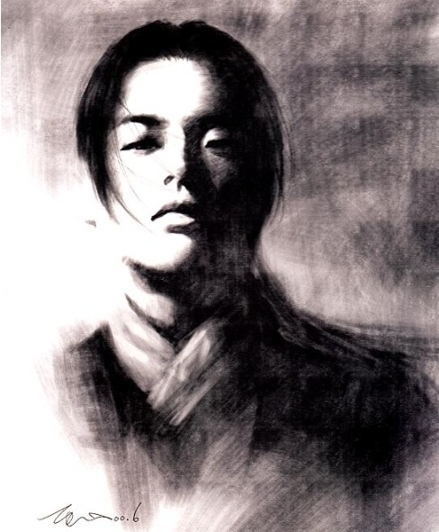

# ＜天权＞林平之的自我完善之路

**长久以来，林平之第一次陷入了自我怀疑。林平之想不明白，为什么武功就那么重要，为什么一定要有缚鸡之力，有大侠气概才可以合法地和小芳做爱。为什么这个世界上的人都在追求天下第一。天下第一很牛逼吗? 天下第一就可以心安理得地睡小芳吗？**  

# 林平之的自我完善之路

## 文/王悦翰(Emory university)

林平之的父亲是福州造剑局的局长。按照现在的说法，官拜正厅级。林平之算是一个不太够格的富二代。他的朋友们坐八抬大轿，骑汗血宝马，他只能骑驴。他的朋友们每天出入八大胡同，不用花钱预订也能坐卡座。他只能每天到小树林打猎。虽然日子过得穷酸了点，但是比起寻常百姓，林平之还是能感受到封建主义带给他的优越感。

林平之天生丽质，小白脸，浓眉大眼。他娘说生下来就算不吃奶也要抓着她的乳房，是个淫坯。林平之热爱自己简单的精致的小生活，从来没为什么事儿着过急。他从小就知道，有些事儿他就算奔了一辈子也成不了。这些事儿中就包括学会他太爷爷发明的辟邪剑法。 

林平之的太爷爷当初是个牛逼的人物，是江湖上当年最接近独孤求败的人物。大街小巷的半大孩子都学他的样子，粘两撇胡子，拿跟树杈别腰上，事儿逼呵呵的。明里暗里的姑娘都对他抱有不可名状的爱慕之情，盘儿亮的敢脱的就举个牌子写着林少侠你什么时候来肏我，羞涩一点的晚上行房事的时候闭眼幻想身上的不是自己卖猪肉的老公。

只可惜天妒英才，林平之的太爷爷27岁就死在了自家浴池里，和众多摇滚明星一起加入了27 club。对于林平之太爷爷的死，江湖上众说纷纭，普遍有两种说法。一种是林平之的太爷爷也是生下来就抓着林平之的祖奶奶的乳房不放，是个淫坯，最后死在了石榴裙下。证据是林平之的太爷爷赤裸的身上飘着九十九朵玫瑰花瓣，相当写意。与当今某些被情妇所杀的贪官遥相呼应。还有一种说法是林平之的太爷爷一生树敌太多，一山更比一山高，最终被少林寺的扫地僧级别的绝世高手暗中取了性命。证据是林平之的太爷爷身上没有任何伤口，但五脏均被震碎，法医把他的心脏取出来发现已经变成了饺子馅。 

不管怎样，林平之的太爷爷死了，天下还是一锅毛血旺，血雨腥风的。

一百年后，林平之的太爷爷已经成为传说，被各地武术学校当成门神，和萧峰段誉等人戳在一起，每学年初供新生瞻仰膜拜。同时成为传说的，还有那套惊世骇俗的辟邪剑法。

林平之一家三代单传，所以传承祖上的功业成了林平之生下来就被赋予的责任。传说当年林平之的太爷爷为了防止自己哪天遭人暗算特意写了一本辟邪剑谱交与林平之的爷爷。命他在自己死之前绝不可以打开。太爷爷仙去后，林平之的爷爷怀着心中的牛逼和胯下的肿胀颤巍巍的打开了那本辟邪剑谱，看了一遍就绝望了。估计林平之的太爷爷写这本剑谱的时候喝大了，里面充满了喝醉酒的大动物和各种怪力乱神，唯独没说怎么练剑。 

虽说扯淡，但林平之的爷爷和林平之的父亲还是跟着喝醉酒的大动物和怪力乱神把那套辟邪剑法给练了。功力可想而知，修行一生也只能对付一些喝醉酒的大动物。

林平之知道，学武，他这辈子是没戏了。

林平之心中也有牛逼，胯下也有肿胀。虽然成不了太子党，但也算是福州一少，走在街上也总有几个姑娘冲他抛媚眼。玩不起八大胡同，他也能安心搞洗头妹和站街女。林平之今年芳龄十八。面白唇绛，算是一等一的奶油小生。自从十五岁那年被街头的女流氓头头破了身，或者说十五岁就破了女流氓头头的身，他就知道了自己胯下那管阳具有着神器的法力。

林平之简单而精致的小生活就在那个炎热的夏天被打破了。

那年，他的父亲被一群蒙面黑衣人剁成了馅饼。那年，他遇到了一个姑娘。

林平之甚至没有感到多大的悲痛。放弃学武后父亲本已对他失望透顶，父子间再没讲过一句话。他甚至感到亲临历史的牛逼感，仿佛看到了他威震四方的太爷爷。林平之知道，江湖即将血雨腥风。一报还一报，尽管没人知道凶手是谁，但是打打杀杀总是无可避免。江湖就是这样，你可能死都不知道是被谁砍得。林平之也幻想过自己带领一群心腹忍辱负重最终为父报仇重振家业。他甚至偷偷买了黑帮老大速成经典《教父》三部曲用于坚强自己的小宇宙。经过几次勇敢而悲情的尝试后他得出的结论是别操你妈了，全鸡巴扯淡。

故事到这里应该有一个转折，正如所有好故事和坏故事一样，一个完整的剧本里不能缺少一个会让主人公心神荡漾的姑娘，就让我们暂且叫她小芳吧。

林平之第一眼看到小芳的时候就预感这个姑娘将来会和他有着千丝万缕的联系。尽管林平之十三岁就和自己的右手建立了超友谊的关系，十五岁就被女流氓头头破了身，那天晚上当他梦到小芳半透明的手和胸前一闪的奶光时，裤头还是湿了。接下来，正如所有故事一样，林平之很快便和小芳熟识了，小芳眼睛大大的，笑起来甜甜的。有时她会突然来到林平之的宅子里，他们会做爱，然后分别。林平之很快便适应了这种突如其来的艳福。进而，他开始等待。起初小芳一周不来，林平之便会焦虑不安；后来逐渐的小芳三天不来他便要踢猫骂狗；最终，目送着小芳离开的身影，林平之感到了一抹淡淡的忧伤。他悲哀的发现自己恋爱了。

他开始追求小芳。如果说现如今的姑娘们一心想钱的话，林平之的时代里，功夫就是钱。坐八抬大轿不如会打半套降龙十八掌。小芳坚定地认为林平之是个庸才，是个废人。因为他不会武功。小芳迷恋他的只是他的身体，确切地说，只是他的阳具。她曾经认真地说，如果他的阳具会跑，她会领着它头也不回地一走了之。

林平之恋爱了，他根本不知道，或者不想知道小芳到底是怎么想的。他能做的只有一次又一次满足小芳。这是一个悲剧。林平之有很多次在完事后对着正在穿衣服的小芳说“做我的相好吧”，小芳或笑而不语或娇嗔地使出一招化骨绵掌，顾左右而言他。终于，在林平之第五十次问她做我的相好的时候，小芳崩溃了。

她大声责骂着林平之的无用，手无缚鸡之力，没有大侠气概。她只是迷恋他的阴茎，无他，唯逼痒也云云。

林平之只是听着。

她骂了一个时辰，最后甩下十两银子说，“这钱就算是我补给你的，我们互不相欠，我不来找你，你以后也不要来找我了”。

林平之看到屋外有群鸭子慢悠悠地走过。

长久以来，林平之第一次陷入了自我怀疑。林平之想不明白，为什么武功就那么重要，为什么一定要有缚鸡之力，有大侠气概才可以合法地和小芳做爱。为什么这个世界上的人都在追求天下第一。天下第一很牛逼吗? 天下第一就可以心安理得地睡小芳吗？

林平之悲哀地发现自己是这个世界之外的人。在一个武侠世界里，没人会注意到一个不会功夫的人。林平之发觉自己站在一片沙滩上，前面是一望无际的海洋。可是他不会游泳。

想和世界作对的人，最终都会被世界无视。

但是，林平之还是想要和这个世界玩玩儿。他坚信把阳具插进土里也可以强奸地球。

在笑傲江湖的时代，全民公认的天下第一高手是一个叫做令狐冲的男子。此君不但深得华山派的精绝武功，更是会独孤九剑，吸星大法，少林易筋经等当世绝学。

林平之决定向他挑战。

潜心十年，练就辟邪剑法。气沉丹田，草木皆是兵器。

那年那天，京城惯例下起了沙尘暴。林平之甚至看不清这位令狐少侠到底是哪般相貌。他说：“出招吧”，话没说完就进了一嘴的沙子。林平之想了想，这次没悬念肯定要挂了。只愿小芳能有一天知道我不是个废人、庸才。我抱着跟丫死磕的精神与这个世界同归于尽。语毕，他把攒了很久的一口浓痰就着沙子吐向了滚滚黄沙。然后笑着闭上了眼睛。

剑花一闪。

林平之知道，以对方的内功心法和剑术，手起刀落斩下他项上人头和踩死只虫子没有本质的区别。林平之甚至没有感到疼痛，他的确不应该感到疼痛。因为令狐冲的剑从他喉结前一寸的地方划过，林平之毫发未损。

你丫玩儿我啊。这是林平之的第一反应。

“这位兄弟看来不怎么会武功啊”对方也不恼，甚至有些打趣。

林平之自是被人小瞧了去，狠狠地说道“我乃辟邪剑法创始人的曾孙，方才只是想测试一下阁下的功夫到底有几班了得，看来也不过如此”。

对方只是冷笑了一声，意思分明是你别吹牛逼了。

“请问这位兄弟为什么要来挑战，想必你也清楚你是赢不了我的。”

“我想追求牛逼。”

“比如被我戳几个窟窿？”

“或者死在追求牛逼的路上。”

林平之感觉对方笑了笑，那人接着问道：

“你知道我这把剑杀了多少人？”

“几百人？”

“每天几百人。”

“这世上那么多人想争这天下第一？”

“这得问你。”

“我不想争天下第一，只是想向一个人证明我不是个废人，庸才。”

“天下第一就算不是废人，庸才了？”

“至少天下人是这样觉得的。”

林平之不明白为什么对方不杀他反而跟他扯起淡来。

令狐冲接着说：

“这世上没有天下第一，当年郭靖黄蓉夫妇牛逼了大半辈子，最后不还是死在了襄阳城门口么？当你是天下第一的时候，就会不断有人来挑战，不管你多牛逼，最终还是会被愣头青们在身上戳几个窟窿。这就是天下第一的悲哀。”

“但是你曾经牛逼过，这就够了。我只想让她知道我也可以牛逼。”林平之说。

“她对你这么重要？”

“比命重要。”

一炷香时间。

令狐冲说“不如这样，我让你做这天下第一，正好我和盈盈打算私奔。背着这个名头，到哪都不得安生。但是你要想清楚，以你的功力，随便一个人都可以杀了你。你赢了我这个消息会在一个时辰内传遍江湖。也就是说，你还有一个时辰的时间，在被群殴致死之前，挑要紧事儿做吧。”

林平之谢过令狐冲，他知道，他只有一件事儿要做。

在去小芳家的路上林平之想了很多，他该和小芳说什么？或者还是什么都不说直接推倒？小芳会和他说什么？小芳会承认他牛逼了吗？小芳还迷恋他的阴茎吗？这些问题他一个都不知道，但是他明白，答案离他越来越近。

林平之这十年调理内息，也算学了点皮毛轻功。转眼间已经到了小芳家门前。

他敲门，门开了。一个半大小子仰着头看着他。

“我……我想找一下小芳。”他甚至不知道小芳的全名。

小孩儿嘿嘿乐了一声跑进屋里，林平之听的真真切切：

“妈！外面有一男的找你！还管你叫小芳呢！害不害臊呀！”

我操你妈，你丫生孩子了？！？！这是林平之的内心独白。

是的，这就是小芳，眼睛大大的，笑起来甜甜的小芳。

他可以原谅她，他知道他可以，只有不到一个时辰的活路了。他唯一能做的，就是让小芳知道他的心。告诉她一切，要她知道有这样一个人为她付出了一切，这很重要。

林平之不由分说的开始讲述他这十年是如何潜心修行，又如何赢了当世天下第一，最重要的，又是如何思念她。他知道自己时间不多了。他必须把他想说的话告诉她。只有这样，他才可以安心赴死。他如果死在令狐冲剑下，充其量也就是死在了追求牛逼的路上，但是现在，他将死在牛逼中，他将死在小芳的敬仰中，说不定，他还可以死在小芳的怀中。一片花瓣被风吹落，引得姑娘一抹相思泪。值了。

小芳听着他一遍一遍的讲着他有多爱她，笑着，甜甜的笑着。直到他讲完都没说一句话。确认林平之的告白已经结束，她轻轻的说道：

“这位阁下，”被称作阁下，林平之竟然不成器的脸红了。

“你谁啊？”

是的，她真的不记得了。小芳年轻的时候也是九龙一凤似的人物，睡过的男人以三位数计算，她真的不记得眼前这个男人是谁了。她的记忆甚至出现了扭曲，嫁做人妇以后，她一心相夫教子，与以前叱咤街头的时候判若两人。她真的不记得她曾经无数次的和眼前这个男人翻云覆雨。

林平之感到头晕目眩。

小芳开始讲述她如何意识到自己曾经叱咤街头是多么的幼稚。她说她后来嫁给了一个秀才，给他生了个儿子叫小刚。她又说小刚不像他爸，不爱学习，天天就想练武，当天下第一。她接着说最近猪肉又涨价了马车又脱轨了皇上龙体又欠安了她真的不记得他是谁了。

林平之的心碎成了饺子馅。

最后，他告诉小刚学武没用，还是握笔杆子吧。他祝小芳幸福，他祝秀才幸福，他说他还有事儿先撤了。

还有半个时辰。

林平之不懂这个世界上绝大多数的爱情都是单向的。小芳其实只是母狗转世，她从来不觉得林平之真的爱她，她只是把林平之当做了拜倒在她石榴裙下的众多大小流氓之一。其实她的判断合情合理。林平之不会武功，父母双亡也没有硬靠，除了只会说爱她以外什么也给不了她，是个标准的三无人员。凭什么委身于他啊？傻逼啊？林平之不懂，他坚信只要一如既往的投入感情，小芳就一定有一天会出现在他家门口。他潜心十年修行却不知道小芳其实早已不记得世上还有一个叫林平之的家伙惦记着她。这是个悲剧。

想和世界玩玩儿的人，最后只能被世界玩儿。

林平之知道，只有一种方法可以让小芳记住他，只有一种方法。

他对着镜子，脱下衣服，看着自己绝对算不上伟岸的阳具。

手起刀落，一地血红。

他把他的兄弟装进了一个盒子里面，盒子外面写上林平之敬上，把它放在了小芳家门口，转身走进了滚滚红尘中。他知道还有一件事没有了结。

林平之缓缓爬上了城楼。

还有一炷香的时间。

他已经可以看到江湖豪杰们从四面八方涌了过来，他可以嗅到空气里弥漫着血腥味儿和荷尔蒙的味道。少林方丈、武当道长、五岳剑派掌门、日月神教教主、青城派、五毒教……

他知道，这里面每一个人都可以要他的性命。

没有了下体的肿胀，林平之心如止水。

潜心十年，练就辟邪剑法。气沉丹田，草木皆是兵器。

他梯云纵飞下了城楼，涌进了人群中。

欲练此功，必先自宫。

风月千年，东方不败。

 

（采编：徐海星，责编：黄理罡）

 
