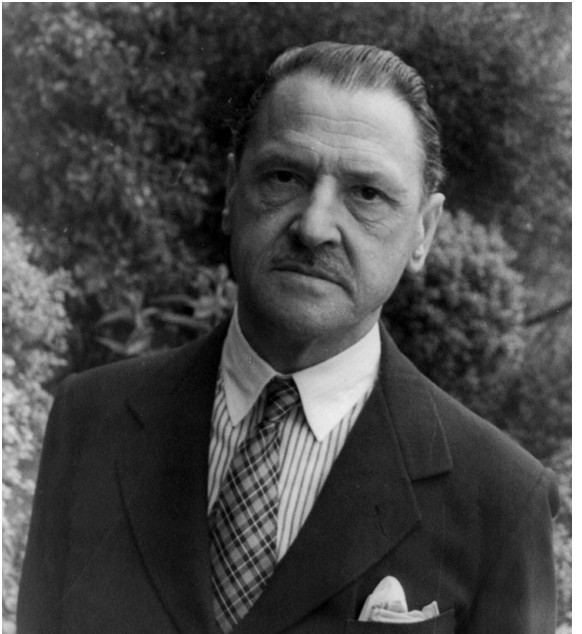

# ＜天权＞毛姆，你懂的

**他早有预感，这种终极疑难是毕其一生都难以解决的，所以他在一步步进阶为练达人情的智者时，也做足了自嘲的功夫：从创作生涯到个人人格，他的自嘲渗透了与不可逆转的命运有关的淡淡悲伤，一如“前言”的最后一句：“当我的讣告最终出现在《泰晤士报》上，大伙儿纷纷说：‘什么？我还以为他死了好些年了呢！’到那时，我的鬼魂便会吃吃窃笑。”话就是这样让他一个人都说完了，《作家笔记》教我们懂得了一个懂得一切的毛姆的一切。**

# 毛姆，你懂的

## 文/云也退

 

1916年夏季，东萨摩亚的帕果帕果港湾里泊着一艘名叫索默纳的蒸汽船，它原计划要开往西萨摩亚首府阿皮亚，现在被暴风雨滞留在此，于是在那船上，一位英国医疗传教士的妻子开始同一个四十开外的英国佬聊了起来。这位女士大谈特谈太平洋岛屿上的那些基督教的化外之民，说他们这个肮脏，那个堕落，不论男女都衣不蔽体，跳下流不堪的舞，第一次到达他们的传教地时，简直没有一个村子里能找出一位“好”姑娘。“土人的婚姻习俗使我们大吃一惊，我简直没法说给您听。”

若是她知道眼前的这位先生就是萨默塞特•毛姆，她大概会少说两句。就因为这次不经意的交谈，日后她将成为一篇小说、一部戏剧以及三个电影里的人物原型：《雨》中的那位胆小、愚蠢而又自命不凡的戴维逊太太。按故事大王毛姆的习惯，写笔记属于拳不离手，还可为日后的小说囤积素材，他只用寥寥四五百字就把这位太太的行止留了下来。日后，当他在自己五十多年来涂下的随手文字里整理出的《作家笔记》出版时，读者们就能发现戴维逊太太当初给毛姆留下的印象——“她谈到当地人的堕落时声音就高了起来，怎么也压不下去”——还有他的锐利观察：“……她的口气中有一种强烈而造作的恐惧。”

编《笔记》时的毛姆已经年过七旬了，二十岁时他满嘴班香宋艳，大把大把的日志都奔着格言警句而去，到七十岁时，他已不需要再为成为聪明人而努力，他在自己的大脑里支起一张太师椅，安安静静躺下，颐养天年。晚年的毛姆把家安在了法国南部的里维埃拉，他像构思小说一样仔细设计，盖起了一栋别墅，几乎每天都有来自世界各地的崇拜者写来的信，他一封不落地拆看，一封不落回复，除了少数实在没有回复价值的以外。他倒没在《泰晤士报》上开个鸡汤专栏，老了老了，就不用像连岳那样见天显摆自己的聪明了。

毛姆那阵有个重量级邻居，比他大五岁的安德烈•纪德。《纽约客》上的一篇文字记载了这么件事：纪德在里维埃拉的宅子与毛姆相去不远。1948年春天，一位肖像画家去给纪德画像时顺便拜访毛姆，同他共进午餐。画家问：“你认得纪德吗？”毛姆信口答：“我从没见过他，不过我曾和纪德在往返巴黎与伦敦的‘金箭’列车上共过一个车厢。”画家诧异道，为什么他不自我介绍下呢？“这会很尴尬嘛！”毛姆淡淡笑答，“我们的对话可能会是这样的：‘纪德先生，我是萨默塞特•毛姆。’纪德先生马上反问：‘谁？’我可不想冒这个险。”

这是毛姆聪明练达的地方，他的表达方式是经常自反性的，在嘲笑别人（这是一位“风俗小说家”必备的专长）的时候，不忘给自己的才华、名声、信仰、年龄准备好陷阱和锁镣。他尖刻地描绘某人某人如何势利、虚伪，却不让人觉得他有法国后现代知识分子，比如鲍德里亚的那种精英式的焦虑；他讥笑一切企图约束人欲的天真想法，同时又滴水不漏地自嘲说：“我比自己希望的还要洁身自好。”自1898年发表第一篇小说之后，毛姆每一次出新作，都是在冒被人问“谁？”的险，不过很快他便无需担心了：读者们认他，觉得自己总能与这个说话永远到位的家伙心气相投，他的幽默来自于一种对世故的深度体验，但他又返过身来，伸出中指，对着那种世故咯咯大笑。到了1941年，名满天下、著作等身的毛姆可以笃悠悠地去嘲笑那些拿热脸贴名人屁股的俗人，他在当年的一则笔记里记录了与一位女士的对话，后者照例是那种在平庸之见里活埋了一辈子的人：

“她相当热情地问我：‘出名的感觉如何？’

“我想这个问题我已经被问了不下二十次了，我以前一直不知道如何回答，到今天我才灵光一现，想出个想法，可惜太迟了。

“‘感觉就像人家给你一串珍珠。珍珠链子很漂亮，等过一阵子，如果你还能想起它的话，你也不过是想知道它到底是真的还是人工的。’

“现在我有答案了，我看也不会有人再问我这个问题了。”

你比赛得了第一，胜选了一个官职，写了东西大卖，这个时候，你迎来的第一桩考验就是应对类似的发问：“此时此刻，你感觉如何？”你的回答证明了你是否足够睿智，是否可以秒杀企图与它对话的平庸，是否配得上自己的成就。和所有聪明人一样，毛姆也时常面对那些智力上的绝对劣势者，不过他乐意自我节制，尤其到了晚年，他知道为了最大限度地缓和自然规律的报复，有必要像同情自己去日无多一样同情他人的暗昧不明：“大家总是迁就老年人，所以他自己必须步步留心，应该努力不让自己招人嫌。他若硬要插到年轻人的队伍里，可就无礼了……”在年轻人的面前，老人总是一座山，不管它有多少奇峰怪石，飞瀑深潭，“去攀登既不是为了体验登山的乐趣，也不是为了登临绝顶，一览美景，而是为了下山后可以去细述自己的英雄事迹。”是白纸黑字的自嘲，在别人读来却难免一身冷汗。

作为这种通达澄澈的明证，《作家笔记》里慷慨地公布了一系列上好的小说素材，其中帕果帕果之夜已化作毛姆生涯里的里程碑之一，另一个写于1901年的故事，关于一个红杏出墙的贵妇，四十年后则被他敷衍成了另一则小说《上校之妻》。除去这少数五六则叙事型笔记，以及毛姆明言是自己记下、但日后无意去用的笔记外，至少还有二十个绘声绘色的叙事断片，是由他上传供人免费下载的：两个同样无聊乏味的有夫之妇和有妇之夫的私奔，一位禁酒主义者的死后奇闻，一对一辈子相互误解的兄弟，俄罗斯恐怖分子的内心陈词……琳琅满目，随便哪一个都够一位新手作家解馋的了。

毛姆出品，必属精品，当然，没有人敢轻易动用毛姆先生的灵感：他的聪明和他的作品一样早已家喻户晓。我在《纽约客》里还看到这则轶事：早在1908年的夏季，毛姆就因为自己名下的四部戏剧同时在伦敦上演、创下伦敦建城以来之一大奇迹而为世人所知。当时，著名的政治漫画杂志《笨拙》刊发了一幅漫画：四张宣传毛姆戏的海报贴在墙上，前面缩着个莎士比亚，正满脸愠妒地咬着自己的手指甲。到1948年，毛姆的所有著作，包括英文原版和译本在内，已经卖出了200万本，版税所得足够让他山吃海喝地再活上两辈子。

不过，名利缠身又素无信仰的毛姆没有变成另一个人，他的大刻薄背后并不缺少大同情。他在里维埃拉孜孜不倦地回信，倒并不是为了替人解开“人性的枷锁”，而是告诉那些备受困扰的人：我在，我听着呐。毛姆的一句流传甚广的名言就是在信里说出来的：“得到一个男人要靠性的吸引；掌握住一个男人要靠性的满足”，是写给一个克利夫兰的女士的（是的，又是女士），此人因为红杏出墙而一跃成为精神上的弱小羔羊。毛姆用极精炼的词句申说常识渡人，但能否有幸受渡则要看各人的造化。当他意识到，自己在美国享有巨大的读者群，在法国和斯堪的纳维亚半岛以及他本人最爱的国家西班牙都备受崇拜时，便更加抓紧余生去普及常识，它们包括：人走茶凉、花无百日红、爱是永恒的惩罚、每个人都活在自己的偏见里、上帝应该为自己的造物无地自容、不可高估文化对改善社会人心的作用、享乐主义万岁，等等，等等。

还有一条未明言的常识就是文人永远相轻。访问过、住过毛姆别墅的英伦名人，从路德亚德•吉卜林到温斯顿•丘吉尔，如过江之鲫络绎不绝，毛姆平生所接触的英国文学艺术界名流也不在少数，然而读《笔记》，你会发现几无一位本国的大人物曾出现在他的记述之中，仅有的H.G.威尔斯还被他反复挖苦，说他在美国演讲时，如何不自量力地高估了自己的社会影响。法国作家喜欢互相念自己的作品，而英国作家则自顾自，不搭理别人做啥——毛姆在《笔记》的“前言”里如是说，也身体力行。

是普通人，而非大人物的命运，在毛姆的悬念之中。普通人奋斗的赌注太大，《刀锋》里的拉里也好，《人生的枷锁》里的菲利普•凯利也罢，都是些目睹命运天平不可逆转地进入失衡状态，还锁着双眉，机械地拾起砝码，默不作声地扔上自己那一端的秤盘的人物。毛姆在为他们倾心，即便他仍然在客厅里开着冷嘲热讽的音响。单看他22岁时（1896年）写于意大利卡不里岛的一则文字，你或许会觉得后来阅历把此人变油滑了，然而实际上，心智早慧的毛姆从没放弃过成为一个哲人的努力：

生活的意义是什么？生活有目的结果吗？有道德这种东西吗？一个人在生活中应该如何立身？有什么样的领路人？有没有一条道路比另一条更好？诸如此类的问题，不计其数。……我什么都弄不清，只觉得那是一团乱麻。绝望中，我喊出声来。我不明白。我不知道。我不知道。

很长很长的时间过后，安栖于私家别墅里的毛姆先生依然对这些问题感到困惑而无可解答。他太知道、太挂心于人不得不为人生支付的高昂代价了，作为一个更世事洞明一些的人，他认为这世间不论是谁，不论他是否情愿，都无理由去承担这种存在主义式的峻厉，他甚至看不上那些献给痛苦天才的慰词：“有的人说艺术有一种价值（这种价值就是它存在的理由），并说服自己相信为了能目睹画家和诗人笔下光芒四射的作品，拿一般人类的悲惨命运来换，实在算不上是太高的代价。我怀疑这样的观点……除非艺术能导致正确的行为，否则它就是知识分子的鸦片。”

他早有预感，这种终极疑难是毕其一生都难以解决的，所以他在一步步进阶为练达人情的智者时，也做足了自嘲的功夫：从创作生涯到个人人格，他的自嘲渗透了与不可逆转的命运有关的淡淡悲伤，一如“前言”的最后一句：“当我的讣告最终出现在《泰晤士报》上，大伙儿纷纷说：‘什么？我还以为他死了好些年了呢！’到那时，我的鬼魂便会吃吃窃笑。”话就是这样让他一个人都说完了，《作家笔记》教我们懂得了一个懂得一切的毛姆的一切。

《作家笔记》，（英）萨默塞特•毛姆著，南京大学出版社2011年1月版，29元。

源地址：[http://www.douban.com/note/131413847/](http://www.douban.com/note/131413847/)

 

（采编：佛冉 责编：黄理罡）

 
