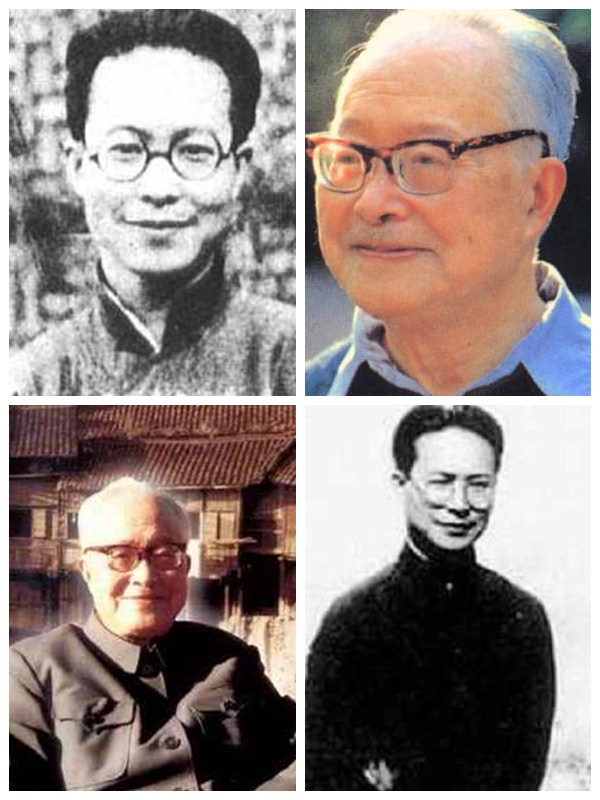
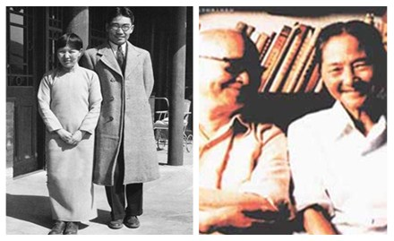

# ＜天权＞沈从文：无闷骚，不从文

**如果你看见个美女直接就扑上去了，追求理想直接就美梦成真了，报效祖国直接就国家栋梁了，那你也未必有心思有时间去写首小诗、发发议论、编个小说。往往对所爱之人所思之愿欲求而不敢求，或者求之而不得，或者求而得之复又失之，最后孤零零一个人灯下苦读，只好把自己对女子、对理想、对家国的一腔热血付诸笔端，一篇篇传世佳作才得以诞生。 **

### 

### 

# 沈从文：无闷骚，不从文

### 

## 文/沐风（山东大学）

### 

### 

### 

自打屈原的《离骚》一出，诗人们就都成了“骚人”。有时我会想象，中国古代一批批文学青年们，在自命骚客洋洋得意之际，如果得知“骚”这个词随着时代的发展，其含义有了质的飞跃，脸上会是什么表情。不过，千百年后网络时代的中国，广大寂寞男青年结合这个字又发明了一个新词，倒是恰恰概括了古往今来一代代文学青年那一言难尽的内心世界，也算是告慰了让大家变成骚人的屈老爷子。没错，这个词，就是闷骚。 无闷骚，不文人。其实这里面是有某种必然联系的。首先，在文学创作中要想写出好作品，你心中必须要有一股滔滔江水连绵不绝的“情”，让你浮想联翩才思泉涌，让你感时花溅泪恨别鸟惊心，这样才能落笔惊风雨诗成泣鬼神。我们小学开始学作文，评价标准里第一条永远是要有真情实感，其实这对创作来说是最基础也最可贵的，可惜我们语文教育根本不能容忍有真情实感的作品，你在作文里捡到一分钱不交给警察叔叔试试？扯得有点远，说来说去，文人不能没有一个“情”字，对女子，对理想，对家国，没有一份执著热爱之情，那你还是学理科去吧。但其次也是最重要的是，如果你看见个美女直接就扑上去了，追求理想直接就美梦成真了，报效祖国直接就国家栋梁了，那你也未必有心思有时间去写首小诗、发发议论、编个小说。往往对所爱之人所思之愿欲求而不敢求，或者求之而不得，或者求而得之复又失之，最后孤零零一个人灯下苦读，只好把自己对女子、对理想、对家国的一腔热血付诸笔端，一篇篇传世佳作才得以诞生。他们在笔下找寻失落的美，重建幻灭的理想，让香草美人属于文学青年，然而一切一切，终不过是在文学世界里。回到现实，文人们抽一根烟，扒两口饭，还得埋头落笔，在闷骚中创作，在创作中闷骚。 

### 

### 

如果你是冲着沈从文读这篇文章，并且还能坚持读到现在，那么恭喜你，下面开始谈他。最近在读沈从文的一些小说，常常让我想起闷骚这个词汇。沈老的过人之处在于，他能够对细腻的心理活动有出色的描写和精准的把握，捕捉到那不为人知的闷骚情怀，造就了许多回味无穷的佳作。 能做到这一点，八斗之才固然少不了，没有同样闷骚的内心世界，想必也难以下笔吧。不过沈从文可是不甘心于这么闷下去，接下来所做的事情，就是我们大家都知道，女生们尤为津津乐道的了。喜欢一个女人，为她写成堆成堆的情书，对文学青年来说不算难事，把这成堆成堆的情书死皮赖脸地坚持寄给她，就稍微有点难度了，最后靠这些情书把这个女孩一举拿下，就更是小说里的大团圆结局了。现实往往不那么美好，所以文学青年们大都愿意为悲剧落几滴伤情的泪，也不愿意抱着本喜剧小说哈哈大笑，太俗。沈从文还真就大团圆了，当然不能仅仅靠情书，还得有胡适这个靠山。话说回来，女生要是频繁被骚扰想找人论理，你也得有点智商，打听清楚彼此关系，被宿舍老二纠缠去找宿舍老大告状，那不是自投罗网么。张兆和就这么被一群文艺青老年连哄带骗地把一辈子交出去了，要说她这婚姻幸福么？不想浇冷水，但是沈从文死后，张兆和曾说过：“从文同我相处，这一生，究竟是幸福还是不幸？得不到回答。我不理解他，不完全理解他。”可见，生活毕竟不是小说，有些事情终究不能像传说中那样圆满。 

### 

### 

话说回来，沈从文作为一个有点自卑情结的北漂，一个乡下来的文艺青年，敢于走出许多闷骚男想象了半天也没走出的一步，还是非常值得鼓励的。尤其是他的大胆，那句名言——“我不但要得到你的灵魂，还要得到你的肉体”——实在是喊出了古今中外的恋爱中男人憋屈已久的心声，令诸多道貌岸然春心荡漾的尔康五阿哥之徒无地自容。幸亏我在没读过《边城》的时候就听说过了这句话，否则未必能像当年对沈从文那么五体投地。不过，如今我也大四了，对大学里的舆论八卦价值观评价体系有了基本了解，静下心来想想，假如这种事这句话在身边出现的话，让大家议论起来，八成得出的结论是：丫这不是流氓么？可见，闷骚呵，闷骚呵，不在闷骚中灭亡，就在闷骚中爆发。沈从文是一骚惊人，一举将目标拿下，实为超越闷骚的楷模。 但即便如写起情话大胆得限制级的从文先生，也逃脱不了在闷骚中灭亡的命运。改朝换代之后，沈从文一如他的所有笔友，文学生命立即宣告死亡。只是大多数人的文学创作虽然今天看来死亡了，当时可是在义无反顾的自我检讨中走向一个“新的高潮”，歌颂美好新时代。沈从文是直接十分坚决地告别了文坛，任其他人再怎么好言相劝，就是一个字，不写！他和郭沫若结怨甚早，直接被这第一位中科院（看清楚了，不是社科院）院长发配到历史博物馆去了。在此之后，貌似十七年里他就写过一篇文章，对任何活动都保持缄默。在周围的人都狂热地歌颂我党的时候，沈从文固执地闷骚着。这种精神阉割对于一个曾经著作等身、创作力绝对在鲁郭茅巴老曹之上的小说家来讲，其痛苦是可想而知的。然而他一个小文人，在这样一个大时代面前，又能怎么样呢？他曾经的文学作品已经落后于时代了，再怎么文思泉涌，也只能憋在心里，反正你不憋着，也没地敢发表。于是，他只能在闷骚中埋头钻研文物，寻找难得的快乐与宁静。 但是，我写这篇文章并不仅仅是为了像今天的许多小文青那样，借此表达对沈从文如滔滔江水连绵不绝的敬佩之情。事实上，我恰恰在《随笔》杂志上读到景凯旋先生的一篇文章《没有死过，但病过》，提到沈从文在某些时候也并不是非常干净的。比如他曾经揭发萧乾与美帝国主义合作，原因仅仅是萧乾与美国人曾经合办过杂志。我也不想就此对沈老发难，只是当时读到这里感慨良多，想不到一位写出《边城》这样唯美之作的文静书生也曾经有过如此劣迹，究竟是怎样的年代，才能把一个涵养颇深的文人变成这样呦！ 

### 

实际上，那是个所有作家都在疯狂中闷骚的年代，沈从文也不过是诸多受难者之一而已。每当想起这种年代，我这个小文青内心就一阵阵发紧。无闷骚不文人，这当然只是一句戏言；但我们这片神奇的土地上，却曾经出现过无文人不闷骚的奇景。闷骚对于文人而言，一旦从自愿的选择变成被迫的唯一选项，就不仅仅是文人的灾难，而是时代的莫大杯具。但愿今后的所有文青们，不仅能够想闷骚就闷骚，更能永远享受不想闷骚就不想闷骚的权利。 注：本文题目系编者所改，原题为《沈从文：超越闷骚与回归闷骚》。 
