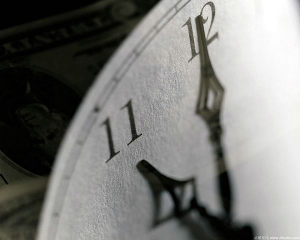
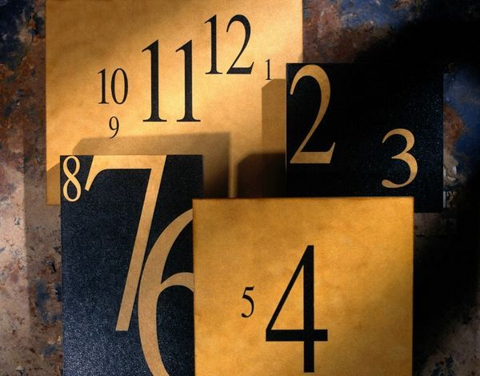

# ＜天权＞没有后悔药

**当这些事发生在身边的时候，我从没有过后悔。我从未渴望回到过去来试图挽回一种截然不同的结果，我心安理得地接受了一切，然后踏过它们前行。我兴趣盎然地发现，没有了后悔，没有了渴望重来一遍扭转结果的渴望，所谓悲伤、怜悯、同情、失望、自责、仁慈等一系列感情便统统没有了赖以生存土壤。它们依然存在，只是没有了意义。我并非麻木，只是找到了智慧的真谛。**  

# 没有后悔药

## 文/李孟元（Yale University）

 

那年我考取了高中年级的前十名，担任学生会长，交往着一个人人羡慕的漂亮姑娘，有一些小小的理想。那年我被一所鼎鼎有名的大学录取，即将远走他乡。眼看未来就在眼前，却浑然不知想学什么，路在何方，只是隐隐约约怀揣着一点野心和改变世界的志向。女朋友考到了本地，来年将与我分隔半个地球。我爱她，她更爱我，我们商量好了要常联系，多聊天，争取毕业分到同一座城市，然后就结婚。临行前那天夜里，我陪她看了电影，和她接吻，看着她蹦蹦跳跳一步三回头地消失在街道拐角。我转过头，面带微笑，然而走着走着，却仿佛被一种难以言状的力量拖住了双脚，连拉带扯地迂回了好几条街，左拐右拐，最终跌进了一家巷口的咖啡馆里。

这家店我平时来得不少，灯光昏暗，不算嘈杂， 聊天小酌都十分惬意。 装潢简单的店铺里星罗棋布着三十来张小巧玲珑的圆桌，桌椅间一年到头都散发着高谈阔论留下的书卷气息。说实话，这里比起那些满大街雨后春笋般的潮流场所并无多大区别，只是有一处特征总让人觉得蹊跷。每晚九点之后，这家咖啡馆往往都人满为患，然而就在吧台边上的角落处总有一张好端端的圆桌莫名其妙地空着，不管大家怎样询问恳求，就是不让人坐，说是已经预约了出去，而且是老板的死命令就算要了他们的命也不敢破例。好几次我们问桌子究竟留给了什么样的人，服务员都只是耸耸肩说：好像是掌柜的一个老朋友吧。

十一点的钟声已然敲过。我走进逐渐冷清的店铺里， 坐下点了饮料，等送上来后一边吮着咖啡一边和服务员寒暄。又坐了一阵，眼见四周没什么熟人，我伸长脖子无聊地打量周围。这时我突然注意到：那台空了一万年的桌子边上赫然坐着一个人。

从我坐的距离，并不能看清那人的相貌。但是这么多年来从未露面的座位主人终于现身， 让人无法不想一探庐山真面目。而我从来不是个害羞的人，便站起身，凑上前去，微微弯腰侧头跟阴影中的人挥手致意。他放下手中的矮脚杯，稍稍抬起了额头，杯中叮当作响的冰块在深棕色的液体里滚动；借着粗糙的灯光和窗外月亮，我勉强窥视到一件黑色的西装，一件黑色的衬衫，一卷黑色的头发，一对黑色的眉毛，一双黑色的眼睛，和眼角四周密密麻麻的皱纹。他点点头，说：坐下。

我依然记得他的声音，既不苍老，也不悦耳，却有一种说不出的腔调在悸动，乍一听饱经风霜，再一品又年轻不羁。当时的我没空多想，便顺着他的话坐在了对面。他抬起头，仔细地看着我，借着昏暗的灯光，我见到了他的脸。

那是一张极普通的男人之脸，像他的声音一样全然看不出年龄。三十岁？五十岁？还是更老？除了眼角之外，男人的面上并无岁月洗尘的明显痕迹，也没有说得出口的异形或特点，仿佛一转头，他就会消失在木质墙壁勾勒的背景里，被我和这间咖啡馆遗忘。

“你叫什么名字。”他嘴里呼出了威士忌的味道。

我不假思索地告诉了他。眼前明明是一个素不相识的人，我却一点也没有觉得说出真实姓名有什么不妥。在我内心深处，有一种隐隐约约的直觉：他知道关于我的一切，从我呱呱坠地那一刻到我第一次牵一个女孩的手，他都了然于心。如果这世界上只有一个人能让我省去逢场作戏的必要，那这个人就在眼前。突然间，我很想了解他。不，不对，我很想从他口中了解我自己。”你叫什么名字？”

“我叫什么不重要。”男人平淡如水地说。”你想要什么。”

“我不喝酒。”

他摇了摇头。

“你想要什么。”

这不是一个问题。

他看着我，年轻，迷茫，不知所措，我看着他，仿佛在一瞬之间看到了他背后的整个世界，一个充满了杀戮，战火，和硝烟的地方，流淌着鲜血，钢铁，和无尽的欲望。我使劲摇了摇头，定睛一看，才确认眼前的人只是一个随处可见的中年男子而已，但他的眼神却没有变，他的话还在我的脑海里回荡。 “我想当一个了不起的人。”

我像被催眠了一样地看着他，用我自己都没听到过的恳切语气说道。不知为什么，对眼前这人吐露心事仿佛是世界上最容易的事情。

“我想当一个音乐家，企业家，建筑家，美食家，作家，政治家，科学家，电影导演，还有老师，大学老师。我想带兵打仗，建功立业，我想体验世界上最聪明最漂亮的女人，再和其中一个白头到老。我想把每一秒都过得充实而有意义，在自己丧失大脑和身体之前体验心灵和肉体的所有快乐。我不想等到自己垂垂老矣，一事无成之后，再像我那些逢年过节就上门借钱的失败亲戚一样，活在对自己的悔恨当中，却又要强颜欢笑，阿谀奉承，把失败当成家常便饭，在自欺欺人的安分守己里饮鸩止渴，走完一生。我……” 

我呆住了。突然意识到不知何时起从自己的眼角里正流出两行滚烫的泪，而喉咙也变得哽咽起来。我怔怔地拍打着眼前咸湿的痕迹，愣了一瞬，接着无法控制地嚎啕大哭起来。从我记事起，就没有这么无拘无束地哭过，好像世界都只剩下我一个人，而我只剩下了一对眼睛。咖啡馆里几个零星的顾客却仿佛看不到我一般，似乎对吧台角落里那个歇斯底里的男孩的全然不觉。

我不知哭了多久，直到脖子酸了，舌根发甜，仿佛身体里的血液都要从眼睛里夺眶而出，然后我才慢慢收起了啜泣，抬起头，看着那个男人。

我不想成为一个失败的人。

他看着我，眼睛里燃烧着一种捉摸不透的东西。

接着，他开始说话。

“你也许认为，是因为能力，运气，付出，时代，因为体制，歧视，环境，性别，因为这些因素作祟，所以有些人成功，有些人失败。”

他顿了一顿。

“这些都是庸人自扰的借口。”

“你生在一个选择多如牛毛的社会，一个机会不计其数的时代。只要成长在一个可供温饱的家庭里，只要你有机会读书，你的眼前就无时不刻充满着可能性，每一种可能性都通往不同的方向 。有一些近在眼前，有一些不知所终。而你害怕失败，是因为害怕失败之后，会后悔此前做出的努力，后悔为之投资的时间，后悔因其失去的机会，后悔无法重做的选择。你后悔玩物丧志占据了学习时间。后悔追一个姑娘失去了工作经历，后悔尝试艺术耽误了养家糊口，后悔努力工作没时间陪伴家庭； 后悔肉体出轨失去了生活寄托。后悔精神出轨浑不觉天伦之乐。但最好玩，最有意思，最让人捧腹的一点是：你害怕失败，却更害怕成功。你害怕循规蹈矩的胜利会造成无法挽回的失败，你害怕二十岁的自己在办公室里朝九晚五，浑不知世界为何物，后悔三十岁的自己和一个普通人结婚，错过了藏在心里的那个人。后悔没有选择等待，后悔没有等到更好的，一次又一次后悔，后悔自己的后悔，日复一日，永无止境，直到生命剩下的时间已经不允许你失败，而你只能战战兢兢地走在愈发狭窄的道路上，规规矩矩地结束一生。你是一个平庸的人，你没有超出旁人太多的智慧，你没有真正与众不同的才华，你没有决心，你没有天赋，这是你的命运。”

“我这里有一种药。” 男人看着呆若木鸡、眼神空洞的我，毫无表情地说。”吃下去之后，可以带走你所有的后悔。”

据说大哭之后往往会止不住地大笑。如果真有此事，那么那一晚便是我有生以来的第一次。之前的愁云惨淡一扫而空，继而被无法抑制的捧腹冲动挤满胸腔。

我终于意识到这不过是一个江湖骗子，一个卖大力丸的赤脚医生。从我小时候记事起爸妈就喜欢叮嘱我：这世上没有后悔药，没有后悔药，凡事三思而后行知道不？这世上没有后悔药！而眼前这人居然面不改色地信口雌黄。我努力咽下了笑声，抬头看着男人。

“先生您，您喝多了吧，这世上没有——”

“这不是后悔药。”他打断道，脸上的肌肉依然无动于衷。“我这儿也没有能让你回到过去重新选择的药。我这儿的，是‘没有后悔药’。”

我怔怔地张着嘴，不知是因为被他未卜先知地抢了话茬，还是因为这药名实在太过傻逼。

“什么叫……”

“吃下去之后，你就不会再感到后悔。”

我花了足足一分钟的时间理解这个概念。

“任何事情？”

“任何事情。”

男人不慌不忙地看着我，伸手入怀，掏出了一只小巧的玻璃瓶。瓶壁间，一颗半蓝半红的圆滚球体懒洋洋地滚动着。他伸出手，我接了过来。

“任何事情？”

“任何事情。”

我咽了口唾液。

“我欠你多少钱。”

男人的脸上第一次表现出了某种表情：一个笑容。

“不要钱。你吃下去，这笔交易就完成了 。”

言罢，他突然站起身，拎起椅背上黑色的风衣，接着从邻座上拾起一顶异样的黑色礼帽，穿戴整齐后，他转身欲走。

在他身后，我吞下了药丸。

心念微动。

“等一下！”

我叫住了他。

在三十五岁那年，我已精通四门语言，六种乐器，足迹遍布世界各地。我在大学期间以年级第一的最高荣誉提前毕业，三年里拿到四门专业文凭，在最高密级的兄弟会里担任主席。毕业后我主动从法学院退学，五次创业，旗下企业在十年之积累上百亿资产，创造六万就业机会。我十次登上《时代周刊》杂志封面，八次荣膺“影响世界一百人” 称号，连续三年占据畅销书作家榜榜首。我急流勇退，转而从军，在半年之内因功勋卓越被授勋国家特殊贡献金十字章，破格晋升上校军衔 。复员后，我奔赴北京，伦敦，巴黎，纽约拍摄了四部电影，分别斩获金棕榈，银熊，和小金人的主流奖项，一次又一次刷新我自己创下的票房记录。十八所国际著名高校先后授予我终身教授职位，内容涉及经济、文学、政治、社科、外交、艺术等十三项领域。我的日程安排里写满了时下炙手可热的女性明星，电视主持和知识分子。第一个为我纪传的作者很快名声大噪，我每次参与采访都会创造新的流行语和穿衣风格。我是世界的偶像，不可复制的传奇。

十八岁那年，我毫无预兆地甩掉了爱我的姑娘。她疯狂地给我打电话，给我写信，独自一人偷偷攒钱坐越洋航班到学校找我。我很清楚如果想要有所作为，割舍掉这一段纠缠在所难免，于是从未理睬过她任何一次的联系。两年后，她罹患抑郁症从大学退学，被倾家荡产送她上学的父母逐出家门。三年后，她在从业过程中感染艾滋病，几个月之后就悄无声息地死在了没有窗户的地下室里。发现她的是一个素不相识的邻居，据报导称他从几天前起就开始闻到一股腐烂的异味，只是一直没去注意。

二十二岁那年，我在毕业班级里排名第二。年级第一是一个心地善良，相貌姣好，家境贫困的女孩子。她每天除去忙于课业，余下时间都在学校附近的餐厅勤工俭学。我以偷窃客人财物为由打了几个匿名电话， 于是在第二天早晨她就被餐馆辞退，并于一周后因严重违反道德规范被学校开出。她一个人在宿舍里收拾东西，准备回家。我上前帮忙，请她吃饭，当晚就夺走了她的贞操。第二天，我送她去车站，在她耳朵里灌输着假期重逢、许她未来的约定。她走后，我再也没有见过她。

我曾以为，后悔是人力可及的情感当中最无用处的一种。

二十五岁那年，我在军队里效力。在一次边境冲突事件中，我中弹负伤，被边境外的村民救助得以幸免于难。在恢复健康之后，我找到我所属战斗营的武器储藏所，瞒过警卫将一大半枪支弹药运回那座村庄，趁着夜晚潜入每家每户安置了一定数量的证据，然后把我自己的佩枪装上消音器， 一个，一个，一个击毙了村里的每一个人。冲突结束后，我因英勇作战、保护战斗资源以及预防流血冲突的突出表现接受特别表彰，破格提拔。战友们把村民的尸体集中在一起焚化，尸堆最上面的一个就是那位率先对我伸出援手的老太。她的皮肤在烈火中像纸一样窝卷，发黑，然后归于灰烬。

二十八岁那年，我的公司并购了一座效益平平的工厂。工厂员工基本都是三十出头的男性，大都结了婚，有孩子，从成年起就在厂里工作。我简单地审阅了一遍接受前的效益表和收支明细，然后利用权利交接过程中无处不在的合同漏洞将他们一个不剩地解雇驱逐，用一批没有医疗保险，不了解最低工资界限的移民和失业技工取而代之。工厂的利润在一个季度后翻了三番，几乎所有的产值都直接进入了董事会的名下。我用同样的方法并购了七十九家类似的工厂，很快在同行业里排在了利润榜头名。在此过程中，被迫失业的员工大约在三万人左右，他们没受过专业教育，没有门路，大都找不到下一家工作。他们中的很多人没有医疗保险或养老金，只拿着一笔被我麾下律师悉心压低的辞退款，诉诸酗酒与暴力，最后以各种各样的方式家破人亡。

不一而足。

当这些事发生在身边的时候，我从没有过后悔。我从未渴望回到过去来试图挽回一种截然不同的结果，我心安理得地接受了一切，然后踏过它们前行。我兴趣盎然地发现，没有了后悔，没有了渴望重来一遍扭转结果的渴望，所谓悲伤、怜悯、同情、失望、自责、仁慈等一系列感情便统统没有了赖以生存土壤。它们依然存在，只是没有了意义。我并非麻木，只是找到了智慧的真谛。

其实在十七年前吞下药丸的那一刻，我就已经意识到自己作为交换被取走的是什么了。但这正是整件事情最为妙不可言的地方：我虽然知道了令人毛骨悚然的真相，却一点都不后悔。

“等一下！”

我叫住了他。

咖啡馆的木地板上，男人的步伐声戛然而止。他转过身，似乎有所顾虑，怕我笑着跟他说这一切都是扯淡，而我要反悔。下一个瞬间，他看到了我手上空空如也的玻璃瓶。他的眉毛松弛开来，眼神也变得柔和；他甚至毫不做作地松了一口气。对这一切，我看在眼里，却浑不在意，因为我还有一个问题要问他，一个即便对答案已经大抵知晓，却还需要亲口由他回答的问题。

这很重要。

“你叫什么名字？”

男人笑了，笑得像一个刚拿到新玩具的孩子。在那露出的笑容里，我看到了拥抱这世界几千年的罪恶。

 

（采编：周拙恒；责编：周拙恒）

 
