# ＜天权＞没有大学城，也没有地铁以前

**那是他心内村落的光荣时代。没有大学城，也没有地铁以前。烟总是比现在的好。**  

# 没有大学城，也没有地铁以前

## 文/张继州（中国药科大学）

 

我是国立药学专科，又名中国药科大学的一名在读研究生，本科也在本校，看着这周围的村落和油菜花越来越少，也看着地铁修好让我们到南京（对的）越来越快……

有一天，GF打电话说，亲，你的学校地址偏远，快递说今天送不了新年礼物了。这里终究不是真正的南京城。这应该是哪里？我记得以前周围千篇一律的水泥农村，我记得足球场旁边的油菜花，而有了地铁，中国药科大学终于接上南京的轨道，这些却已不复存在。

我拍摄过原来下王墅村的孙家祠堂，还拍摄过沿着地铁方向再走下去的前梅村后梅村。而我不知道离学校最近、隔着龙眠大道的解溪到底有什么。每次出门拍照前，我都把将要到来的当作一次深入不毛的壮游；而去了以后看到的，给我的感受却不尽相同。

开元钱摇出两个阴面，四选一结束，下乡去。

[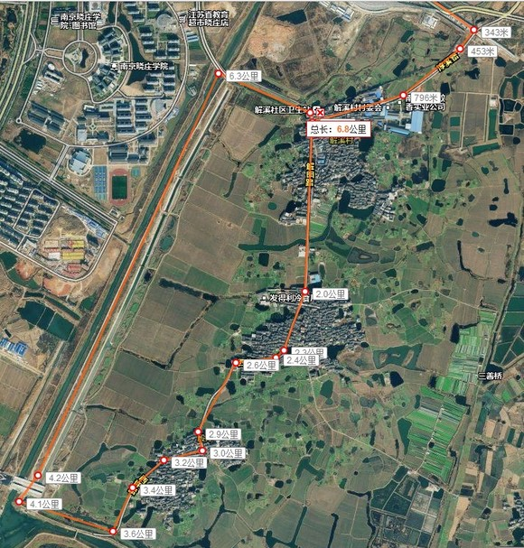](ebb62e34-e046-4df5-afb2-8efcc88193ca.jpg)

这三个村子：解溪（分前后）、许村（分东西）、殷岸，正好被药科大学、南广学院和晓庄学院围起来。不知道这么多学生，特别是南广的文青们是否留意过远方的未知。那是没有大学城，也没有地铁以前的这块土地。

骑车进了解溪，我看到这房子感叹：“好大房！”这句话我下午说了好几次。假如是皇帝微服私访，这就可以挂匾了。

[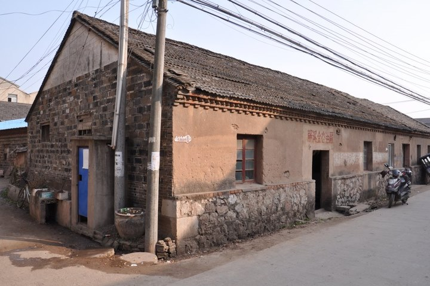](2eaf0eb3-20aa-4eee-a098-b43c3abbfcdf.jpg)

拍下来是因为做了一个很福州式样的叠涩，让我惊讶不已。

[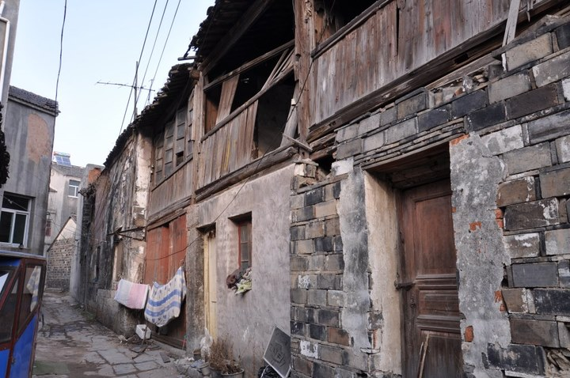](888477aa-91d6-4bb9-a11e-d1fb3a6761c3.jpg)

[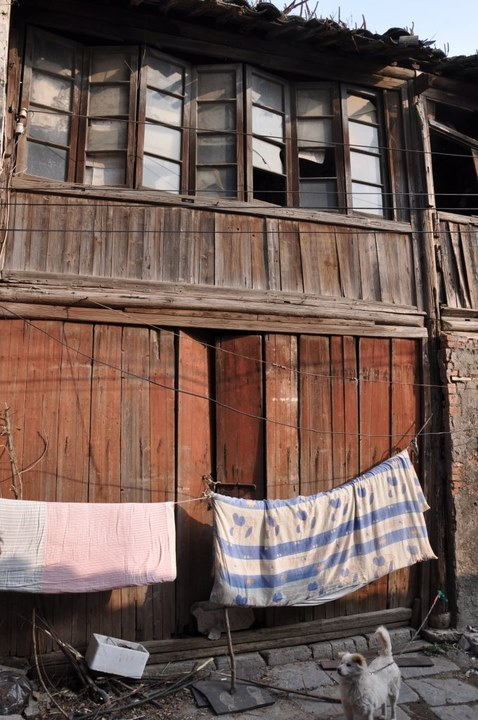](a3e12d48-cb1c-4f62-a23d-d9337c5b856d.jpg)

这是两百年的老街，石板有车辙印，房子上细看有语录，店铺后来做过供销社，狗看见我就高兴地摇尾巴。我说我是邻村药科大学的。

居民说起这个村的历史，说当年很繁华，到处铺着石板路，人流不断；说村子有几个门，晚上关上了整个村就封住了；说她母亲家的石头墙基高到胸口，最后房子还是倒了；说再过二十年看不到老房子了也是指不定的事；说药科大学的地方原来是荒地和农田，没有房子。

老伯一直沉默着，后来我们说完，他转身进屋子拿出一块铁牌：

[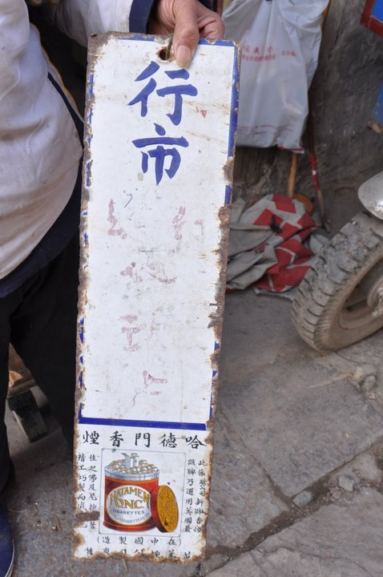](c0d66d64-435e-444d-ab4a-5f0733490afa.jpg)

行市 哈德门香烟 此系敝公司新牌香烟该牌乃选用美国最佳之佛及尼押烟叶精工巧制而成（在中国制造）英美烟公司专售

老伯张开掉了牙的嘴笑了：“这个好吃！当年……”说完取下一块钉子上的抹布，把牌子挂在门口。

那是他心内村落的光荣时代。没有大学城，也没有地铁以前。烟总是比现在的好。

[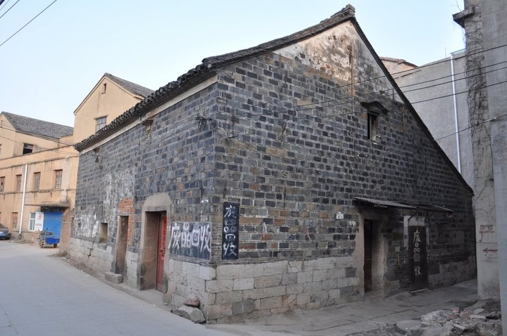](f58e0827-fcd4-4f0a-ba10-c2c076520c09.jpg)

请容许我再说一次：“好大房！”

[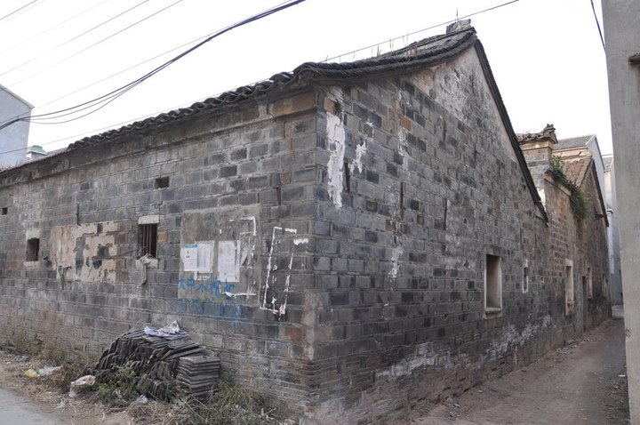](1f67f368-b14f-4525-8e80-61b75eeb472a.jpg)

在西许村这个房子外面，我听一个阿姨用江宁话唠叨。我问她为什么马头墙横过来，她听不懂，只是说“三个儿子一人分一边”“要不是烧了”等等。

进了房子才知道，这房子不知道什么时候走过水，建筑全是一片焦黑。

[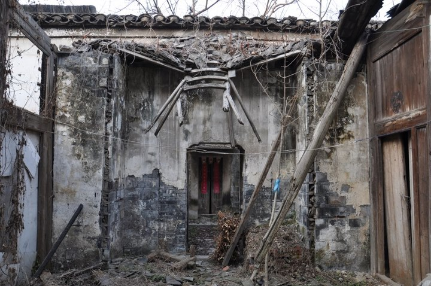](7f75162a-477c-4f40-9b4c-80fab76336fe.jpg)

小门进去还是一个小空间，我开始明白她说的分成三分是什么意思。各个小天井都砌筑了花池种植灌木，看起来很是舒适，假如没有那一场火的话。主人现在去哪了呢？

[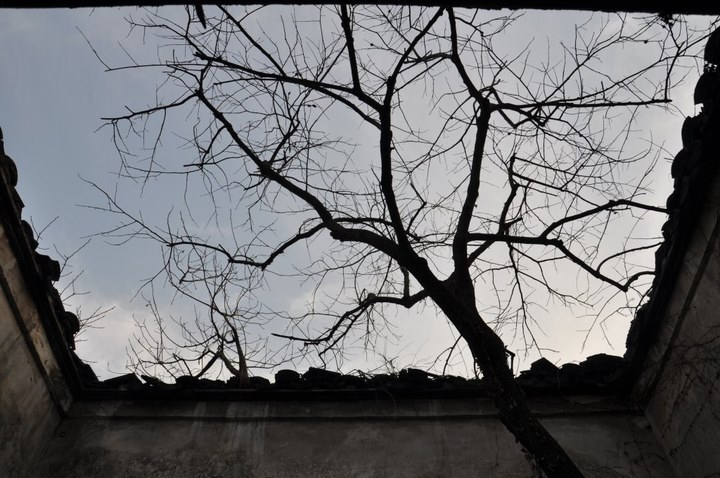](edd8f212-72f2-4c13-9f6f-36df4c6d98f2.jpg)

静脉爬过天空。

这是西边的院子。

[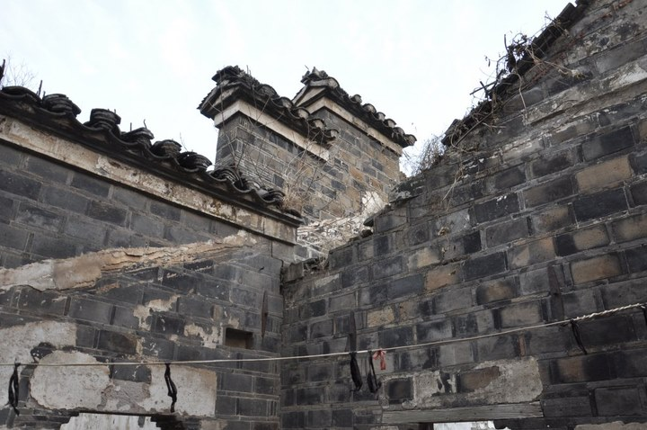](8f463262-f3f3-44a6-8f4a-a4305c2a3ca3.jpg)

[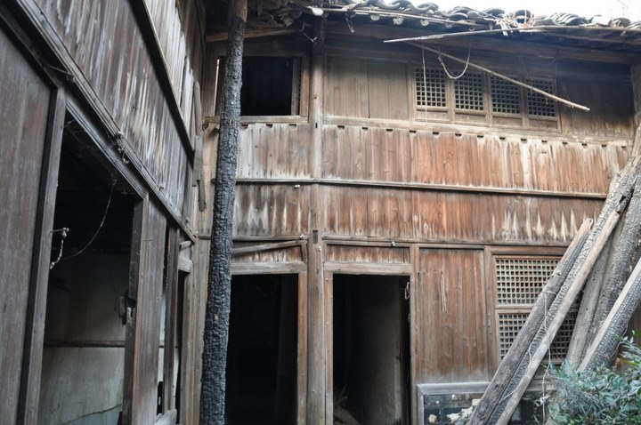](54734b07-0f1c-4e8f-99e2-9bf9fb8aafc1.jpg)

[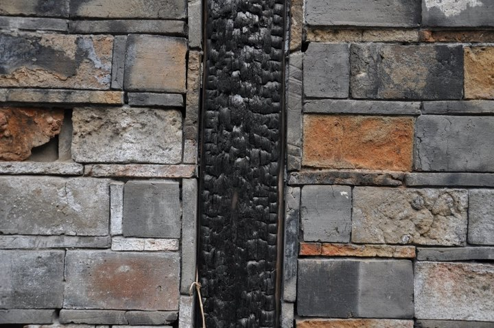](fd7b1dab-d45a-4713-a460-89530406f703.jpg)

没有大学城，也没有地铁以前，不知道是谁在这里夸耀着建筑的高敞和安逸。

他们现在去哪了呢？

我在解溪河边问放羊人路。“去南广只能把车子搬过栏杆上桥，如果沿着这条路可以去晓庄。”这已经是现在的村庄名了吧。当学生换了一茬又一茬，刷卡太快请重刷响了一遍又一遍，人们在地铁口只听到“金科晓庄南广”，却将不再会知道解溪、许村和殷岸。

 

（采编：楼杭丹；责编：麦静）

 
