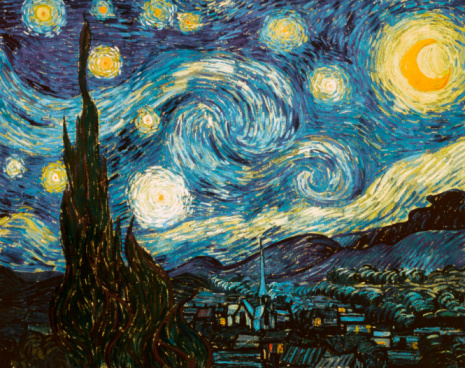

# ＜天权＞溺水者之歌

**他说只是想投身到自然的美丽之中，寻找一切美的东西，所有都任着自己的性子，他说自己的性子才是人最本能的东西，什么时间、作息表、日程表都是社会的垃圾产物。他就开始这样毫无目的地走，留心每一次落日，关爱每一株花草，累了就借宿在路上认识的人的家里，或者索性睡在自己临时用木头和草搭的棚子里。他已经走了10年了，从南走到北，从这里到那里。他到过什么都有的地方，也到过什么都没有的地方，也到过什么都不是的地方，那些被遗忘的小角落里通常有着最美好的东西。**  

# 溺水者之歌

## 文/钟倍尓（清华大学）

 

他和我说他最喜欢的画是梵高的星空，不是那个有着天空中扭曲旋转的星星的星空，而是在平静的水面之上，在宝蓝无限的天空中有着那一颗颗迸发出来的如同烟花爆炸般的星星的星空。

他说：“当我第一次见到那幅画的时候，我就彻底被震撼了。我从未有那么一刻被一种伟大的存在感所包裹着，只有当你看到无限的宇宙和天上的星星的时候，才会有对生命的崇高对宇宙的无限的彻底的膜拜，这样的星空让你能感觉上帝就在那里。”

“那么你相信上帝吗？”我问道。

“不信基督教的上帝，但是相信斯宾诺莎的上帝。”

“看来你和爱因斯坦一样啊。”我笑道。

“没错，至少从这个层面上来看，的确一样。”他也笑道，“难道你不信有这么一个上帝存在着吗，看呐，这平静的湖面上的伟大绚丽的星星，宇宙是如此广大，人类却又异常渺小，但为什么我们拥有着知觉和理性，为什么我们的感觉无边无际？为什么明知道宇宙是无限的却还止不住探索的欲望？如果没有上帝，那人类又为何存在呢？”

“的确如此，可是即使有了上帝，我们也无法知道自己为什么存在着。比如你，你觉得你为什么存在？”我问道。

他说他不知道，他说当他突然有一天想到了自己为什么存在这个问题继而又无法想通的时候，他就觉得他个人的存在与否毫无意义，于是他开始看了很多很多的书，尼采的、康德的、叔本华的、马克思的，看了之后他觉得每本书都说得很有道理，但当他立刻投入到生活的怀抱中时，他又觉得那些理论过于遥远，让他觉得不知所措。

他说后来有一天，他突然决定放弃那样的生活，就是无比现实的生活。他说那样的生活让他麻木、让他恶心，让他根本不知道自己在干什么，也不知道自己为了什么，每天就是像你所见的那样，甚至不用我说你就能想象出一个西装革履的男人提着一个公文包，挤在地铁里，赶着时间，好像每分每秒都是那么的重要。然后日复一日，年复一年，直到你老去，直到你死去，你甚至都还不知道为了什么。正是这种人类社会的看似忙碌却漫无目的特性，让他决定寻找另一种生活。

“然后？”

他说只是想投身到自然的美丽之中，寻找一切美的东西，所有都任着自己的性子，他说自己的性子才是人最本能的东西，什么时间、作息表、日程表都是社会的垃圾产物。他就开始这样毫无目的地走，留心每一次落日，关爱每一株花草，累了就借宿在路上认识的人的家里，或者索性睡在自己临时用木头和草搭的棚子里。他已经走了10年了，从南走到北，从这里到那里。他到过什么都有的地方，也到过什么都没有的地方，也到过什么都不是的地方，那些被遗忘的小角落里通常有着最美好的东西。他说他曾在雨天走到一个无人居住的即将被拆掉的胡同里，发现了一个无人的咖啡馆，他在咖啡馆的墙壁上看了一幅画，那幅画里出现了一个可爱的小女孩，她捧着一本书，抱着一只猫，坐在一盆黄色的花旁边，眼神呆呆的注视着前方。若仔细看她手中捧的那本书，就会发现那是一本杂志。里面有一个留着长发的男人盯着身旁的一个女人，那个女人留着更长的长发，大约30来岁的样子，可能更加年轻一点，也许是因为多年来服用迷幻剂的缘故使她显得比他的年龄要大上很多。女人的面颊骨突出，说实话有点像历史教科书中的猿人的插画，实在不怎么令人赏心悦目。她的双手举在胸与腰之间，穿着长裙，眼睛注视着话筒，嘴巴微微的张开。男人则站在他旁边看着他，穿着夹克和牛仔裤，双手自然的垂下，显然他们是在唱着某首歌曲，在一个70年代初的小酒馆里，旁边坐着很多人，拿着啤酒和香烟，男人们上身穿着紧身t-shirt，下身则是牛仔裤，女人们则是穿着吊带和长裙，他们自由的随着音乐摇摆，不时的抽口烟，然后微微闭上眼睛，沉静在这个小小的世界里。

他立刻就觉得自己是属于这幅画里的某个人物，他甚至听到了那个酒馆里的音乐，那是Neil Young和Joni Mitchell一起唱的某首歌，歌曲唱的是一个有着黄色月亮的夜晚的情景。

“恩，那之后呢？”

他说他之后就看着那画上的女孩，看着他手中的那本杂志，一闭上眼睛的瞬间就融入了那个酒馆之中。他说他感觉到自己也穿着短袖T恤和牛仔裤，左手拿着啤酒，右手拿着香烟，顺着音乐，和周围的人一样就像那夏日午后被微风拂过的小草一般摇摆着。这时，他看见了一个坐在角落里的姑娘，她垂着头，手中拿着一本杂志。他觉得她很特别，就与她交流起来。

她说她来自北方的小镇，到过世界各地，没有什么理想，理想就是随处飘荡。她问他来自哪里。他说他不知道自己从哪里来。

她给了他一根烟，她说：“你会喜欢这个的。”

他说他没有试过这种东西，

她说你就试试吧。

他说他时常做梦。

她问他梦到什么，

他就说“我时常梦到自己是别的书里面的人物”，

她说你就是，

他说那你呢？

她说她不知道。

他说也许你也是书里的人物，

她说她不是，她说她也时常做梦，他感到自己是一幅画里的人物。

他说真有趣，我们是不是在做梦呢？

她说也许吧，说说你的梦？

他于是说了一个梦。

他说他当时蜷缩在沙发上，还沉浸在梦的世界里，只是一个不经意的光点从被窗户反射到他的眼睛里，此时他还在梦里，与一个女孩一起走在夏天的海边，他嗅着海的味道和她的味道，他们一起脱了鞋子赤着脚，让海水渐渐漫过膝盖，再漫过胸部。于是他们在天空与海面的交界处，开始亲吻起来，大海与天空的界限就在他们的嘴唇之间，他正要同她与大海融为一体，被一束再现实不过的阳光给惊醒了。可是他还没有完全从梦里走出来，他在床上在混沌的空间和时间中遐想，他渴望遇到她，渴望在大海和自然的音乐里拥抱着她，渴望和他一起走进这无限的海里，一起走向最美丽的死亡。

她问那个梦里的她是谁。他说，“长的很像你。”她很开心的笑了，她说她喜欢这个酒馆，因为这里总能让她觉得自己在中世纪的古堡。

“在古堡里听着neil young？”他问道。

“没有比这个更浪漫的了。”她说道。

她让他赶紧试试那个烟吧，它能让你回到现实。他说他不信，她说你试了就知道，他说他不吸这种不好的东西。她说你真啰嗦。他说他是开玩笑的，于是点燃了烟。

一瞬间，他便感觉一切变得模糊不堪了，原本的直线变得弯弯扭扭，原本的烟雾变成了在某个暴雨之中的闪电。他看到了儿时带着他走过青石板路的父亲的脸庞，他们一同走过一个弄堂，穿过狭小的空间后，视线顿时开朗起来。雨后的彩虹和壮烈的晚霞交织在一起，映衬在那个蕴藏巨大能量的海面上。红色的天空中散乱无章的云彩变成了恐怖的魔鬼的脸，有一会儿又变成了软软的面包，他伸出手来，摘了一块，觉得那是从未尝过的味道。天空的另一侧的乌云正被上帝的阳光渐渐撩开，如此平静如此美妙。他微闭着双眼，直直的倒了下去，他感觉到地面在塌陷，他顺着地面一直往下掉，往下掉，往下掉，似乎这样过了几千年，他看到了恐龙和三叶虫，他看到了猎户座的一颗星星，他看到了宇宙的爆炸，他还看到了露水中的那微小生物，他们在对着他微笑，他也对他们问好，他就在这杂乱无章的空间和时间中来回穿梭，直到他感到落日的余晖已被无尽的黑夜渐渐抹去，那个胡同，那个女孩，那个酒吧，那些乱乱的东西都不见了，他的眼前只有有一个人坐在海边抽着烟，那人便是你，他说道。

我听得入迷了，我也不知道我面前的这个人是什么人，从哪里来，到哪里去，或许不是人也罢，我只希望他继续讲下去，一句一句讲过来。我说，你继续说吧，我听着。

“没了。”他说道。

“没了？那然后你要干嘛？”我问道。

“去投入世界的怀抱。”他说道。我看着他慢慢走近海里，水漫过他的膝盖，胸脯。一颗闪亮的仿佛突然从空中迸发出来的星星反射在水里，直直顶在他的头上，那颗星星的倒影越发清晰，直至水面冒出了气泡。

我就这样注视这他走向了大海里，俨如正在举行一出宗教仪式。我揉了揉眼睛，捶了捶脑袋，望着平静的海面，好像根本什么事情也没发生过，好像根本没有这样一个人存在过。

是否根本就是我的世界发生了错乱？

我脱下鞋子，向着大海的方向走去，准备去海底弄个究竟。

 

（采编：何凌昊；责编：尹桑）

 
