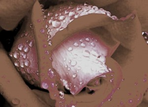

# ＜天权＞灰色日记

**梭罗在《瓦尔登湖》里说到：为什么一桶水很快就会腐臭，而冻起来之后就会保持新鲜呢？人们经常说，这就是情感和理智的不同点。是的，我们看到，越来越多的人把持了矫饰和自私的理性，却丢掉了他们自认为是幼稚与虚假的情感，集体的青春选择了把自身拘锁于个人世界的一隅，只需二两忧郁，八钱享受，外加七分乐子，维持了经济理性时代的舒适生活。**

### 

### 

# 灰色日记

### 

## 文/文刀刘（安徽师范大学）

### 

### 

这个城市下雨了，衣服晾在宿舍的阳台上，我得庆幸自己还能记得这事。不知为什么，最近越来越有点健忘的感觉，有时候对于一个很熟悉的词，临到要说的时候，却又一时半会想不起来了。对着姑娘尴尬的眼神，张着难看的嘴巴，露着参差不齐的牙齿，有点失态的味道。我想是不是劣质烟吸的太多的缘故，对于这一点，我隐约地感到似乎存在着一丝可疑的关联。但是，又觉得自己并不如自己所讲的那样做到了彻底地健忘，有时却被很多遥远而又虚幻的故事所蛊惑，记忆能够瞬间穿透一切岁月的城堞，找到诸如无力、酸楚和难堪的影子，爬在梦呓的窗子上，张望漆黑的意识流。陀斯妥耶夫斯基有过这样一句刻薄的话：最善于欺骗自己的人生活得最幸福。我总把这种假性健忘症当作是一种生理的善意谎言，或者说是记忆的明哲保身之举。我不指望它能让我活的有多幸福，至少不会过分陷入虚无的幻觉世界中去。 现在的我对于自己“病魔缠身”的思想开始有种绝望的动摇，对于这一点，已经被赤裸而狰狞的生活所证实。城市空旷的大马路，奇怪的公交车噪音，就像一个放大的处女膜，留给人诸多现实层面的想象与思考。华灯初上的时候，月色溶溶下的工业化，成了这个抽象的城市最恶毒的谶语。仿佛又回到了贾樟柯的电影《世界》中空洞与华美的市井生活。困顿与不安依旧威胁着这个城市孤独的年轻人们，工业的齿轮被高压的生活弄得锈迹斑斑，可怜的薪水和六个小时的睡眠就是此刻最好的润滑剂。而该死的失眠，却已占据了我大半个凌晨的光阴，还有洗澡间里淋浴喷头一夜不止的滴响。西塞罗曾说过，教育的目的是让学生们摆脱现实的奴役，而现在的年轻人正竭力作着相反的努力——为了适应现实而改变自己。关于教育，我不懂，我只知道，学习永远也不可能是一件轻松的事。凡轻易得来的，必不持久牢靠，凡是得到的，必将有相应的付出。毕业对于我们来讲，并不意味着学习时代的终结，而是一个“后学习时代”的开始，不然，精神这片灰色的麦田，它会一直迷失在这个光怪陆离的孤岛上，大声呼喊着存在的出走和精神的饥绥。 

 毕业应从哪一刻开始正真算起，这或许已经显得不重要了。我时常有种尚且称之为“时间洁癖”的习惯，我不知道这种习惯已经保持了多久，可能又会在多久以后会自动离我远去。我从没有一些名贵的钟表器物，但却具备了时间意识的机械天赋和心理。有人总会认为这样做表明自己有种现代合理的生存观念与时间意识，成为一名合格而又忠实的时间卫道者，所以宁愿选择了被人生的庸碌所淹没，变成了实体工业时代的奴才。在芒福德的著作《技艺与文明》中，他向我们展示了从14世纪开始，钟表是怎样使人变成遵守时间的人、节约时间的人和现在被拘役于时间的人。在这个过程中，我们学会了漠视日出日落和季节更替，因为在一个由分分秒秒组成的世界里，大自然的权威已经被取代了，而自从钟表被发明以来，人类生活便没有了永恒。这样刻薄的字眼，总显得与凶猛急遽的时代有点格格不入，我是个可耻的孤独者。我的洁癖不可救药，我的命运不可更改，这是一个时代留给我的废墟和预言。 我想谈些温暖和琐碎的东西，丢弃所有的宏大与庄严。可回头再去看这些凌乱不堪的语句和莫名其妙的措辞，令人有种荒诞不经的失落感。邓晓芒曾说过，我既不知道我的明天，也已经不认识、不理解我的昨天，这使我根本无法建立起“人性本善”之类幼稚的或骗人的信条，但我既然总在体验，在努力抓住那转瞬即逝的、抓不住留不下的体验之流，我也就永远不会甘于承认“人性本恶”，我从我的生命之瞬间晕眩中已经看出并相信：人生是艺术，是迷人的、美的、孤芳自赏的艺术，是可怕的、可羞的、难以隐忍的艺术。我没有哲学家超越生命意识的终极思考，也不太懂什么叫做温暖，也不想追问什么叫做琐碎。它们只是早已被岁月淘净，挂在时间的门墙上，有些或许已经变质发霉，有些或许已经风干脆化，有些或许已经被风吹走。这对于一个孤芳自赏而又难以隐忍的人生来讲，他们早已转变了一种异化与利己的看法，带着一种轻蔑地怨怼，以及兀自救赎的心态，甩尽一切于己无关又于己似乎有关的包裹，往前猛冲过去，跳进人生的体验之流，用半生年轮读懂“纵浪大化中”的生命归宿和玄学命题。 悲观主义的花朵，适时选择了在初夏盛放，完成所有青春的书写和抽象的解脱。如果青春岁月的那些梦再也不会继续在城市的夜空飞舞回旋的话，那这个世界还会不会继续留有一些令人值得期待的东西，或者说是心动的想法，而现实的结局却是令人越来越多的不再给予过多乐观的对待。梭罗在《瓦尔登湖》里说到：为什么一桶水很快就会腐臭，而冻起来之后就会保持新鲜呢？人们经常说，这就是情感和理智的不同点。是的，我们看到，越来越多的人把持了矫饰和自私的理性，却丢掉了他们自认为是幼稚与虚假的情感，集体的青春选择了把自身拘锁于个人世界的一隅，只需二两忧郁，八钱享受，外加七分乐子，维持了经济理性时代的舒适生活。现实的悲观或是乐观可能只是隔着一层纸，你中有我，我中有你，唯有达到一种相对稳定的平衡，才能不致于彻底崩盘。我仿佛突然悟到一丝飘渺的超越意义、带着这点浑浊的意识，结束这次漫无目的的文字之旅。其实没有谁喜欢一直沉溺于与己无关的琐碎与无聊中，人生苦短的话，隐忍于心头，宣泄在行动上，然后带上死亡的符契，载着精神的水书，一路踽踽独行。最后想说的是：扁平枯燥的年代，只需要埋头苦干和保持沉默，在心底许下未来虚幻的祈愿，然后咬紧牙关，面带微笑，走进喧哗和卑琐的名利场里，尽情疯狂摇摆。 

### 

### 

（采编自投稿邮箱 责编：陈锴）

### 

### 
