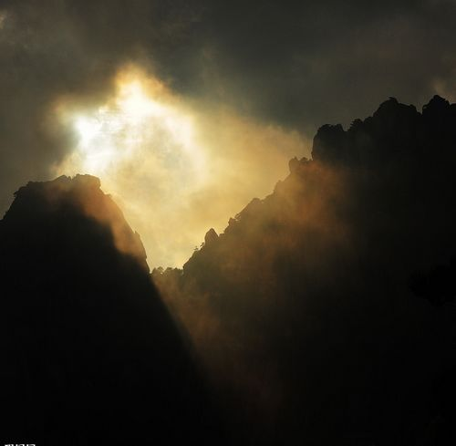
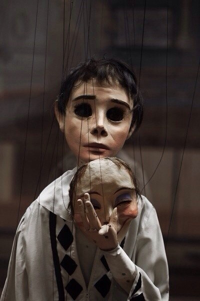

# ＜天权＞灵魂浅吟低唱去，此际我自在中流

**我想斯特里克兰德表现的是一种灵魂的独立。他就像一朵野花，在自然中怒放，不管外界是万紫千红抑或是万户稀疏。这是一颗孤傲的灵魂，也是一颗自由的灵魂。它告诉我们灵魂本来就是自由而独立的。这个世界最美丽最神奇的地方就是我们的内心。灵魂本质上是无法与他者交流的，更是不必同他者交流的。对自己而言“我”就是整个世界。我们总是被世俗的枷锁捆绑得太深，我们就是柏拉图洞穴中永远被锁住的人。斯特里克兰德拒绝如此，他对这个世界云淡风轻地说：“这个世界哥来过，哥走了，但是与世界与任何人都没有任何关系。”**  

# 灵魂浅吟低唱去，此际我自在中流

## 文/王栋（武汉大学）

 

《异端的权利》和《月亮与六便士》皆是名著。近日忙中偷闲，读完两书，掩卷之后不禁唏嘘感慨不已。就我看来，两本书都表达了对枷锁的反抗和对自由的向往。《异端的权利》中卡斯特里奥追求的是思想之自由，言论之自由，摆脱的是权力之枷锁。《月亮与六便士》中思特里克兰德追求的是生命本身的自由，摆脱的是世俗和文明的枷锁。我不敢说我读懂了他们的追求与理想，但我愿记下我的理解与感动。

面对权力的恣肆，面对暴力的张狂，体力羸弱不堪，权力一无所有，无奈偏却懂得这世界不公的人该如何面对。反抗，这种被当权者嘲讽为“苍蝇撼大象”的行为，在卡斯特里奥身上表现得淋漓尽致。这位16世纪最有学问的人道主义者，早已和他的作品一道深埋在历史的烟尘中。之所以如此，只是因为他的敌人是加尔文。只是因为加尔文，这个新教改革的收尾者，借《基督教原理》重整世界的规划者，神的代表者，烧死了如堂吉诃德般的米圭尔·塞维特斯。

作为一个知识分子，卡斯特里奥犹豫过，恐惧过。毕竟人道主义者知道生命的重量和价值。但是犹豫过后他还是选择捍卫正义。在精神方面的论战中，最优秀的斗士并不是那些毫不犹豫热情投入纷争的人，而是那些长时期犹豫的人。因为后者爱好和平，又因为他们的决定是慢慢形成的。但是，那些最难决定战斗行动的人，一旦决定了，就是所有人中最不可动摇的。

他对加尔文提出了两个问题是：米圭尔·塞维特斯犯了什么罪和谁授权加尔文去判定什么是真实的、什么是不真实的？加尔文认为米圭尔是异端，他受上帝之命令处死他。卡斯特里奥则认为异端者是指，虽身为基督教徒，但不承认“真实的”基督教义，顽固地以这样或那样的方式偏离“正”道的人罢了。所谓的异端，不过是违逆当权者的意志而已。

回应卡斯特里奥的是来自意识形态和肉体两方面的暴力，但卡斯特里奥始终认为：“把一个人活活烧死不是保卫一个教义，而是屠杀一个人。我们不应用火烧别人来证明我们自己的信仰，只应为了我们的信仰随时准备被烧死。”卡斯特里奥以坚守面对暴力，以宽容面对迫害。虽然他战斗过的战场，他生活过的生命都已化为乌有，但历史将给他平反。历史以不可思议的路径移动，敌手的绝对胜利促成了卡斯特利奥的复活。17世纪的荷兰人重新发现了这位坚守者，他的文字和思想在百年后成为大家所尊重的共识和底线。宽容成为现代民族国家相处的基本准则。

相较于卡斯特里奥的志向，思特里克兰德的追求则显得离奇、怪异和荒诞。卡斯特里奥原是一个成功的证券商人，拥有幸福的家庭生活。然而四十岁的他却为了绘画逃到巴黎。面对家庭和社会的指责，这个男人只是简单地说“我要画画”。生存、爱人、家庭和社会责任，都不能使这个男人停留片刻。他完全了解并承认各种指责，但他毫不在乎，他选择继续绘画。

写到这里我不得不佩服本书的描写手法和故事构架。相较于一般小说对于作者内心描写的重视，作者没有一个字描写斯特里克兰德的心理，甚至斯特里克兰德在整个故事中都没说过几句话。思特里克兰德的生平语焉不详，我们所见的只是他生活的场景。他对人冷漠无情，他的艺术没有人欣赏——他甚至根本不是在追求艺术。虽然他的贫困生活作者着墨甚多，但这只是为了突出他的冷漠——这个人甚至对自己的生命都漠不关心。映入我们脑海的是这个人的默然与无动于衷，而非他的艺术与追求。

我们无法了解这个人的内心，他也不想我们了解他的内心。但最大悖论恰恰在这里，他绘画的原因只是因为自己的内心需要表达。为了这种表达他不在乎人世间的任何东西，工作、爱情、家庭甚至生命本身。但是他的表达无法让人理解。

作者写道：“他的画只不过更增加了他已经在我心中引起的惊诧。我比没看画以前更加迷惘了。只有一件事我觉得我是清楚的——也许连这件事也是我的幻想，那就是，他正竭尽全力想挣脱掉某种束缚着他的力量。但是这究竟是怎样一种力量，他又将如何寻求解脱，我一直弄不清楚。我们每个人生在世界上都是孤独的。每个人都被囚禁在一座铁塔里，只能靠一些符号同别人传达自己的思想；而这些符号并没有共同的价值，因此它们的意义是模糊的、不确定的。我们非常可怜地想把自己心中的财富传送给别人，但是他们却没有接受这些财富的能力。因此我们只能孤独地行走，尽管身体互相依傍却并不在一起，既不了解别的人也不能为别人所了解。“

当斯特里克兰德耗尽生命终于完成了自己最伟大的作品——甚至有可能是人类艺术史上最伟大的作品——之后，他让自己的遗孀烧了它。当他终于可以表达出自己灵魂深处的美丽与深邃，他却拒绝与别人交流和分享。这难道不是另一个大大的悖论吗？

我想斯特里克兰德表现的是一种灵魂的独立。他就像一朵野花，在自然中怒放，不管外界是万紫千红抑或是万户稀疏。这是一颗孤傲的灵魂，也是一颗自由的灵魂。它告诉我们灵魂本来就是自由而独立的。这个世界最美丽最神奇的地方就是我们的内心。灵魂本质上是无法与他者交流的，更是不必同他者交流的。对自己而言“我”就是整个世界。我们总是被世俗的枷锁捆绑得太深，我们就是柏拉图洞穴中永远被锁住的人。斯特里克兰德拒绝如此，他对这个世界云淡风轻地说：

“这个世界哥来过，哥走了，但是与世界与任何人都没有任何关系。”

在武汉阴郁的天里，读这样的书是令人温暖的。《异端的权利》告诉我们思想自由和言论自由永远无法扼杀，宽容是人类相处的底线。暴政纵然肆虐，进步从未停歇，我们都是异端又都是主流。《月亮与六便士》告诉我们，生活纵然庸碌，内心深处却总有一个高傲不屈的灵魂。无论世事如何变化，自由的心灵永远是我们人生真正的期许。

（采编：何凌昊；责编：黄理罡）

 
