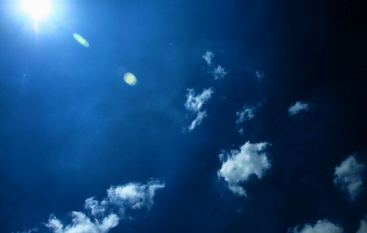
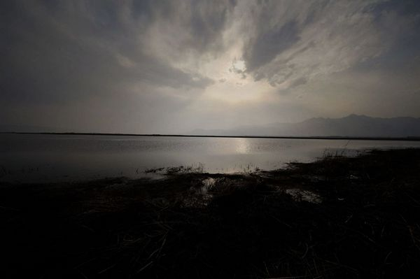
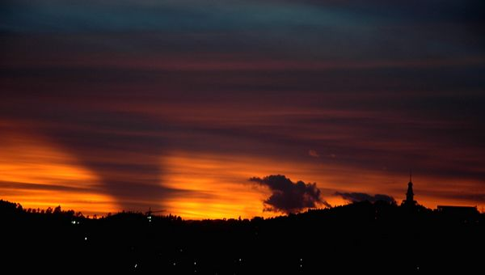

# ＜天权＞狂欢

**狂欢的气氛达到了高潮，N城成了人们癫狂的舞台。说来奇怪，我竟感觉这场狂欢像是一场宗教仪式，夹杂着某种莫名、神秘的美感。“哗啦、哗啦”的玻璃破碎声，“砰、砰”的击打声，人们的怒吼和高歌，正是给这仪式奏乐。**  

# 狂欢

## 文/尹航（Bates College）

 

一阵闹铃声把我从梦中惊醒，我望了望窗外，天已经蒙蒙亮。我一边揉眼睛，一边试图回想梦中发生了什么。我这人做梦一向转眼就忘，可令我惊奇地是现在我竟能记得住梦中的些许细节 —— 慢着，在讲述这个梦之前，我得说说有关N城的天空和E的事。

从我有记忆起，N城的天空就一直是死灰色的，云则是一团一团的浅灰的东西，跟天空混在一起，不分彼此。我对这些自然现象习以为常，直到有天E给我描绘了一个异样的天空。E是我的高中同学，此人高中三年一向独来独往，不喜与人交谈，更没跟我说过几句话。毕业吃散伙饭时E坐我边上，后来他喝多了，告诉我他一生中最大的梦想就是去R城。我问他为什么。

“因为那里的天空的蓝色的。”

我敬他一杯说，等你到了R城给我寄张照片，我想看看蓝色的天空。

我知道E当时喝多了，哪里有什么蓝色的天空？可是这并不妨碍好想象如果天空是蓝色的究竟会是什么样子。我曾无数次试图在脑海中刻画那样一副画面，可从没有成功过，直到现在——确切地说，是我醒来那一刻之前，我梦到了蓝色的天空。

“义民，快过来！”

我的思绪被老老婆急切的呼唤打断。我来到电视机旁，只见老婆手舞足蹈，“看！有几个N城的人划船去了圣石，在上面插上了N城的旗！”我望向电视屏幕，只见几个N城人站在狭小的圣石上，头发被风吹得飘出各式各样的形状，周围水流湍急 —— 多么神圣的一刻！我不禁也激动了起来。“这一天终于到了，终于到了。今天得好好庆祝一下，等我下班回来，咱们出去吃一顿”。作为一个热爱N城的市民，这条新闻让我新的一天充满了愉悦和期待。至于刚才的梦，我已经没空再想了。

如果说有一件事在N城家喻户晓，人人议论，那莫过于“圣石之争”了。事情的起因是这样：N城与J城中间隔着一条河，河中央有块石头叫做圣石，是N城的祖先渡河时发现的，这之后圣石便一直属于N城。谁知从某天开始，J城竟公然宣称圣石是他们的，还自己给圣石起了个名字。在N城，只要一提起此事，人人都无比愤慨，义愤填膺。也正因为此，N城和J城成了死对头。

我一如既往地坐62路公交车去上班，如我所料，车上的电视在反复播放着我刚刚看到的新闻，而乘客们的反应都和我一样，无比激动，连一惯摆着臭脸的司机师傅也喜笑颜开。与平日早上沉闷的气氛截然相反，现在，这个拥挤的车上洋溢着自豪和快乐。一路上，我看见好几个广场的大屏幕前围满了兴奋的人群，他们似乎在喊些什么。不一会儿，电视中出现了N城领导人，他们称赞登上圣石的人是N城的英雄。总之，今天的N城是快乐的。

我在一家汽车修理厂工作，到了厂里，所有人都在谈论这件事，“总算有人给咱们N城争了口气！” 平日里不出三句话就会打起来的小刘和小陈相谈甚欢。甚至连天天常骂我们死猪的车间主任老王都跟我们扯了几句，“你看到电视里左边第二个人了吗，当年我还跟他一起开过会呢。真是没想到啊，早知道当时应该跟他谈上几句……”

忽然车间安静了下来——厂长来了。厂长地位很高，从来没人见过他进过我们乌烟瘴气的车间。只见他迈着外八字，漆黑的皮鞋“沓、沓”作响，走到了车间中央。厂长皱了皱眉头，显然是不适应车间污浊的空气。不过他还是清了清嗓子，以他那尖细的官腔说道：“想必各位都看过了新闻，这不能不说不是我们N城在外交上的一大重要进展，重大胜利。我刚刚接到消息，说上面希望N城各方面对此事表态，进行庆祝。经各方协商，我决定今天休工一天，过会儿跟其他厂的员工一起进行N城大狂欢……”

车间爆发出震耳欲聋的欢呼声，我在跟大家欢呼雀跃的同时，隐约觉得“狂欢”这词听着好熟悉。我努力回想，终于想起了十年前爷爷给我讲的一个故事。

我自幼在N城长大，从没出过城。我本不知道世上还存在着狂欢节.

那年我十三岁，某天晚饭后我陪爷爷在院里乘凉，爷爷在树下扇扇子，我把电视机搬到屋外看动画片。广告时我试图调台，等调到新闻频道时，发现里面正播放着一个异样的画面：一群人穿着怪异，在马路上载歌载舞，路两旁围满了看热闹的人，我连忙问爷爷这是什么。

爷爷眯了眯眼，说道：“这是一种某些城市才会举行的节日，叫做狂欢节。”

“那N城有狂欢节吗？”

“这是一种很不好的东西，我们N城怎么可能有这种节日呢？”

“还有不好的节日？哪里不好了？”

“…… 你还太小，长大就明白了”，爷爷捋了捋胡须，接着说：“不过你别说，我记得N城好像还真有过那么一次狂欢节。”

“真的吗？什么时候？爷爷快给我讲！”

“算了吧，有些事不讲也罢，小孩子别问那么多。”

年幼的我怎肯放弃这听故事的机会？我揪着爷爷的衣角求他给我讲故事，爷爷挨不过我，只好答应。

爷爷关了电视，看了看四周，好像生怕什么人会随时出现。他说：“义民，这个故事跟你讲了，你可不许跟别人说！让爷爷知道了可是要打你的。”

我连着答应，只见爷爷点了一根烟卷，深吸一口，吐出了一个大大的烟圈。

“那是十三年前，一九八九年，那年三月你刚出生。事情发生在六月初，当时我们N城的天空还不是灰色，是天蓝色，湛蓝湛蓝的，特别好看。当年的N城聚集了一群艺术家，他们有各种各样的怪点子，搞音乐会，拍电影，演话剧，有的还玩行为艺术。我记着有一次还去过一个男高音的音乐会呢。”

“可我说，他们吃饱了撑的，嫌玩的还不够多，不够刺激。也不知道哪群人从电视上看到了A城的狂欢节，觉得那个才新鲜。你说一个破狂欢节能有什么好玩的？无非是一群男男女女穿上奇形怪状的衣服，唱着不知道什么音调的歌曲，在大街上胡闹罢了！哎，这群年轻人，真是不知道脑袋里装些什么…… 总之，由于这些艺术家们有些影响力，这狂欢节的想法就在N城的传开了。狂欢节并不是N城的法定节日，不过他们还是想尝尝鲜，就胡乱编了个理由，好像是什么庆祝N城前任市长的生日。之后，那年六月某一天，真的举行了狂欢节。那天城里可真是乱了套啊！一大群人，穿得花花绿绿，在大街上连唱带跳，不亦乐乎。甚至有的男男女女开始亲热起来，真是成何体统。”

“这帮人疯了一天，直到晚上，也没有要停的意思。谁知道，这时候忽然狂风大作，雷雨交加，然后地面上裂开了许多裂缝，从里面冒出了一大群绿色的怪兽！我当时还在楼上看热闹，只记得一个怪兽张开血盆大口，把好几个人吞了进去。我吓得赶紧关上窗户，跟你奶奶在桌子底下抱在一团，只听得窗外惨叫不断……”

“第二天早上我一开窗户，发现大街竟然完好无损，裂缝都不见了，可是我总觉得怪怪的。一抬头，发现天空竟然成了灰色的！义民，你能想象得到吗？平日里抬头可见的蓝天，就那么变成了灰的！整个城市也显得灰蒙蒙的。我吓坏了，急忙打开电视，新闻里却对这件事只字未提，还在播放平日里那些节目。我跟邻居们说起这事，也没人知道到底是怎么回事。有人说这其实是幻象，根本都没发生；有人说绿色的怪兽其实是N城的守护神，那群不知好歹的艺术家触犯了神灵，死有余辜；还有人竟然说……说N城领导们为了惩罚这些艺术家，变出了那群怪兽！真是荒诞至极。这些人一定是脑子坏了，我认识一个当年我隔壁的老朱就这么说，现在已经被送进精神病院了。”

N城的天是灰色的，N城已经二十三年没有狂欢节了。

当我同厂里的同志们准备标语和旗帜时，我试图跟大家提起二十三年前那场狂欢，不料竟然没有一个人知道这件事，我还被人骂说有臆想症，因为没人相信会有绿色的吃人的怪兽。渐渐地，连我也开始怀疑这件事的真实性，因为只有爷爷一个人跟我提过，况且我从没在任何书籍或媒体中得到这个消息。也许爷爷当时讲的只是一个虚构的故事，毕竟爷爷常常给我讲各式各样稀奇古怪的故事；也许时隔太久，很多因果关系我已经记得模糊了；甚至，可能爷爷当时根本已经脑子不清楚了，整个事情都是他胡乱编造的。

不过，我可顾不得这么多了，我在忙着准备狂欢。由于我字写得漂亮，就负责书写车间的大横幅。可是至于标语究竟写什么，大家起了不少争执。有人提议写“圣石是我城的固有石头”，可听着傻里傻气；小刘想出一句诗“哪怕N城遍地坟，也要杀光J城人”，可惜太长了写不下。最后，大家一致赞同“把J城人的蛋摘下来”，霸气十足，又十分有创意。条幅写好时，车间主任老王乐得合不拢嘴，车间里气氛无比热烈。作为亲手写出这几个字的人，我更是洋洋得意。

时间终于到了。我们厂近百人浩浩荡荡地走上了N城的主干道 – 民主大街，街上人山人海，N城的市民们穿着写满标语的衣服，横七竖八地举着大大小小、形状不一的条幅，行进在民主大街上。我特别注意了一下满目琳琅的标语，大多数都是例如“圣石是N城的神圣石头不容侵犯”之类没有创意的标语，我们的“把J城人的蛋摘下来”在其中独树一帜，十分吸引人眼球。同时，连街两边的店铺也一改平时的装饰，变成了狂欢的主题，并挂上庆祝的标语。很多店铺挂上了代表N城传统的、血红色的大旗，还有了各种各样的打折活动——“N 城大饭店”赫然贴出“为了庆祝大狂欢，本店今天一律七折”。看来今天晚上跟老婆的庆祝有着落了。

狂欢开始了，我们车间的工人们欢快地唱着代表N城精神的歌曲。别看小刘平时很惹人讨厌，他真有一幅天生的好嗓子，队伍中就属他唱的最卖力，最好听。受到小刘的感染，越来越多的人开始加入了我们的合唱：炼钢厂的、造纸厂的……甚至还有几个当地出名的小混混也扯着他们五音不全的喉咙吼了起来。路边的一条黑白相间的小野狗先是茫然地看着这一切，然后也“汪、汪”地加入了我们。

我身后火葬场的兄弟们正在激昂地喊着侮辱J城的口号，令我大开耳戒，这辈子听过的、骂过的脏话在这些口号面前显得不值一提。他们从J城人的身体部位，性取向，一直谈论到他们的亲戚、祖宗。与此同时，我看到跟着队伍行进的记者们把头摇得像拨浪鼓，并告诉摄像师赶快把镜头合上——要是有人在直播，那家电视台可就惨了。

全城上下人人手舞足蹈。我被这气氛所感染，更加卖力地叫喊着。同时，我还十分感动：平日素不相识的人们，只是由于爱着N城，竟能放弃了一天的工作进行狂欢。在这一刻，不论商贾戏子，高贵卑劣，心中只有N城，嘴里唱着的是同样的歌谣和口号。在这一刻，作为一个N城人，我心中萌生了深深的自豪感。

N城的正午总是燥热而沉闷的。这时的天空变成了亮灰色，可是你永远看不到阳光。

狂欢已经进行两个多小时了，该唱的歌已经唱了两三遍，火葬厂的兄弟们似乎也江郎才尽，口号变成了乏味的“J城人是狗”，时不时还有人错把J城喊成了N城，引得无数人对其怒目相视。人们的热情减退了不少，车间主任老王直打哈欠。路边那条黑白相间的小野狗已经侧卧在路旁开始打盹，时不时还用后腿挠挠头。尽管狂欢的气氛减退了不少，人们还在民主大街上缓慢地行进着。毕竟，人们舍不得就这么离开这千载难逢的大狂欢。

不过，我就知道N城人不会就这么让这盛大的节日黯淡下去的。

由于民主大街被游行的人群占领了，想横穿大街的车必须要等游行的庞大队伍过去才能通过，不少车主很不耐烦。当我们经过一个街区时，有一辆车按了几下喇叭，这引起了游行队伍的不满。

“今天N城大狂欢，我们是为N城的荣誉在这里游行，你就不能等等……”

“诶？这不是J城产的车吗？”

这句话像是一剂强有力的催化剂，点醒了疲惫的人群。大家为之一震，纷纷叫嚷“对！我认识！就是J城的车”，“J城的东西没一个好玩意！”。群情激奋之时，一个把头发染成绿色、穿着时尚的男子拿起砖头向那辆J城车砸去。“哗啦”一声，转眼间，玻璃碎得遍地都是，有几片碎玻璃还戳到了砸车人的胳膊，可那人丝毫没有退缩，又用砖头向车门砸去…… 人们仿佛被他的精神感动了，火葬厂的兄弟们停止了喊口号，转而四处寻找砖头，或一切可以用来当做武器的东西。我们汽修厂的兄弟则负责辨认哪辆车是J城的，“这辆也是，那辆，那辆也是！” —— 我们工作时每天要见无数辆车，在大街上认出几个J城的车岂不是易如反掌？

转眼间，无数J城车都被砸得稀烂，民主大街成了J城车的坟墓，无论车里有没有人，只要是J城的车就要遭殃。嘹亮的歌声又响了起来，想必等大家对自己的劳动成果十分满意：毕竟，人们用自己的行动给J城带来了损失。只听得小刘和小陈又像往日一样大声吵了起来，他们在攀比谁砸得多，砸得狠。路旁的小野狗被他们的叫嚷声惊醒，吼了几声，钻进一条胡同消失了。

人们似乎受到了启发，渐渐地，不仅车，一切与J城有关的东西，J城饭馆，J城商铺，一切都成了人们的目标。路边的一家“J城料理”已被游行的群众占领，桌椅被砸得稀烂，还有人追着里面的老板和服务员边骂边打。只见有人一砖头砸开了收银机，“这是J城饭馆赚我们N城人的不义之财，大家伙儿分了吧！”他话音刚落，砸玻璃的、拆牌匾的赶忙丢下武器跑过来。

刚开始我还蹑手蹑脚，只是拿起砖头喊上两嗓子。可当我看到平日总被欺负的张猛竟总是带头冲向新的目标时，不由得暗自惭愧。我咬了咬牙，随手抄起一根铁杆，随着人潮，奔向了一家J城音像制品店。我们砸碎玻璃，进去掀翻无数摆满CD的架子。之后，我看到了一辆刚刚停下的J城车，便冲了过去……

狂欢的气氛达到了高潮，N城成了人们癫狂的舞台。说来奇怪，我竟感觉这场狂欢像是一场宗教仪式，夹杂着某种莫名、神秘的美感。“哗啦、哗啦”的玻璃破碎声，“砰、砰”的击打声，人们的怒吼和高歌，正是给这仪式奏乐。那些被砸烂的J城汽车和店铺，正是这狂欢仪式的祭品。而我们，N城的人民，是仪式的祭司。这场仪式持续了五六个小时，伴随着黄昏金色的阳光落下了帷幕。我很疲惫，却满怀欣慰，因为我知道，我参加的不仅仅是一次狂欢，还是一次场圣洁的仪式，一次心灵的洗礼。

第二天早晨我起的很早。我想出去跑一圈，换了身运动装准备出门。在一楼楼道我照例查了查信箱，摸到了一张明信片。我出门，借着光线看到明信片正面似乎印着一张照片-或一幅画-总之是我从没见过的东西：一层浅蓝色的背景，上面镶着一些白色的团状物；而最引人注目的是那一团金灿灿的东西，十分耀眼。我隐约觉得像是在我梦中出现的情境，可看了半天也看不出个究竟。

晨风吹得我好不舒服，我决定不再去想，便随手把明信片丢在风中。这大概又是哪个孩子的恶作剧吧。

我开始慢跑，清晨的N城无比寂静，一切如此美好。

可是——诶，可是怎么总感觉有点奇怪？

我向四处张望，一切正常。疑惑之时我抬起头，猛然发觉那天空，那曾经灰色的天空，竟不知怎的变成了红色，血一般的红色。

这时，在N城的某个角落，有一条黑白相间的小野狗，正以和我相同的姿势望着天空，内心同样疑惑着。它嘴里正叼着那张被我丢弃的明信片，明信片的背面印着我的老同学，E的名字。

 

（采编：应鹏华；责编：应鹏华）

 
