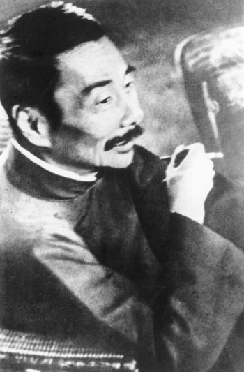

# ＜天权＞猛士鲁迅

**在我看来，生活而非批判才是鲁迅思想与文学的主题，可就像闰土这样再日常不过的形象，也以最去意识形态的方式告知着世界的沉沦，更遑论统治者的残暴、民众的麻木、卖国者的涎脸和“正人君子”的虚伪。鲁迅先生的眼睛，总能一眼发见那些林立着的、形态各异却同样凶狠的恶人。故尔，先生的文字，愈读，便愈会有一股荒腔走板、失声痛哭的冲动，那是最为真实的绝望。**  

#  猛士鲁迅

## 文/ 后愚（北京大学）

 

我从小便是喜欢鲁迅的，尤其喜欢老先生的愤怒，那时，我常以为这种愤怒是真性情，而“真”无疑是可爱的。

迅翁的易怒是每个人都能轻易发现的，在他的作品中亦常有“我已经出离愤怒了”之类的句子。出离的愤怒，愤怒之下便总有怒斥，这怒斥的对象又不止于人，有时却更要指天划地，直接说到了人间，若是怒极，他便必会说“我只觉得我所住的并非人间”，我曾觉得这一点与战国时的孟子颇有些相似，孟轲先生到了不能忍处，便会直接指着别人的鼻子大骂“是禽兽矣”。“是禽兽矣”、“非人间”，可不是一回事吗？

小时从长辈们那儿曾听到过这样一句话：“少不读鲁迅，老不读胡适”，那时并不明了其中的深意，等到后来历事多了，便渐渐清楚起来，原来前一句讲的是迅翁笔下常生绝望，年轻时读容易坏了雄心壮志。

这样，迅翁与孟子原是“貌合神离”的。我渐渐发觉，老先生的怒之前首先有一“悲”字，他论及的“非人间”里是有着“浓黑的悲凉”的。因此，与其说鲁迅是易怒的，更根本地，毋宁无说鲁迅是易悲的，迅翁之怒是“悲愤”，故尔，读起鲁迅来，多需长腔慢调，才能体会和宣泄出其中浓烈的悲情。而孟子却并非如此，他的愤怒常在于对方触犯了他的原则信条，对此，老夫子可并不觉得有甚可悲，怒骂之后，他照样“舍我其谁？”，故读起“孟子曰”，总需急人快语，方显出其中声势的激烈，孟子之怒所多的是“义愤”。

鲁迅的“悲愤”自于他的敏感，像一切优秀的文人一样，鲁迅的心比常人来的敏感，因此也比常人更容易动情，而情所以动，在于所经历和所见闻的。先生并非总见那龌龊，先生也见那干净与美好，“Ade，我的蟋蟀们！Ade，我的覆盆子们和木莲们！”，老先生的心也是分外柔软的。可只是，世界究竟怎样？亲眼所见的沉沦，怎不令人心生绝望？悲从中来，怒不可遏，先生这便要开骂了。

孔子讲“文胜质则史，质胜文则野”，鲁迅先生并非文学的科班出身，走的是野路子，不是技术流，也不太喜欢玩技术，这从先生的小说中可窥见一斑，鲁迅的小说几无剧情可言，比不得张恨水、查良镛，可我每读《故乡》，每读闰土，却总比赏玩英雄美人轰烈的爱情时更为动容，因为我发觉，闰土是那么地真实，我们每个人都会是闰土，丢失与被改变，甚至面目全非。这就是“质胜文”，思想盖过了他的文笔，可也因其“野”，才刻画了带“最”字的真实，那被我们唤作——生活，先生的笔所写的是我们忽视或不敢正视的生活。

在我看来，生活而非批判才是鲁迅思想与文学的主题，可就像闰土这样再日常不过的形象，也以最去意识形态的方式告知着世界的沉沦，更遑论统治者的残暴、民众的麻木、卖国者的涎脸和“正人君子”的虚伪。鲁迅先生的眼睛，总能一眼发见那些林立着的、形态各异却同样凶狠的恶人。故尔，先生的文字，愈读，便愈会有一股荒腔走板、失声痛哭的冲动，那是最为真实的绝望。

可仅止于绝望，成就不了伟大的鲁迅。绝望与希望非不能并生，所以，先生还讲“将来”，还讲“使命”，还讲“拿来主义”，在他荒凉的笔调下总不鲜见类似的话语：“创造这中国历史上未曾有过的第三样时代”，“创造”，鲁迅又彷佛是相信着未来的，他人生字典的抬头镌刻着希望二字。

洞悉世态致使的绝望，与生长于内心永不磨灭的希望，这两种天才的情感交错纠结于先生的笔端，于是，即便是再迟钝的人也会发现鲁迅的文字是忽冷忽热的，来自世界的绝望之风劲吹，那是数不尽的苍凉；希望从泥土里生长，又是坚韧温暖的力量。

若干年前，我曾以为，敢为人之不敢为者便是最大的猛士了，可历了些事，见了些人，我才知道匹夫之勇是不足道的，真正的猛士乃是知其不可为而为之，先生便是这样的人。“敢于直面惨淡的人生，敢于正视淋漓的鲜血”，这何一不是鲁迅先生自己的写照？唯有敢见那最绝望、却仍能在心中升腾出希望的人，才配成称得上——猛士，这是天底下最悲壮、也最有力量的人。

读书的时间愈长，我愈相信，一篇作品所以不朽不在于修辞做得如何之美，而在于里头贯穿了强大的生命意志，对，文字是有灵魂的，先生的文字从来在以生命和生活书写，“刑天舞干戚，猛志固常在”，这是鲁迅挚爱的句子，他从来是周旋于万千人中做那独自奋战的勇者，以那高扬的生命意志“固执”地发出这世间最深沉的不平，读鲁迅的人都知道，这样的声音是任谁也磨灭不了的。

 

（采编：陈锴；责编：陈锴）

 
