# ＜天权＞献给孩子们（三）

**编者按：作者去青海旅游的时候，特意安排前往玉树，从西宁买了些文具和糖想带给灾区的小朋友。到了玉树后，问路时巧遇藏族志愿者罗格，他是传媒大学大一的学生，利用暑假来玉树支教。罗格带作者等去了他所在的学校，作者被当地恶劣的灾后环境、受灾的求学少年儿童以及辛勤耕耘的老师所震撼，于是结束旅游后，作者返回玉树，在当地停留了16天进行支教。作者回北京组织了两次募捐，并由朋友押送物资到玉树。** **玉树天气温差很大，现正值春寒料峭，如果朋友们有各类衣物，或书籍等学习资料，可以邮寄到以下地址，地址是玉树利民学堂求松校长的家，他肯定会把物资发放到灾民手中的，考虑到二手衣服可能会产生疫情，所以希望大家还是捐赠新衣服，感谢。** **援助物资接收地址：青海省玉树县胜利路71号玉树州关爱生命协会 求松（收），邮编：815000。**

### 

# 献给孩子们（三）

### 

## 文 / 小5（首都师范大学）

### 

### 

我突然想起一个人，在去青海之前，在多背一公斤的网站上偶然看到一个电话，就是玉树的当地人，打过去，竟然是真的，是位堪布，我理解的就是僧人里的博士。他一直和我保持着联系，我去玉树的时候，他恰巧不在，后来因为我手机没电，他到的那天没有联系到我，至今都很遗憾没有见到他，他第二天又打来电话，很自责，说这次也没有帮到我什么，期待有缘再见，在玉树见。这一行，总是遇到这样的好人。 其实我心里早就做了决定： 在走的那一天，次松老师不说话，把一条洁白的哈达献给我的那一刻起； 在走的那一天，当他们围在车窗前，挥手对我们说再见的时候，没有人哭，都在微笑，我想他们都在为我们祈福的那一刻起； 在走的那一天，坐到了长途车上看着窗外的景色，那样的不舍，不知道眼泪重复的掉了多少次的那一刻起； 

### 

### [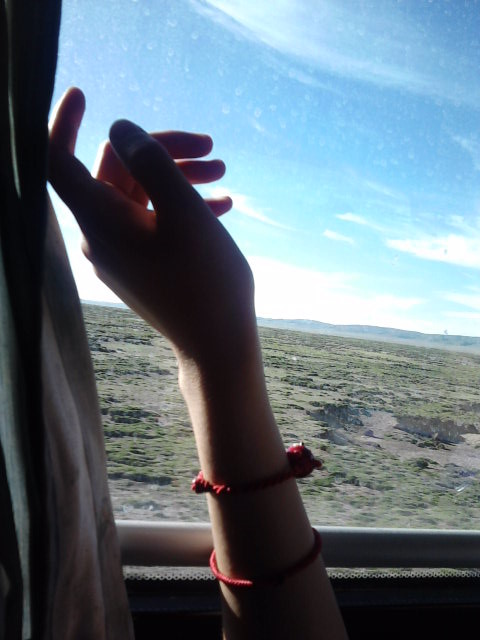](56dbbb8b-01eb-4f1a-bbcb-e6b9652806d6.jpg)

 我想，我和这片土地有缘，或许这里有我的前一世。 

### 

### [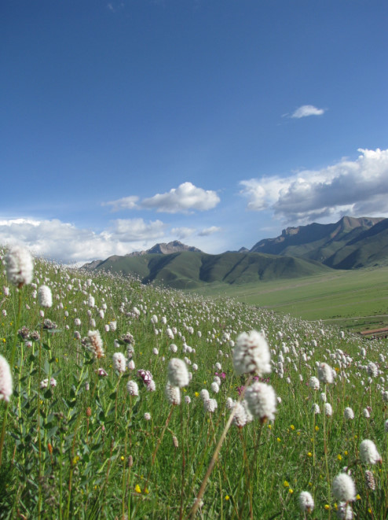](1c3f6f7d-7b18-4bb8-b9bc-96bcb11448c9.jpg)

 这次走之前（编者按，这是作者第二次到玉树之前），我写了遗书放在电脑桌面，写给爸爸妈妈看的，幸好，我完好无损的回来了，每一刻我都提醒自己必须平安，有那么多的爱没有对他们说出，有那么多的事情没有为他们做…… 但有时会想，在我还年轻的时候要去做我想做的事情，因为年纪再大些，身上的责任和家庭的责任就越来越重，或许就恨不下心这样做了…… 9月12号是薇姐的婚礼，老早就承诺她要当伴娘； 10月28日是爸爸的生日，希望给他过完这个生日再出发。 希望妈妈能理解和批准我的决定，我有预感，她会支持我，因为她能懂我的。 我不是虔诚的教徒，或许我这辈子也没有超脱的心境成为一名教徒，但我还是祈祷，就向老天爷祈祷吧，祈祷你们所有人平安、幸福，祈祷我的爸爸、妈妈健康安乐，祈祷一切美好的事情。 

### 

### [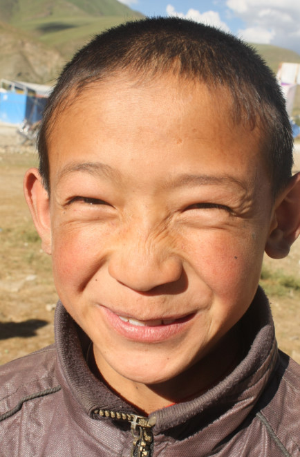](546380e3-a9d8-47c3-81a0-c2f8d3392f41.jpg)

 活脱脱长的像个可爱的小猴子，在我还没有和这些孩子熟悉的时候，有一天，政府捐赠的书籍到了学校，学生们自发地帮老师一起卸书，把书搬到图书室，摆放整齐。由于我要写一篇关于捐赠图书的简报，收集包装书的牛皮纸总结书名，我满处在找牛皮纸，不一会儿，他站在我面前，小手里攥着一沓牛皮纸递给我……在走之前要和他照相，他害羞地躲开了，然后我就先和别的孩子照，他又有种羡慕的表情，在照几个人的合影的时候，他突然闯进了镜头，还是害羞的笑着，就那样笑着。 

### 

### [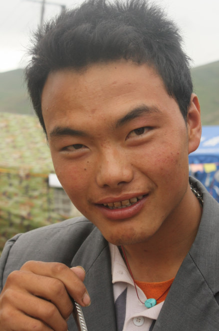](8c61d266-f173-43d9-8051-ac6d05ab57bc.jpg)

 摘自另一位志愿者的日志： 我不知道这个学生的名字叫什么，以前也没太注意过他，大概是因为他太沉默的缘故吧。今天中午在图书馆整理书时，有两个男生进来看书，他们看的是一本讲人体结构的藏语书，两人一边看，一边在身上比划着相应的部位，不知道为什么，只看到他们用手比划，却听不到说话的声音。其中的一个学生叫吾金文桑，我对他印象特别深，上次罗格他们走时，他用钳丝给每个老师做了一份感恩的礼物。 正好这段时间做图书馆图书的分类录入工作，需要对所有的书编号，我就请吾金文桑帮忙，他非常乐意，很快就学会了怎么做。上课了，他们两个一起离开。下课后，吾又回到图书馆，接着他前面编过的号，一言不发，认认真真地做起来。我没想到他还会回来，更没想到平时那么活泼的他能坐下来这么的安静，他的安静，也感染了被各种各样书的分类弄得有点焦躁的我，于是整个下午心中都充满愉悦。 

### 

### [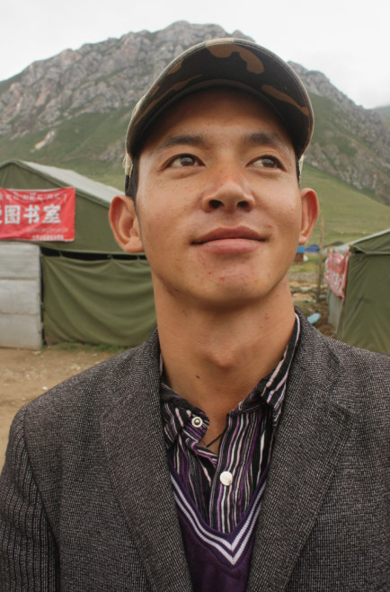](df32b659-8d75-463c-b07e-823aebf1e580.jpg)

 他，很帅吧？穿戴总是那么整齐，阳光的笑容，总是文质彬彬的，他是个哑巴，勤奋好学，很有心的一个孩子，对他了解并不多，以下摘自另一位志愿者的日志： 原来另一个男孩是吾金文桑舅舅家的孩子，是个哑巴，在唐卡班学习画唐卡，他也很喜欢做钳丝。他们两个人看起来很亲密，边看边交流，满脸的欢喜。看了一会藏文的书，他们又换汉语的插图故事书，一直看到快要上课的时候。学校里面会认字的学生不多，像他们这样能看懂而又好学的学生，今天我还是第一次看到。走到唐卡班，看到吾金文桑不会说话的兄弟，像是要融入他画的唐卡中一样，神情安定，脸上洋溢着快活而又淡淡的微笑。看着他们，真的就如陈冲说的一样，和这些孩子待久了，你会发现他们每一个人都不同，你会喜欢上他们，不想离开他们。 

### 

[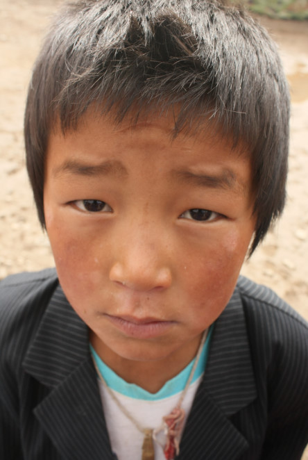](cd034148-99ad-4b98-884d-2c42a4f283fa.jpg)

 一脸无辜的小样儿，别想欺骗读者，呵呵！上课的时候就数你话最多，最淘气！当然，老师记得你钻到黑板后面帮我找粉笔的小身影，记得你抢着到黑板上来填单词时候举得高高的手，记得你举报其他小盆友上课随便说话时候严肃的表情，记得你帮我维持班上纪律时候小大人的样子，嘻嘻。 

### 

### [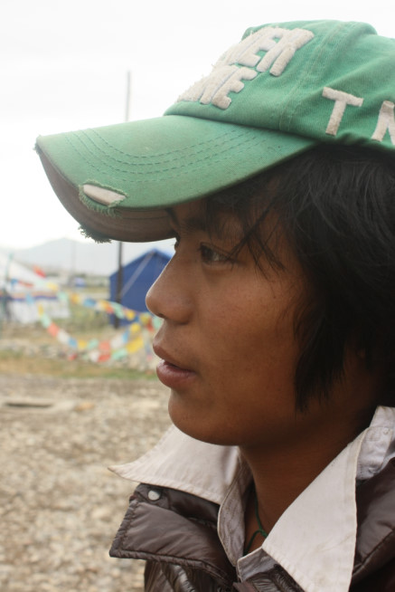](85e11edc-d841-4de7-b52c-1568384109db.jpg)

 曲英，一个瘦瘦的男孩子，这次地震中失去了很多亲人，在唐卡班学习，我们写了材料给家庭极为困难的孩子申请补助，他是其中之一。记得我在写东西的时候，他站在旁边看，看到我的手，他惊讶为什么这么白，然后拿出自己的大黑手，和我的比较，自己嘿嘿地笑。我还欠你一份唐卡颜料，我记得。 

### 

[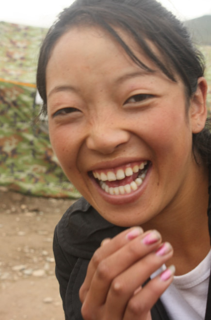](93f513d3-c994-49a1-8df1-1a5690d21ccd.jpg)

 很害羞的巴桑卓玛，每次与她眼神接触的时候，她会微笑着对视一下，然后害羞地避开。唱歌很好听，总是坐在靠后的位置，我想可能是因为她的汉语水平不是很高的缘故，没有太多的自信坐在前排。走到后面一字一字地教她发音，她很困难地学着，觉得自己的发音不好，羞怯地笑，但是还是努力地跟着我反复的读，直到读对为止。轮到她到台上唱歌，她和其他2个女孩子躲在教室的角落里捂着嘴乐，不好意思唱，其实他们每个人都有一副好嗓子，纯净的声音，我好像看到了某个阶段的自己，也曾这么害羞过，这种人往往有种不服输的韧劲儿，终有一日，她会自信地站在讲台上。 

### 

### [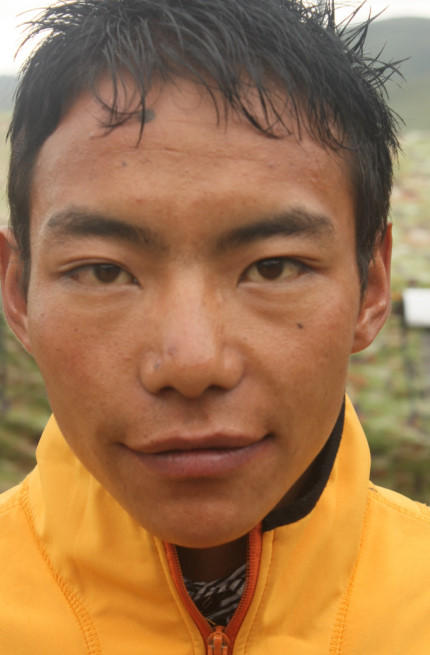](26cb87ba-638f-4be3-8c97-d95ab43ce255.jpg)

### 

嘎玛，坐在巴桑卓玛的后面，看起来很稳重，比较内向的大男孩。见了面总会微笑地冲我点点头，没有什么过多的交流。对于那些调皮、稍微外向点的孩子，不用担心和他们的交流，但对于稍微内向点的孩子，在短时间里我还真没法子和他们有过多的交流，有点后悔为什么自己不主动…… 

### 

### [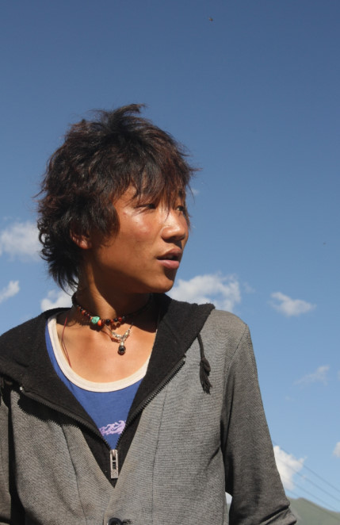](a418a02f-8ffe-4369-9be8-c7142104088e.jpg)

### 

型男！特有范儿，还特有喜剧效果的大男孩。每次看到他晃悠悠地走着，嘴里哼着小曲，我就忍不住想乐，有一次实在没忍住，看到他迎面走来，我就笑了，他看见我笑，但又不知道我为啥笑，那种不知所措的表情停留了两秒，他也笑了，特别搞笑的那种笑，然后我就更笑的不行了……他是我们学生时代都会遇到的那一类男生，看似吊儿郎当，看似不务正业，但其实他们有颗纯良的心，讲义气，是条汉子！ 

### 

### [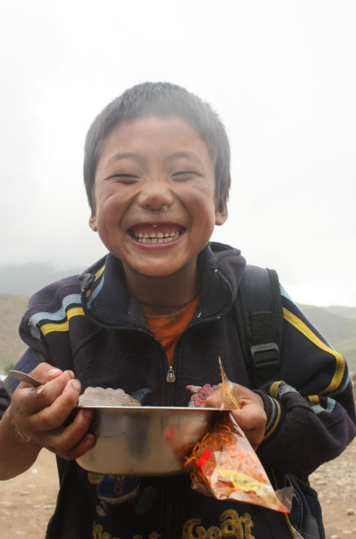](7d50f4d2-f0af-4aeb-9724-af5ef8e3d065.jpg)

### 

就这个还冒着鼻涕泡的家伙，可机灵了。我留了的作业，他完成得还不错，递上来给我，叫着：“老师老师，你看我写的，你看看我写的。”然后其他同学听到后，也争先恐后地把作业递给我，一时间，我被包围了，一双双小手举着作业本都要递给我看，他说：“别吵，你们让老师一个一个的看！”大家稍微安静点，他突然就说：“老师，先看我的！”我以为他要维持秩序呢，原来哈哈，还是有点小私心的。 

### 

### [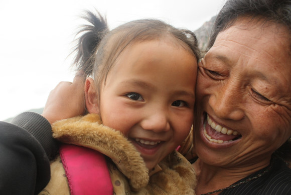](cbe2ccf6-311e-453a-a01f-1ed8056394de.jpg)

### 

之前的日志有过这个小女孩的照片，可爱杀手小卓玛！哎呀，谁遇到她谁就得中招……打开零食包，第一口绝对是喂到你嘴里的，然后奶声奶气地央求你抱着她，没写作业就央求到：“姐姐，那个太难写了，我就没写……”一脸委屈，眼泪马上呼之欲出，顿时觉得我留作业是难为孩子们了……离开的时候，卓玛阿姨抱着她在车窗外和我们道别，她挥着小手甜甜地说：“姐姐，再见，姐姐，再见。” 遗憾，没有与每个孩子都有接触和对话，许多孩子的事情我还不知晓。这些仅是我接触到的孩子们，仅是我与他们接触的点滴，他们还有更多的故事，那里面有好有坏，有调皮捣蛋不听话，也有感动得让你落泪的。 还记得第一次见到罗格，他说这些孩子每个人背后都有许多故事，很想为他们写一本书。 就像其他志愿者说的：相处久了，你会发现这些孩子都不一样，你会舍不得离开他们的…… 我希望能有机会记录他们更多的故事，真的，善的，当然也有让人生气，让人无奈的，真实的就好。 

### 

### [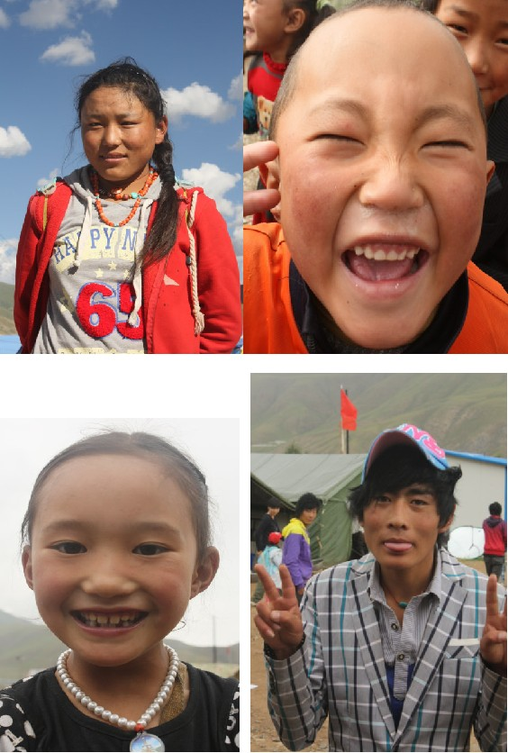](28a543cc-c56f-4cf0-8cff-a0fbe92d26ae.jpg)

### 

[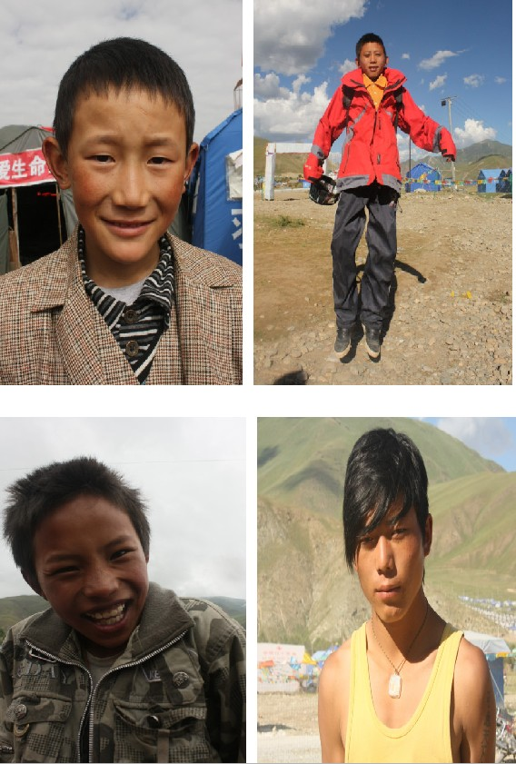](13080db7-5ad9-48e3-a356-d7417538b950.jpg)

[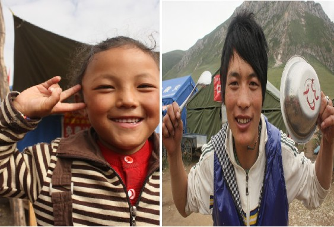](d2736e3e-4db7-4490-8865-7001f9c051d7.jpg)

在京华时报上看到一名玉树的学生已经被清华大学提前录取，心里有种欣慰的感觉，虽然知道那种几率真的太小了，但是还是有一点点的奢望就是这些孩子也能有那样的机会，就算上不了一流的大学，也可以接受更多的教育。 

### 

### [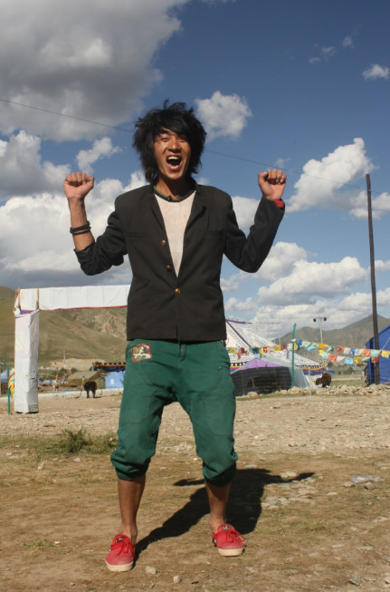](4e1c23ee-17af-4816-96b6-56f50626d4c7.jpg)

 吼吼，很喜欢阿布这张，有力量，有朝气。 

### 

### [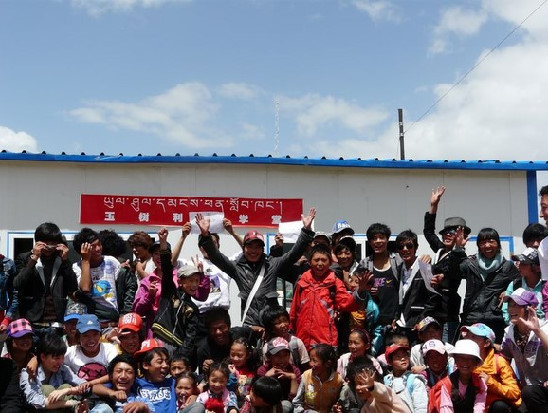](1cc7b15f-b31d-40e2-87bd-465c4a6f7622.jpg)

 从罗格的日志上扒下来的，是他最喜欢的合影，也是我最喜欢的。 未完，待续。 

### 

### 

（编辑：黄理罡）
