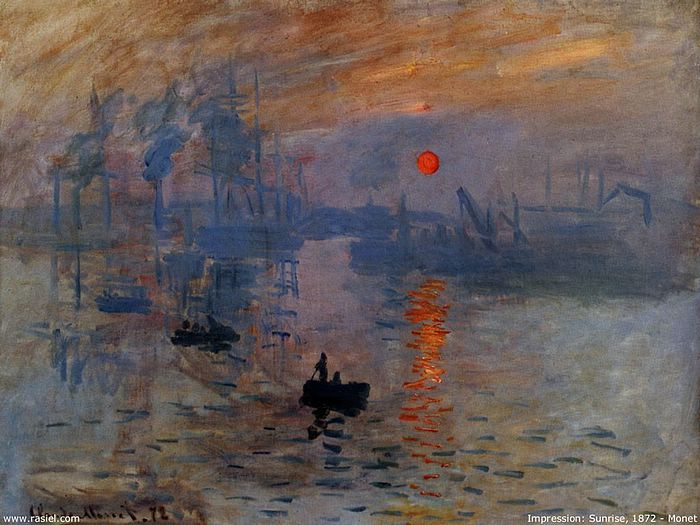
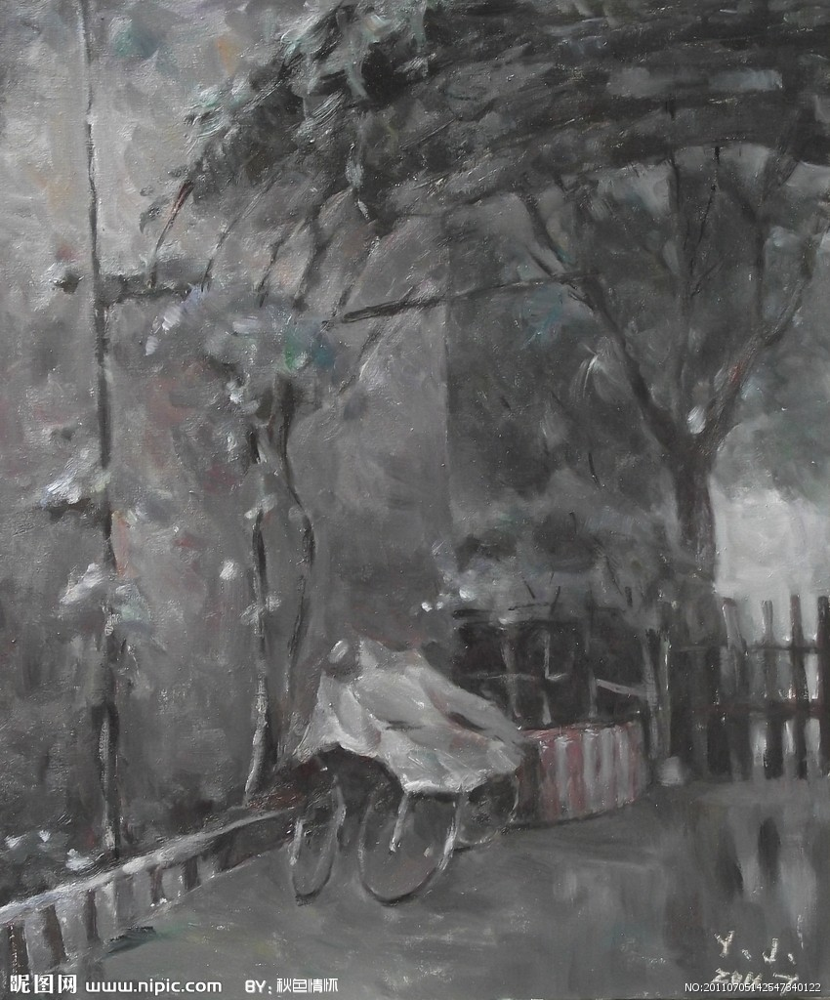

# ＜天权＞现代诗两首（二）：第二天日出

**少年，希望你以前坐过的火车和以后坐的火车能够如莫名的期望一样安稳千年。一切都是轻浮的，某个乡下的故乡，烧起了火。那些嚎啕的声音，透过这雨，听不见。**  

# 第二天日出

## 文/应小野（石家庄铁道大学）

 

#### 第二天日出

注：祭奠林昭78冥诞所作

夕阳驾驽的马车之下，必有箴言。

冬天，摧枯拉朽的白桦树，白骨累累的竖起，

新年的爆竹，响在脚镣的叮当声中，

那些骨瘦如柴的树枝上，挂着大月亮。

鸦群没有散去，

在草纸上写下血流成河，罄竹难书，

身体慢慢轻浮着，

手铐轻浮着，

囚衣轻浮着，

夜晚，飘在荒外。

走吧，走吧，

伴着初春的露水，

三角轮的马车;

走吧，走吧，

路上的野果下，

长着红罂粟;

走吧，走吧，

马车的轮子下，

长着红太阳。

 

#### 雨二则

（一）

意外是一个礼物，因为不可控，也是一个惊喜。

——前面的话

呜咽，我没有呜咽。

无力，我没有无力。

泪水，全无。

石家庄。

外面下着雨，

混沌，光怪陆离。

少年，

希望你以前坐过的火车和以后坐的火车能够

如莫名的期望一样

安稳千年。

一切都是轻浮的，

某个乡下的故乡，

烧起了火。

那些嚎啕的声音，透过这雨，

听不见。

 

（二）

南方，湖干了

我们捧着屈原的尸骨，在污泥之中

就像我们小时候抓泥鳅的游戏

最近

我总感觉到 一场预谋

那些水划破气流

划破柳絮三月 来到五月

朝着我的眼球

飘来

这样一场倾盆大雨

那些泥土活着雨 成了泥

让我想起

是谁挖出我的尸骨

 

#### 隐居

——致房龙

“一伙瘦弱又狂热的信徒在距各地千里之遥的山中潮湿的帐篷里苦苦自修，那些孤儿寡母和伤病者当真能从这种行为中受益吗？” 房龙如是说

在落难的空谷之中，

深知悲伤即将降临草原，

如同黄昏笼罩朝阳一样自由。

天堂在沙漠，

每一个沙砾都是主的。

祈祷，一刻不休，

帕肖米尔斯隐居了，

我们贫穷了，

从此，我们每天睡两三个小时。

 

骆驼穿过针眼都比一个富有的青年人进入天国要容易

——《路加福音》第十四章第二十三句

 

（采编：应鹏华；责编：黄理罡）

 
