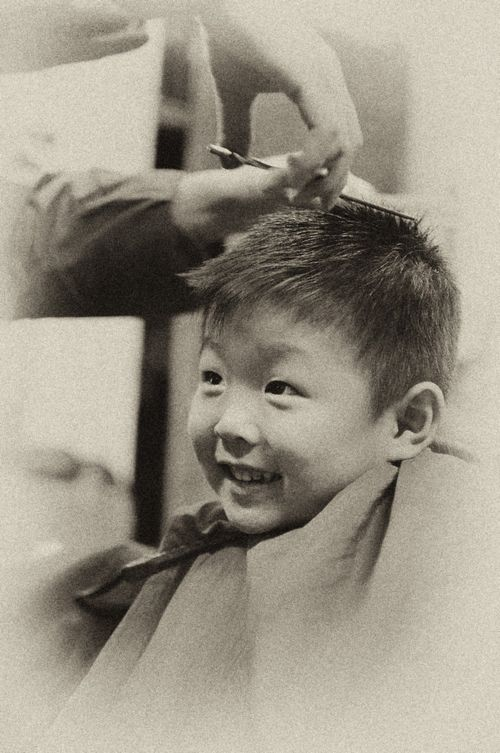
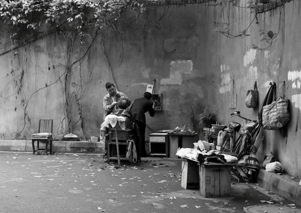

# ＜天权＞理发师的手

**不论是在学徒经历中曾到大街上为建筑工人提供过多少次免费的剃头服务，还是在创立自己名下的品牌之后曾为多少位当红歌星设计过演唱会造型，他也依然看不透，他们中任何一块颅骨包裹之下的思想，是什么样子。** **这或许就是为什么，他要跟顾客说话。**  

# 理发师的手

## 文/周雨霏（中国人民大学）

 

第一次去发廊理发，耳朵被理发师触碰到，我不禁颤抖了一下。

小时候的世界里是没有发廊的，只有“剪头发的地方”。剪头发的地方是一个机关单位宿舍旁的老旧门面。每次跟妈妈走过梧桐树遮天的宽敞街道，拐进巷子里的剪头发的地方时，师傅都会转过来瞄一眼我们，说，坐，等半个小时，然后继续严肃地处理眼前的任务。

经常有退休在家的老干部光临剪头发的地方，因此排队剪头发的次序也就时常被打破。我是在那个时候从妈妈口中学会了一句台词：“让列宁同志先走。”虽然不知道列宁是谁。排队太久，我就在店里走来走去。走到洗头发的地方，看见一个跟厨房里洗菜用的水槽没有二致的水槽，心想，人要怎样在这里面洗头发呢？正想着，理发师引着我爸爸来到了水槽边，爸爸的大圆头已经被剃成了一个薄到头皮隐约可见的平头了。爸爸双腿一分坐在了板凳上，手肘撑在大腿上，把大头埋在水槽上方的带有机械的冗杂感的水龙头下面。师傅拧开热水，水顺着爸爸的脸流下去，带下细碎的头发渣滓，带下泡沫花花，糊满了眼睛，扬起了蒸汽。

剪头发的地方有一种僵硬的、畜肉加工厂的气味。当然，我没有去过畜肉加工厂，但关于这种味道的想象却十分浓烈。理头发的地方的地上堆着一蓬一蓬的人类头发，乱糟糟的，像《动物世界》里猩猩的体毛。剪完体毛的人，被牵到水槽边，像牛喝水一样弓腰伏在水槽上，师傅像搓洗一只猴子一样搓洗一个头。动物肉块被搬运和搓洗所孕育起来的沉默气息充满了整个空间。

但是发廊不一样。耸立着橘红色短发的瘦削理发师系着时尚的黑布围裙，用手指轻轻地碰到了我的耳朵，使得我整个身体禁不住狠狠地颤抖了一下。被触碰的一瞬间，我对我作为一个人类的耳朵的认识和理解达到了我整个人生都不曾达到过的高度。耳朵上被陌生成年男子猛然侵占过的部位，竟然过于长久地保留着被侵占过的痕迹，直到第二天中午才消退。

十多年来我一直都记得耳朵被触碰的感受，曾经反复回想、体会和分析，从来都不肯轻易而坦荡地，将那种莫名震颤的缘由归结为少女情绪。

烫染剪吹那么多年，我早已对理发师手指的触感脱敏了。任他们怎么摆弄我的耳朵、额头、脖颈甚至肩膀，我都不再会有害羞的感情产生。但我仍然不习惯跟理发师说话。

不知是谁最早立下行业规定，理发师剪头发时，一定要跟顾客说话。沉默是不被允许的。理发过程必须是一场活泼、轻松、愉悦、心有灵犀、惺惺相惜、肝胆相照的互动。

经验丰富的理发师的手，已经摸过了太多的头颅，恐怕早就不觉得一个人的头是其隐私了吧。他们长期站立在旋转椅的旁边，以常年不变的犀利目光注视镜中轮替变换的无数头颅，一眼看穿了头盖骨的长势、发迹线的原本位置、发质的软硬、发梢的分叉数量、洗发的频率、昨夜睡觉的姿势、常用的护发素厂牌以及上次理发时犯下的不可原谅的错误。任何复杂的参数都可以在一眼的瞬间里被铭记在心。

可是头皮之下的东西，是看不穿的。这是否能使一位获奖无数的首席造型师感到偶然的恐慌？任由他怎样注视、触碰，大脑都不会自行打开来讲述内里的秘密。首席理发师在回首人生时会觉得有点遗憾。不论是在学徒经历中曾到大街上为建筑工人提供过多少次免费的剃头服务，还是在创立自己名下的品牌之后曾为多少位当红歌星设计过演唱会造型，他也依然看不透，他们中任何一块颅骨包裹之下的思想，是什么样子。

这或许就是为什么，他要跟顾客说话。

与顾客说话时，他不经意地发现自己的嘴巴变成了第三只手。只要他在适当的情境下讲出适合的话语，顾客的嘴巴就会温顺地被他掰开，他就可以把手指伸进嘴去，顺着牙齿，翻过舌头，掏空上颌，渐渐探入那个他向往已久的温暖潮湿的洞穴里，触碰到柔软的思想本身。他能够摸到思想柔韧的机理，及其突突跳动的韵律。再深一点，他的整个手掌都将被思想粘稠的汁液给包裹住了，思想将毫无抗拒地，将自己的秘密吐入他的手心。

首席造型师临终前头发已经掉光了，他把最年长的弟子叫到床前，留下了他最重要的一句遗言：“一定要跟顾客说话。”

“干我们这一行，阅人无数。” 耸立着金黄色短发的瘦削理发师一边修理着我的刘海，一边对镜中的我说。

“哦。” 我说过，我不喜欢跟理发师说话。

我取下眼镜什么都看不见，凡是人脸在我的裸眼视野中，都是一块斑驳的肉色豆腐。我无法跟豆腐说话。比如眼前这块发黄的豆腐。

我取下眼镜的时候，通常是睡觉、游泳、查视力和理发。前三项都不需要与人社交。睡觉就闭上眼睛睡；游泳就一个劲地游；查视力就胡乱地指指上下左右。都不用说话。唯独理发，我既看不到理发师的样子，也看不到自己的样子，整个世界一片闪烁不清，在这样混沌的宇宙中还必须要张嘴说话，想起来就可笑。

其实，我原来是很喜欢跟理发师说话的，后来才不喜欢了。因为我总在理发的时候说出一些不该从我嘴里说出来的话，事后想起才后悔。哎呀怎么又是这样多嘴，都快把身家性命说到别人手里去了。庆幸，我并没有在任何一家理发店里长期驻扎的习惯，那些听过我取下眼镜之后胡言乱语的理发师，在后来的生活里我再也不会遇见。

恐怕是遇见了，也像没遇见一样。因为我不曾看清过他们的样子。

有时候我很害怕。走在街上，看见一张张清晰的面容飘到眼前，这时只要我一取下眼镜他们就会马上都变成肉色的豆腐，没有五官，没有情感。这样我就不能跟他们说话了。我怎么能跟肉色的豆腐说话。肉色的豆腐蠕动着表层的褶皱，发出说话一样的声音，呶呶呶，就像已经埋葬了一个月的尸体突然诈尸，从坟墓里坐起来蠕动着已经腐烂了一半的嘴脸说，呶呶呶。

如果我的眼镜丢失了，我就不能说话了，因为全世界的人都将成为行尸走肉，直到下一副眼镜配好，世界重新清晰，死人复活。

这个金黄色短发的理发师废话尤其多，他已经从多个方面角度猜测过我的身世命运了，这会儿他正在赞美我的鞋子：“你鞋子真好看。你是学艺术的吧。”

“差不远。”我呶呶地混过去，不理睬他。我一定要坚持住，不能理睬他。

为了不让自己被他的思路牵着走，我开始闭上眼睛反过去猜测他的身世命运。刚没取眼镜的时候第一眼看到他觉得有点像甄子丹，《叶问》里面那种感觉，猴手猴脚的。我一向觉得打中国功夫的人都有点猴手猴脚的。《叶问》里面那个一派宗师的感觉还不错，没那么猴手猴脚，感觉很正派，腰杆儿挺得直直的，就像《白鹿原》里的白嘉轩。江湖气息不那么腥野，老大嘛，总要有点端庄作态。《白鹿原》里面那个宋先生也有一种端庄的感觉，但那不是老大，那是读书人。冷先生也挺端庄，但那也不一样，可能，有点像《功夫》里面那两个拿着乐器来打架的杀手。阴森森的。嗯，冷先生就是阴森森的，简直不像中医，就像个算命师傅。一看你的眉毛形状就知道你会什么时候死那种。

诶刚才我是怎么想到冷先生的呢？哦，我在推测这位黄毛小哥的身世命运。说他长得像甄子丹。理发师。算命师傅。或许，这位小哥他爸以前就是算命师傅，或许他祖上曾经是算命世家，要不刚才他看我那眼神怎么鬼鬼祟祟装神弄鬼的。他们家曾经世世代代是街边上摆摊儿给人看相算八字的算命师傅，历朝历代的皇帝都迷信这个，所以他们口口相传的安身绝技也就安全无损地延续了一千年。突然有一天，新登基的皇帝看不惯这些封建迷信的东西，下令除四旧。结果是算命这种腐朽的骗人把戏当然也要斩草除根。生活就在那一天轰然倒塌了。这个算命家族最后一名传人有一天正抓着一个孕妇的手在给她说命，突然穿制服的人就走过来，掀翻了他的铺面，把他抓到牢里，棒打了几个回合，一天半夜里放出来之前对他说，以后不许再从事违法经营。

遍体鳞伤的他跪在高墙的脚下瑟瑟发抖，一抬眼看见草丛里躺着一把闪亮的剪刀。

算命世家最后一位传人成为了一个剃头师傅。跟所有在朝代翻覆重建过程中被碾压得不成人形的劳苦人民一样，他毫无怨气，兢兢业业，勤劳勇敢，一点一点重拾起倾覆之前的家产积蓄。这个剃头师傅一直觉得那天那把突然出现在眼前的剪刀是老天爷显灵。那会儿他浑身虚弱，可是一拿起剪刀握在手里就感觉到浑身一震，只觉得世上再没有这样称心如意的物件了，虽然他甚至还没用那把剪刀剪过任何东西。他奔回家，把女人从床上拉扯起来，顾不得她惊慌失措，就把她按坐在凳子上，自己则绕到她的身后，静止下来，慢慢地、轻轻地捋着她因为侧向一边睡而被枕头压弯的鬓角发丝。仔细而专注的抚摸所带来的快感，使他禁不住浑身颤抖了一下。剪刀在黑暗里发出阴冷的光，锋利的刀刃跃跃欲试，他握住女人一绺发丝的末端，噌地一刀剪下去，剪刀与头发碰触传递到他指尖的感受甚至比用手直接去摸还要强烈，那一声风过竹林一般的“噌”，激荡得他竟然瞬间产生生理反应，忍不住尴尬地叫唤了一声。

“你怎么了？！”

“……没怎么。我们得救了。”

剃头师傅靠着手中一把剪刀过上了舒畅日子。被他剪过头发的顾客个个都格外满意他的手艺，一而再再而三要他给自己理发。理发馆的生意兴隆，顾客络绎不绝，剃头师傅的家里也逐渐热闹起来，因为女人为他生下一个乖胖的儿子。

女人在产房里发出最后一声惨叫的时候，剃头师傅突然冲了进去，吓了接生婆一大跳。他径直抱起刚刚出生脐带还没剪的胎儿，不顾它浑身上下红的紫的血污粘液，只是准准地看清了它两只手十个指头是否齐整，便又将其放下，大步流星地走出产房。

儿子满周岁时抓阄。母亲轮番递给他钢笔、勺子和钞票，他都不要，他直愣愣地盯住一把剪刀，径直爬过去把玩起来。站在一旁一直默不作声的剃头师傅这时候像突然醒过来了一样，拿掉儿子手里的剪刀，抱起他来到浴室把他的两只小手结结实实地洗了三遍，然后拿出一副早已准备好的橡皮小手套，给儿子一只手指一只手指地戴上。儿子嚎啕大哭，他丝毫不管不顾，直到小小的手套与小小的肥手完全贴合。

自那以后剃头师傅的儿子再也没取过手套。只有洗澡时才取下，洗澡时父亲亲自为他褪下手套，让他把两只手伸进一缸掺入了肥皂的清水中搓洗，然后举到水龙头下冲刷至冰凉，然后又戴上一副崭新的手套，开始新的一天。

手套一天一天地长大，儿子五岁了。五岁生日那天，下了入夏以来最大的一场雨。剃头师傅，叫来儿子，第一次在并非洗澡的时间取下儿子的手套，用黑布蒙上他的眼睛，引着他来到庭院中央，让他伸手去摸一个女人的头发。

这个女人是他的母亲，她旁边还坐着另外一个女人，有着和他母亲一样的发型。父亲想让他光用手指去辨别哪一个是他母亲的头发。儿子自满周岁以来就没摸过任何人的头发，包括他自己的。那把剪刀是他五岁的人生中摸过的最后一样日常世界里的东西。四年来他一直生活在橡皮手套的世界里，一切都是朦胧的、含糊不清的，所有东西摸上去都是一个感觉，像豆腐在嘴里的口感。只有在梦里，世界顿然清晰，梦里他挣脱了手套的束缚摸到很多东西，狗的舌头、瓦片的边沿、妈妈的胸脯、爸爸的剪刀。每一个都不再像豆腐那么浑浊，那么遥远。

那天午后，天气很热，父亲取下了他的手套。闷热被一下释放了，凉风争先恐后去亲吻他的手指缝，指背上的汗毛敏锐地立了起来，被夏日的空气拥吻着，包裹着。他突然无由来地产生一种朦胧的预感，从今往后他都不用再戴手套了。他被蒙上眼睛，被领到阳光下，他依然小小的圆滚滚的手臂被握住，抬起来，然后他便触到了一个女人的头发。

他触到了一个女人的头发，他曾在那个女人的腹部和胸怀里安然沉睡，他曾握住这个女人的手学会走路、学会用筷子，他曾经在偷偷想要取下手套被父亲发现并痛打时躲到她的身后，他曾经隔着手套摸到过这个女人的头发，那时的头发是豆腐，而现在，是头发，只是头发，他一摸到就知道是头发，一摸到就知道……

“妈妈！”惊叫声伴着哭腔撕破天空，引发一条闪电劈响在午后的夏日天际，顿时间滚滚炸雷轮番敲响开来，汤圆那么大的雨粒一下子噼里啪啦地杂碎在庭院的青石板地上……

剃头师傅看着这一切，仰面朝天跪倒在地，一脸雨水。

“剪完了，你看怎么样？” 黄毛小哥一脸冷漠地看着我戴上眼镜端详镜子里的自己。

“还不错。”

“你的故事也不错。”

 

（采编：佛冉；责编：刘铮）

 
