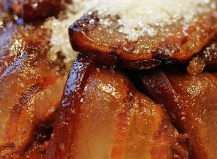
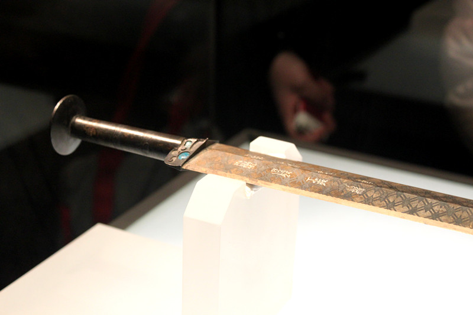

# ＜天权＞甜烧白的一夜

**理想的生活，乃是左手拿着葡萄，右手捧着美酒，嘴里含着凤梨，一面细水长流就算无用也乐悠悠，一面气喘嘘嘘抓着疲惫生活的英雄梦想绝不放手。倘若生活没了能让热血再度沸腾悲喜沁人心脾的爱情，那这个世界仅剩善与恶的二元判断，将不啻于哈米吉多顿的战场，眼望之处，再无新绿，皆成焦土。**

# **甜烧白的一夜**

## **文/回形针（苏州大学）**

one night in 北京，有多少寂寞的心涌动在百花深处。4月19号这日子，也随着柳絮飘飞花粉暗涌莫名地变得暧昧潮湿起来。随着英语入侵了中文，改革开放引来了思想开化，暗恋不再是件酸酸甜甜的事儿，亦难免俗被调侃得活色生香春意盎然起来。往年握着衣角的我喜欢你，变成了人人网上满屏新鲜事求合体。不禁要让人怀疑这世上哪里还有能种山楂树的清净地，可以撂下那无处安放的青春给个地儿长出一口气。 幸而人总是能找到法子自娱的。虽然不得鱼水之欢，却不能挡我一满口腹之欲。尽管这样的放纵往往带来荷包干瘪体重飙升，然则，所谓痛快就是这般不痛不快，并无一件事能够两全其美。在满座的餐厅里排队侯位，一面瞄着菜单心里喊贵，一面努力抵挡着飘散的香辣酥麻味道。吃川菜在快节奏的生活里仿佛变成了一种聚餐时心照不宣的通则，似乎不麻不辣不红火则不足以挑逗萎靡的胃口。唉，是现代人口味重也好吧，是天然甘味食材难得也好，今天我都不想要，只想吃一道甜得发腻浓情化不开的甜烧白。 

 说到甜烧白，最早还是从郝明义先生的《越读者》里面识得。他拿来比喻一场好的阅读旅程需要一味完美的甜食来收尾，而我，很不幸只记得了甜烧白这道菜，都怪他把这货描写得太销魂： 那天最后上来的是一道点心，叫“甜烧白”。盘子里，雪白的一个糯米堆，糯米堆里包着红糖煮过的豆沙，糯米堆外披着一片片薄薄的、肥腻适中的夹层肉片。混合着糯米、红糖煮过的豆沙、酥软的五花肉片那一汤匙才入口，你就知道，一部来到最高潮的欢乐颂，有了完美的收尾。所有因麻辣而绽放的味蕾开始回收，让你从另一个角度体会什么是甜而不腻，以及人类为什么要如此恒久追寻甜食的秘密。 提拉米苏，是大家很熟悉的一道甜点。意大利文里，TiraMisu的意思是，这道甜点的美妙，可以“把人拉进天堂”。那天我真的是从那道甜烧白上，体会到了这一点。 所以当我发现住处附近就有以甜烧白为卖点的馆子时，身为一个老饕激动的心情你们能不能理解！或许可以类比为，在公共场合窥见多年不见的情人，欲言又止口拙心热，明知多说无益，却又不由自主的靠近吧。 坐定下单等菜翻书的时候，我才惊觉这个餐厅的灯光是多么地柔和！沙发是多么地柔软！就连新闻联播听起来也变得那么地柔美！当然若不是这样的环境，也配不上我今日不计后果但求一爽的心境。然则看着书不禁又纠结起来：三十块买本好书，可以消化很久。三十块买件衣服，可以得瑟很久。三十块吃道甜烧白，当然也可以满足很久，可是会长胖！！！而且没营养！！！大油大肉高糖高热！！！吃完还要心疼！！！还要产生负罪感！！！我这不是花钱找罪受是什么！！！  不过当甜烧白姗姗而至我的面前，我终于举筷投降了。 暖橙的灯光下整齐地伏在糯米上的五花肉片薄薄的，呈现温润透明的反光。糯米被油脂浸润得饱满弹滑，这一垛饭团渐次藏匿着黑芝麻、红豆沙、花生碎，底层混杂着粗粒的红糖和白砂糖，咬到嘴里咯嘣蹦地响。 这精美的点心，真的没什么用处，至少是缺乏食补益身的价值。营养不足，吃多反胃。除了提供只有甜味和油脂能带来的幸福感，除了让你脑细胞通过味蕾共享柔腻芬芳，除了让你吃几筷子就感叹一声生活真美好之外，实在没有什么用处。因为觉得“无用”，而不去品尝它的人，永远不能从生活中摄取“享用”这个词的真正意义。 花朵有什么用呢？爱情有什么用呢？阅读有什么用呢？它们对不需要美的心灵的确百无一用。然而人生如此短暂，急冲冲地考证拿本结婚生子立业安身，一路闯到关底，其实是最简单的事儿。不需要想象、冒险、渴望和好奇，贯彻实用主义，拒绝禁果之味，抹杀了无用功不必要的耗散，结果也不过是一样的归零。人生的终极归宿，我们早就知道。宇宙的生成和奥秘对我们有什么用？时间的本质和意义我们能拿来干什么？可是，让昔日的无名工匠最花心血铸造且最容易失败得融掉重来的，不就是青铜器上那些无用但漂亮得不得了的花纹吗？ 

 唐诺在《阅读的故事》里说到：“每当有人，尤其是手握生杀大权的人，想起来用效率，用重要不重要、有用没有用来逼问时，往往就会带来人自由心智的委顿和书籍的瘟疫性浩劫。柏拉图要建造一个斯巴达式、万事万物皆有功能且环环相扣的理想国家，无用（无用即有害）的神话就得全数消灭，所有的诗人也得一并被逐走。秦始皇要留下有用之书，于是便只剩下筮、天文、农艺等几套丛书，其余的全数化为燃料，我们可想象一下，当诚品书店、金石堂书店只剩这三组书时，那是多么荒凉可怖的末日书店景象。” 无怪乎我们经世致用的时代有着如许之多的夫妻失和，家庭破碎，愤世嫉俗，情绪失调。怪只怪我们的一言一行一举一动，都太精简了，太目的明确了，太坚定了。恋爱为了快感，相亲为了结婚，一夜情为了舒筋活络，上学为了找工作，读博士为了硬通货，实在是有失魏晋风骨，先哲遗韵。 停箸喝一口清茶，我环顾餐厅，竟而找不出一个可以用“无用”来形容的女人。高级餐厅里的女子，一个个看起来踌躇满志意气风发，撒娇也是目的明确的，微笑也是暗含伏笔的。一望便知受过良好的教育，虽不着套装黑丝，也个个文艺优雅。面容紧绷身材瘦削，犹如现代版的程灵素。这样的女子，带上厅堂分外长脸，进了厨房特别给力。她们会嘱咐你早起早睡帮你养生，让你少吃油盐忌口海鲜，亲手为你烹调一日三餐三碗菜是煎豆腐、鲜笋炒豆芽、草菇煮白菜，那汤则是咸菜豆瓣汤。她们品位高雅不低俗，谈吐清新不紧绷，敏感话题笑而不语，金融形势了若指掌。研究的专业是外行人一辈子看不懂的高深课题，连导师也牛逼闪闪言行分外拉风。 这般的女子，虽然秉承实用主义的神髓，却太过出尘闪眼，让人不禁捏一把汗怕生活总有一天硬生生把她们逼成李莫愁、公孙绿萼，乃至灭绝师太。反观金庸笔下另外一位著名的美艳人妻康敏，虽然天生丽质，奈何出身贫寒，混到最好也只是个丐帮副帮主夫人。可是人家深得风月精髓，善于制造生活情趣，颇有戏剧女王风范。君不见她牡丹花边杨妃姿，杏子林里怨妇装，雪夜温酒咬流氓，华丽抢镜风流出位，男人在她身边个个小宇宙爆发犹如打了诗人之血，就连执法长老白世镜也能吟出“天上的月亮白又圆，不如你的赛蜜糖”这样的香艳词句，不由得让人长叹，红颜祸水就是艺术缪斯，没了她们，世间不知要多了多少寒冷寂寞不成眠的长夜。 想来康敏的爱情太过甜腻，没人能招架得住。可是程灵素的日子又索然无味，好像7-11万年不变的萝卜海带豆腐魔芋关东煮。理想的生活，乃是左手拿着葡萄，右手捧着美酒，嘴里含着凤梨，一面细水长流就算无用也乐悠悠，一面气喘嘘嘘抓着疲惫生活的英雄梦想绝不放手。倘若生活没了能让热血再度沸腾悲喜沁人心脾的爱情，那这个世界仅剩善与恶的二元判断，将不啻于哈米吉多顿的战场，眼望之处，再无新绿，皆成焦土。 生活是一段太过漫长的求索之道，在找到真正的快乐之前，别被清粥小菜洗了脑，别放弃对桃花源的寻找。或许正如荷尔德林所说：“新的幸福向心灵敞开，是当心灵能顶住，熬过忧伤的午夜，而人世的生命之歌，只有在深深的痛苦之中，才能像黑暗中的夜莺的歌唱神妙地传到我们的耳畔。” 当然，有朝一日，当我们的理想在这里开花，我们的抱负在这里结果，也别忘了甜烧白的功劳。想吃的话，自己去找，不包邮哦亲！！！  

（采编：黄理罡 责编：黄理罡）
