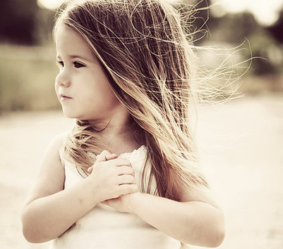
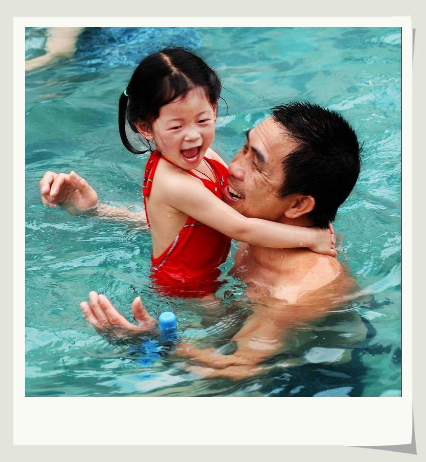
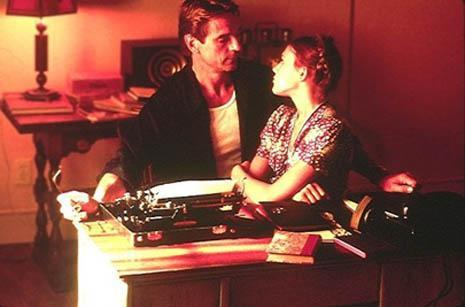
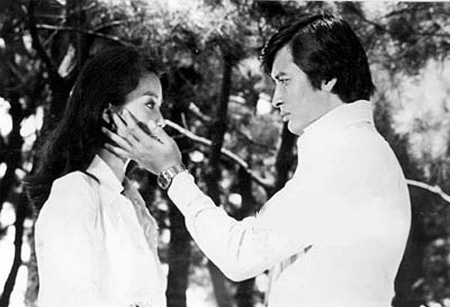

# ＜天权＞男人与女孩

**按霭理士所说，在两性关系里男子本来有某种统治的欲望，而女子有某种被统治的欲望。虽然激进的女性主义者显然不乐见女性对男性的崇拜和依附，但波伏娃的时代已经过去，现在的女性主义甚至也变得更为“民粹”：既然少女喜欢老男人，那么让她得到老男人似乎才是唯一真正的幸福，而试图让她意识到她其实是个受虐狂（况且也未必真的如此）则是多么的惨无人道。**  

# 男人与女孩

## 文/ E姑娘（中国人民大学）

  “简，你肯嫁给我吗？” “肯的，先生。” “一个比你大二十岁的瘸子，你得侍候他的人。” “是的，先生。” “当真，简？” “完全当真，先生。” 

——《简•爱》，夏洛蒂•勃朗特，1847

**“许多年轻女性都喜欢比他们年长很多的男人”**

在海明威的短篇小说代表作《白象般的群山》中，一对男女在异国的火车站里讨论他们是否要堕胎。在不到一千五百个单词的全文中，海明威始终把男主角称为“男人”，把女主角称为“女孩”。

当一个作家决定把他的角色们称为“男人”和“女孩”时，让人好奇的，倒不是他所做的关于某一小说的决定，而是他究竟怎样获得了关于现实世界的这一想象。为什么精益求精的小说家会认为他所需要的是“男人与女孩”，而不是“男人与女人”，或者“男孩与女人”？

事实如此：许多年轻女性都喜欢比他们年长很多的男人。

对于二十岁上下的“女孩”来说，同龄的“男孩”远不够成熟。缺乏男子气概。太磨叽。没有一份像样的事业。她们青睐的是遥远某处更为模糊和完美的真正的成年男子形象——《简•爱》的罗切斯特或者《傲慢与偏见》的达西先生：高大英俊，成熟可靠，能把她带入一个全新世界，哪怕有沧桑的过去。

简•奥斯丁的另一篇小说《爱玛》的女主角爱玛二十岁，而男主角奈特利先生有三十六岁。奈特利先生饱含深情地回忆他是如何看着爱玛从小女孩长大成人。多年以来，他是她认识世界的导师（他的名字奈特利就是“骑士般的”），直到他们终于发现，如果他们要和世界上的某个人结合，那也只能是对方。

哪怕现在我们已经很清楚哈姆雷特是一个中年男子，我们还是坚信他的奥菲利娅只是个少女，而非三十岁的大龄萝莉。事实上，威廉•莎士比亚本人的妻子安妮•海瑟薇比他年长八岁，他们婚后八个月就生下了第一个孩子。文学史研究者由此认为他们草草结婚的原因显而易见——可悲，似乎让男性接受更年长女性的唯一原因就是难以启齿的原因。小龙女比杨过年长四岁，于是我们发现金庸如强迫症一般反复解释小龙女从外表到内心都天真年少。也许对于大多数人来说，杨过爱上李莫愁才是最不可以接受的事情。

**“她们同时在男性伴侣身上寻找生殖崇拜的男性特征，和如童年时受到母亲爱抚般的女性特征”**

通俗文化研究名作《阅读言情小说》中，作者简妮斯•拉德威沿用弗洛伊德学派的观点，剖析女性读者的“女性俄狄浦斯情结”（恋父情结）。她们的理想伴侣显然应该像父亲一样坚强可靠。除此之外，女性在童年时期受到的母爱，也会转移到成年后寻找另一半的要求上，于是她们同时在男性伴侣身上寻找生殖崇拜的男性特征，和如童年时受到母亲爱抚般的女性特征。拉德威由此得到全书最精彩的结论之一，即女读者心目中理想的爱情模式应包含男主角——尽管他要尽可能地富于智慧和男子气概——对女主角的一些母性式的关怀。

一个“男孩”很难成为“父亲”，恐怕更难成为“母亲”。而一个“男人”，除却是一个“父亲”，他对这个世界的理解兴许也足以让他，在适当的时候，成为一个“母亲”。

我的朋友阿方二十岁，说她愿意接受比她年长二十岁的异性。老人的话是对的：女孩子比男孩子早熟。如果她要和一个异性建立亲密关系，而开朗和能干的她反而要成为他的“母亲”，这确实不是我们想见的结果。她说她并非不喜欢同龄男性本身的为人和性格，只是他们确实缺乏某种岁月赋予的魅力。也许，十五年后，他们就会变得非常吸引。

尽管大多数年轻男性必定不会因此而打消寻找女朋友的念头，但我的另一个男性朋友，也只有二十岁，热爱日本动画，却表示暂时不考虑恋爱——直到他摆脱“正太”身份，修炼成“大叔”。

**“假如她真的爱上一个年长男子，她也很可能会获得在《洛丽塔》小说中所熟知的那种关爱”**

但究竟是女性对于更年长男性的幻想造就了文艺作品中层出不穷的“男人与女孩”，还是文艺作品建构了女性受众的想象？罗切斯特先生说：“（你是否愿意嫁给）一个比你大二十岁的瘸子，你得伺候他的人。”简•爱说：“是的，先生。”《简•爱》全书带有强烈的基督教色彩，罗切斯特年长、“负罪”、“恩威并重”，简•爱要去“伺候”他。夏洛蒂•勃朗特给女性读者创造了一种献身式爱情的想象，而献身的对象应该是个受过苦难的圣人，不可能是纯洁无瑕的少年。

一百年后的《洛丽塔》更为赤裸裸。它其实是一本男性话语的小说，纳博科夫竭力创造和描绘的是“男人”对“女孩”的想象。然而当女性读者开始阅读这本书，反向带入到洛丽塔去想象亨伯特，她所构想的便不仅仅是“女孩”对“男人”的爱慕，而进一步把“男人”对“女孩”的迷恋视为理所当然。她开始把小说场景变为一个背景事实：她开始相信，假如她真的爱上一个年长男子，她也很可能会获得在《洛丽塔》小说中所熟知的那种关爱。

“渴望年长男性，是寻求一个可依附的权威”

在根据《圣经》改编的文学经典《失乐园》中，弥尔顿描述上帝用亚当的一根肋骨造出夏娃，此后夏娃却不被允许观看水中倒影里的自己的脸。后世的女性主义评论家认为弥尔顿的夏娃（显然不完全是《圣经》原本的夏娃）是“被塑造的女性”：她从未得知自己真正是谁。上帝未能给她自己决定自己是谁的机会。夏娃所知道的一切均来自亚当，亚当是她绝对的领袖，正如弥尔顿写道“（女性的）美貌比不上男性的光辉”。

今天的女性大概不会再认为自己“比不上”男性，但无法否认的是，年长男性始终有强烈的“导师”象征。或者说，从根本的某处，渴望年长男性，是寻求一个可依附的权威，渴望被征服和统治。

1933年，哈夫洛克•霭理士在他的《性心理学》第一卷中写道：

“男子的施虐恋和女子的受虐恋……不过是正常的性冲动的过度发展而进入性爱狂的境界罢了，但若男子有受虐恋或女子有施虐恋，那就成为转向的歧变，而和正常的状态完全相反了。”

按霭理士所说，在两性关系里男子本来有某种统治的欲望，而女子有某种被统治的欲望。虽然激进的女性主义者显然不乐见女性对男性的崇拜和依附，但波伏娃的时代已经过去，现在的女性主义甚至也变得更为“民粹”：既然少女喜欢老男人，那么让她得到老男人似乎才是唯一真正的幸福，而试图让她意识到她其实是个受虐狂（况且也未必真的如此）则是多么的惨无人道。

**“如果爱，年龄都无所谓。”**

奥地利演员赫尔姆特•贝格是一个同性恋者，也是意大利导演维斯康帝的最后一个情人。1976年，维斯康帝在69岁上去世，贝格只有32岁。他晚年回忆说：“三十二岁，我成了维斯康蒂的寡妇。从此，人生再无欢愉。”

在琼瑶的《窗外》中，高中女学生与男老师相恋。然而琼瑶用几乎破框*的力道给了浪漫小说一个惊人的结局：男女主人公被拆散后，女学生再去寻找过去的恋人，却发现潇洒迷人的老师经受不住打击，已经变成邋遢和萎靡的中年汉。

当满腔柔情在女学生的心中变为恐怖，我们开始知道，“男人与女孩”的想象是可能破碎的。然而在西班牙的火车站里，海明威的“男人”与“女孩”各自伤怀时，他们的不幸绝非从根本上源自他们的年龄。连亘在他们之间的“白象般的群山”，在其他情侣面前，可以同样冰冷肃杀。

正如阿方告诉我：“如果爱，年龄都无所谓。”爱上年长男人也许并不是因为我们挑剔年纪，而恰恰是因为它无关紧要。

（采编自投稿邮箱；责编：陈锴）

 
