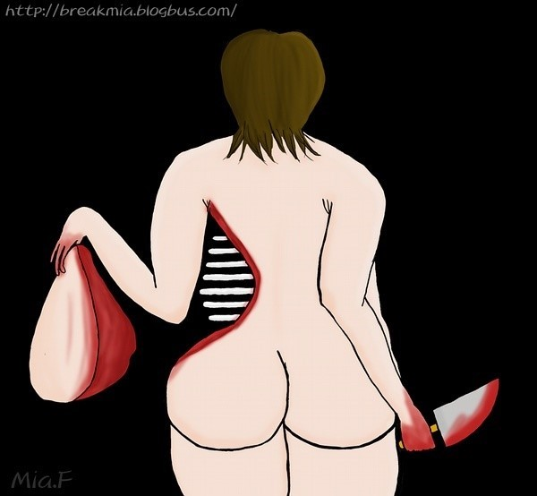

# ＜天权＞真相

**她死去后，就成为一块廉价而闪闪发光的肉，见者争相食之，用以点亮此后的灰败人生。**  

# 真相

## 文/方慧

 

初中时有个女同学被人害了，先奸后杀，裸露的尸体绑在路边的树杆上。这件事震惊了整个市，上了电视，上了报纸，最终成为一个著名的事件。

当时班里因为成绩差而长年畏畏缩缩不发一言的男生，也突然话多了，放学路上眉飞色舞地给别班同学讲这个女生的一切，讲刚开始是谁发现她失踪的，那一天班里如何炸开锅，他们如何私底下打赌她的去向，甚至他和女孩某年某月说过一句话，也一个细节都不放过地描述，仿佛因此沾了光。所有人都围着他认真听他讲话，他享受这种被重视的感觉，因沾沾自喜而愈加唾沫横飞。我鄙视他，我朝他吐了口水，而他受欺负惯了，不敢望我。

我为那个女生哭过。在那之后的一整年我都在想念她，我记得做早操的时候她站我前面，她头发长而天然卷，柔软，我每天搓揉它们。她英语好，死前那几天还在准备奥林匹克竞赛，我座位离她很近，时常顺手翻翻她那本比赛题库。她叫我时，说“小方慧啊”。她性格软弱，老师一批评就哭。她好告状，我往垃圾桶里丢苹果核，丢歪了，她对班主任说了，班主任让我站了一堂课，我因此而记恨过她。但当她死后，这些全部成为珍贵的回忆，我一次又一次地温习，温习，直到咀嚼得难辨真假。此后多年，我又分别对很多朋友讲起过她，有时还是会哭出来，我想念她，她是我的好朋友。

但很偶然地一次，也是很多年以后了，我回想起一个画面。那就是一次去食堂吃饭，我端着饭盘和她碰面然后擦肩而过时，我没有和她打招呼，她也没有和我打招呼，我们面无表情地眼睛扫一下对方就转移开来。

这是一个很恐怖的记忆片段，它越来越清晰，好像就在眼前闪过，几乎颠覆了我对自己的认识。你知道那意味着什么吗，意味着我从头到尾想起来了，我和她并没有那么要好，简单来说，我和她只是最普通最普通的同学关系。

我哭，不过是因为我享受那样的哭泣。我在哭泣一件很著名的事件，而那个事件我也有发言权，我和那被我吐唾沫的男生没有分别。我甚至，无数次在脑子里清楚地浮现出她被绑在树上的尸体，但我很快又理清楚了，我没有看到过，只是因为班里一个最讨厌的男生不厌其烦地描述过他跑去现场时看到的一切，而我以为当时我也去了，并且为此而哭，而震颤。

又一次，同学相聚，我从老师那里知道了一个更加恐怖的事实，那就是班里所有人都人前人后地为她哭过，为她写过泪迹斑驳的周记。而那女生根本沉默寡言，只和她同桌交过朋友，没那么多友情。

她死去后，就成为一块廉价而闪闪发光的肉，见者争相食之，用以点亮此后的灰败人生。

 稿件来源：http://www.douban.com/note/180569752/  

（采编：宋晓慧；责编：黄理罡）

 
