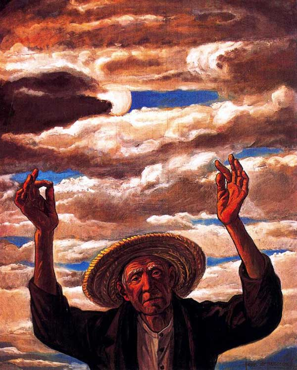
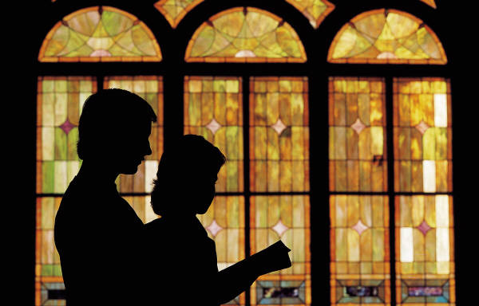

# ＜天权＞祭女萨日朗的死

**除了各种动物的声音，萨日朗从来也听不到什么神。她坐在黑暗里，挂在塔楼上的眼睛，就像一头看着猎枪的鹿。瞳孔里还映着跳舞的人群和篝火。一闪一闪。所以当一个男人走进她的房间时，她慌乱不堪，她又没有舌头。如果神要她传达什么，她要怎么办呢？**  

# 祭女萨日朗的死

## 文/汪海鸣（上海戏剧学院）

 

萨日朗昨晚十六岁生日，她第一个醒来。整个村庄彻夜未眠，还浸泡在酒精和性爱的梦里。

他们把每一个庆祝萨日朗诞辰的日子当做盛大的节日，因为老人说她和先知同一天出生。

很久很久以前，这个同样叫萨日朗的先知教会了村民怎样生火，酿酒，以及跳舞。

这些受神宠爱的少女从出生就被定为祭品。

既然我们说了萨日朗，那就以她为纪年法吧。

一个月前的一天，也是这样一个雾蒙蒙的清晨，老人们总说没有太阳是不好的，通常这天大家都像瘟疫来临一般躲在帐篷里，懒洋洋的，不愿意出去。

哦，对了，萨日朗每个生日都有雾，他们私下里认为这很糟糕。

可萨日朗喜欢雾，因为每年生日都有雾。

这些乳白色的不知道从哪里过来的冷冰冰的，额，说不上是液体还是气体，就像是远道而来，翻山越岭来看她的一个亲人。

萨日朗深吸一口气说，那是从森林里过来的。父亲就甚为忧愁。

我们继续说一个月前的一天，萨日朗走出帐篷，沿着河流，一边唱歌一边走。

这时看见了一匹受伤的黑马，躺在草丛里呻吟，萨日朗去抚摸它，它就安静，掉眼泪。

萨日朗跑去叫醒全村的人，希望把它救回去。然而老人们认为，在一个有雾的天气，清晨，看见血污，是一件罪恶的事。

萨日朗在家里哭，父亲抚摸萨日朗的头发，脸颊，亲吻她的脖子，他抱住她，直到她哭累了趴着睡着，他把她抱回毯子上。

然后松开她，走了出去。

那是一匹野马，半个钟头后，村庄再次被嘶鸣声吵醒，有人说萨日朗的父亲被野马踢死了。

萨日朗在睡梦里，听见一片马蹄声，践踏在心脏上，把整个胸腔都踩得稀巴烂。

他们拿着刀，棍子，铁铲，点着火把，从清晨到午夜，去追杀这个杀人犯。一无所获。

萨日朗走在队伍的最前面——因为只有她能认出那匹黑马，带着他们在草原和河边不停绕圈，人们认为她因为悲伤过度而沉默不语，并且神志昏迷。

十六岁的姑娘很多已经嫁人了，可是萨日朗昨天晚上才知道，原来从今天开始她要被隔离在森林里最高的塔楼里，他们认为那是最接近神的地方，可以看见所有即将发生的事。

萨日朗走到河边时，已经有一个年轻人在等着她了。

呼和苏姆坐在河边低着头，萨日朗碰了碰他，他抬起一张满是眼泪的脸。

他说，萨日朗，你还不能爱我吗？

萨日朗摇摇头。

今天没有日出。为了能干净地和神对话，她的双眼被挖出，挂在森林里的阁楼，那一对黑白分明的眼睛，就像长明灯。

她的舌头被割掉，每个人都喝了一点放着舌头的酒，他们认为这会带来好运。

萨日朗那时也没有哭，萨日朗是不会哭的。她本来话就很少。

男孩说，我知道你的秘密。如果我说出来，他们不会把你送到塔楼里去。

萨日朗站起来，抓起一把草，胡乱砸过去，草叶纷纷散落。

呼和苏姆也站起来，说，你抱我一下，我就不告诉别人，我发誓。

萨日朗转身就走，走了十六步，就跑回来，男孩张开双臂抱住她。

可是呼和苏姆却不愿松开，他吻住了她，说萨日朗，我的好姑娘。

他开始撕扯她的衣服，恶狠狠地说，假如你拒绝，我就说出那个秘密。

萨日朗发不出声音，她就像安静的雾，散在地上，慢慢被吸干了。

太阳升起来了。萨日朗赤裸着躺在河边的草丛里，草尖上有水珠，她走进水里，把自己洗干净，然后回到了村庄。

河水很凉。这是萨日朗对这个村庄最后的触觉。

村庄不知多少年才出一个先知，这个塔楼已经荒废了很久。

除了各种动物的声音，萨日朗从来也听不到什么神。

她坐在黑暗里，挂在塔楼上的眼睛，就像一头看着猎枪的鹿。瞳孔里还映着跳舞的人群和篝火。一闪一闪。

所以当一个男人走进她的房间时，她慌乱不堪，她又没有舌头。如果神要她传达什么，她要怎么办呢？

男人跪在地上，说，神啊，难道人没办法摆脱孤独吗？

萨日朗抚摸他的头，他的脸上湿湿的，萨日朗心里也说，神啊，难道人没办法摆脱黑暗吗？

他们互相抚摸，亲吻，在厚厚的树叶上翻滚，忽然萨日朗听见森林里的嘶鸣和奔跑的声音，鸟群惊慌失措地逃开。

男人的动作停下来，还留在萨日朗的身体里。

萨日朗用手摸索着他的额头，像真正的神一样。

男人好像真的听到了回应，虔诚地说，神宽恕你，神救赎你。

萨日朗就这样，用女人的身体，医治着有病的灵魂。

他们通过忏悔，做爱，来把罪恶，羞耻，痛苦，留在萨日朗的身体里。

当他们干干净净地走出塔楼时，总有一匹黑马在远处，睁着乌黑的眸子，紧紧目送着人们离开。

这渐渐成为村庄里一个公开的秘密。所以女人都对萨日朗恨之入骨。

终于有一天，萨日朗怀孕了。

对于祭女来说，她的纯洁性遭到彻底否定，她和孩子的父亲，将受到严厉的刑罚。

全村每一个男人和女人，从来没有这么统一一致地，要弄死这个女人，他们生怕萨日朗在指认孩子的父亲时，会提供出卖他们的细节。

呼和苏姆悲伤地看着这个被村民围起来的少女，她肚子浅浅地鼓起来，额头光洁，像一尊雕像。

呼和苏姆不知道，全村只有他，没有在塔楼上和她发生关系，他认定了那是他的孩子。他的母亲就在旁边，一只手抓着他，嘴里小声咒骂着这个放荡的女人。

不知道为什么，每当男孩的手被母亲抓住时，就像施了魔法，全身的力气都消失了，他的手和嘴巴，软绵绵的像一个婴儿。

然而他生怕萨日朗真的把他供出来了，那他就全完了。

于是就在这时，呼和苏姆忽然站出来，对着全村的人说，我知道孩子的父亲是谁！

萨日朗坐在那里，嘴巴动了一下，人们永远不会知道她想些什么，她脑子里不断地在把这些说话的，和她记忆里的，以及阁楼上的三者对应起来，她发现这是一件耗时巨大的工程。

现在，她听出了呼和苏姆年轻的声音，她和所有屏着气等待答案的男人女人一样紧张，这个傻瓜，要说出来谁呢！

可是，呼和苏姆顿了一下，说，大家还记得一个多月前那匹撞死萨日朗父亲的黑马吗？人群里响起低低的议论声。呼和苏姆继续说，萨日朗不是带着你们一直转圈吗？你们都被这个女人给骗了！她其实一直把这个杀父凶手藏在森林里，偷偷去看它。而且，而且，有一天我去森林里捡柴火，那天清晨，有雾，我听见不远处有喘息的声音，觉得奇怪，于是顺着声音找，在森林深处一片空地上，我看见黑马伏在地上，萨日朗赤裸着身子，在——在——

在干嘛？人们咽着口水，兴奋地问。

萨日朗绝望地抬起了头，神啊，神啊，人什么时候才可以摆脱黑暗？

她想起呼和苏姆的身体，光滑，明亮，像刚升起来的太阳。满怀都是她厌恶的热烈和温暖。

在和黑马交合！呼和苏姆的声音像水溅进了油锅。

人群里发出一片唏嘘声，有人往地下吐口水，女人们尖叫起来，男人互相傻看着。

呼和苏姆继续说，如果萨日朗进塔楼前是处女，那么倘若她怀孕了，肚子里一定是和野马杂交的怪物！

这时忽然有人附和道，我们每次去祈祷时总能看见一匹黑马在阁楼前走来走去，难道这事还有假吗？

一群人忽然自告奋勇冲出去，说再也不会放过这匹黑马！他们带着刀，棒，火把，向着森林的方向走去。

萨日朗站起来，伸着双手，不停往两边安抚，有人认出她在做着宽恕众人的那个手势，好像受到侮辱一般。他们说，烧死这个女人！

人们的愤怒往往比善良传染起来要快。他们默契地约定，每家献出一些柴火。谁献得最多，谁就可以获得神最多的荣耀，烧掉最多的罪恶。

这时萨日朗开始挣扎，她把双手放在自己的肚子上，人们意识到，她希望保护这个罪恶的孩子。

于是刑法提前开始了。他们抓住她，把她放在木架上，像祭祀的一只羊。

萨日朗穿着灰绿色的长裙，像一把晒干的艾草。他们围着篝火，唱起了那首古老的歌。

他们喝着萨日朗酿的酒，跳着萨日朗教的舞蹈，围着萨日朗教他们生起来的篝火。他们恰巧淡忘女人教给他们的一切善良。

其实我想安排一个更优雅的结局——

黑马冲出了森林，一路奔跑到萨日朗面前，从火堆里带走了她。他们逃出人们笨拙的围攻，向着雾气升起的地方走去。 

裙摆有火，她光着脚，双手放在肚子上，就像一颗好像要升空的星辰。

现实的情节是很肮脏的，乌黑的烟升得很高，黑马顺从地跟着人们走，在火光里像一位天神，它的眼睛很亮，驮着满满的眼泪，眼珠好像要一起流下来。

这时，人们忽然沉默了。

不用走得很近，他们也可以看清，这是一匹怀孕的母马。

走近萨日朗时，黑马再也支撑不住，倒在火堆旁，开始痛苦地呻吟。

牲畜和女人的生产被认为是肮脏的，所以除了产婆没有人真正看到过生命的诞生。

除了这次，一个浑身是血的马驹在火光旁诞生。

没有人动，萨日朗在燃烧。

那天萨日朗就发现了这是一匹怀孕的母马，她没办法在失去父亲时陪葬两个生命。

而她在为黑马疗伤的时候刚好被呼和苏姆撞见。她抱住黑马，安抚它的疼痛。

呼和苏姆，真的以为她是一个恋马狂。

这是一个祭女的故事。不知道为什么，后来的人们总说成另一个词语。

然而，从那以后，村庄却不再有神明和先知了。

道德开始败坏，很久以后出现了一个真正的妓女，她也叫萨日朗，当然，那是另一个故事了。

  （采编：麦静；责编：麦静）  
