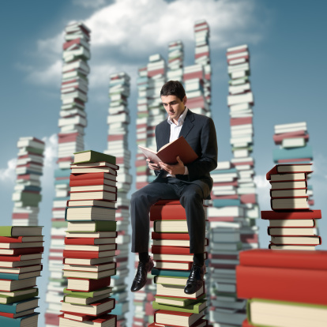
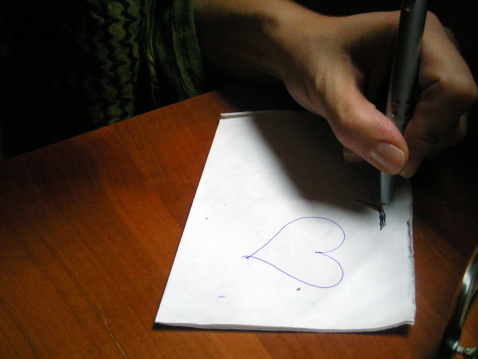

# ＜天权＞离理性太近，离灵魂太远

**理性和灵魂如同一对双生儿，二者的纠缠与争斗，贯穿了人类的整部历史。在昆德拉笔下，它们被称为重和轻；而在尼采那里，则被叫做日神和酒神。理性的缺席通向迷信和疯癫，而灵魂的失落则导致冷漠和虚无。在这个科技主宰的时代里，我们太容易相信理性的力量，从而沉迷于功利的计算，以致忘记了灵魂的存在。然而，符号、机械和逻辑终究不能代替情感、体温和信仰。在通往幸福之门的航程中，理性是路灯，是船桨，是桥梁；然而，只有灵魂，才是那可以揭示最后谜团的金色钥匙。**  

# 离理性太近，离灵魂太远

## 文/王也（北京大学）

 

To M, for lighting up my soul

一

我今年22岁，还未曾经历过爱情。

中学的时候，我想：高考为重，何况考上之后也是天各一方，再等等吧。大学的时候，我想：将来那么不确定，我既不帅，又没钱，能给她什么？还是算了吧。等考上了研究生，我想：我读书，她工作，再加上相隔千里，我们不会有共同的未来。读研期间，我想：我要出国，她会等我吗？还是找个志同道合的人吧。

我一直觉得，我所做的都是正确的选择。爱是多大的一份责任，没有做好充分的准备，怎敢轻言承担？一边努力让自己变好，一边默默地等着那个人出现，难道不正是一个理性的男人的作为？然而，有时候，我也不无焦虑地想：让我等了这么多年的那个她啊，你究竟在哪儿呢？

偶尔也会和朋友们开玩笑说：我虽然形貌猥琐，但好歹出身名校，前途光明；读书不少，家境尚可；性情温厚，也不乏幽默感，何以就是找不到女朋友？朋友总会安慰我说：这种事急不得，等等总会有的。我也颇以为然。

直到有一天，我和一位女性朋友聊起我苍白的感情史，她突然说：你呀，连青春都没有！

那一瞬，我感到灵魂深处被什么东西击中。猛然间我明白，我似乎计算好了一切，却忘记了，青春、激情和爱，这些东西是无法用理性的尺度来衡量的。也许，世界上压根就没有什么对的人。你现在看到的这对天造地设的情侣，当初可能全然不合拍。然而自从有了爱情，他们开始把对方当做生命中重要的一部分来对待，努力向彼此靠拢，彼此适应，最终才成就了今天的模样。你觉得，你对那姑娘来说，还不够好。可也许，人家根本不在乎你的未来，你的家境，你的相貌，而只想要你的笑容，和温暖的怀抱。

在这个物欲横流的社会里，爱情被赋予了太多附加的东西，以至于连真正渴望爱情的人，都会在她面前掂量再三，心怀畏惧。可是啊，爱情本身，毕竟只是两个相互契合的灵魂之间的厮磨和温暖。过于理性的考量，只会把自然激发的冲动和热烈消磨殆尽。我们总是顾虑今后的婚姻会不会幸福，却忘记了爱情才是婚姻最不可或缺的前提。我们总以为有了稳定的物质基础，爱情就会随之而来，却不知道灵魂的投契是可遇而不可求的缘分。人类终究是依赖感情的生物，而感情只有用感情来交换。我不敢说，真心的付出一定能得到回报；但我相信，爱的温暖可以融化最冰冷的灵魂。我不敢说，有爱就一定能幸福，但至少，当你回顾青春的时候，不会只看到一片刺眼的空白；当你步入暮年，跟儿孙回忆往事之时，你可以骄傲地说：我有过遗憾，但我并不后悔。

二

我已许久未曾翻开一部文学作品。

学习之余，也会忍不住从架子上抽出一部小说或是散文。然而还未翻开，那恼人的理智警察便要跳出来喊：“读那无用的东西作甚！”于是只得长叹一声，重新打开手边的《微观经济理论》或者《计量经济学方法》。

似乎在很久以前，我也是个会不时动动笔杆子的文学青年。然而最近一段时间，我却未曾记下只言片语。每当我说“呀，似乎该写点什么了”的时候，室友望着我的眼神便让我感觉自己如同火星来客一般，不得不讪笑道：“咳，也是，三大检验还没搞懂，写什么东西嘛。”久而久之，研究专业课竟成了一种习惯，以至于被同学扣上了一顶“学霸”的帽子。我倒不以为忤，至少说明我没有在虚度光阴嘛。

这个假期，我在网上认识了一位姑娘，她是个挺专业的文学爱好者。当我们讨论海子和埃兹拉庞德的诗歌时，我讶异地发现，我的感觉已经变得如此迟钝不堪，以至于完全无法体会诗人笔下那微妙的情绪。昨天夜里，我闲来无事，点开那姑娘的博客，随意翻阅，不意竟几度泫然欲泣。她笔下记述的，自己十八岁时的生活，像是有某种魔力，把那曾经的日夜相伴的孤独感再度从我身上唤起。一刹那间，我仿佛回到了本科时候，那一个个难以入眠的凌晨。黑夜沉寂，如同死亡。我躺在床上，睁大双眼，安静的空气，似乎能听到生命流逝的声音。那一刻，我读过的亚当斯密、熊彼特、哈耶克和罗尔斯们全都变得毫无意义。我悲哀地发现，我向理性走得太快，以至于灵魂已然跟不上脚步。我多么渴望，那个姑娘就在我的身边，让我可以抱着她大哭一场，然后听她给我读海子的诗：

“到南方去，到南方去，你的血液里没有情人和春天。”

我们花了太多的时间，来锻炼自己的理性，却忘了在夜深人静的时候，看一看自己的灵魂是否已经干涸。不要试图用理智去追问，灵魂的丰赡有着怎样的意义，须知灵魂乃是先于理性的存在。有空的话，多读读诗吧，多陪陪爱人，这会让你的生命从此变得不同。别忘了歌德写下的那句箴言：

“一切理论都是灰色的，只有生命之金树长青。”

三

高考填志愿的时候，我思虑再三，第一志愿报了复旦的数学系。我妈看到之后，有些紧张地问我：“为什么报这个？”她很清楚，我在数学方面，既无热情，亦无天分。“因为数学是基础，将来发展的空间大。”我答道。她“哦”了一声，没再接话。那个时候，我觉得自己的选择颇为高明：既然尚未决定以何为业，那就不妨选一个可塑性强的，反正人生还长着呢。至于喜不喜欢，高三都撑过来了，还怕再熬四年么？

事实证明，我错的很彻底。抽象的概念和深奥的理论，让我提不起多大兴趣；而复杂的证明和烦琐的计算，占据了我生活中的大部分时间。虽然还算努力，可成绩也只能在系里的中游徘徊。回首那段日子，我觉得用“黯淡无光”来形容，再合适不过。

毕业之后，藉由跨专业考研，我得以转行去读经济。如今，课业依旧繁重，成绩依旧一般，但每天的辛苦却让我感到充实和愉悦。这段经历让我深切地明白，去做自己感兴趣的事，这有着多么重要的意义。

现在看来，当初去读数学，不失为一个理性的选择，然而，大概并不能算是一个好的选择。所谓“理性”，不外乎是指收益最大，但收益和快乐之间，却并不存在简单的对应关系。快乐源自灵魂，源自人之本性。而大多数时候，我们会屈从于外界的压力和内心的虚荣，把梦想丢在一边，转而去追寻那些能带给我们短暂满足感的幻象。“我只是长大了，理智了，不再像小孩那样，整天做白日梦了。”我们一面这样自我欺骗，一面加速向痛苦的深渊沉沦。

我见过太多这样的人，他们去美国名校读博，不是出于对学术的热情，而是为了旁人歆羡的目光；他们选择职业是不是看自己的兴趣，而是看随之而来的收入和名望。他们成绩优异履历光鲜谈吐得体笑容自信，然而当我望向他们的眼睛，却甚少能在其中看到灵魂的影子。我时常想，这样的人真的幸福吗？一个整日忙于营造围绕身遭的光环，却甚少回头审视自己内心的人，他是否已经忘记了快乐的滋味？

更可悲的是，这些人被今天的社会奉为成功的圭臬，他们是环绕在我们耳边的“人家孩子”，是同侪之间攀比的标杆，是流传在师弟师妹之中的传奇。我们不在乎他们给社会做出了多少贡献，也不在乎他们光鲜的外表之下是否污秽不堪，我们只是一边紧张地喘着粗气，一边向台上颔首微笑的青年导师发问：“我想像你一样，该怎么做才好？”功利主义的毒药，已经把太多年轻的灵魂侵蚀得不成人形。凭作弊和小聪明通过考试的人得到追捧，把读书当作乐趣的人则被目为怪胎；靠弄虚作假求得名利的人被称为成功者，不计报酬献身公益的人却被斥作神经病。我们自以为靠理性之舵牢牢把握着航向，却不知自己正疾驶进疯狂的漩涡；我们精心设计了金光闪闪的人生通途，却未发现灵魂已经无处安放。每当我目睹这个国家最优秀的青年涌向体制内和金融界，每当我听说有留学生为了进华尔街不惜欺骗导师，我都忍不住学金斯堡发一声感叹：

“我看到，这个时代最杰出的头脑毁于‘理性’。”

一群没有灵魂的精英，将如何承袭这个民族的道统，将如何点亮这个时代的精神？我不知道答案。

四

刚接触经济学的时候，我曾是自由至上主义的坚定信徒。

古典的经济学理论，为我们勾勒出了一幅“人人为自己，上帝为大家”的美妙图景；弗里德曼和哈耶克的热情呼召，更让人每根汗毛都激动得竖立。

人是理性的生物，因而每个人都应有自由选择的权利，且能够为自己的选择承担责任。何必要金融监管？何必要食品安全法？何必要公立医院？优胜劣汰的竞争机制，将会自动筛选出最适合人类生活的“扩展秩序”。政府干预，在大部分情况下都毫无必要，自由市场会挥动“看不见的手”，让整个社会的福利达到最大。

然而，随着对经济学了解的加深，我日益清楚地认识到，现实世界并不那么完美。自由市场摆脱不了囚徒困境的诅咒，也解决不了世代交替中的动态无效率。面对信心的崩溃和传统的限制，市场更是无能为力。

或许更为重要的是，人类并不总如理论假设中那般，是谋求私利的理性个体。我们会为了已经丢掉的门票失落良久，会为了素不相识的同胞奋不顾身；我们前一天还立志减肥今天又会胡吃海喝，我们对小概率事件从来没有正确的理解。“理性的生物”，这一形容有时候近乎嘲讽。毕竟理性只是思维之海上露出的冰山一角，暗流之下不可捉摸的潜意识才是生活的真正主宰。就像社群主义者所说的那样，我们都被镶嵌于成长背景之中，都只是历史和文化的奴隶。

对于人类来说，经济效益并非生活中唯一重要的东西。我们是背负着灵魂的存在，我们不仅渴望富足，更渴望爱、正义和安全感，而这些都无法简单地用效用函数来加以衡量。自由当然也是不可或缺的价值，然而自由的程度，却要由理性力量的大小来决定。在要求毒品合法交易的自由之前，我们最好先扪心自问，自己是否能够抵御毒品的诱惑；在反对金融监管的时候，也最好先想一想，自己是不是在投资方面足够精明，从而绝不会被推销员的花言巧语轻易蛊惑。自由从来不是没有代价的，若把人类想象得过于理智和完美，则自由也会成为生命中不能承受之轻。

这一年来，在网络上和现实中，我看到越来越多的人举起了自由至上主义的大旗。他们鼓吹小国寡民，反对各种形式的政府干预，对凯恩斯主义嗤之以鼻。我于经济学只是初窥门径，对政治哲学更所知甚少，因而无力对他们的主张一一作出评判。我只想在此表达我的一点隐忧——毕竟，任何东西推到了极致，多多少少都会带来一些问题，我想自由亦然。我们不应该忘记哈耶克在晚年对我们的提醒：要时刻警惕“致命的自负”。对于理性和自由的过度信任，或许，也只是一种“知识的僭妄”？任何社会科学，归根到底都是研究人的学问，若离理性太近，离灵魂太远，则理论大概容易做的精致，但现实意义恐怕要大大地打个折扣吧。

理性和灵魂如同一对双生儿，二者的纠缠与争斗，贯穿了人类的整部历史。在昆德拉笔下，它们被称为重和轻；而在尼采那里，则被叫做日神和酒神。理性的缺席通向迷信和疯癫，而灵魂的失落则导致冷漠和虚无。在这个科技主宰的时代里，我们太容易相信理性的力量，从而沉迷于功利的计算，以致忘记了灵魂的存在。然而，符号、机械和逻辑终究不能代替情感、体温和信仰。在通往幸福之门的航程中，理性是路灯，是船桨，是桥梁；然而，只有灵魂，才是那可以揭示最后谜团的金色钥匙。

 

（采编：佛冉 责编：麦静）

 
