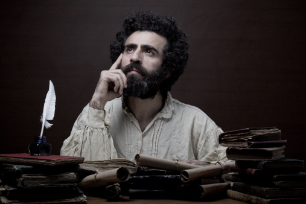

# ＜天权＞科研与生活状态

**多少年轻人选择继续读硕士读博士仅仅是为了想象中仍然保留在校园的前现代生活方式——完全自主的、不必斤斤于投入产出的田园诗般的生活方式，可当他们真正投身科研才发现自己不过是知识生产过程中一个小小的、微不足道的、任人摆布的螺丝钉。说白了，和那些在流水线上重复着同一个动作的低技术工人没有本质的不同。要是较真儿起来，他们说的大部分的话早就被别人说过了，而且往往不止一次。**  

# 科研与生活状态

## 文/朱明哲（中国政法大学）

 

从大学的头几年就不断地听人说，做学问要懂得“板凳坐得十年冷”，要“耐得住寂寞”，要懂得“潜沉”什么的。似乎科研从头到尾就是一个充满隐忍的历程，没有终点。我一开始也就相信如此了，并也在一段时间中有意识地迎合这一想法，每天背着一堆厚厚的书早早来到图书馆，独自找一个被人占了却没人坐的角落，一个人读些东西，只有在吃饭和洗澡的时候离开。至于那些专业课，或是选修，或是必修，大部分是翘掉的了。图书馆关门回到宿舍后，和同学打骂一阵，总还是要在熄灯的时候继续就着应急灯看文章的。记得在大学一段很长的时间里，随着天花板上日光灯的熄灭，9A308的四盏应急灯就会准时亮起，号称昌平不灭的灯塔。我仍能愉快地回忆起，从高考英语试卷上有一半单词不认识、到国际人道法课上发下来将近一百页的英文判决一晚上读完的过程，从看《君主论》看到在十三号线上睡着、到看《经济与社会》看到睡不着的过程。

是的，我仍能愉快地回忆起这一过程，而非这一过程所带来的任何结果。从结果上说，实在没有什么值得骄傲的——无论是和别人比还是和自己比。和别人比，我身边围绕着27岁用两种语言发表了十余篇论文并写了一本书的人、硕士论文就被王泽鉴教授引用的人、以英语为第二外语却夺得贸仲杯最佳发言人的人、潜心整理中国法院数以千计的违约金判例的人。和自己比，我并没有把我所有的精力都放在科研方面，我也因为懒惰和多愁善感浪费了无数光阴，以至于每次看到奥斯特罗姆教授给我写的“致一位勤勉的同事”的寄语都倍感惭愧。奥赛博物馆的大厅里有一个在艺术史上举足轻重的雕塑，表现的是一群裸体的男女宴饮歌舞。人们认为这是现实主义的代表作，并且它在刚诞生的时候引发了极大的恐慌。并不是因为没穿衣服，也不是因为宴饮——这两个题材在古典时期的作品中都出现过，而是因为这些男女身材都并不完美，或腆着肚子、或肢体虚弱，却还毫无廉耻地欢笑着。在认为艺术应当塑造典范的评论家看来，这毫无疑问是非道德的、甚至是邪恶的。他们无法想象，不完美的人有什么资格快乐。可我就是这样，带着一份无论如何说不上完美的成绩单，恬不知耻地保存着一份愉快的回忆。

我曾经告诉我的导师，当年我在图书馆外文部的一个昏暗角落里一边打着喷嚏一边读落满灰尘的《正义论》时，恰逢夕阳西下，辉煌的阳光透过冬日寒冷的空气洒落在书页上，让我顿时感到一种无与伦比的愉悦。这不是真的。首先，昌平图书馆外文部没有窗子；其次，图书馆似乎没有向西的窗子；最后，我是不在藏书区看书的。虽然说这一场景如此深刻地印记在我的脑海中，仿佛我曾经真的经历过一样，它却无论如何无非是一种想象。我毋宁采取了一种他容易理解的隐喻，用光明、知识和愉悦的三重奏帮助他体会我的心情。在这一过程中，我并没有体会到冷、寂寞、潜沉什么的；相反，除了一些厌学的片段，是充沛的热情让我每天早上起来洗漱用餐后第一时间开始一天的工作。我厌恶假期，反感无所事事的生活，期盼可以没日没夜地工作。

厌恶无所事事是现代才普遍出现的心态。伴随着私有化、资本主义、西方中心论的兴起，人们开始把自己视为勤勉的劳动者、用双手创造财富的独立的人。韦伯将其归功于新教伦理。马克思说这是异化的开端。虽然韦伯是我最喜欢的作家，但还是姑且说马克思在这个问题上看的更清楚吧。但是稍等，似乎我们对科学研究的理念除了寂寞以外，还往往包含着对闲散生活的憧憬。或许人们可以毫不费力地把物理学家或者化学家想象成每天在实验室里泡20小时的怪咖；可在想到哲学家、历史学家、法学家的时候，人们倾向于在脑中描绘一条风景秀丽的山路，一个看不清面孔的孤独的身影正在小路上缓步徘徊，眉头紧锁。为什么看不清面孔？或许是因为在经验世界中并没有出现过这样的一个场景吧？在经验世界中，历史学家在布满灰尘的角落里翻阅着手稿、书信、日记、档案、政府文案；在经验世界中，哲学家在为看不完铺天盖地的新书而烦恼，并最终选择假装自己全部看过；在经验世界中，法学家在苦苦思索他如何用一种可以自圆其说的方式整合那些头绪万端的判例，又如何应对同行的批评。换言之，他们从事的是艰辛、旷日持久的劳作。更不用提时刻需要面对的“水很深”问题。这是一个非常有趣的现象，多少年轻人选择继续读硕士读博士仅仅是为了想象中仍然保留在校园的前现代生活方式——完全自主的、不必斤斤于投入产出的田园诗般的生活方式，可当他们真正投身科研才发现自己不过是知识生产过程中一个小小的、微不足道的、任人摆布的螺丝钉。说白了，和那些在流水线上重复着同一个动作的低技术工人没有本质的不同。要是较真儿起来，他们说的大部分的话早就被别人说过了，而且往往不止一次。

一个悲哀的事实，不是么？第一次产业革命时，刚刚成为产业工人的农民和工匠无法忍受自己成为毫无生气、毫无创造性的生产链条上的一环。现在，投身科学的青年却不得不忍受自己也不过是知识生产过程中的“玻璃纸人”。可另一方面，这是不是一种看待世界过于悲观的方式？伟大的历史学家Michelle Perrot在七十年代预言，人类终将成为手机、电脑的奴隶，SOHO的理念终将让工作场所和休闲场所合为一体，并最后把家庭生活和其他人性的方面全部吞噬。我非常崇敬Perrot教授，并且认为她对巴黎郊区和巴黎底层人民无与伦比的研究是理解第三共和国社会史的基石。但我仍希望可以斗胆提出一个问题：生产场所和社会再生产场所的合二为一，是否有可能反过来让那些人性的因素侵入工作中，即便并不改变生产方式，却可以在这种生产方式中坚定地保留一块人性的空间？

对这一问题的回答，看上去有可能同时回答为什么我享受着在许多人看来应该是寂寞孤独冷清的科研过程。道理说起来很简单，无非就是我爱着这份工作，心甘情愿地让它支配着我生活的方方面面。包括与朋友的交往和互动。记得我在上法语课的时候，许多人都劝我不要把爱好作为工作，否则会毁了工作，也会毁了爱好。我想，这种后果大概是源于对那种爱好爱得还不够深沉吧。如果真能爱到同时接受其所有不完美的程度，我无法想象为什么把爱好作为工作会同时毁掉二者。

反过来说，既然人际交往贯穿了当代科研工作的始终，如果可以在这份工作中遇到许多志趣相同的人、一些同样不介意让工作占据生活的人，又怎么会寂寞呢？都是青春年华，都拿着微薄的奖学金奋斗在科研一线。谁不希望别人听到自己的声音？可在现在的体系中，年轻人的声音往往是被当作背景噪音自动屏蔽掉的。道理很简单，在理论话语的增长速度远远大于个体的消化速度的时候，通过名气、资历、职称或者现有的引用率来判断一篇文章的好坏，显然是一种比较经济实惠的方式。所以引用率高的作者会一直拥有高引用率。而他们大部分人思想体系早在十几年甚至二十几年前就已经定型了，现在只不过是继续反复以前说过的话而已。真正新鲜热辣的，恰恰是这些仍然默默无闻、无足轻重的年轻人说出的话。甚至可以说，要写一篇可以发表的文章，不仅在论证方法和写作技巧上要符合现有的学术“规范”，甚至在观点上也经过了不知多少自我审查，也就少了许多锐气和朝气。所以我一直说，某小破学校给研究生开的所谓前沿问题，其实都是过气得不行的问题。真正的前沿问题只有在那些酒酣耳赤的年轻人聚会中才能听得到，只有在他们骂我是老顽固、我骂他们步子太大会扯到蛋的时候能听得到。真是奇妙，反而是外于工作领域的私人空间内，人们得到了本来寄望从工作领域中得到的满足——有人倾听、有人理解、有人把他们当回事儿。从这个意义上讲，工作和生活的领域要完全区分开来更让人感到难堪。想象一下，要是在聚会上不能谈工作，我们就只能讨论某个女同事的身材了。那是多么无趣的一件事。

不仅如此，几杯酒下肚，脱掉一切伪装，大家都可以更真诚地面对彼此、面对自己。我告诉一位教授我看过他1986年发表的关于Hauriou一篇文章，而他告诉我那是他发表的第一篇文章，他还告诉我他在编辑来约稿的时候压根没有看过Hauriou的任何作品，所以写得真是糟透了。明朝酒醒，带上面具，我还是要在文章里面写“某某教授先生在1986年发表的关于Hauriou的作品是该领域开创性的成果”。

千万不要小看这些名不见经传的年轻人在非正式场合说出的话、在博客上发表的文章，以及他们尖刻、偏颇的批评。正如我愉快地回忆起我在书桌边度过的每一个日夜，我也愉快地想象着十八世纪末那些住在Odéon附近寒酸的阁楼里、连个床垫都没有的穷酸文人，在某一个雾气笼罩的冬天早晨，裹着脏兮兮的、散发着恶臭的毯子，一边费劲地咳嗽，一边用鹅毛笔给警察局写信：“我是一个不错的笔杆子，像我这样的人应该去给政府效劳，请您给我一个机会”。刚写完信，转过头来就写以路易十六和玛丽皇后为主角的色情小说。当然，玛丽皇后在小树林子里颠鸾倒凤的时候，路易十六往往在他的大房子里摆弄着钟表。这些色情小说当然不可能通过出版审查，只能在阿姆斯特丹或者伯尔尼出版，然后通过走私贩子运回法国销售。他们当然也参与学会举办的各种活动，并且其中一些人成为了他们的偶像伏尔泰或者卢梭这样伟大的启蒙哲人。但我们总是要记住，他们的色情文学最终摧毁了大众对皇家的崇拜之情，并为1789铺平了道路。三百多年后的今天，我拿着数额令人难堪的奖学金，住在凯旋门附近寒酸的阁楼里，因为舍不得电费在冬天最冷的时候都没有开暖气，靠热水暖暖手指，在键盘上敲下这样一篇文章，准备酝酿情绪去聚会上继续和同事们吵架。或许用不了多久我也需要开始到处写信说“您看，我还是一个不错的笔杆子……”。我的同事们情况比我稍好，也好不到哪儿去。关键是，说不定我们这些现在看来只能自我吹捧的人，有一天真的能改变世界呢？

科研从来就不是一份不得不做的工作。有些人生来就注定要下矿井、上车间。但几乎可以说没有人生下来就注定要进实验室。所以我无法想象竟然需要忍受多么大的苦难才能继续在科研的路上走下去。大部分在学界的人，转行不做学问可能赚到的钱更多。板凳要是冷着腚的话，不要坐就好了，这不是很简单的事情么？原谅我，现在在提到科研和学术时我绝对想不到孤独、潜沉这样的词。相反，我能想到的是热爱，是喧嚣，是激情。

 

（采编：楼杭丹；责编：麦静）

 
