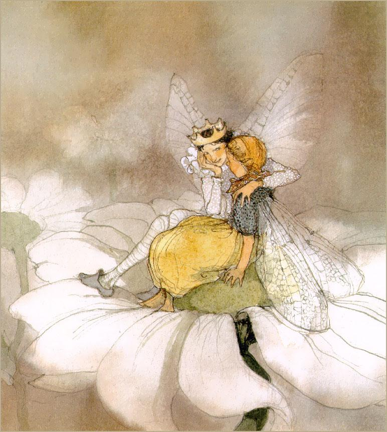

# ＜天权＞程序员和他的拇指姑娘

**那天下午是个周末，当他又一次打开电脑，并已准备好一碗泡面时，他看到了拇指姑娘。她正坐在他的桌面音箱上，晃荡着双腿望着他。** ** 他也看着她，不知道怎么办好，Hello，Hi什么的也不是他的语言。但是不消说，他还是有点儿紧张，因为拇指姑娘实在太漂亮了。** ** 她的身上没有什么发亮的饰物，但是怎么说呢，有一种饱满的力量，不如说——她长得非常自然，略微丰满。她说话的时候胸脯一起一伏的，她有时就是会这么激动。她戴着的是一个红色蝴蝶发卡。拇指姑娘有着一袭长发。** ** 突然，她停止了晃悠，“啪嗒”一声跳下了音响，站得十分笔直地，望着程序员。** ** 程序员更紧张了。他泡面的盖子也“啪嗒”一声掉了下来。**  

# 程序员和他的拇指姑娘

## 文/豌豆（自由作者）

 

我早就想写一写我的这位程序员朋友和他的拇指姑娘的事，在听说了我最喜欢多管闲事之后，他选择了在一个漆黑的夜晚给我讲述了这故事。他的倾诉极为困难，因为我们都知道程序员是一种闷骚的动物。基本上需要我问一句，他才答一句，他表示有时他想说也说不清楚。但是这回算是真忍不住了。他太思念拇指姑娘了。

拇指姑娘是怎么到来的他已记不大清楚，大概是在看了那档相亲节目之后。舞台上的那群小姐们把他折磨地快要发疯了，她们都是极漂亮的，不用说。但他觉得一个都不适合自己。

就这样，程序员还是努力地工作，加班加点。最后，不可避免地，他成了一个日剧迷。

那天下午是个周末，当他又一次打开电脑，并已准备好一碗泡面时，他看到了拇指姑娘。她正坐在他的桌面音箱上，晃荡着双腿望着他。

他也看着她，不知道怎么办好，Hello，Hi什么的也不是他的语言。但是不消说，他还是有点儿紧张，因为拇指姑娘实在太漂亮了。

她的身上没有什么发亮的饰物，但是怎么说呢，有一种饱满的力量，不如说——她长得非常自然，略微丰满。她说话的时候胸脯一起一伏的，她有时就是会这么激动。她戴着的是一个红色蝴蝶发卡。拇指姑娘有着一袭长发。

突然，她停止了晃悠，“啪嗒”一声跳下了音响，站得十分笔直地，望着程序员。

程序员更紧张了。他泡面的盖子也“啪嗒”一声掉了下来。

拇指姑娘走了两步，凑近这桶泡面，狠狠用鼻子嗅了一下。

“这个，好吃吗？”拇指姑娘眨了眨眼睛。

“你要尝尝吗？”程序员总算说话了。得到拇指姑娘一声响亮的“嗯”之后他把泡面搅和了一下，挑了一根给她。

“啊，我不要这么多的，你给我一点点，放在手上，我尝尝就好。我吃过饭了的。”

程序员于是就慌张地用筷子掐了一小截泡面，放在食指上，送到了拇指姑娘的面前，接着，他感到了拇指姑娘的小身体在朝自己慢慢靠近。蝴蝶结发卡动了动，她低下头，她的鼻息凑过来了！她就那么舔了一口程序员手中的小泡面。

“嗯，不错。”拇指姑娘咀嚼着。“不过我还有更好吃的。以后有机会给你尝尝。”拇指姑娘说完这话就转身坐在了程序员的电脑键盘上，那是一个靠近“Esc”的位置。“你吃饭吧，我可是吃了饭来的。”说完，拇指姑娘摆弄起自己的花裙子。

听到这话，程序员稍稍放松了些。“你等我一下，我去洗个手就来。”望着坐着的拇指姑娘，程序员说。

拇指姑娘哼了一声，头也没抬。

程序员放下手中的筷子，走向洗手间。

望着洗手间的镜子，程序员努力平复内心的欣喜，反复思考的只是一个问题：她如果要走的话，我该怎样去留住她？

再出来时，拇指姑娘已经坐在了电脑空白键的位置，正望着他。

“刚才你好像在听什么东西。”

“喔，我在看电影。”从洗手间回来的程序员已经没有之前紧张了。

“电影？”

“对，我在看……啊！我正在看一部和你有关系的电影！”

“和我有关？你是说借物小人艾莉塔吗？”

“你怎么知道？！”程序员感到不可思议了。

拇指姑娘打了个呵欠，径直睡在了空白键上，双手枕着头。“好多人都给我讲这部‘电影’的。你继续看吧。我困了，在这儿睡一下没关系吧。”不等程序员说话，拇指姑娘闭上了眼睛。

“可以可以，你睡。但是你可不可以睡别的地方？”

“为什么？”拇指姑娘睁开了眼睛。

“因为你睡在这里，压住了暂停键。我看不了。”

“暂停键？”

“对，对，”程序员说着起了身，“你等我一分钟，我给你一个更舒服的地方睡觉。”

再回来时，程序员带来了一张手帕，那是去年日本同事回国前送给他的礼物。手帕是粉红色的，很软。“早日找到喜欢的女孩子哦！”那个日本女孩倒是少有的爱开玩笑那一种。

程序员把手帕卷出了一个小枕头，摆在笔记本电脑的旁边。“好啦！”程序员两手往上一扬，望着自己的杰作。

拇指姑娘很快从空白键上跳了下来，以一个最舒服的姿势躺在了软手帕上。她很快睡着了。

程序员把电脑的声音调到了最小，看起了这《借物小人艾莉塔》。他现在看这电影的心情和前十分钟那可是很不一样的了。

“好热，”不到十分钟，拇指姑娘就坐了起来。

程序员这才发现自己给她做的小床正对着笔记本电脑的散热孔，连忙说，“哦，不好意思，那我看看……”

音箱？太吵，台灯？凹凸不平。程序员的视线最后落在了床边的茶几上。那个位置正好可以看得到睡梦中的拇指姑娘。

他连床带人把拇指姑娘挪到了那个位置。

“怎么样，这位置可以吗？”

“这个位置可以的。但是我要说一点问题。”

“嗯？”

“刚才你突然就把我抱过来了，”拇指姑娘好像有点脸红，“——我是说，如果以后你也要抱我去哪里的话，请你一定提前告诉我。”

以后？！程序员听到这个词觉得很激动，他连连点头。

拇指姑娘翻了个身，睡觉去了。

拇指姑娘再醒来时，已经是下午五点。程序员早就看完了电影，更把自己的宿舍打扫了一番，洗掉了所有的衣服，甚至他还洗了个澡。然后他就一直望着拇指姑娘。她醒了。

“啊，你醒了！”程序员有点尴尬。

“你一直望着我，我怎么还睡得着。”拇指姑娘坐了起来，“现在几点了？”

“下午五点。你饿了吗？你要吃点什么？”

“还不饿。”拇指姑娘揉揉眼睛。

“那，我们晚上出去吃饭好不好。嗯，我可以带你出去吗？”

“可以。你的床很舒服。以后我就睡这里了。”拇指姑娘好像心不在焉。

而为了确保自己没听错，程序员换了个问题。“那，我把你放在口袋里可以吗？——我的衣服都很宽松，口袋里很舒——”

“可以可以。你是做什么的？”

“啊，我是做，呐——”程序员指指电脑，“我做这个的，‘理工男’你听过吗？”

“呵呵，我听过。”拇指姑娘居然笑了。

再回到这个房间的时候，已经是夜里十一点半，程序员已经吃完了饭，并且带着拇指姑娘在湖边兜了一圈。往湖里看的时候，拇指姑娘一直站在程序员的肩膀上。程序员感觉就像有只鸟恰好停在了那里。

“我累了，要睡觉。”拇指姑娘在荷包里嚷嚷。

换好拖鞋，程序员双手把她捧了出来，继续放在了粉红色的手帕上。

“玩了一晚上，你也辛苦了。早点休息吧。”程序员望着拇指姑娘。

“嗯。”

程序员正准备走开，拇指姑娘又叫住了他。

“嗯，我说，你没有什么女朋友之类的吗？”

“没有，”程序员摇摇头，“很久以前有一个。”

“怎么不找个女朋友呢？”

程序员呼出一口气，“不知道。”

“那你知道你很帅吗？”

“是吗。”程序员挠挠脑袋，“你觉得我长得——”话还没说完，拇指姑娘打了个呵欠。

“晚安，IT男。”

故事讲到这里，程序员停了一下。“这就是我和她认识的经过。”程序员正襟危坐，但和三个月以前的他已经有很大不同。

“呵呵，我认识你以前你好像不是这个样子的。”我突然岔开了话题。

“是吗？我有变化？你指的是——”

“你变成熟了。好快，三个月，你的变化很大。”

“嗯，可能吧。如果有的话，就是她带给我的。我想我再也遇不到她了。她怎么不事先告诉我就走了呢。”程序员惆怅地重复这最后一句话。

“别难过了。后来又发生了什么？”

程序员调整了心情，开始讲接下来的事。

“我醒来的时候，她正在捏我的耳垂。你知道吗？她那么一点，就用两只手捏着我的耳垂，我能感觉到的就是蚂蚁在爬。爬来爬起，我就醒了。醒来发现她在那里咯咯笑。”程序员声情并茂地继续讲述着……

“我不喜欢闹铃，我给你关了。但是你快要上班了还不起床。”他耳边的拇指姑娘笑得直不起腰，“你的耳垂好大。捏起来真麻烦。”

程序员突然在想上一次和姑娘接吻是什么时候的事。他有点心慌，因为拇指姑娘实在太小了。

按照之前两人的约定，程序员把拇指姑娘带着去上班了。

“那么，那一天你就是带着她一起上班的了？”我问程序员。

“是的，不光那一天，之后的三个月都是这样。我上班一直带着她。你知道，我们上班很枯燥的。当然，有工作上面的事情做时还是很忙的，但基本来说，一个人上班很孤单，包括去的途中，突然闲下来的时候——”

“你这话真有意思，大家不都是这样的吗？”

“是的。正因为都这样，所以都很孤单。那三个月就是两个人一起上班的。她一直躲在我的文件夹旁边，我不想让同事知道这件事。怕麻烦。三个月我都没怎么和同事一起吃饭。他们以为我在约楼下公司的女生。不过说起来也奇怪，认识了她以后，感觉和同事一起吃饭啊玩啊都没有太大意思了。之前我也不太喜欢，恐怕是实在没事做吧。”

“哦，明白了。她三个月一直在陪伴你——”

“不，不是陪伴。陪伴是很简单的事，但是，你知道，虽然她只有一点点小，但她给了我很多的东西。那段时间不是类似陪伴，如果你同意的话，我愿意说这是爱情。”

“以前有过这种感受吗？”

“嗯，好像从来没有。”

而说到他们相处的一些细节，程序员也记得十分清楚。他说拇指姑娘给他做过吃的。

“做过吃的？做了什么东西？”

“不太清楚，我吃得太少了。她不知道我该吃多少，你懂吗。”

我有点疑惑，“可是我觉得你们的沟通一直都很好啊，没问题。”我反问道。

“没问题是的，但，有些事情她是不明白的。”程序员陷入了思考。“不过她不明白的都是无关紧要的小事。她能知道我这人是怎么一回事。”

“你这人是怎么回事？”我调侃道。

“你不会明白。”程序员摇摇头。

尽管对我的调侃表示了满不在乎，但程序员还是愿意接着给我讲他的故事。

“举个例子吧，有一次在地铁，我弹吉他了。”

“什么？”

“嗯，在她的帮助下。我给很多人表演吉他了。那音乐不用说，是我最喜欢的。好像是一部电影的原声。”

“噢，你说的是这个。可是，在地铁里表演吉他也是很正常的事啊，没有遇见她，你也可以做到。这不是什么新闻吧？”

“说得没错。可事情的关键不是我在地铁里表演什么吉他，而是她帮助了我表达自己。你知道，我不太会跟人交流。”

“呵呵，那你说说看，她是怎么帮助你‘表达自己’的？”我逗程序员。

“嗯，那一天，正好加班，回家比较晚，地铁很空。但我还是愿意站着。她和以前一样，站在我的口袋里，不说话。突然，她在我口袋里蹦跶起来。我望望她，她那眼神好像是在说放她出来。我吓坏了。虽然地铁人不多，但我感觉已经有人望向了我们。但她蹦跶地越来越厉害，我偷偷地把她拿了出来。”

“我蹦了这么久你才有感觉，你长胖了吗？”拇指姑娘有点气恼地说。

“不是，你知道，这里有人，你想干嘛？”程序员尽量用手把她盖好。

拇指姑娘歪了一下头，又笑了，说，“我有一个好主意。你猜我想做什么？”

“这，猜不到。回家再跟我说好吗？”

“不，回家就做不了了。你看到那边了吗？”顺着拇指姑娘的手臂望去，是一个倚靠着的少年，他的旁边立着一把吉他。

“吉他你会不会？”

“啊，不会。只在小时候学过钢琴。”

“你听我说，……”

“这怎么行呢？我不会吉他，如果按错了怎么办，这里这么多人，我又不知道怎么……”

“还有五站我们就到了哦。这是你唯一的机会了。”拇指姑娘突然坐了下来。

程序员不知道这“唯一的机会”是什么意思，但本能的，他感觉他必须按拇指姑娘说的去做了。

他向那个少年走去，拍了拍他的肩膀，“琴可以借一下吗？”疲惫的少年点了点头。

拇指姑娘迅速跳到了木制音箱里面。

程序员找了个靠少年的位置坐了下来，“你是说，我只要按住几根弦，剩下的全部交给你，右手随便放？”

“是的，”拇指姑娘的回答带了回声。

“那你要弹什么？”

“这个不能告诉你。就当我送给你的礼物吧。你去前面，那里。”

程序员按照拇指姑娘的要求去了车门附近的空地，两节车厢处站着一个人，叉着脚站着，面容疲惫地望着这拿吉他的新来客。

程序员不知道拇指姑娘要做什么，但他隐隐觉得这样也蛮好玩的，弹吉他这件事和他的生活实在相去甚远，小时候虽然学过钢琴，最后却也学丢了。想起来已经是很久远的事情了。

左手按照拇指姑娘说的那样压住了几根弦，右手耷拉下来，不一会儿，音响里的小人动起来了。

“就像你想的那样，我真的弹出音乐了。”程序员激动地说。

“你弹了什么？”我追问道。

“那个曲子刚开始听没听明白，大概过了一会儿我知道了，是我和她前两天一起看的一部电影里面的原声音乐。她太厉害了，听一次居然会演奏了。我当时挺尴尬的。我怕别人看出来。”

“其实被看出来也不要紧，他们只会觉得你在开玩笑，因为你又没有找他们要钱。”

“嗯，正是抱着这样的想法才继续演下去的。不过那个时候大家的确都在看我的。有人本来趴着睡觉的，后来一直看着我。还有人在拿手机，在拍我们。哦，在拍我。”

“那你弹得一定很好听了。”

“嗯，非常优美流畅的曲子。这是我第一次在这么多人面前表演，还是表演我不会的东西。这样的事以前也从没有做过。总觉得这样的行为和我的生活差太远了。不过当时旁边好像有一对情侣听出来了是什么音乐，女孩小声地告诉了那男孩。”

“拇指姑娘太可爱了。”

“嗯。……不过我的故事也该讲完了。”程序员沉默了一会儿，接着说，“弹完那首曲子之后，我们就到站了，我赶快把琴还给少年，他原来也一直在看着我表演，之后我们就准备下车，和以前一样，到了这个站就有很多人要上车，大家一下子涌进来，我小心地想保护着她，有很多话准备下车了告诉她——她就蹦了几下，突然不见了。”

“她从哪里走掉的？”我大惑不解。

“她踩了一下我的头。说实话，她从来没有告诉我她能蹦这么高。”

“这，实在很奇怪，她怎么突然就走了呢，在这个时候，什么也没有说吗？她为什么走呢？”

“她走也是必然的。只可惜没有跟她道别。你知道吗，昨天晚上她还在我的洗脸池里游泳来着……”

“哎。”我叹了口气。

大概停了一会儿，我们没有讲话。突然，我想起了什么。

“嘿，你这家伙，是不是还有故事没告诉我……”

“我都跟你说了。你不是正闲得无聊嘛。”

“我是说，你们俩就再没有香艳一点的故事……”

“这个，之前告诉过你，虽然她很性感，但是你知道，她只有这么一点点大……”程序员说着给我比划。

“你应该看过西班牙导演阿莫多瓦的一部片子，里面有一个情节就是一个男人变小了， 然后……”

“喂喂，你在想什么。我不会对她那样的。……你知道她在的时候我最喜欢做什么吗？”

“做什么？”我很好奇。

“最喜欢看她睡觉。特别是看着她睡着睡着突然翻了个身。”

说完这最后一句话，程序员竟打着呵欠就那么走掉了。

(完了)

原文地址：[http://www.douban.com/note/224533154/](http://www.douban.com/note/224533154/)

 

（采编：佛冉；责编：佛冉）

 
