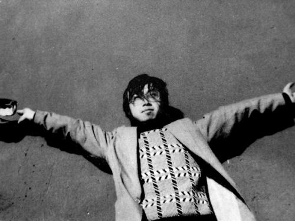

# ＜天权＞纪念张慧生

**90****年代中期，很多人跟我一样，读的最多的诗人是海子，听的最熟的音乐是涅磐，想的最少是如何生存。经常愤怒，但没时间分析愤怒的对象。我也曾经真的相信，激情本身疯狂的旋转是不需要反省的。从一个角度看，这叫真正年轻的生命，该释放的绝对不会保留，要亢奋到随时都有可能爆发的程度。换一个角度看，这也是艺术青年们早晚要承认的，大学时代的很多行为倾向，都带有妄想狂转移成青年痴呆症的嫌疑，用慧生的话说，那是一种牛逼型的精神病。 ** 

# 纪念张慧生

## 文/王敖（Yale University）

有时候，记忆的闸门打开，却并没有洪水般的往事涌来。往上看，是静悄悄的夜空，星星们仿佛投身于深海，它们习惯性地，略微神经质地微颤着。人，酒瓶，吉他互相需要，很想一起去捕捉旧日的歌声。这跟十多年前并无多少不同。可是如今，还没等抒情就肃穆了，不论那歌声多么像一捧浓烈奔放的野花。

90年代中期，很多人跟我一样，读的最多的诗人是海子，听的最熟的音乐是涅磐，想的最少是如何生存。经常愤怒，但没时间分析愤怒的对象。我也曾经真的相信，激情本身疯狂的旋转是不需要反省的。从一个角度看，这叫真正年轻的生命，该释放的绝对不会保留，要亢奋到随时都有可能爆发的程度。换一个角度看，这也是艺术青年们早晚要承认的，大学时代的很多行为倾向，都带有妄想狂转移成青年痴呆症的嫌疑，用慧生的话说，那是一种牛逼型的精神病。

97年初夏，我骑车路过北大静园草坪，听到有人在弹吉他唱歌。老远听着，觉得技术非常精湛，我想那一定是教我弹琴的巴特在跟人“查琴”。过去才发现，有两个人在弹唱，一个人在听，他们面前放了一堆酒瓶。慧生是其中弹得最好的，但看上去面目有点蛮横。另一个弹琴的人是北大毕业的许秋汉，当年还比较瘦，而且气度不凡。还有一位是中文系的一位老生，听我自我介绍以后，说他并不熟悉“晚辈”。听了这话，我就觉得没必要跟他浪费时间。后来经胡续东再次介绍，才继续说话。许秋汉赞美了巴特出色的技术，并谦虚地说，只要有巴特上场，他自己就有可能被观众撵下去。慧生具体说过什么，我已经忘记了，隐约记得他说很喜欢诗歌，似乎那天他还唱了海子的《九月》。

后来我跟许秋汉成了好友，也结识了他的一些朋友，比如唱民谣的杨一。有一天，许秋汉约了我和海淀的大杨一起去圆明园找慧生。这次算是跟慧生正式结交，而且发现他颇有趣。我弹琴基本上是刷琴，唱歌其实是嚎叫，但慧生听得很认真。许秋汉说，王敖，你这劲头可绝对要保持，并用某种方言说“关键的是要有激情！”。慧生呵呵地笑，一副老大哥的样子，给人信任感。据许秋汉介绍，慧生练过拳，经常是一言不合就拔拳相向。但他对朋友却很温和，除了偶尔和身高一米九多的大杨较劲。

慧生对很多人的技术都很不以为然，但他对唐朝的老五评价很高，说他们在一起弹过琴。有次他来北大找我玩，宿舍已经熄灯了。只听见他在楼下喊，“王敖，下来弹琴吧！”。我一激动，就到处找眼镜，然后拿吉他跑下去。弹不了多久，就变成他的独奏，因为他弹得实在太好，折腾到一两点，走的时候草坪上都空荡荡的。那时候我脾气非常急躁，人极瘦，远看就像一把刀在迎风招展。因为性格原因，跟朋友在一起也免不了自我中心的激烈碰撞，伤和气的事情也有不少。但我跟慧生从没有任何摩擦，有时候聊到诗歌，他都耐心地听我发表自己的狂论，对我的诗也一律表示欣赏。

慧生当时养了一只白猫，被我借回宿舍养了一段时间。那猫性情古怪，有时候慧生看它不顺眼，就揍它一顿。在我那里，该猫得到了纵容，但它眼神里总是有一种倍受压抑的感觉。我想，跟慧生一起生活，估计对它是有点难度。有一次，音乐协会办活动，来了很多人。为了保护女同胞不受调戏，慧生怒吼着跟一个台湾人打了起来。如果不是那人跑得飞快，估计慧生会把他打残。慧生给我讲过他在5±1期间的经历，说他当时逃到一个公厕里躲避，旁边有个人中了枪，问他要烟抽。慧生刚给他点上，那人头一歪就咽气了。后来，我在一首叫《长征》的诗里提到过这件事：

我靠着厕所酥软的墙，给死人点上烟，心说签证吧

厕所也是迷宫，伟人的线团引我们去瑞士银行

2000 年我出国前，遇到一些不痛快，导致情绪崩溃，头脑一片混乱，慧生一直鼓励我。慧生来北大找我告别那次，我们在艺苑食堂吃了饭，然后去静园草坪上唱歌喝酒。慧生劝我一切事情要看开，还是身体要紧。我隐约记得他说有个哥在美国，还说他也想去美国，找个音乐学院好好进修一下。有一对学生情侣跑过来，坐在我们身边听慧生唱歌。唱到一半，他们起身要走。慧生就说，我兄弟还没开唱呢，你们不准走，起来把那对学生拦住。我忍不住，说了慧生几句，他也不恼，就放人走了。我送他出了西南门，以后再也没有见过他。

在美国的时候，我听过关于慧生的一些消息，很让人担忧。后来有一天，我晚上赶论文一直到早晨，胡续东到网上告诉我，慧生自杀了。我听了以后，把刚吃的早饭都吐了。没多久，许秋汉告诉了我事情发生的经过。

2002年我回国，朋友们为我在昌平举办了一个几十人的大party，颜峻去租了一辆公共车，把大家从地坛公园带过去。大家都喝了几杯之后，不知谁提起慧生已经走了，我和许秋汉抱头痛哭。前几天在网上看Led Zeppelin复出的演唱会，找出《天堂的阶梯》听了几遍，又想起了慧生。

十多年过去了，我30多了。回国跟老朋友见面，大家都改变了很多，但弹琴唱歌的时候，还是老样子。是啊，所谓的成熟，其实不过是做某些事情熟练了一些而已。但我毫无怀旧的意思，许秋汉说的激情（两个字分别发三声和四声），永远是我们的力量源泉。只不过，我不再那么容易上当，并对自己的荷尔蒙也保持了清醒。

很遗憾，到现在也没有专门为慧生写一首诗，或者歌曲。前段时间四川地震，我写了一首诗叫《航行》，录在这里，以寄哀思：

航行

我昏倒在床边的悬崖

昼夜的航行，让人回忆不起

漩涡的眼睛——那是我的黑手

为剧院镶的明珠，海盗却像更华丽的

魔术师，用巨斧砍掉我鼻尖的征尘，他转手

锯断了手持竹竿的祥林嫂，欢声如潮

梦里的亲人们，曾为毛主席重装电脑

我醒来，沙滩上儿时挖掘的洞穴，爬出

继续醒来的我，暗云般飞渡，大陆漂移在海面

晴空下的海胆，用触手拨着我的心率，水面上不远处

慢转的国家机器，在蛋壳里演奏着消音器，啊

哦，就像一片原地打转的小帆，给我们一点联系，在希望

和否认绝望之间，这时候，我听到远方的地震，越来越小的悬崖

挂着夜幕，熊猫的海洋祖先，在我的手里吐泡，还是啜泣

关上贝壳，世界无限多的滚珠，运转着最新的悲剧，其中有多少是眼泪

 

（采编：麦静；责编：麦静）

 
