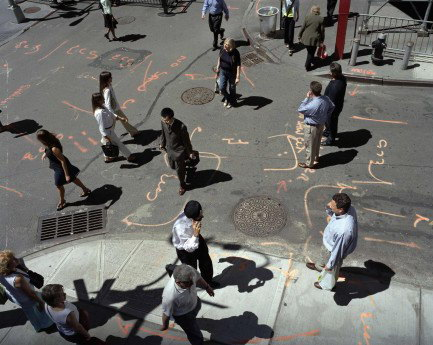

# ＜天权＞纽约，一座野性城市的独白

**纽约的脏乱、庞杂和喧嚣都是一种浑然天成，但人们的心路多半是宽厚温存的，他们忍受着年久失修的地铁和拥堵不堪的高速路，忍受着呛人的空气和狭隘的小巷。因为火气再高也蹿不过头顶的摩天大楼，心窝再闹也抵不住脚下的轰隆滚滚。只是纽约以一种特殊的方式补偿着她的臣民，让他们心甘情愿留守在这片土地之上。这是一种兀然挺立，包罗万象又富有生机的归属感。**  

# 纽约，一座野性城市的独白

## 文/刀洛西（北京大学）

 

“如果你爱他，请送他去纽约，因为那里是天堂；如果你恨他，请送他去纽约，因为那里是地狱。”——十多年前，北京人在纽约如是说。这座城池可以轻易摧毁一个人，也能用馈赠成全他的一枕幽梦。诚然，每座城都郁积着源源不绝的欲望和罪恶。人们习惯了找寻乌托邦，殊不知他们亲手创造了地狱。

纽约，这个古怪又不可思议的传奇，野性的爆发力使其远远不同于伦敦、巴黎：她在垂直维度上凌空冲刺，高耸入云，飞机只得拦腰去撞上她。纽约的迷人之处还在于她的诗性，其用尽所有肤色的种族民族作为韵脚，来讲述形色各异的生活。这里是当代一个浓缩的角斗场，挤满了证券商，戏剧演员，和各色名流。人们摩肩接踵，却各自孤独。白天时分游轮鸣笛，警车呼啸，纽约人自得其乐地履行着他们的快感。金融街上行色匆匆的风衣男，领口永远浸润着挥之不去的贪婪。画烟熏妆的朋克少女洒着廉价香水，斜靠着垃圾桶吐着一轮轮烟圈。而在夜色里穿梭的黑人、奇卡诺人和波多黎各人像灰尘一样撒开，纷纷散落在这场浩大却筋疲力尽的梦里。

在我造访纽约之前，曾无比美好地憧憬过某女神和百老汇的种种。事实上，有人坐船来到艾里斯岛，意气风发写下了著名的大英四课文；而有些人来到这里，只花了五分钟上了趟厕所。亨利·罗斯在小说Call It Sleep中对自由女神像有如下描写：“对甲板上凝视的人们来说，她的容颜烧得炭黑，蒙着阴影，她本身的深度已经耗尽……阴影把她举着的火炬轧平，衬着完美无缺的光线，成了一只黑色十字架，仿佛一把断剑烧黑的剑柄。”这座雕像无疑早成为纽约城的象征，但这场颇具闹剧意味的顶礼膜拜却有着难以言说的荒诞：只有看得见雕像上刻字的人，这才是他们不朽的福音，这才是他们辉煌的未来。再回忆起我在纽约看过的唯一一场歌剧魅影，不讳言，从头睡到尾。也许是温度太高，吃得太饱，中学时代哼唱过度，这场百老汇倒像是略显过气的蛋奶冰激凌秀，没了往昔那副骨架子，甜腻表皮里包裹着软绵空乏的音效，不死的也只是人们的味觉罢了。

在过去的小一个月，我和同学在这里走走停停。喘着热气大步跑上夜色里的布鲁克林大桥，在华尔街高管的眼皮底下呼呼大睡。无数次迷失在时代广场的刺目喧嚷，盯着百事可乐巨幅广告上性感的白人女郎，听破败地铁站里黑人大叔悠悠唱着爵士。组队辗转杀到法拉盛吃麻辣火锅，那里面黄肌瘦，为生计所迫的中国人总是阴沉着脸嘟囔小费太少。纽约的脏乱、庞杂和喧嚣都是一种浑然天成，但人们的心路多半是宽厚温存的，他们忍受着年久失修的地铁和拥堵不堪的高速路，忍受着呛人的空气和狭隘的小巷。因为火气再高也蹿不过头顶的摩天大楼，心窝再闹也抵不住脚下的轰隆滚滚。只是纽约以一种特殊的方式补偿着她的臣民，让他们心甘情愿留守在这片土地之上。这是一种兀然挺立，包罗万象又富有生机的归属感。纽约从来不属于外人——那些胸怀甜蜜初恋情结的探险者，初来乍到，总是成群涌入第五大道，大都会博物馆，和圣帕特里克大教堂。激荡劲儿褪去后，拉丁美洲的小伙子开始抱怨起餐馆讹人，来自中国的好基友口口声声说还是社会主义国家的牛奶“更浓更好喝”。这时候，开出租的印巴大叔便会美滋滋地夸耀起这座属于他的城市，尽管除了他同胞以外的人听上个三遍还不能领会其意。热情的纽约人还热衷于给外来客指路，倒也不乏“手把手带着徒步五个街区后”发现竟然迷路了，然后腼腆地摊手一笑，结局就是一天下来我倒在旅馆床上，脚酸得愁肠郁结。

野性而浮躁的都市，也极易焕发生机，一如纽约从不呆滞乏味。年轻的情侣约在帝国大厦顶楼见面亲吻，暴戾的嬉皮小子三三两两聚在街头前后翻滚。献艺歌手用长串儿的转音响彻夜空，一把漆黑手杖，一身油亮毛皮大衣，他们四处游走，像成群结队的鸽子寻寻觅觅广场上四散的面包屑。每天，晨跑者们在中央公园蔓延出一大片清新的力量，白天的绅士在夜晚会化身蕾丝酒吧的醉客。纽约人不会停止让生活发光发热，收集起来，堪比一座核反应堆。而大都市之为大，在于其敞开胸怀容纳百川，招贤纳士，亦藏污纳垢。去年十月，我在香港旺角久久注视焦虑沧桑的过往人群，同样是房价飞涨，寸土寸金的社会，投机倒把贩卖苹果的青年人，撑不起一座城市的明天。当然，New Yorkers won’t give a shit until you prove yourself。今天纽约人会全场起立为一个亚裔小子喝彩，而昨天还调戏他是送中餐外卖的服务员。一次引吭高歌，让有些人一夜成名；一次股市震荡，又足以毁掉红色的曼哈顿狂想。

认识你自己，然后决定，你是被就地打倒，还是继续行进。

这就是纽约，野性里透着柔软。我在这里满意的时光，不是潜入联合国总部看各国政府的歇脚地，不是在投行里围观主掌命脉的操盘手们兢兢业业。而是晒着太阳，坐在华盛顿广场的喷泉上，听不远处的学生弹着吉他，看小孩子和狗滚成一片。人们总是在烦恼中感伤，在感伤中愉悦。

自由，颓废，性感，诗意。

  

（采编：麦静；责编：麦静）

 
