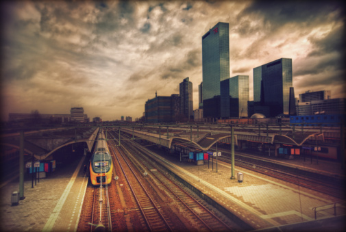
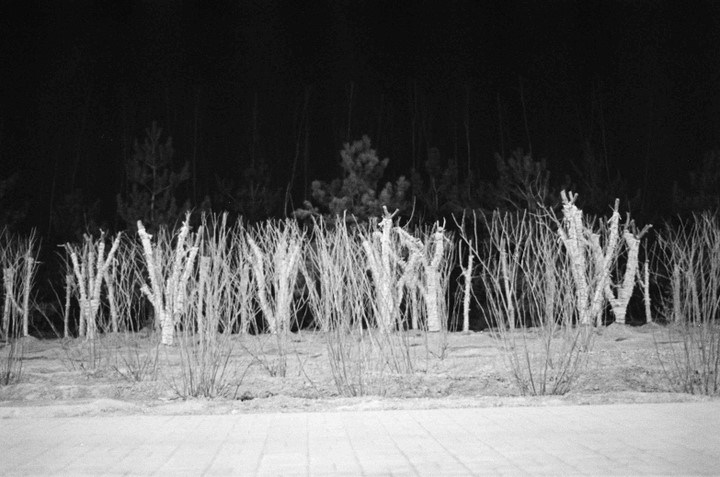

# ＜天权＞老王的小呀嘛小火车（上）

**老王给我的感觉就像一幅印象派的画作，一小块一小块颜色和气味拼凑起一种无法言说的感觉。陌生人总会在最高级的画家和最低级的民工之间犹疑不决好一阵子，来试图定义老王的身份。**  

# 老王的小呀嘛小火车（上）

## 文/汪海鸣（上海戏剧学院）

 

**一、**

那个年代，老王没事就喜欢来这么一句，他翘起腿，水泥灰色的旧西装裤在裆部难看地皱起来，开始歪着嘴眯着一只眼剔牙，坐在对面的大学生和女职员眼睛里酝酿着不屑的情绪，一层一层冲着老王，准备喷薄而发，在某些情境下，这句话实在招惹年轻人的嫌恶。

老王却好像忘了说过什么，嘴咧地更惨烈无辜，像一头被撬开嘴巴的鳄鱼，渐渐地连眉眼都瞧不见了。一滴晶莹的口水挂在嘴角闪烁不定，嘴唇混乱地上下震颤，以方便那根撇断的一次性筷子更深入，好像一个癫痫发作的病人。一股新鲜的啤酒和泡椒鸡爪的味道从胃里翻出来，在四人狭小的座位里来回波动，然后在万众瞩目里，一小撮透明的鸡筋被剔出来，发射到了地上。

这个过程持续之长，以至于我们都忘了老王的开头，他潦草地又不马虎地干掉火车上的一顿饭后，隐约想要说些什么，但随着那缕鸡筋的剔除一起被遗弃了。我们随即也转过头，各自陷在那一句“那个年代”里余味无穷的幻想里。那个年代，那个年代。他们不知道，这一向不是老王的开头，而是他的结束语，好像文言文里故作高深的虚词结尾罢了。

我刚认识老王不久，这次旅行也是他撺掇的。他说想换个地方刷墙，但没想好是哪。我想去哪个地方睡觉，也没想好是哪。我患上了严重的失眠症，我在心理医生那里见到老王。

那天老王也是这身打扮，他随便地往我身边坐下，一股油漆涂料的味道涌上鼻子，让本来就头疼的我几乎要吐出来。接着看到的便是并排的两双低帮篮球鞋，回力经典款，一双斑驳疲惫，一双炯炯有神。顺着这双鞋，看到一条不断抖动着的腿，在肥大的西服裤里寂寥地晃荡着，裤裆的拉链停在一半，惶恐地咧着嘴。他殷勤地递过来一根烟，我嫌恶地推开，想提醒他医院禁止吸烟。转过头看见的是一件蓝白色的旧校服，上面红色的标志模糊了，只剩下血迹一样的一圈红。那红色配合着脚下的回力，不断抖动，扩大，狰狞，扭曲，最终混成一种红色的毒气，让我倒下来了。

我真的已经很久没睡了。

**二、**

我对老王的脸实在是没什么第一印象的。老王给我的感觉就像一幅印象派的画作，一小块一小块颜色和气味拼凑起一种无法言说的感觉。陌生人总会在最高级的画家和最低级的民工之间犹疑不决好一阵子，来试图定义老王的身份。

包括他那远房表哥，老王跟我说，表哥看见他那年久失修的乱蓬蓬的头发和回力鞋，就眯起了眼，问着，会刷墙吧，老王瞪着眼说，这个年代，又顿了一下，摇摇头，不会。不知道的人还以为老王是个隐居世外多年的高人，悠悠念出诸葛亮出山时第一句台词，这个年代，谁他妈知道这个堕落的年代，老子是知道的是那个年代的事！形象恍然平地直起，一马平川。表哥心里顿时对这个农村老弟肃然起敬，大慈大悲的念想窜起，笑得更妩媚多情了，一脸褶子都熠熠生辉，说，没关系，先干着吧，咱俩谁跟谁啊，心里却算计着，是个傻料，可宰。混迹大城市多年的暴发户总带着这样一副面具的，于是老王就去刷墙了。

我敢说老王如果不小心再长高点，生长发育期间少吃点那个年代的苦头，的确在形象上作为一个特立独行的先锋艺术家是无可挑剔的，他具备一个艺术家长期生活在意淫里必不可少的猥琐颓废气质。然而老王又的确长着一张热爱生活的娃娃脸，加上条红领巾可以去参加升旗仪式，一对圆圆的眼睛准能让姑娘母性大发，一个圆圆的鼻子，一张微鼓起来的大嘴，也能让人追忆起年少没有换牙时的万种风情。

因为这老王的身份便更加叵测高深，更何况他是个极其健谈的人，好像凭空比别人多活了几辈子，那个年代的概念范围在时空里不断被重新演绎，偏偏又健忘地要命，以至于在短短一段谈话里时空穿越了无数次，听客蒙了不耐烦了就会嚷嚷起来，你他娘的扯的到底是哪个年代。老王就摇摇头，点着烟，从鼻孔里吹出一口气，转过去，好像一个前朝遗老，孤独地陷入那个年代的无限哀思里，不再搭理这个年代的人。

**三、**

我们是在凌晨两点来到这辆南去的火车的，很快我就发现了这个旅伴的不靠谱而深深地后悔自责起来。一个人怎么可以信任在医院的精神科里遇到的人呢？

当时我已经对老王刷墙这个故事产生了严重的怀疑。他不断完整的推翻着这个前史，使得一切都扑朔迷离起来。

老王刷墙的悟性深得表哥欢心，然而很快，老王就开始胡作非为起来，对完工以后的作品进行无法控制的破坏。他先是在客厅正对的一整面墙画上了一个说不上是像猪还是像大象的不明生物，野蛮丑陋，两颗獠牙凶狠异常，使得女主人几乎当场昏厥，而天花板上零星散着一块一块红斑，血迹一样晕染开来，在这血腥的背景下，男主人怒推儿童起居室的门，一个巨大的女人的裸体映入眼帘，而那看似随意的褐色一条就顺理成章的疑似男性生殖器了。下笔直抒胸臆，开门见山，这件事引发了世界级恐慌，偏偏这家又是某老总赏给小三儿的大礼，以至于此次工程血本无归，表哥连夜追杀老王也于事无补，还差点惹上官司。

然而在老王的描述里，却变成一个美好的家庭破镜重圆的励志大片，小三儿精神受到震颤，离开老总，老总回到妻儿身边，从此执子之手，三从四德。而他是重建道德底线的末日英雄，牺牲了自己拯救了世界。

后来他向别人讲述此次战役时，变成了一场有预谋的行动，出现了新的人物和前史，他也确确实实成了复仇的一个武器。再后来，他毫不脸红地告诉别人，他在客厅里画上的不是豪猪也不是野象，而是自己家乡的图腾，一个牛头，儿童起居室里的，也是家乡特有的花朵和植物，不过组合起来像一个女人的裸体罢了，他在异乡漂泊已久，突然思乡情盛，像性欲一样势不可挡，像腹泻一样一触即发，于是涂上了这些画以表思念。你不知道，那个年代......老王说起这段时，圆圆的眼睛真诚动人，令人发指。

听过无数版本的我坐在一边，如坐针毡，蠢蠢欲动，此事疑点重重，老王作为团队作业的拖油瓶，手里只有一种颜色的涂料，对房间主人一无所知，也明明长着一张赤裸裸的我中土人士的大饼脸，连图腾都出来了，怎么不说自己是佤族人，还割头皮呢？偏偏那些老小姑娘都听得神清气爽，陷在短暂的精神快感里不可自拔，好像看见传奇里的民间奇人从天而降，心里涌出无限激情，觉得老王那身民工服都潮爆了，每每让我嫉妒万分。

后来我就琢磨出来了，不能考究老王的那个年代，会精分。 

**四、**

然而你总会喜欢上老王这样的旅伴儿的。他喜欢坐长途火车，坐上就不愿下车。和火车上的人一个劲儿闲扯，别人高兴了就请他喝啤酒，我总装作不认识他。在他讲述那个年代的故事时，我的确是不认识他的。每一次都是一个新的老王，刷墙的老王，要饭的老王，扒手老王，高中门卫老王，煎饼大叔老王，单身父亲老王，煤矿工老王，在火车上待久了，乘务员都认识他了，以至于又生出来一个火车促销员老王，不管哪个年代的哪个老王，都有一段传奇的不得了的旧事，以至于你压根不想去怀疑，你总愿意相信这些故事。

有时候我甚至鼓动老王和乘务员唠嗑，怀着隐秘的担心和兴奋，生怕老王被拆穿，又亟不可待等着被拆穿的快感，等着有人指着老王鼻子大骂，你他娘的算哪门子促销员，老子见了一辈子促销员，跟我扯！然而那个老乘务员也听得兴致勃勃，不断追问后来呢，气得我心痛不已。

那天老王讲的故事是这样的，那个年代，刚有火车乘务员时，在一列北去的火车上，有一个姑娘非法促销苹果和茶叶蛋，也就是那种躲着正规火车销售人员，在乘客里浑水摸鱼的。最后被老王给发现了，老王发现她总是在这列车上，一会在二车厢睡觉，一会在六车厢站着，一会从八车厢的厕所里出来，更确切的说，老王是凭着重复的浓烈的苹果和酱油味道认出来的。姑娘被抓到时痛心疾首，几乎要以身相许来求老王放过一马。

老王看着姑娘青春逼人的脸，裆下一紧，心就一松，非但如此，还和姑娘里应外合，狼狈为奸。东窗事发的并不是老王的篮子，而是姑娘的肚子。老王看着她神奇地隆起，新生的生命扼杀着姑娘纯洁的故事。一个辛苦打拼的四川妹子顿时堕落成了“知音”桥段。她未婚先孕，背井离乡，在北去的火车上找着抛弃自己的爱人。老王说道这里，眼睛里泪光闪闪，说如果不是那个年代，他就不会放姑娘走，妈的，别人的儿子我也养了，老王声称那是他唯一爱过的女人。

现在他之所以一直坐在火车上，与其说是希望再遇见小四川，倒不如说是为了履行他们曾有过的一个纯洁的愿望。那个年代的老王短发凌厉，精瘦生硬，嗓门洪亮，才华横溢，可以为一个玩具编无数个段子，再把无数个段子朗诵无数遍，对着一整节昏迷的车厢上蹿下跳，只因为车厢尽头站着小四川，两根发辫乌黑油亮，圣母一样雪白的脸像一束灯光从头顶直泻而下，老王站在那个舞台上忘乎所以，不知今夕。

那时老王有爱情，这爱情抵过午夜的泡椒鸡爪，抵过三百多块的豪华卧铺，抵过一中午的秦岭风光，抵过一千里程的颠簸，抵过一个火车乘务员的身份，抵过小四川，抵过那个年代，那时老王有憧憬，他们在狭小的车厢里打着暗语，从先前的警告提醒到偶尔的关心呵护，到后来情意绵绵的手势，含蓄谨慎，像老王丢给小四川的苹果一样余味无穷。就在这样的交流里，他们约定坐每一列火车，穿越祖国的鸡头凤尾，穿越祖国的子宫心脏，卖掉春光夏意秋凉冬雪每一个季节的五色芬芳，在每一条血管里生活，在生活里相爱。然而姑娘怀孕了，新生儿的孕育成了一滴墨，在这条血管里蔓延疯长，小四川也便成了那滴墨，火车像超载了一肚子的墨汁儿，腐臭粘稠，随时都要炸开，都要喷出去，一切都黑了，一切都完了，火车你怎么他妈还不脱轨呢？

老王说这个故事的时候，火车正穿越西南，车窗外是贵州水汽弥漫的山水画，年代模糊了，我忘了我的初衷，我看着老王，我真他娘的爱那个年代的老王。

（采编：许鹤立；责编：应鹏华）

 
