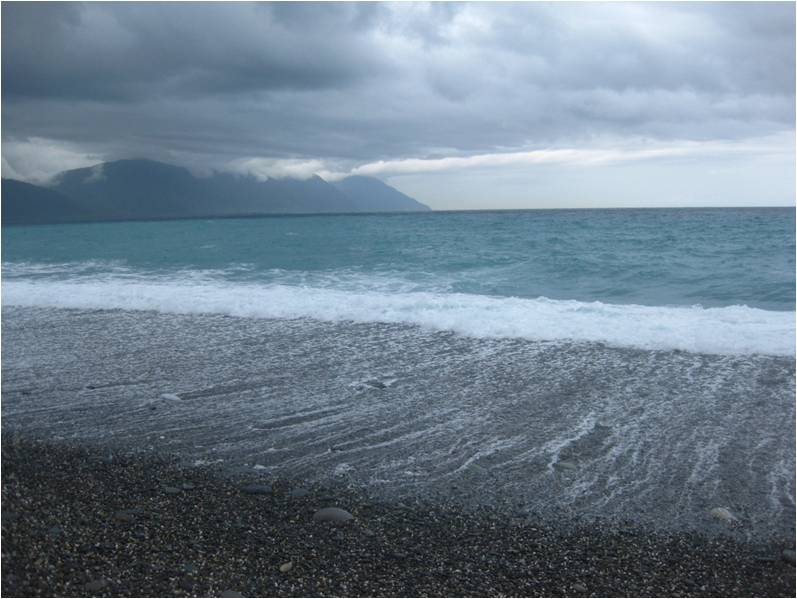
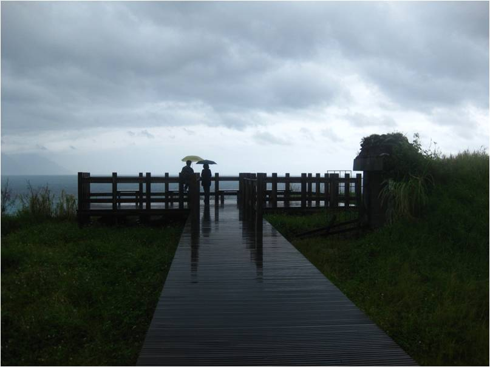
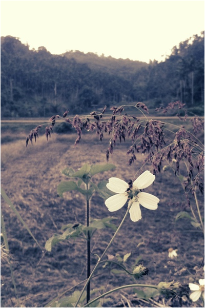
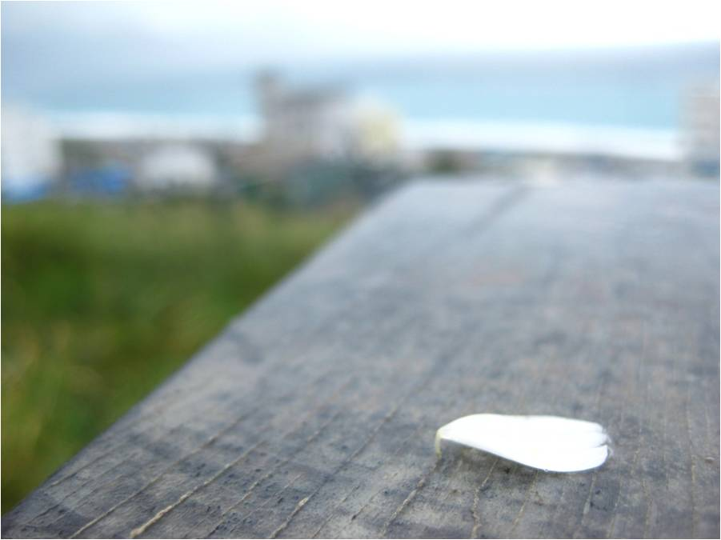

# ＜天权＞花莲——慢城独观海

还没等我回味这般情景，那花瓣已经不见，被一阵风带走。留下我，不可抑制地陷入无边的思念。我想闭上眼，若一滴思念坠下来，一滴空明，灵魂会不会减轻，海会不会加咸，星，会不会殉情？  

# 花莲——慢城独观海

## 文/沉樱（北京大学）

 

题记：他们选择在花莲，以一种缓慢的姿态生活着，任心绪自由地流动着。

新的城市哲学悄悄在欧洲一些小城里诞生，这套哲学叫做慢。我所寻找的慢城，是透过一群愿意腾出时间享受生活的人们，是让城市回归生命的所在。

于是来花莲寻找心中的慢城。 

我曾经在渤海湾倾听五月的风声，我曾经在鼓浪屿遥望浅绿色的波涛，我曾经在加勒比海边白色的沙滩上狂欢，也曾经登临旗津海上感受台风的余波。只是，到了花莲，才第一次感受到海的深邃，叫人心生敬畏。

没有给自己预设固定的行程时间表，我开始任由心情追随着目光自在起舞。仰头看看天，天空是一片阴霾。大片的乌云从无穷的远方一直延伸到头顶，又向着山的那一边飘去了。我忽然想，或许只有停留在无穷远处，距离才不再有意义。在无穷的那个地方，海天交接的那条线，才是彼此的心靠得最近的距离。

天开始下起蒙蒙细雨。虽是细雨，却也叫我感到滴滴冰冷，直刺我心。赤着脚徜徉在松松散散的石滩上，向左转是直入云霄的山脉，向右转是深蓝色的太平洋。侧耳倾听，是涛声。乌云，白雾，海的蓝，分成了一层一层，在白浪的另一边。海浪每一次涌动、平复，都好像要把我带走，带到海上，带到地平线，带到无穷远处。 

我决定把视野放的更广阔些，于是走上岸，远远地望着这一片沙滩。花莲果真是座慢城，且看这沙滩上的人们。眼前的这片草场上，他们举着伞观海，听海，时不时地交谈，从那个午后到那个傍晚，过了好久好久。我曾听说欧洲人喜欢在阳光明媚的下午坐在自家院子里晒太阳，无论老少，一晒就是一下午。而眼前的这对亦是如此悠闲自在。这不由得让我回想起平日的自己，穿梭于人间，每走一步都要计算着节奏，深怕这一步与下一步的衔接有了缝隙。殊不知，在拼命争得生命的广度时，却忽略了生命的深度。我的生命中留了太多缝隙，它们交织在一起，成了一种空洞的虚幻。

我有多久没有这样凝视过雨后的阳光，把叶上的水滴照得透亮。极轻地，极细微地，叶上水滴悄悄滑过，划过，但又没有集结在一处的重量。只若有似无地荡漾。对，若有似无地。我必须极专心，极平静地，才能感觉出那比无感地震还轻微的震动。那心头的震动。然后在心里把它们搜集成一块儿，勉强能拼凑出些什么来，关于记忆，关于永恒，我想大概是关于爱情的吧。

从仔细地凝望一朵花，到从一片花瓣的角度凝望远方，你一定会爱上这种角色的变换——这是来自花莲的小妹妹教会我的趣味和哲学。但我想我的领悟力还是不够，我只是一个行者，只在这有限的一两天体会她生来就潜移默化了的心境。我还悟不出她想传达的更高的不可名状的境界。我不知道，它究竟是由物羽化为了人的境，还是由人蜕变为混沌之初的境地呢？于我，只想到了俗世之中的顾忌，那种魂销香断有谁怜的落寞。她，含着泪滴，颤抖着，默默凝望沧海，该是隐忍着怎样绝望的爱？

还没等我回味这般情景，那花瓣已经不见，被一阵风带走。留下我，不可抑制地陷入无边的思念。我想闭上眼，若一滴思念坠下来，一滴空明，灵魂会不会减轻，海会不会加咸，星，会不会殉情？ 

一切只是空想而已。若不是来到这慢城，我大概会一如既往拍照留念罢了。 

采编自投稿邮箱；责编：黄理罡

 
