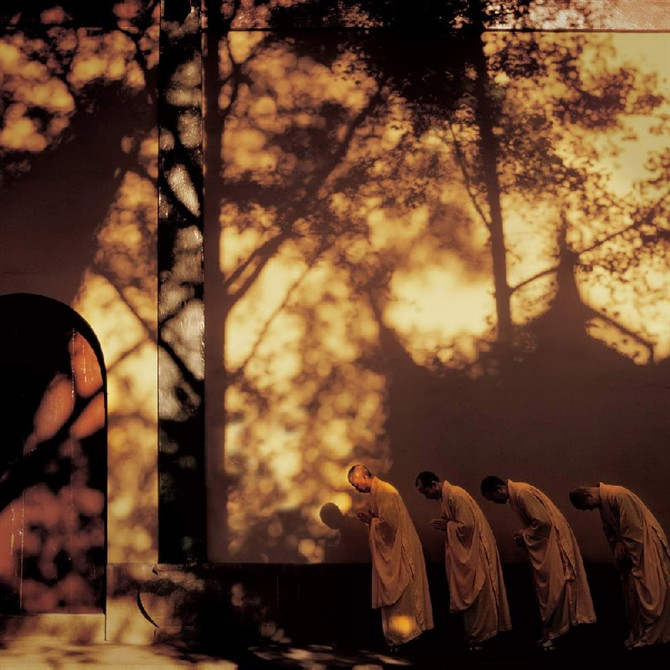
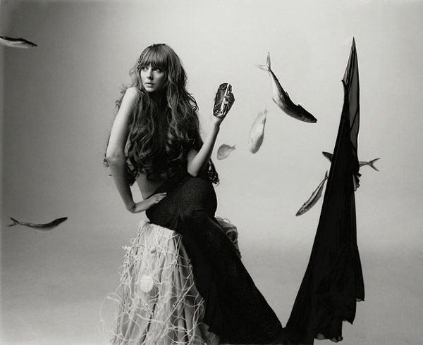

# ＜天权＞蒸日的金锄头

**洛素在和蒸日对视的过程中，也感到很可怖。蒸日对她的欲望扭曲了他的面孔。她之所以来见蒸日，是因为她想回味当年的柔软时刻。她记忆中的蒸日，是那个款款而谈的大哥哥，是那个艰难时候给自己温暖的大哥哥。洛素是有理想的，在时局艰辛尔虞我诈的今天，她需要温暖去抚慰她，去告诉她世上存在不具功利性的情感。但其实那童年记忆根本就是自己手制的玩偶。尤其是刚才自习一答，让她明白印象中厉害的大哥哥原来从大学起就是这样一个废物，如今更是极品猥琐男。洛素只怕自己如果抚摸蒸日一下，他都会饥渴得阳痿。**  

# 蒸日的金锄头

## **文/王胜寒（Brown University）**

 

“其实蒸日是试图带洛素去开房。可洛素说今天太晚了，并祝他一路顺风。蒸日明天又要飞回美国，下次见面不知是猴年马月。蒸日醉醺醺出了小区，打了车，消失在北京夜里。”

蒸日从一个小县城考到了清华，在家中被亲戚奉为人中龙凤。在出发的那天，蒸日想到自己第一次拿到那套“走进清华北大”的辅导丛书时，清华校门的熠熠生辉，险些刺瞎了他的双眼。如今，他也要融入这光辉，成就伟大，成为将来中国精英阶层的栋梁人才。

蒸日以前的生活都是在做题，难免对生活对前途的想象力有限。这就好比那个金锄头的典故——古代有三个农民耕作之余闲聊意淫皇帝的生活是如何牛逼，其中一个农民望着悠悠白云推测皇帝锄地用的一定是金锄头。蒸日也这么幻想着他到北京后所能得到的金锄头，并用之辛勤耕耘，打造自己的天空。

可当蒸日到了清华，才发现所谓的金锄头根本不存在。蒸日没有过人的为人处事能力或资本，便不能跻身于学校的政治圈，与学生会的人混；他也没有专注的学术精神，与学校里的学术帝们不分昼夜一起沉浸在公式和药水的海洋中。蒸日从来没有热爱过学习，学习对他只是一种习惯。毕竟今天的一切都是靠他苦学换来的，没有它蒸日会心慌，因为自己其他都不太会，可是有它蒸日又会不甘，觉得自己奋斗了这么多年，怎么还没有出头之日。

与北京的花天酒地无缘，与干渴的学术圈无缘，蒸日便诉求于恋爱。可清华的漂亮姑娘又岂是他这样的去食堂总吃最便宜套餐的人可以染指的。他最终和一个叫燕瘦的姑娘走在一起。燕瘦除了是个小A罩杯加上一口歪牙之外，倒也没有什么突出的特点。燕瘦很老实，也没有钱，从来没用过化妆品，戴着眼镜，永远穿着运动装。蒸日也没有钱，所以两人在一起最长做的事情就是在图书馆一起自习。

殊不知，多年以后，当蒸日提起自习这事时，竟会成为他心中窒息般的永痛。

蒸日为了给自己赚点生活费，每个星期给一个小学快毕业的小姑娘做家教。这个小姑娘叫洛素，肤如凝脂，鬼灵精怪。洛素的父母因为工作繁忙，看蒸日也老实，所以有的时候也出同样的家教费让蒸日平日生活里照顾洛素。洛素经常语出惊人，很多见识经常让蒸日汗颜。为了夺回身为老师的面子，蒸日把他对经济、政治的远大见解也告诉洛素。每次洛素向蒸日提问，管蒸日叫“小蒸哥哥”的时候，蒸日都会获得一种恣意的成就感。因为洛素的父母感情不合，他们经常吵架。有一次吵得凶了，洛素离家出走，跑到蒸日的宿舍。她在蒸日的膝上一直哭，哭着哭着，便睡着了。从此，洛素对蒸日便很依赖，没事时经常喜欢看蒸日在宿舍打游戏。如此两年。

一眨眼大学就快毕业了。蒸日在北京没有户口，也没有关系，就算找到了500强的工作，在这个消费水平极高的城市里也只能过着做牛做马的生活。于是蒸日和燕瘦一起申请了美国的PHD。两人都拿到了不同学校的不错的offer，并开始了一段长达六年的长距离关系。大学毕业，燕瘦终于答应把初夜给蒸日。可两人试了又试，竟然怎么都无法成功。每次蒸日要进入的时候，燕瘦都会喊疼，脸上表情如杀猪一般，让蒸日产生自己的生殖器是杀猪刀的幻觉。更关键的是，燕瘦的每根汗毛每条逻辑每个行为都粒粒分明，根本不会存在性感。

在美国读PHD的日子可以忽略描述。一年，两年，三年，四年，五年，六年。六年时间，过得其实也很快，因为其中没有任何标志性的事件来使时间摸上去有所方物。中国超市，中国朋友聚餐，看黄片，Walmart，逛天涯论坛，关心中国社会问题，关心美国油价，在实验室图书馆放空。和燕瘦带着中国方便面去了一趟迈阿密，风景不错，看见老美的私人游艇，心想自己什么时候也能混出头买一条。可能唯一一件印象稍微深刻一点的，就是昔日女同学来美，蒸日接待。由于住房紧张，晚上女同学和蒸日住在一个房间里。那天晚上，蒸日心跳如麻，想自己是否应该有所行动，想着想着，天就亮了。

毕业后蒸日在美国一家程序公司找到了工作。蒸日的英语不是那么好，和美国同事的交流仅限于“吃了没有”的程度。蒸日永远不会被老板重用，但也由于他每天按时上班准时完成任务，如果不出现经济危机，也不会被炒鱿鱼。蒸日每天的午饭是自己隔天做好的盒饭。但因为中国饭蹿味儿，好几次在办公室里吃都惹来同事一样的眼光。后来蒸日总是带到公司楼外去吃。下班后开50分钟的车回到家。

蒸日在美国和燕瘦结了婚，马上有了小孩，在郊区按揭买了房，生活迈入正规。周末的时候和附近的中国家庭聚会。大家的聊天包括对中国的下岗工人和农民的关心，对中国的教育事业的担忧，对美国民主的探讨，对国内party的黑暗的抨击——最后结论是还是在美国好，公平，日子滋润。除此之外，他们还讨论李家孩子去了哈佛，张家孩子上了医学院，王家又买了更大的房更好的车。大家的日子都很安逸，和多数美国人一样，站在道德制高点上自以为是的享受着物质和精神的双重优越感——幻想着国内人苦到吃不上馒头，而自己手握金锄头。

蒸日有的时候会比较苦闷，觉得自己的深刻时局见解和文艺情怀无法得到宣泄，有时候去天涯写帖，可第二天一看只有几条回复，大多数还是都是喷的。蒸日继而大骂几句。

蒸日请了一个月的假回中国“衣锦还乡”，给亲戚朋友带了很多美国的化妆品、美国人参，吹嘘美国的优越生活，感慨国内污染日益严重。尔尔。当蒸日拿出昔日的联系簿，看见了洛素的名字。这几年偶尔在msn上联络一下，不知现在小妹妹长成什么样子了，便约着一起吃晚饭。

蒸日在餐馆外面看见洛素第一面，全身上下的欲望都瞬间燃烧了，差点站不直。洛素唇不点而红，眉不画而翠，身穿一件红色披肩，里面是白色的褶子衬衣，领口宽敞得可以隐约看见小半个胸脯，下身是横条的深色短裙，两条白嫩的腿露于其下。蒸日在吃饭时努力深沉的装逼，描绘自己在美帝国的美丽生活，知识的渊博，以及对洛素小妹妹在学业上的关心。洛素在北大中文系念大三，眼中尽可以读出她平常对男人呼风唤雨的狡黠和无所谓——她又怎么读不出蒸日的紧张，无力，饥渴呢？可她附和着，回应着——为何不呢？对于蒸日来说，洛素的每一丝声线都夹杂着激素，刺激着他温腾腾的血液。洛素偶尔的一两句评论让他明白，他这一辈子都是没法泡到这姑娘的。可蒸日幻想，曾经有那么两年的时间，他们之间曾经如此的亲密，洛素对他感情上如此依赖，也许，还是存在那么一些可能性的吧？虽然蒸日也不明了究竟什么是可能性，又怎么去把握呢？

吃完饭后，蒸日提出要给洛素在书店买书，因为洛素聊天时提到她很喜欢超现实派文学。相比于多年以前，蒸日更不能融入北京这个大都市。他没有做为成功中年人进入高级会所的资本，也没有了做为小年轻去小酒吧跳舞的资本，唯一能做的是什么呢，卖弄他那点可怜的文艺情操，而场所竟是可悲的公共书店。

洛素也很吃惊。在她进大学之后，有男人要送prada包，有男人邀请她去夏威夷度假，却没有人在荷尔蒙如此喷涌的情况下邀请她去书店给她买书。

在去书店的路上，两人走在路人稀少的街上。洛素的凉拖并不适合走路，每跨出去一步臀部都要摇晃一下。蒸日好想搂着她的腰，让她走得稳些，但他的手还是留在了兜里。洛素和他闲聊，说起了他大学时候。洛素问起他和老婆是怎么谈恋爱的，蒸日说，自习。洛素惊奇的看着他，问为什么。蒸日说，因为她喜欢自习。

洛素很奇特地转过头看着蒸日。

被洛素如此赤裸裸的看着，蒸日蓦然悲哀得难以自禁，因为他明白其实连恋爱都是没有谈过的。燕瘦喜欢自习，因为自习能够给她带来安全感，因为他们的日子就是为了寻求一种安全感，一直如此。大学时候是自习，读博士时是实验室，毕业后是C++语言和一份稳定的工作。这里不存在想象力，不存在创造力。一切只是为了安全。去美国是为了安全，与燕瘦谈恋爱也是为了安全。

与洛素共处的时光里，蒸日逃离了那令人窒息的安全感，却也被置身于一种幻灭。那晚北京的夜格外黑，但洛素的美是那么白炙般的刺眼和直接，光太强，以至解体了一切幻想。洛素解体了当年蒸日上大学之前对清华光环的想像，对美利坚自由平等的想像，对自己年轻时前程似锦的想像。

面击洛素的一刻，这世上不存在任何政治任何肮脏任何阶级任何差别，可是如果想要得到洛素，却需要成为这些阶级政治权力地位争斗出来的胜者。洛素代表着一种危险，一种野心，一种从安全感中的突破，可蒸日已无力做到，他的灵魂已经走向了平庸。就算有这个愿望，也早已为时晚矣。

蒸日第一次直击自己的痛苦，自己的失败。这么多年来苦心经营的一切突然灰飞烟灭，没有了意义。被洛素看着，自己未来的几十年一下子铺在眼前。他没有机会了。

洛素在和蒸日对视的过程中，也感到很可怖。蒸日对她的欲望扭曲了他的面孔。她之所以来见蒸日，是因为她想回味当年的柔软时刻。她记忆中的蒸日，是那个款款而谈的大哥哥，是那个艰难时候给自己温暖的大哥哥。洛素是有理想的，在时局艰辛尔虞我诈的今天，她需要温暖去抚慰她，去告诉她世上存在不具功利性的情感。但其实那童年记忆根本就是自己手制的玩偶。尤其是刚才自习一答，让她明白印象中厉害的大哥哥原来从大学起就是这样一个废物，如今更是极品猥琐男。洛素只怕自己如果抚摸蒸日一下，他都会饥渴得阳痿。

想到这里，她不禁打个寒颤，掏出手机，开启手机闹铃。她知道，3分钟后，手机闹铃会响，她会假装接电话。她会告诉蒸日，家里有点事让她马上回去。这样处理最不尴尬，最迅速。

在北京停留的最后一晚，蒸日喝醉了。他打的到了洛素家的小区内，给洛素发短信，说有些事想跟她谈，望她能下来一趟。其实蒸日是试图带洛素去开房。可洛素说今天太晚了，并祝他一路顺风。蒸日明天又要飞回美国，下次见面不知是猴年马月。蒸日醉醺醺出了小区，打了车，消失在北京夜里。

回到美国以后，日子照旧。蒸日换了更大一点的房子，燕瘦又生了个儿子。性欲实在无处发泄的时候，蒸日就把笔记本抱进厕所里看成人片自慰。或者，在老婆晚上熟睡之后，蒸日就幻想着洛素自慰。蒸日幻想如果那天洛素答应下楼来找他，他如何让洛素欲火焚身，亲手松解他的腰带。回到现实的话，蒸日周六的时候带大儿子去中文学校，周日除草——要知道，在美国如果房前的草坪不经常修理的话，是要被罚款的。

有一个周末，蒸日透过窗外，看着自己刚刚修理完毕的草坪，感到很满意。还在上幼儿园的小儿子跑过来对蒸日说，昨天老师问我们长大想做什么，我说我想做你，爸爸！

不，不—

—可也许是，是的！至少还有孩子，至少还有孩子！他可以做得更好！我让他好好学习，必须好好学习！他以后能上哈佛，对，哈佛！！上了哈佛一定就不一样！他以后能当医生，一年能在美国赚好几十万！能够买更大的房子，更好的车！一切都会好的！ 

蒸日回头看看窗外的草地，还是那么绿。这草地绿得如此美丽，如此安全，如此兢兢业业，如此一潭死水，如此亘古不变。这草坪是历史终结者。

 

采编：尹桑 责编：陈轩

 
