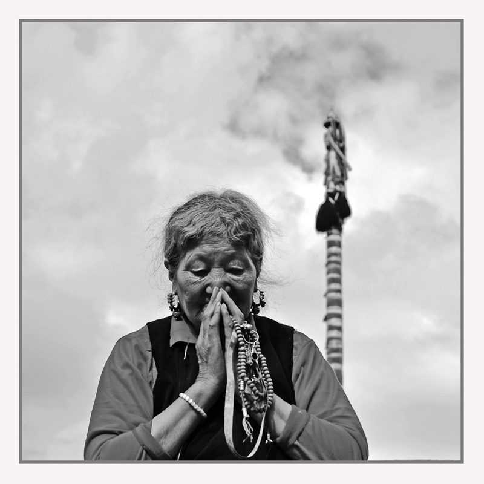
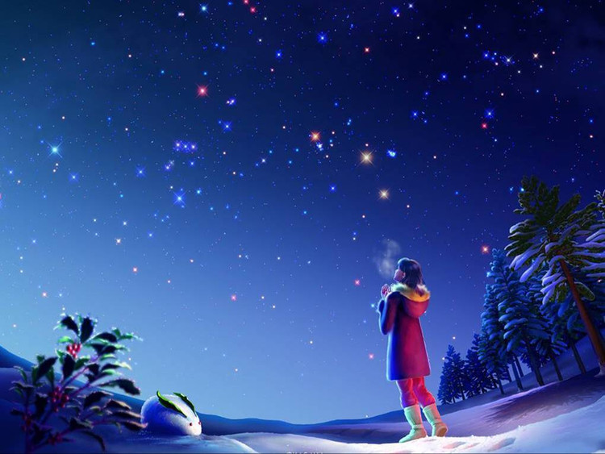
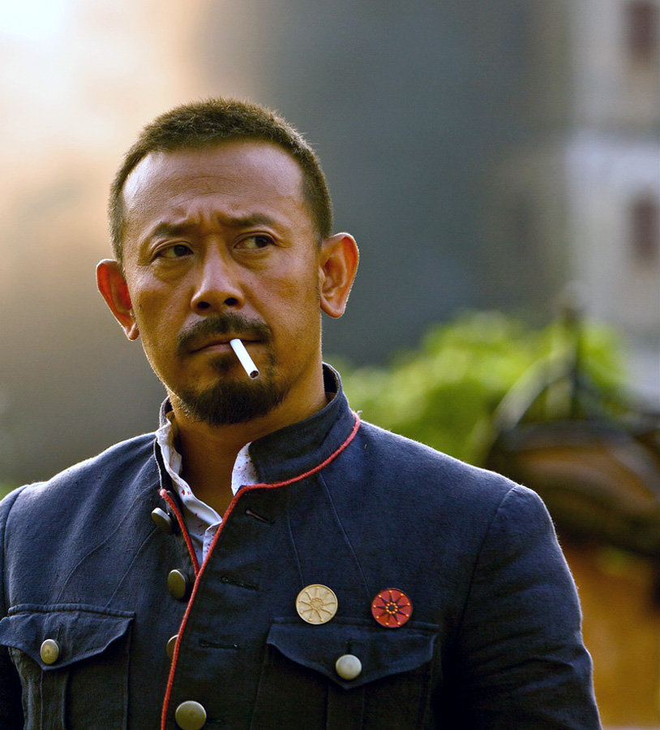

# ＜天权＞要有风，要有肉，要有美女儿，要有驴

**姜文在子弹中，说要有风，要有肉，要有美女儿，要有驴。风和美女儿是彼岸，肉和驴是此岸，虽然风雅与低俗混杂一起，但却很顺眼。一个完整的人性，就要兼有此岸和彼岸，就要追求雌雄同体，左手能写诗，右手能杀猪。** 

# 要有风，要有肉，要有美女儿，要有驴

## 文/张栋（济南大学）

 1． 

每个人都要面临两个世界，精神的和物质的，不靠谱的和靠谱的，不现实的和现实的，彼岸的和此岸的，诗情画意的和油盐酱醋的。

在一个世界里，人们是这样说话的：你要上进，要成为更美的，更聪明智慧，更从容淡定的，更学历高，妹子靓，赚钱多的人。因为人的价值就是这样体现出来的，你要比别人强，从你的邻居家的孩子，你的同桌，你一个村儿的人开始比，你都要比他们更好，更强，更有钱，你的人生才是有意义的。

在另一个世界里，话是这么说的：不经思考的人生毫无意义，人生就这么短短几十年，你从不问问自己内心想什么，就按照社会给你的标准去做，你是存在的么？金融，法律，保险，建筑，医学，不错这些都是人活着的支柱，但是爱情，艺术和诗歌，才是人活着的目的。小波说，人只有此生此世是不够的，他还应该有无限宽广的精神世界。他还说，总觉得现实世界是一场庸俗的大合唱，自己偶尔应和一句都觉得脸红。

我想多数人都面临这两种力量的冲突，只有两种人没有，一种像钱钟书这样，来人借钱一千，他给人两千，然后说不用还了，也别来借了。他不需要来自物质世界的安慰和来自社会他人的承认，钱先生的出现，貌似是上帝的一个误会。另一种人，是只有物质世界，现实世界的人，他们没有，或者根本不相信有另一个世界的存在。 

2． 

而我们都是凡人。我们身上兼具神性和兽性，注定就要面临这样的矛盾。我有时候暗自猜想，这也可能是我自己选的，如果我只需要物质世界，那我就应该投生为动物，它们只有吃喝拉撒，不会思考自己作为一头猪存在的意义是什么。

它安心自己作为猪的意义，就是吃喝拉撒，运气好的话还有交配。西塞罗曾写过一个故事，说在一艘遭遇风暴的船上，最绅士的乘客也大惊失措，只有一个乘客自始至终淡定自如，它是一头猪。

猪（以及其他动物）不会思考死亡，除了在临死的那一刻。猪也不会思考一个怎样的伴侣适合自己，君不见过狗是怎样择偶的么？你见过他们在追求异性之前思前想后，手足举措么？见过他们被拒绝之后用各种可笑的方式安慰自己的自尊么？但是人却会。

所以，既然生而为人，就证明，我不是只有物质世界就能满足的，除了性，我也需要爱情，除了吃喝，我还要写诗。

同样的，仅仅是诗歌和爱情的世界，我也不能满足。因为在我体内，还存在着兽性的血液。我要做快乐的猪，也要做痛苦的哲学家。

3． 

在这两者之间，彼岸的世界，诗歌和爱情的，不靠谱的世界是第一位的，此岸的世界是第二位的，人生的意义，就是把自己从物质的，现实的，此岸的世界里解脱出来，纵身向彼岸世界里去。

面对此岸世界，合理的办法不是拒绝，和各种理由的回避，相反，应该投身到婆娑世界里去。《相约星期二》这本书里说：

超脱自我，不是不投入到生活中去，相反，你应该完完全全投入进入，然后你才走得出来。接受所有的感情，如果你逃避这些感情，不让自己去经历感受，你就永远超脱不了，因为你始终心存恐惧。对待感情和金钱，都是这样。

释迦牟尼佛是体验了人间的享乐之后，又发现这不足以满足自己，才去修炼的，他看起来像一个乞丐，如果在他身边坐着另一个乞丐，你以为两人是一样的么？

冯唐说，我不相信，寺里的和尚，看透了世事；也不相信，学校里的处男，了悟了情欲。我也不相信。

4． 

还有一种态度：

昨晚看《艺术人生》节目，片中王姬回忆说她的老师苏民教给她一句话，让她终身受益，那就是要"痛饮人生的满杯"。我瞬间即被这句话感动！

痛饮人生的满杯是马雅科夫斯基诗句里的一句。

我也是一名教师，我不具有苏民老师的那种睿智，可以寓意深长地引用这样词句授之于人，但我以为这句话不就是对人生的最好的诠释吗？人生的满杯，就是包含有大喜大悲，无论是人生的得意之时或落魄之日，无论是人生的低谷或平淡亦或颠峰，都能把他当作生活这杯美酒来细细品尝，泰然处置之。

何谓痛饮，我认为应该是一种生活态度，全身心投入，活的慷慨潇洒，活的淋漓尽致。 当我们被所谓的痛苦磨砺得感受人生战栗时，却可以潇洒地一饮而进，感受这浓烈的生命之水所带给我们热烈与透明的质感，也许我们会发现人生终是沧海一粟，白驹过隙不是每个机遇都可以让人运筹帷幄。

千年岁月都可以如梦如烟，成为过往烟云，何况我们短短一生，若是漫画此生，也不过寥寥数笔便可勾勒全部人生，敞开自己的胸怀去包容生活中的一切吧！我们可以一脸恬淡地微笑着去领悟事关所有痛楚的来路，既而微笑着避过泥泞。我们可以在顺利的时候愁容惨淡，也可以在苦难的时候欢颜一笑！

痛饮人生的满杯，这杯里饱含酸甜苦辣，这是生活恒久不变的基调！ 

5． 

也有一种人生态度：

杨绛：我也不知道自己如今身在境界第几重。年轻时曾和费孝通讨论爱因斯坦的相对论，不懂，有一天忽然明白了，时间跑，地球在转，即使同样的地点也没有一天是完全相同的。现在我也这样，感觉每一天都是新的，每天看叶子的变化，听鸟的啼鸣，都不一样，new experince and new feeling in everyday。

树上的叶子，叶叶不同。花开花落，草木枯荣，日日不同。我坐下细细寻思，我每天的生活，也没有一天完全相同，总有出人意外的事发生。我每天 从床上起来，就想“今天不知又会发生什么意外的事？”即使没有大的意外，我也能从日常的生活中得到新体会。八段锦早课，感受舒筋活络的愉悦；翻阅报刊看电视，得到新见闻；体会练字抄诗的些微进步，旧书重读的心得，特别是对思想的修炼。要求自己待人更宽容些，对人更了解些，相处更和洽些，这方面总有新体会。因此，我的每一天都是特殊的，都有新鲜感受和感觉。

细想至此，我心静如水，我该平和地迎接每一天，过好每一天，准备回家。

笔会：有人认为好性情只能来自天生，但您的好性情，来自您一直强调的“修炼”。您大部分作品是70岁以后创作的，堪称“庾信文章老更成”的 典范。您认为“人是有灵性、有良知的动物。人生一世，无非是认识自己，洗练自己。”您看重曾参所说，“自天子以至庶人，壹是皆以修身为本”；在《走到人生边上》的自问自答中，您得出的结论是“天地生人，人为万物之灵。神明的大自然，着重的该是人，不是物；不是人类创造的文明，而是创造文明的人。只有人类能 懂得修炼自己，要求自身完善。”“这个苦恼的人世，恰好是锻炼人的处所，经过锻炼才能炼出纯正的品色来。”对您这些话，我没有疑问，也不求回答。在此复述一遍，只为给您一个响应。

6． 

英国诗人有一句，“我心有猛虎，正细嗅蔷薇”。对此句，余光中有精彩的理解，也是一种人生态度： “我心里有猛虎在细嗅蔷薇。”人生原是战场，有猛虎才能在逆流里立定脚跟，在逆风里把握方向，做暴风雨中的海燕，做不改颜色的孤星。 有猛虎，才能创造慷慨悲歌的英雄事业；涵蔓耿介拔俗的志士胸怀，才能做到孟郊所谓的一镜破不改光，兰死不改香！”同时人生又是幽谷，有蔷薇才能烛隐显幽，体贴入微；有蔷薇才能看到苍蝇控脚，蜘蛛吐丝，才能听到暮色潜动，春草萌牙，才能做到一沙一世界，一花一天国”。

在人性的国度里，一只真正的猛虎应该能充分地欣赏蔷薇，而一朵真正的蔷薇也应该能充分地尊敬猛虎。

还有一个人人好友日志里的文字，算是类似的态度： 查理•芒格是我2011年最喜欢的作家。他是沃伦•巴菲特一辈子的合伙人，伯克希尔•哈撒韦公司的董事会副主席——主席当然是巴菲特——芒格被称为奥马哈圣人，甚至，巴菲特有些肉麻的称芒格为自己的灵魂双胞胎。

与富兰克林一样，芒格相信理念与现实的融合，相信纯粹的智慧能带来现世的成功，相信现世的成功是验证其智慧有效性与智慧独立性的途径，以便于在智力上进行更深入的探索。因此，查理•芒格仅仅是把伯克希尔•哈撒韦，这家世界上最伟大的投资公司，看作是他的实践与教学平台，终身如此，乐此不疲。

7． 

很早之前，宋文京，一个青岛比较知名的书画家，来半岛玩，轮到大家向他提问的时候，我说，宋老师，书画的世界，是一个美的，好的，完整的世界，而现实世界却不是这样，你如何应对这种“现实”？

他说，首先自己是一个有按钮的人，可以随时调整自己的频道。其次，中医是一种哲学，里面有表里，虚实的哲学思想，你可以借鉴下。

看，彼岸的，不靠谱的世界，是里，是实；此岸的，现实的，物质的，法律的，金融的，医学的世界，是表，是虚。问题就这么解决了。

我们要追求完美，但是重心在追求上，而不是在完美上。在这里要文艺一下， 引用柏拉图的名言：在世间的万事万物，天堂里都有完美的标本，重要的不在于我们能否实现，而在于我们无暇的追求。

一个完美圆不可能存在，一个完美的爱人和爱情不可能存在，一个没有问题的世界不可能存在，一个没有缺陷的身体不可能存在，一篇完美的文章不可能存在（每次写完，都会觉得和自己脑子里的样子相差甚远），但是只要在追求，在追求中时时刻刻进化自己，就是意义的所在。

姜文在子弹中，说要有风，要有肉，要有美女儿，要有驴。风和美女儿是彼岸，肉和驴是此岸，虽然风雅与低俗混杂一起，但却很顺眼。一个完整的人性，就要兼有此岸和彼岸，就要追求雌雄同体，左手能写诗，右手能杀猪。 

 

采编：何凌昊 责编：尹桑

 
